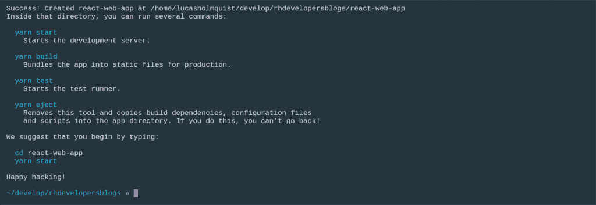
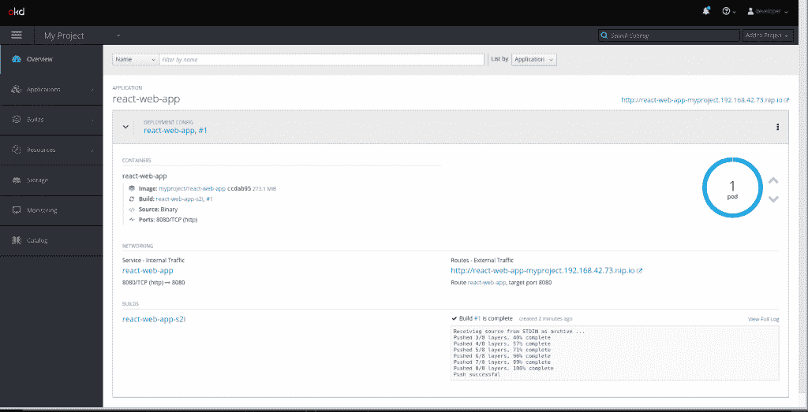
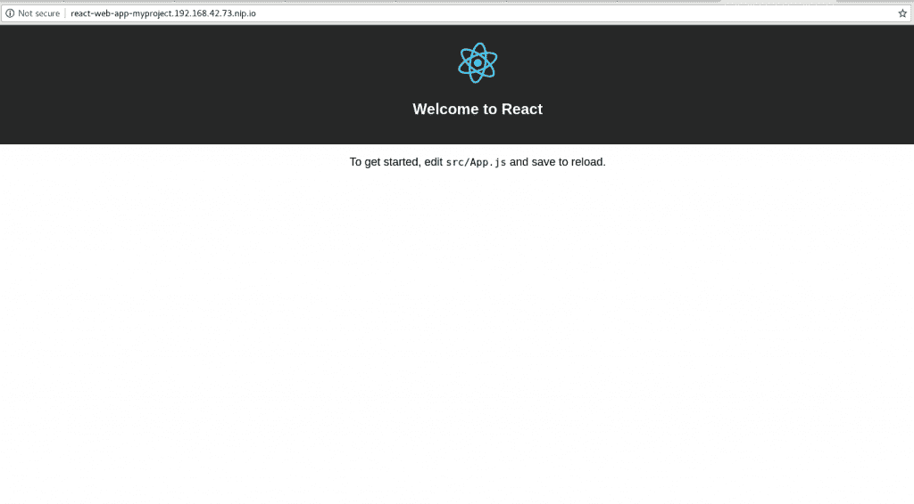
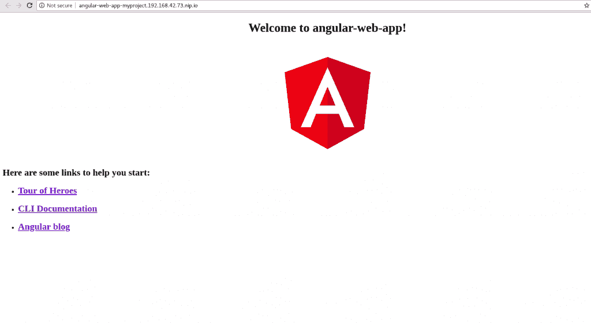

# OpenShift 上的现代 web 应用:第 1 部分——两个命令中的 Web 应用

> 原文：<https://developers.redhat.com/blog/2018/10/04/modern-web-apps-openshift-part-1>

在这个由多个部分组成的系列中，我们将了解如何使用新的源到图像(S2I)构建器图像将 React 和 Angular 应用程序等现代 web 应用程序部署到 [Red Hat OpenShift](http://openshift.com/) 。

系列概述:

*   第 1 部分:如何用最少的步骤部署现代 web 应用程序
*   第 2 部分:[如何将这个新的 S2I 映像与当前的 HTTP 服务器映像](https://developers.redhat.com/blog/2018/10/23/modern-web-applications-on-openshift-part-2-using-chained-builds/)结合起来，比如 NGINX，使用 OpenShift 链式构建来实现更适合生产的部署
*   第 3 部分:如何在 OpenShift 上运行应用程序的开发服务器，同时与本地文件系统同步

## 一些初始设置

如果你想跟着做，有一些先决条件。您需要一个正在运行的 OpenShift 实例。我将使用 minishift，它允许您在虚拟机中的 Windows、Mac 或 Linux 桌面上运行 OpenShift。要获得 minishift，请下载[红帽容器开发工具包(CDK)](https://developers.redhat.com/products/cdk/overview/) 。按照[这些说明](https://developers.redhat.com/products/cdk/hello-world/)安装并运行 minishift。更多信息参见 [CDK 文档](https://developers.redhat.com/products/cdk/docs-and-apis/)和 OKD.io 上的[文档。](https://docs.okd.io/latest/minishift/index.html)

一旦运行了 minishift，您需要确保您已经登录并设置了一个项目，您可以使用如下代码来完成:

```
$ oc login

$ oc new-project web-apps

```

我还假设您已经安装了 Node.js 8+和 npm 5.2+。

如果您只想看到这两个命令，请跳到“摘要”部分。

## 什么是现代 web 应用程序？

在开始之前，我们可能应该定义一下现代 web 应用程序到底是什么，以及它与我所称的“纯”Node.js 应用程序有何不同。

对我来说，现代的 web 应用程序类似于 React、Angular 或 Ember，其中有一个生成静态 HTML、JavaScript 和 CSS 的构建步骤。这个构建步骤通常执行一些不同的任务，比如文件的连接、转换(Babel 或 Typescript)和缩小。每个主流框架都有自己的构建过程和管道，但是 Webpack、Grunt 和 Gulp 等工具也属于这一类。无论使用什么工具，它们都使用 Node.js 来运行构建过程。

但是生成(编译)的静态内容不一定需要节点流程来服务。是的，您可以使用类似于 [serve module](https://www.npmjs.com/package/serve) 的东西，这对于开发来说很好，因为您可以快速查看您的站点，但是对于生产部署，通常推荐使用类似 NGINX 或 Apache HTTP Server 的东西。

另一方面,“纯”节点应用程序将使用 Node.js 进程运行，可以类似于 [Express.js 应用程序](http://expressjs.com/)(即 REST API 服务器)，并且通常没有构建步骤(我知道，我知道:Typescript 现在是一个东西)。开发依赖项通常不会安装，因为我们只希望应用程序使用的依赖项运行。

要查看使用我们的 Node.js S2I 映像将“纯”节点应用程序快速部署到 OpenShift 的示例，请查看我关于[将 Express.js 应用程序部署到 OpenShift](https://developers.redhat.com/blog/2018/04/16/zero-express-openshift-3-commands/) 的帖子。

## 将 web 应用程序部署到 OpenShift

现在我们已经了解了现代 web 应用程序和 Node.js 应用程序之间的区别，让我们看看如何在 OpenShift 上获得我们的 web 应用程序。

在这篇文章中，我们将部署 React 和 modern Angular 应用程序。我们可以使用它们各自的 CLI 工具`create-react-app`和 `@angular/cli.`非常快速地创建两个项目，这将算作我在标题中提到的两个命令之一。

### React 应用

让我们从 React 应用程序开始。如果你已经在全球范围内安装了`create-react-app`，那太好了。但是如果没有，那么您可以像这样使用`npx`运行命令:

```
$ npx create-react-app react-web-app

```

*注意:npx 是 npm 5.2+附带的一个工具，用于运行一次性命令。点击查看更多[。](https://www.npmjs.com/package/npx)*

该命令将创建一个新的 React 应用程序，您应该会看到类似这样的内容:

[](https://developers.redhat.com/blog/wp-content/uploads/2018/09/create-react-app-success.png)

假设您在新创建的项目目录中，现在可以运行第二个命令将应用程序部署到 OpenShift:

```
$ npx nodeshift --strictSSL=false --dockerImage=nodeshift/ubi8-s2i-web-app --imageTag=10.x --build.env YARN_ENABLED=true --expose

```

您的 OpenShift web 控制台将如下所示:

[](https://developers.redhat.com/blog/wp-content/uploads/2018/09/react-quick-running.png)

下面是您运行该应用程序时 web 控制台的样子:

[](https://developers.redhat.com/blog/wp-content/uploads/2018/09/react-on-openshift.png)

在我们进入角度示例之前，让我们看看最后一个命令在做什么。

首先，我们看`npx nodeshift`。我们使用 npx 来运行 nodeshift 模块。正如我在以前的帖子中提到的， [nodeshift](https://www.npmjs.com/package/nodeshift) 是一个用于轻松地将节点应用部署到 OpenShift 的模块。

接下来，让我们看看传递给 nodeshift 的选项是什么。首先是`--strictSSL=false`。因为我们使用的是 minishift，它使用的是自签名证书，所以我们需要告诉 nodeshift(实际上，我们是在告诉请求库，它是在幕后使用的)，这样就不会抛出安全错误。

接下来是`--dockerImage=nodeshift/ubi8-s2i-web-app --imageTag=10.x`。这告诉 nodeshift 我们想要使用新的 [Web App Builder 映像](https://hub.docker.com/r/nodeshift/ubi8-s2i-web-app/)，我们想要使用它的 10.x 标签。

接下来，我们要告诉 S2I 图像，我们要使用纱线:`--build.env YARN_ENABLED=true`。最后，`--expose`标志告诉 nodeshift 为我们创建一个 OpenShift 路由，这样我们就可以获得一个到我们应用程序的公开链接。

由于这是一篇“快速使用 OpenShift”的帖子，S2I 镜像使用 [serve 模块](https://www.npmjs.com/package/serve)来提供生成的静态文件。在后面的文章中，我们将看到如何使用 NGINX 的 S2I 图像。

### Angular 应用

现在让我们创建一个角度应用程序。首先，我们需要使用 Angular CLI 创建新的应用程序。同样，如果您没有在全局范围内安装它，您可以使用 npx 运行它:

```
$ npx @angular/cli new angular-web-app

```

这将创建一个新的 Angular 项目，与 React 示例一样，我们可以运行另一个命令进行部署:

```
$ npx nodeshift --strictSSL=false --dockerImage=nodeshift/ubi8-s2i-web-app --imageTag=10.x --build.env OUTPUT_DIR=dist/angular-web-app --expose

```

同样，与 React 应用程序类似，您的 OpenShift web 控制台将类似于以下内容:

[](https://developers.redhat.com/blog/wp-content/uploads/2018/09/angular-quick.png)

下面是您运行该应用程序时 web 控制台的样子:

[](https://developers.redhat.com/blog/wp-content/uploads/2018/09/angular-on-openshift.png)

让我们再看一下这个命令。尽管它看起来与我们在 React 应用程序中使用的命令非常相似，但还是有一些非常重要的区别。

不同之处在于`build.env`标志:`--build.env OUTPUT_DIR=dist/angular-web-app`。这里有两件不同的事情。

首先，我们移除了`YARN_ENABLED`变量，因为我们没有在角度项目中使用 yarn。

第二个是添加了`OUTPUT_DIR=dist/angular-web-app`变量。因此，默认情况下，S2I 映像会在`build`目录中寻找您编译的代码。React 默认使用`build`；这就是为什么我们没有为这个例子设置它。然而，Angular 对其编译输出使用了不同的东西。它使用`dist/<PROJECT_NAME>`，在我们的例子中是`dist/angular-web-app`。

## 摘要

对于跳过这一部分来查看要运行的两个命令的人来说，它们是:

**反应:**

```
$ npx create-react-app react-web-app

$ npx nodeshift --strictSSL=false --dockerImage=nodeshift/ubi8-s2i-web-app --imageTag=10.x --build.env YARN_ENABLED=true --expose

```

**棱角分明:**

```
$ npx @angular/cli new angular-web-app

$ npx nodeshift --strictSSL=false --dockerImage=nodeshift/ubi8-s2i-web-app --imageTag=10.x --build.env OUTPUT_DIR=dist/angular-web-app --expose

```

## 额外资源

在本文中，我们看到了如何使用新的 S2I web App Builder 映像快速轻松地将现代 Web 应用部署到 OpenShift。这些例子使用了图像的社区版本，但很快就会有官方的 [Red Hat Openshift 应用程序运行时(RHOAR)](https://developers.redhat.com/products/rhoar/overview/) 技术预览版。所以要小心。

在接下来的文章中，我们将更深入地了解这个映像实际上在做什么，以及我们如何使用它的更多高级特性，以及 OpenShift 的一些高级特性，来部署一个更适合生产的应用程序。

阅读本系列的第 2 部分,了解如何将这个新的 S2I 映像与当前的 HTTP 服务器映像(如 NGINX)结合起来，使用 OpenShift 链式构建来实现更适合生产的部署。

阅读本系列的第 3 部分[,了解如何在 OpenShift 上运行应用的“开发工作流程”。](https://developers.redhat.com/blog/2019/01/17/modern-web-applications-on-openshift-part-3-openshift-as-a-development-environment/)

欲了解更多信息，请下载免费电子书 *[部署到 OpenShift](https://developers.redhat.com/books/deploying-openshift/)* 。

*Last updated: January 28, 2020*