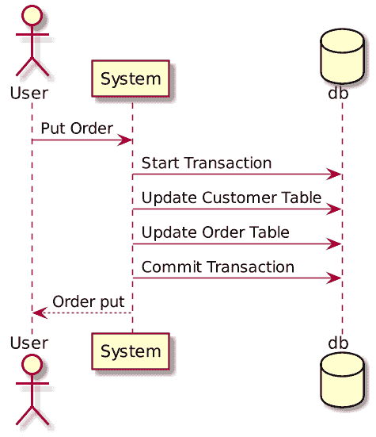
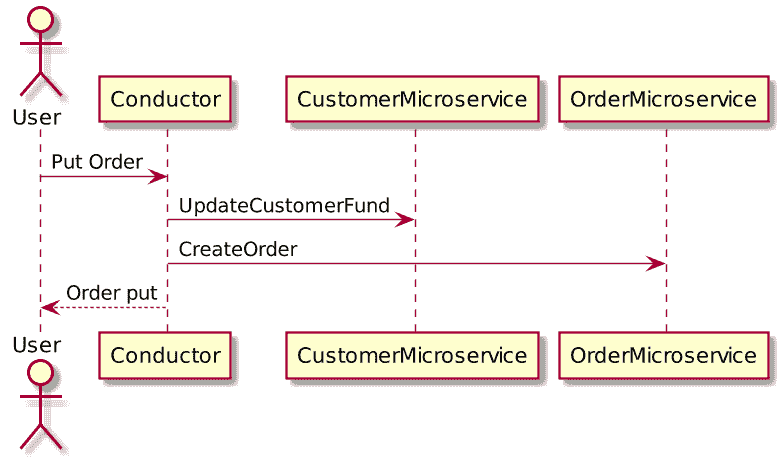
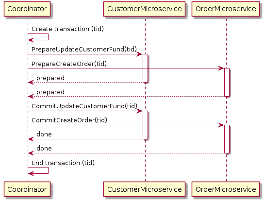
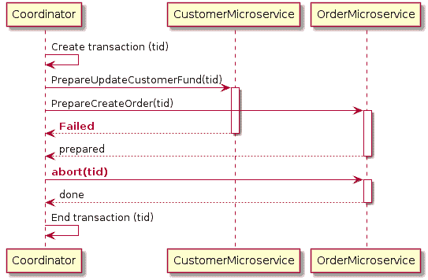
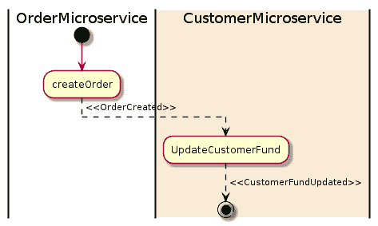
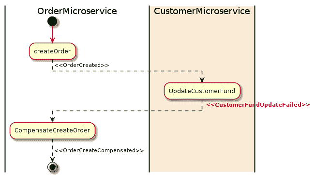

# 微服务架构中分布式事务的模式

> 原文：<https://developers.redhat.com/blog/2018/10/01/patterns-for-distributed-transactions-within-a-microservices-architecture>

[微服务](https://developers.redhat.com/topics/microservices/)架构已经非常流行。然而，一个常见的问题是如何管理跨多个微服务的分布式事务。在这篇文章中，我将分享我在过去项目中的经验，并解释这个问题和可能解决它的模式。

## 什么是分布式事务？

当微服务架构将单块系统分解成自封装的服务时，它可能会中断事务。这意味着单片系统中的一个本地事务现在被分配到多个服务中，这些服务将按顺序被调用。

下面是一个使用本地交易的单体系统的客户订单示例:

在上面的客户订单示例中，如果用户向单块系统发送一个 **Put Order** 动作，系统将创建一个本地数据库事务，该事务处理多个数据库表。如果任何一步失败，事务可以**回滚**。这就是所谓的 ACID(原子性、一致性、隔离性、持久性)，由数据库系统保证。

当我们分解这个系统时，我们创建了`CustomerMicroservice`和`OrderMicroservice` **，**，它们有独立的数据库。以下是微服务的客户订单示例:

当来自用户的 **Put Order** 请求时，两个微服务都将被调用，以将更改应用到它们自己的数据库中。因为事务现在跨多个数据库，所以它现在被认为是一个**分布式事务**。

## 有什么问题？

在单片系统中，我们有一个数据库系统来确保酸度。我们现在需要澄清以下关键问题。

### 我们如何保持事务的原子性？

在数据库系统中，原子性意味着在一个事务中，要么**所有步骤完成**，要么**没有步骤完成。**基于微服务的系统默认没有全局事务协调器。在上面的例子中，如果`CreateOrder`方法失败，我们如何回滚由`CustomerMicroservice`应用的更改？

### 我们是否隔离并发请求的用户操作？

如果一个对象被一个事务写，同时(在事务结束之前)被另一个请求读，那么这个对象应该返回旧数据还是更新的数据？在上面的例子中，一旦`UpdateCustomerFund`成功但仍在等待`CreateOrder`的响应，对当前客户资金的请求是否应该返回更新后的金额？

## 可能的解决方案

上述问题对于基于微服务的系统非常重要。否则，无法判断事务是否已成功完成。以下两种模式可以解决这个问题:

*   2pc(两阶段提交)
*   冒险故事

### 两阶段提交(2pc)模式

2pc 广泛应用于数据库系统。在某些情况下，您可以将 2pc 用于微服务。只是要小心；并不是所有的情况都适合 2pc，事实上，2pc 在微服务架构中被认为是不切实际的(解释如下)。

什么是两阶段提交？

顾名思义，2pc 有两个阶段:准备阶段和提交阶段。在准备阶段，将要求所有微服务准备一些可以自动完成的数据更改。一旦所有的微服务都准备好了，提交阶段将要求所有的微服务进行实际的更改。

通常，需要有一个全局协调器来维护事务的生命周期，协调器需要在准备和提交阶段调用微服务。

下面是客户订单示例的 2pc 实现:

在上面的例子中，当用户发送一个 put order 请求时，`Coordinator`将首先创建一个包含所有上下文信息的全局事务。然后它会告诉`CustomerMicroservice`准备用创建的交易更新客户资金。例如，`CustomerMicroservice`将检查客户是否有足够的资金进行交易。一旦`CustomerMicroservice`可以执行更改，它将锁定对象，防止进一步更改，并告诉`Coordinator`它已准备好。在`OrderMicroservice`中创建订单时也会发生同样的事情。一旦`Coordinator`确认所有微服务都准备好应用它们的更改，它将通过请求提交事务来要求它们应用它们的更改。此时，所有对象都将被解锁。

如果在任何时候单个微服务未能准备好，`Coordinator`将中止事务并开始回滚过程。下面是客户订单示例的 2pc 回滚图:

在上面的例子中，`CustomerMicroservice`由于某种原因未能准备好，但是`OrderMicroservice`已经回复说它准备好创建订单。`Coordinator`将在`OrderMicroservice`上请求中止事务，然后`OrderMicroservice`将回滚所做的任何更改并解锁数据库对象。

#### 使用 2pc 的好处

2pc 是一个非常强的一致性协议。首先，准备和提交阶段保证了事务是原子的。该事务将以所有微服务成功返回或者所有微服务无任何改变而结束。其次，2pc 允许读写隔离。这意味着在协调者提交更改之前，字段上的更改是不可见的。

#### 使用 2pc 的缺点

虽然 2pc 已经解决了这个问题，但对于许多基于微服务的系统来说，并不真正推荐使用它，因为 2pc 是同步的(阻塞)。该协议将需要在事务完成之前锁定将被改变的对象。在上面的例子中，如果客户下订单，那么“资金”字段将为客户锁定。这阻止了客户申请新订单。这是有意义的，因为如果一个“准备好的”对象在它声明它是“准备好的”之后改变了，那么提交阶段可能就不起作用了。

这可不好。在数据库系统中，交易往往很快，通常在 50 毫秒内。但是，微服务的 RPC 调用会有很长的延迟，尤其是在与外部服务(如支付服务)集成时。锁可能会成为系统性能的瓶颈。此外，当每个事务请求另一个事务所需的资源锁时，两个事务可能会相互锁定(死锁)。

### 传奇模式

Saga 模式是另一种广泛用于分布式事务的模式。它不同于 2pc，2pc 是同步的。Saga 模式是异步和反应式的。在 Saga 模式中，分布式事务由所有相关微服务上的异步本地事务来完成。微服务通过事件总线相互通信。

下面是客户订单示例的 Saga 模式图:

在上面的例子中，`OrderMicroservice`收到一个下订单的请求。它首先启动一个本地事务来创建一个订单，然后发出一个`OrderCreated`事件。`CustomerMicroservice`监听该事件，并在接收到该事件后更新客户资金。如果成功地从资金中扣除，那么将发出一个`CustomerFundUpdated`事件，在这个例子中，这意味着交易的结束。

如果任何微服务未能完成其本地事务，其他微服务将运行补偿事务来回滚更改。以下是薪酬交易的传奇模式图:

在上面的例子中，`UpdateCustomerFund`由于某种原因失败了，然后它发出了一个`CustomerFundUpdateFailed`事件。`OrderMicroservice`监听事件，并启动其补偿事务来恢复创建的订单。

#### 传奇模式的优势

Saga 模式的一大优势是它支持长期事务。因为每个微服务只关注自己的本地原子事务，所以如果一个微服务长时间运行，其他微服务不会被阻塞。这也允许事务继续等待用户输入。此外，因为所有本地事务都是并行发生的，所以不会锁定任何对象。

#### 传奇模式的缺点

Saga 模式很难调试，尤其是涉及到很多微服务的时候。此外，如果系统变得复杂，事件消息可能变得难以维护。Saga 模式的另一个缺点是它没有读隔离。例如，客户可以看到订单正在创建，但在下一秒钟，由于补偿交易，订单被删除。

#### 添加流程管理器

为了解决 Saga 模式的复杂性问题，添加一个流程管理器作为协调器是很正常的。流程管理器负责监听事件和触发端点。

## 结论

对于基于微服务的架构，Saga 模式是解决分布式事务问题的一种更好的方式。但是，它也引入了一系列新的问题，比如如何自动更新数据库并发出一个事件。

采用 Saga 模式需要在开发和测试两方面都改变思维模式。对于不熟悉这种模式的团队来说，这可能是一个挑战。有许多变体可以简化它的实现。因此，对于一个项目来说，选择合适的实施方式是很重要的。

*Last updated: September 23, 2022*