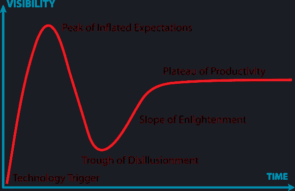

# 非微服务架构的兴起

> 原文：<https://developers.redhat.com/blog/2018/09/10/the-rise-of-non-microservices-architectures>

这篇文章简要总结了我最近与正在实施类似于[微服务](https://developers.redhat.com/topics/microservices)的架构，但在当前的后微服务世界中具有不同特征的客户打交道的经历。

微服务架构风格已经存在将近五年了，关于它已经有了很多的说法和文章。今天，我看到一些团队决定不严格遵循“纯”微服务架构的某些原则，而是打破一些“规则”团队现在更加了解微服务的利弊，他们做出基于上下文的决策，尊重团队经验和组织边界，并接受并非每个公司都是网飞的事实。下面是我在最近的微服务演出中看到的一些例子。

## 没有预付保费

团队(由开发人员、运营人员、测试人员、业务分析师、架构师等组成。)越来越意识到他们必须支付的[额外费用](https://www.martinfowler.com/bliki/MicroservicePremium.html),以获得使用纯微服务架构的特权。在 Kubernetes(最流行的微服务平台)上运行的典型的基于 Java 的微服务将需要 Git 存储库、Maven 模块、一组测试(单元、集成、验收)、API、Maven 工件、容器映像、配置、安全配置、构建管道、设计、文档等。在运行时，它将需要 CPU、内存、磁盘、网络、指标聚合、日志聚合、数据库、端点、服务网格代理边盘等。它还需要一组 [Kubernetes](https://developers.redhat.com/topics/kubernetes) 对象:容器、卷、配置图、秘密、pod、服务、副本集、部署等。导航和管理数十或数百个这样的工件给团队中的每个人带来了沉重的负担。毫不奇怪，最近 ThoughtWorks 宣布[不打算](https://www.thoughtworks.com/insights/blog/microservices-adopt)在可预见的未来将[微服务架构](https://developers.redhat.com/topics/microservices)投入其[技术雷达](https://www.thoughtworks.com/radar)的“采用”阶段。

## 存在的理由

考虑到每个服务都有成本(不考虑隐藏的溢价)，而不是最初的“从每个服务几十行代码开始”，系统开始变大，它们开始作为一个服务——作为一个单一存储库——只要服务属于一个团队。然后，对于每一项服务，都有一个明确的理由和好处来证明其作为独立微服务的存在。在从 monolith 中分离出一个独立的服务之前，有一个强制性的“存在检查”。以下是使用或不使用微服务的几个非常有效的理由。

### 打破有限的语境

虽然讨论最多的分解成微服务的方法是通过有界上下文进行[分解，但实际上创建微服务的原因还有很多:通过成熟度进行分解、通过数据访问模式(读与写)进行分解、通过数据源进行分解(而不是为每个微服务划分一个数据源，为每个数据源创建一个微服务)、为派生功能进行聚合(为其他一些服务创建一个编排服务)、为客户端方便而进行聚合(如前端模式](https://martinfowler.com/bliki/BoundedContext.html)的[后端)、为提高系统性能而进行聚合等。](https://samnewman.io/patterns/architectural/bff/)

### 共享数据源

微服务的一个基本原则是每个服务都有一个独立的数据存储。虽然在理论上，这一原则非常有意义，但在实践中，对于棕色地带项目来说，这是微服务最难的部分，而且并不总是值得付出努力。对于集成项目来说尤其如此，在集成项目中，数据源通常属于不同的团队或公司，并且一开始就不能被划分。通过承认数据源级耦合导致的未来约束，让独立的服务共享同一个数据存储仍然是可能的。

## 更少膨胀的期望

好消息是，团队现在正在做出更明智的决策，而不是盲目相信关于微服务的会议幻灯片。关于 Gartner 的[炒作周期](https://en.wikipedia.org/wiki/Hype_cycle)，在几年的“膨胀的期望”之后，微服务架构正在(向下)走向“幻灭的低谷”阶段，在这个阶段，期望与实际利益更加一致。

Hype cycle">

从现在开始，未来充满了启迪和生产力——除非在我们收获这个周期的好处之前，另一个周期开始了(比如无服务器)。

## 变异的微服务

相比编排，微服务更喜欢事件驱动的交互和编排，以减少服务耦合。但与此同时，我们已经看到像优步的 [Cadence](https://github.com/uber/cadence) 和网飞的 [Conductor](https://netflix.github.io/conductor/) 这样的项目，它们是专门为编排分布式长期运行服务而创建的，作为编排方法的替代方案。

Bernd Ruecker 对在分布式系统中使用事件、流程编排和工作流引擎做了一个非常好的[评论](https://qconnewyork.com/system/files/presentation-slides/complex_event_flows_in_distributed_systems_0.pdf)，分析了它们的实际优势和感知优势。

在另一篇名为[后 Kubernetes 时代的微服务](https://www.infoq.com/articles/microservices-post-kubernetes)的文章中，我还描述了微服务架构风格的变化完全是由 Kubernetes 和云原生原语驱动的。

也有其他人写过非微服务架构，如[独立系统](https://scs-architecture.org/)、[微服务](https://sdtimes.com/micro/difference-miniservice-microservice/)、[其他替代方案](https://segment.com/blog/goodbye-microservices/)在某些情况下比纯微服务更好。

这些替代方案为脱离纯粹的微服务原则提供了很好的理由。

## 结论

最好的体系结构是上下文驱动的体系结构，在这种体系结构中，你采用一个很好理解的体系结构，并根据你的需要对它进行调整。你质疑每一条原则和每一条规则，只要你理解并接受后果，你就不怕脱离某些规定性的要素。一个很好的类比是“地图不是领土。”如果建筑是地图，那么环境就是领土。

[让我知道](https://twitter.com/bibryam)你违反了哪些微服务规则，以及违反这些规则是否对你更有利。勇敢点。

*Last updated: September 3, 2019*