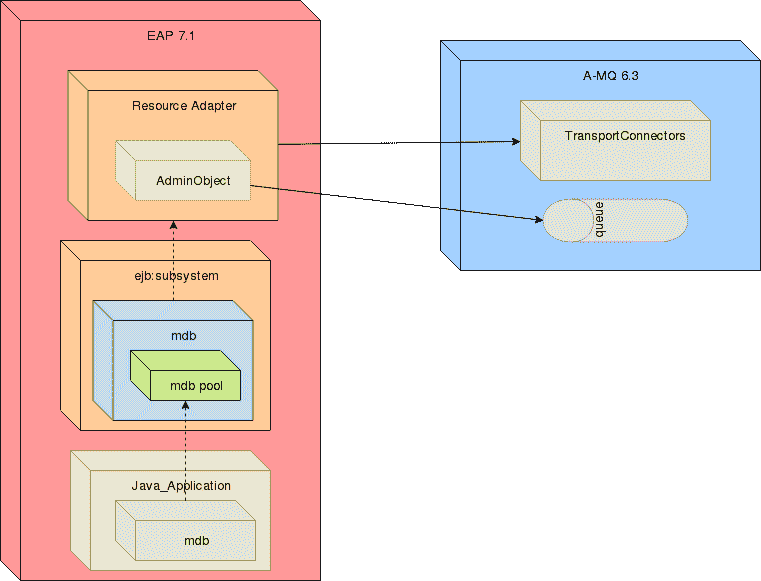

# 如何在红帽 JBoss EAP 7 上集成 A-MQ 6.3

> 原文：<https://developers.redhat.com/blog/2018/08/20/how-to-integrate-a-mq-6-3-on-red-hat-jboss-eap-7>

本文详细描述了如何在[Red Hat JBoss Enterprise Application Platform](https://developers.redhat.com/products/eap/download/)(EAP)7 上集成 [Red Hat A-MQ 6.3](https://developers.redhat.com/products/amq/overview/) ，并详细介绍了管理对象配置，尤其是池名配置。管理对象解释的属性 pool-name 可能会导致混淆。在这篇文章中，我将尝试阐明许多步骤，给出组件的概述，以及它们是如何组合在一起的。

JBoss EAP 需要配置一个资源适配器作为与 A-MQ 6.3 集成的核心组件。此外，需要 EAP 上的 MDBs 配置来启用 JMS 消费者。在 A-MQ 6.3 上，需要传输连接器的配置来打开与 EAP 的通信通道。

下面描述了配置 EAP 7 以将 A-MQ 6.3 用作外部 JMS 代理所需的所有步骤:

*   [JBoss EAP 7 上的通用资源适配器配置](#genericra)
*   [EJB 子系统的 MDB 配置](#mdb)
*   [A-MQ 端口/传输连接器/安全配置](#transport)

## JBoss EAP 和 A-MQ 组件概述

首先，理解配置中涉及的组件以及它们之间的关系非常重要。

### 资源适配器

资源适配器是 JBoss EAP 配置的核心组件。它提供了从 EAP 到 A-MQ 代理的链接。

简而言之，资源适配器是一个可部署的 Java EE 组件(通常是一个. rar 文件)。资源适配器使用 Java 连接器体系结构(JCA)规范在 Java EE 应用程序(通常部署在 JBoss EAP 实例上)和企业信息系统(EIS)之间提供通信。

EIS 供应商通常会提供一个资源适配器，以方便他们的产品与 Java EE 应用程序的集成。

在 JBoss EAP 7 上，资源适配器在`resource-adapter`子系统中定义。

### MDB

JBoss EAP 中的 MDB 配置为 Java 应用程序提供了创建链接到 JBoss EAP 的 A-MQ 消费者的能力。此外，MDB 池对可用的实例和会话数量提供了限制。

### 运输连接器

传输连接器是在 A-MQ 代理上定义的端点，允许客户端代理通信。可以使用不同的传输协议(TCP、SSL、HTTP、HTTPS 等)来配置传输连接器。)并且可以支持不同的有线协议(Openwire、STOMP、AMQP 等)。)

### 组件集成概述

下图以简单的方式描述了上述组件之间的关系。



## EAP 7 上的通用资源适配器配置

在 JBoss EAP 7.1 中，推荐的消息传递代理是 AMQ 7，它在消息传递子系统中有一个集成的资源适配器。然而，可以使用不同的消息传递代理或遗留的 A-MQ 消息传递代理。

**从 A-MQ 6.3 发行版中提取资源适配器。**

第一步是提取。rar 文件从 A-MQ 6.3 分发到一个更容易访问的位置。资源适配器 zip 容器位于＄AMQ _ HOME/extras/Apache-ActiveMQ-5 . 11 . 0 . red hat-[*最新 _ 版本* ]-bin.zip 中

```
unzip $AMQ_HOME/extras/apache-activemq-5.11.0.redhat-[*LATEST_VERSION*]-bin.zip \
-d /tmp

```

将文件解压到一个已知的位置:[AMQ RAR 目录]。

使用 CLI 在独立/域 JBoss 服务器中部署资源适配器。

```
Server$ jboss-cli.sh
```

在独立服务器中:

```
Server$ deploy /tmp/apache-activemq-5.11.0.redhat-[*LATEST_VERSION*]/lib/optional\
/activemq-rar-5.11.0.redhat-[*LATEST_VERSION*].rar

```

在域管理的服务器中:

```
Server$ deploy /tmp/apache-activemq-5.11.0.redhat-[*LATEST_VERSION*]/lib/optional\
/activemq-rar-5.11.0.redhat-[*LATEST_VERSION*].rar \
–server-groups=[SERVER_GROUP_1],[SERVER_GROUP_2],...

```

**使用管理控制台部署资源适配器。**

也可以使用管理控制台部署资源适配器

**使用部署扫描器在独立服务器中手动部署资源适配器:**

为了将资源适配器手动部署到独立服务器，请将资源适配器归档文件复制到服务器部署目录$ EAP _ HOME/standalone/deployments/。因此，扫描程序将检查部署目录并部署资源适配器。

**域管理服务器的新配置:**
可能，需要不同的服务器组使用不同的代理技术或配置。为了更好地分离对 JMS 服务的访问，可以创建一个包含代理配置的新概要文件。

### 资源适配器手动配置

**向资源适配器子系统添加资源适配器元素:**

```
<subsystem >
  <resource-adapters>
    <resource-adapter id="activemq-rar.rar" statistics-enabled="true">
    </resource-adapter>
  </resource-adapters>
</subsystem>

```

**资源适配器档案的定义:**

```
<subsystem >
  <resource-adapters>
    <resource-adapter id="activemq-rar.rar" statistics-enabled="true">
      <archive>
        activemq-rar.rar
      </archive>
    </resource-adapter>
  </resource-adapters>
</subsystem>

```

**设置不同的配置属性:**
首先，设置服务器 URL、访问凭证、支持的交易类型。

```
<subsystem >
  <resource-adapters>
    <resource-adapter id="activemq-rar.rar" statistics-enabled="true">
      <archive>
        activemq-rar.rar
      </archive>
      <transaction-support>XATransaction</transaction-support>
      <config-property name="ServerUrl">
        tcp://[BROKER_HOST]:[BROKER_PORT]
      </config-property>
      <config-property name="UserName">
        myusername
      </config-property>
      <config-property name="Password">
        mypassword
      </config-property>
    </resource-adapter>
  </resource-adapters>
</subsystem>

```

**建立连接定义:**
一个可能的连接定义类名可以是:org . Apache . ActiveMQ . ra . activemqmanagedconnectionfactory，选择取决于你要使用的工厂类型。

```
<subsystem >
  <resource-adapters>
    <resource-adapter id="activemq-rar.rar" statistics-enabled="true">
      <archive>
        activemq-rar.rar
      </archive>
      <transaction-support>XATransaction</transaction-support>
      <config-property name="ServerUrl">
        tcp://[BROKER_HOST]:[BROKER_PORT]
      </config-property>
      <config-property name="UserName">
        myusername
      </config-property>
      <config-property name="Password">
        mypassword
      </config-property>
      <connection-definitions>
        <connection-definition class-name="com.ra.EISManagedConnectionFactory" 
             jndi-name="java:/jms/connection/amq/ManagedConnectionFactory" 
             enabled="true" 
             pool-name="A-MQ">
          <xa-pool>
            <min-pool-size>1</min-pool-size>
            <max-pool-size>50</max-pool-size>
            <prefill>false</prefill>
            <is-same-rm-override>false</is-same-rm-override>
          </xa-pool>
          <validation>
            <use-fast-fail>false</use-fast-fail>
          </validation>
        </connection-definition>
      </connection-definitions>      
    </resource-adapter>
  </resource-adapters>
</subsystem>

```

**配置 XA 恢复插件:**
“XA 恢复”是指当其中一个参与者崩溃或不可用时，更新或回滚事务的过程。XA 恢复无需用户干预。

每个 XA 资源都需要有一个与其配置相关联的恢复模块。

```
<subsystem >
  <resource-adapters>
    <resource-adapter id="activemq-rar.rar" statistics-enabled="true">
      <archive>
        activemq-rar.rar
      </archive>
      <transaction-support>XATransaction</transaction-support>
      <config-property name="ServerUrl">
        tcp://[BROKER_HOST]:[BROKER_PORT]
      </config-property>
      <config-property name="UserName">
        myusername
      </config-property>
      <config-property name="Password">
        mypassword
      </config-property>
      <connection-definitions>
        <connection-definition class-name="com.ra.EISManagedConnectionFactory" 
             jndi-name="java:/jms/connection/amq/ManagedConnectionFactory" 
             enabled="true" 
             pool-name="A-MQ">
          <xa-pool>
            <min-pool-size>1</min-pool-size>
            <max-pool-size>50</max-pool-size>
            <prefill>false</prefill>
            <is-same-rm-override>false</is-same-rm-override>
          </xa-pool>
          <validation>
            <use-fast-fail>false</use-fast-fail>
          </validation>
          <recovery>
            <recover-credential>
              <user-name>recoveryuser</user-name>
              <password>recoverypassword</password>
            </recover-credential>
            <recover-plugin 
               class-name="org.jboss.jca.core.recovery.ConfigurableRecoveryPlugin">
              <config-property name="enableIsValid">
                false
              </config-property>
              <config-property name="isValidOverride">
                true
              </config-property>
            </recover-plugin>
          </recovery>
        </connection-definition>
      </connection-definitions>      
    </resource-adapter>
  </resource-adapters>
</subsystem>

```

**管理对象设置和配置:**

创建管理对象是为了给 JBoss EAP 应用程序提供 JMS 队列的 JNDI 查找。

经常导致定义未回答问题的属性是 admin 对象的 pool-name 属性。属性“pool-name”在 JBoss EAP 中没有实现，这意味着不应该使用该属性。

```
<subsystem >
  <resource-adapters>
    <resource-adapter id="activemq-rar.rar" statistics-enabled="true">
      <archive>
        activemq-rar.rar
      </archive>
      <transaction-support>XATransaction</transaction-support>
      <config-property name="ServerUrl">
        tcp://[BROKER_HOST]:[BROKER_PORT]
      </config-property>
      <config-property name="UserName">
        myusername
      </config-property>
      <config-property name="Password">
        mypassword
      </config-property>
      <connection-definitions>
        <connection-definition class-name="com.ra.EISManagedConnectionFactory" 
             jndi-name="java:/jms/connection/amq/ManagedConnectionFactory" 
             enabled="true" 
             pool-name="A-MQ">
          <xa-pool>
            <min-pool-size>1</min-pool-size>
            <max-pool-size>50</max-pool-size>
            <prefill>false</prefill>
            <is-same-rm-override>false</is-same-rm-override>
          </xa-pool>
          <validation>
            <use-fast-fail>false</use-fast-fail>
          </validation>
          <recovery>
            <recover-credential>
              <user-name>recoveryuser</user-name>
              <password>recoverypassword</password>
            </recover-credential>
            <recover-plugin 
              class-name="org.jboss.jca.core.recovery.ConfigurableRecoveryPlugin">
              <config-property name="enableIsValid">
                false
              </config-property>
              <config-property name="isValidOverride">
                true
              </config-property>
            </recover-plugin>
          </recovery>
        </connection-definition>
      </connection-definitions>      
      <admin-objects>
        <admin-object class-name="org.apache.activemq.command.ActiveMQQueue" 
             jndi-name="java:/jms/myapp/myqueuename" 
             pool-name="MY_POOL_NAME">
          <config-property name="PhysicalName">
            myapp_mycontext_myqueuename
          </config-property>
        </admin-object>
      </admin-objects>      
    </resource-adapter>
  </resource-adapters>
</subsystem>

```

### 资源适配器 CLI 配置

您可以使用管理界面配置资源适配器。我在下面展示了如何使用管理 CLI 配置资源适配器。如果您将本文档用作其他资源适配器的参考，那么查看供应商的文档以了解支持的属性和其他重要信息是很重要的。

**向资源适配器子系统添加资源适配器元素，并定义资源适配器的档案:**

```
/subsystem=resource-adapters/resource-adapter=eis.rar:add(archive=eis.rar, \
transaction-support=XATransaction)

```

**定义不同的配置属性:**

添加服务器配置属性。

```
/subsystem=resource-adapters/resource-adapter=activemq-rar.rar/\
config-properties=server:add(value=[$AMQ_BROKER_URL])

```

添加端口配置属性。

```
/subsystem=resource-adapters/resource-adapter=activemq-rar.rar/\
config-properties=port:add(value=[$AMQ_BROKER_PORT])

```

**定义连接定义:**

为托管连接工厂添加连接定义。

```
/subsystem=resource-adapters/resource-adapter=eis.rar/\
connection-definitions=cfName:add(class-name=com.ra.EISManagedConnectionFactory, \
jndi-name=java:/jms/connection/amq/ManagedConnectionFactory)

```

配置托管连接工厂配置属性。

```
/subsystem=resource-adapters/resource-adapter=eis.rar/connection-definitions=cfName/\
config-properties=name:add(value=Acme Inc)

```

**配置 XA 恢复插件:**

为了使用 CLI 命令正确定义“恢复插件属性”，首先，添加“恢复插件类名”。

```
/subsystem=datasources/xa-data-source=test-xa-datasource/\
:write-attribute(name=recovery-plugin-class-name,\
value=org.jboss.jca.core.recovery.ConfigurableRecoveryPlugin)

```

然后添加“恢复-插件-属性”。

```
/subsystem=datasources/xa-data-source=test-xa-datasource/\
:write-attribute(name=recovery-plugin-properties,\
value={"EnableIsValid" => "false",\
"IsValidOverride" => "true",\
"EnableClose" => "false"})

```

**管理对象设置和配置:**

添加一个管理对象。

```
/subsystem=resource-adapters/resource-adapter=activemq-rar.rar/\
admin-objects=aoName:add(\
class-name=org.apache.activemq.command.ActiveMQQueue, \
jndi-name=java:/jms/myapp/myqueuename)

```

配置管理对象配置属性。

```
/subsystem=resource-adapters/resource-adapter=activemq-rar.rar/\
admin-objects=aoName/config-properties=threshold:add(value=10)

```

**激活资源适配器:**

激活资源适配器。

```
/subsystem=resource-adapters/resource-adapter=activemq-rar.rar:activate	

```

## EJB 子系统的 MDB 配置

首先，理解什么是 MDB 很重要。MDB 是一种特殊的无状态会话 beans，它们是特定队列的 JMS 消费者。

它们实现了一个名为 onMessage(Message message)的方法，该方法在 MDB 监听的 JMS 目的地接收到消息时执行。

JMS 使用者负责异步触发 MDBs。

默认情况下，MDB 有 16 个会话同时处理消息。

将必需的消息驱动 bean 配置添加到 JBoss EAP 配置中的 urn:jboss:domain:ejb3 子系统。

```
<mdb>
  <resource-adapter-ref resource-adapter-name="activemq-rar.rar"/>
  <bean-instance-pool-ref pool-name="mdb-strict-max-pool"/>
</mdb>

```

此外，定义 MDB 池:

```
<pools>
	<bean-instance-pools>
		<strict-max-pool name="slsb-strict-max-pool" max-pool-size="20" 
             instance-acquisition-timeout="5" 
             instance-acquisition-timeout-unit="MINUTES"/>
		<strict-max-pool name="mdb-strict-max-pool" 
		     max-pool-size="20" 
             instance-acquisition-timeout="5" 
             instance-acquisition-timeout-unit="MINUTES"/>
	</bean-instance-pools>
</pools>

```

最终的 standalone.xml 配置应该如下所示:

```
<server ...>
    ...
    <profile>
        ...
        <subsystem >
            ...
            <mdb>
                <resource-adapter-ref resource-adapter-name="activemq-rar.rar"/>
                <bean-instance-pool-ref pool-name="mdb-strict-max-pool"/>
            </mdb>
            <pools>
                <bean-instance-pools>
                    <strict-max-pool name="slsb-strict-max-pool" 
                         max-pool-size="20" 
                         instance-acquisition-timeout="5" 
                         instance-acquisition-timeout-unit="MINUTES"/>
                    <strict-max-pool name="mdb-strict-max-pool" 
                         max-pool-size="20" 
                         instance-acquisition-timeout="5" 
                         instance-acquisition-timeout-unit="MINUTES"/>
                </bean-instance-pools>
            </pools>
            ...
        </subsystem>
        ...
    </profile>
    ...
</server>

```

## A-MQ 端口/传输连接器

首先，A-MQ 配置要求传输连接器定义 JBoss EAP 用来集成资源适配器的端点。

在 activemq.xml 中实现以下配置:

```
<transportConnectors>
   <transportConnector name="openwire-client" 
        uri="nio://0.0.0.0:[BROKER_PORT]?[TRANSPORT_OPTIONS]"/>
</transportConnectors>

```

## 摘要

本文详细描述了 Red Hat JBoss EAP 7 与 A-MQ 6.3 的集成和管理对象配置，如果集成者不清楚所需的步骤，这将是一个复杂的过程。本文详细介绍了管理对象设置和池名属性，并提供了关于正确配置的很好的提示。

*Last updated: September 3, 2019*