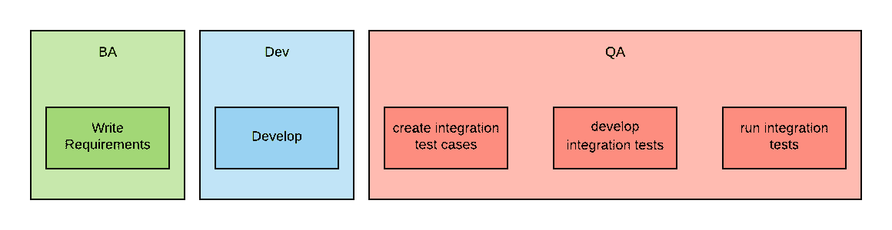
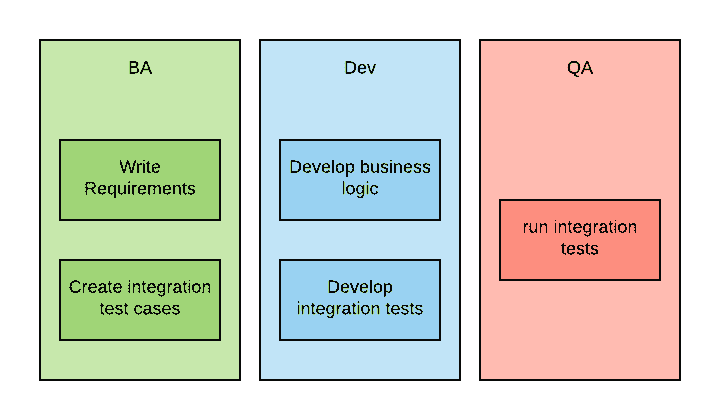
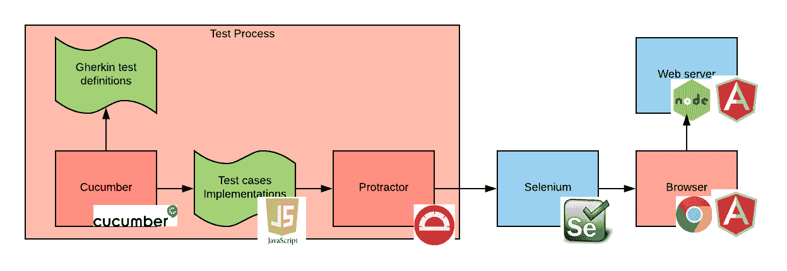
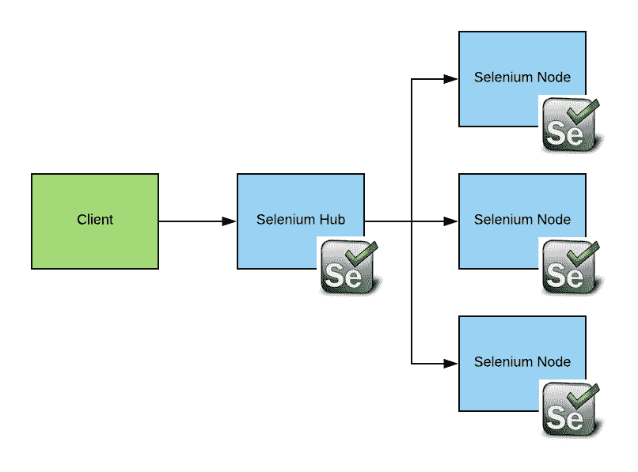
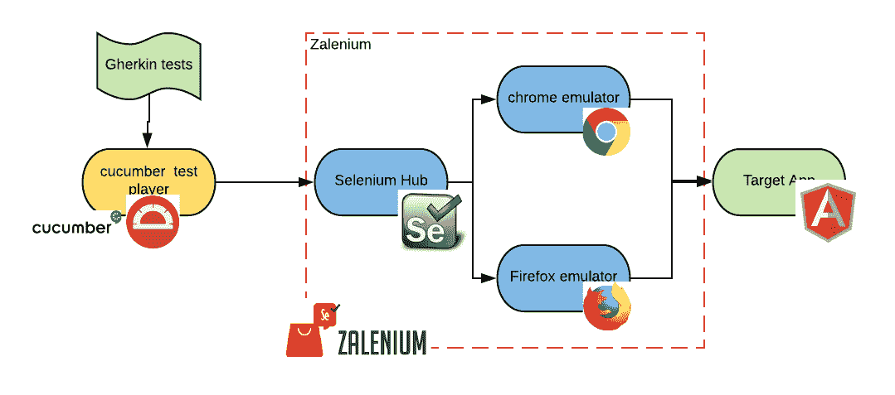
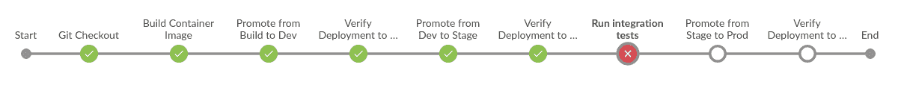
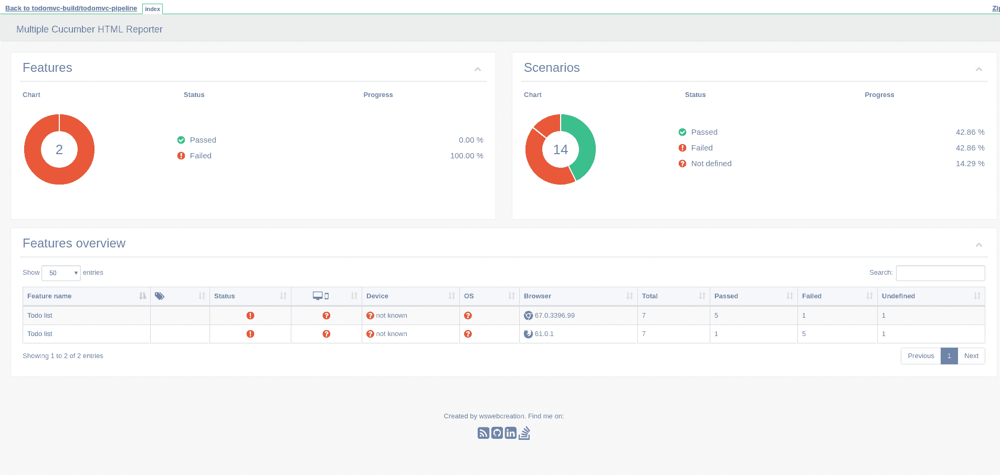

# 容器-本机集成测试

> 原文：<https://developers.redhat.com/blog/2018/08/02/container-native-integration-testing>

集成测试仍然是 CI/CD 管道中的一个重要步骤，即使您正在开发容器本地应用程序。集成测试往往是运行时间有限的资源密集型工作负载。

我想探索集成测试技术和工具如何利用容器编排器(如 [Red Hat OpenShift](http://openshift.com/) )来运行更快、更动态的测试，同时更有效地使用资源。

在这篇文章中，你将学习如何使用[黄瓜](https://cucumber.io/)、[量角器](https://www.protractortest.org/#/)和[硒](https://www.seleniumhq.org/)构建[行为驱动开发](https://en.wikipedia.org/wiki/Behavior-driven_development) (BDD)集成测试，以及如何使用 [Zalenium](https://opensource.zalando.com/zalenium/) 在 OpenShift 中运行它们。

本文示例的代码可以在 GitHub 的[red hat-COP/container-pipelinesh](https://github.com/redhat-cop/container-pipelines/tree/master/cucumber-selenium-grid)中找到。

## BDD 测试

我喜欢在开发集成测试时使用 BDD 测试。

我喜欢这种方法的原因是，它允许业务分析师(BAs)而不是开发人员来定义集成测试。使用 BDD，可以创建一个开发过程，其中需求和集成测试定义同时准备好，并由 BA 团队创建。

这种方法比传统方法好得多，例如下图所示的方法，在该方法中，集成测试是在业务功能开发完成后由质量保证(QA)团队创建的。

使用 BDD，这个过程看起来更像下面这样:

并且每次迭代通常花费更短的时间。

BAs 可以编写集成测试定义，因为在 BDD 中，集成测试用例是用[小黄瓜](https://docs.cucumber.io/gherkin/)表示的，这是一种与自然语言非常相似的计算机语言。Gerkin 拥有的主要关键词是*给定*、*当*和*然后*，并且 Gherkin 中的每个语句都必须以其中一个开始。

这里有一个例子:

*给定用户导航到的登录页面*

*当用户输入用户名和密码*

*当用户名和密码正确时*

*然后系统将它们记录在*中

能够解释小黄瓜测试的一个流行的运行时是[cumber](https://cucumber.io/)。使用 Cucumber 时，需要开发人员实现一些功能，以便每个 Gherkin 语句都可以执行。黄瓜与多种语言绑定。建议使用与被测应用程序相同的语言编写测试，但这不是强制性的。

## 测试技术堆栈

我们将要测试的应用程序是 [TodoMVC](http://todomvc.com/) web 应用程序的 [Angular](https://angularjs.org/) JS [实现](http://todomvc.com/examples/angularjs/#/)。AngularJS 是一个非常流行的用于编写[单页应用](https://en.wikipedia.org/wiki/Single-page_application) (SPAs)的框架。

因为 AngularJS 在 JavaScript 中，所以我们将使用 JavaScript 的 cumber 绑定[cumber . js](https://docs.cucumber.io/installation/javascript/)。

为了模拟用户与浏览器的交互，我们将使用 [Selenium](https://www.seleniumhq.org/) 。Selenium 是一个进程，它可以根据通过 API 接收的命令启动浏览器并模拟用户交互。

最后，我们将使用[量角器](https://www.protractortest.org/#/)来处理一些用 AngularJS 编写的模拟 SPA 的特性。量角器负责等待，以确保页面内的视图被正确加载。

总的来说，我们的测试堆栈如下所示:

该图试图描述的过程如下:

*   当 Cucumber 测试开始时，Cucumber 从 Gherkin 文件中读取测试定义。
*   然后它开始调用测试用例实现代码。
*   测试用例实现代码使用量角器在网页上执行动作。
*   当这种情况发生时，量角器连接到 Selenium 服务器，并通过 Selenium API 发出命令。
*   Selenium 在浏览器实例中执行这些命令。
*   浏览器根据需要连接到 web 服务器。在我们的例子中，因为我们使用的是 SPA，所以应用程序作为第一个页面从 web 服务器加载，然后就不再需要通信了。

在基于非容器的基础设施中建立这个堆栈并不简单，这不仅是因为需要大量的进程和框架，还因为在无头服务器中启动浏览器一直以来都很困难。对我们来说幸运的是，在一个容器原生的世界中，我们可以很容易地自动化所有这一切。

## 集成测试场

企业需要用不同的浏览器和操作系统组合来测试他们的 web 应用程序。通常，应用程序所有者会优先测试那些在应用程序用户群中流行的组合。通常，每种应用至少需要半打左右的组合。

就资源和时间而言，建立不同的栈并在每个栈上顺序执行每个测试套件是昂贵的。

理想情况下，我们希望并行执行测试。

为了帮助解决这个问题，我们可以使用[硒栅](https://www.seleniumhq.org/docs/07_selenium_grid.jsp)。Selenium-Grid 是一个包含 Selenium Hub 的解决方案，Selenium Hub 是一个请求代理，以及一个或多个可用于执行请求的节点。

每个 Selenium 节点通常运行在不同的服务器上，可以设置不同的浏览器和操作系统组合(这些和其他特征在 Selenium 中称为*功能*)。集线器足够智能，可以向节点发送需要某些功能的请求，节点可以满足这些请求。

安装和管理 Selenium-Grid 集群相对复杂——以至于创建了一个完整的市场来提供这项服务。这个市场的一些主要参与者是 SauceLabs 和 T2 browser stack。

## 容器-本机集成测试

理想情况下，我们希望能够创建一个 Selenium-Grid 集群，其中的节点能够为我们的测试提供合适的功能，并以高度的并行性运行测试。然后，一旦测试完成，我们就会摧毁所有的基础设施。这基本上意味着在内部重新创建一些由集成测试场服务提供者提供的服务。

我认为这一领域的技术仍在不断成熟，我发现了一个非常有前途的开源项目，它可以满足我们的一些需求。

Zalenium 运行一个经过修改的 Hub，能够按需创建节点，并在不再需要时销毁它们。目前，Zalenium 在 Linux 上仅支持 Chrome 和 Firefox。随着 Kubernetes 的 [Windows 节点](https://kubernetes.io/docs/getting-started-guides/windows/)的出现，可以想象对其进行增强，以支持 Windows 上的 Explorer 和 Edge。

如果我们将所有技术放在一起，看起来会是这样:

图中的每个椭圆都是 Kubernetes 中的一个不同的 pod。测试玩家盒和模拟器盒是短暂的，将在测试结束时被销毁。

## 在 CI/CD 管道中运行集成测试

我在 Jenkins 中创建了一个简单的管道来展示这种类型的集成测试如何与发布管理过程的其余部分集成。管道如下所示:

您的管道可能不同，但是您仍然能够重用集成测试步骤，而无需太多的重构。

因为大多数 pod 都是短暂的，所以管道的一个重要任务是收集测试结果。Jenkins 有自己的方法来处理`archive`和`publishHTML`原语。

这是您可以从测试运行中得到的报告类型(请注意，测试已经在两种浏览器上运行):

## 结论

在本文中，我们已经看到了建立端到端集成测试基础设施是多么复杂，并且可以通过使用基础设施即代码的方法来简化这个过程。我们还看到，针对操作系统和浏览器的多种组合运行集成测试会浪费资源和时间，而容器编制器和短暂的工作负载有助于减轻这种情况。

我认为在容器原生集成测试领域有机会出现更成熟的工具。然而，今天在容器平台中运行集成测试并利用容器本地方法是可能的。

当您开发容器原生应用程序时，尝试在 CI/CD 管道中使用这种容器原生方法，看看它是否能简化您的集成测试。

*Last updated: October 19, 2018*