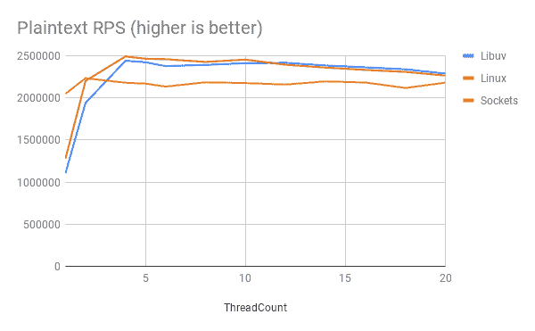

# 正在改善。NET Core Kestrel 性能，使用特定于 Linux 的传输

> 原文：<https://developers.redhat.com/blog/2018/07/24/improv-net-core-kestrel-performance-linux>

ASP.NET 核心是的网络框架。网芯。性能是一个关键特征。该堆栈经过大量优化，并持续进行基准测试。Kestrel 是 HTTP 服务器的名称。在这篇博文中，我们将用一个特定于 Linux 的实现替换 Kestrel 的网络层，并根据默认的开箱即用实现对其进行基准测试。TechEmpower web 框架基准用于比较网络层性能。

## **运输抽象**

由于传输抽象，Kestrel 支持替换网络实现。ASP.NET 核心 1.x 使用`[libuv](https://github.com/libuv/libuv)`进行网络实施。`libuv`是支撑 Node.js 的异步 I/O 库。`libuv`的使用要早于。NET 核心，当时跨平台 ASP.NET 叫 ASP.NET 5。然后范围扩大到跨平台。NET 实现，我们现在称之为*。*净芯。作为的一部分。NET 核心，网络实现变得可用(使用`Socket`类)。ASP.NET 核心 2.0 在 Kestrel 中引入了传输抽象，使得从`libuv`变为基于套接字的实现成为可能。对于版本 2.1，对套接字实现进行了许多优化，套接字传输已成为 Kestrel 中的默认设置。

传输抽象允许插入其他网络实现。例如，您可以利用 Windows RIO 套接字 API 或用户空间网络堆栈。在这篇博文中，我们将研究一个特定于 Linux 的传输。该实现可以直接替代`libuv` /Sockets 传输。它不需要特权能力，并且它在受约束的容器中工作，例如，当在 Red Hat [OpenShift](https://developers.redhat.com/blog/2018/07/05/deploy-dotnet-core-apps-openshift/) 上运行时。

对于未来的版本，Kestrel 的目标是作为非 HTTP 服务器的基础变得更加有用。传输和相关的抽象仍然会作为项目的一部分而改变。

## **基准介绍**

微软一直在对 ASP.NET 核心堆栈进行基准测试。结果可以在[https://aka.ms/aspnet/benchmarks](https://aka.ms/aspnet/benchmarks)看到。基准测试包括来自 [TechEmpower web 框架基准测试](https://www.techempower.com/benchmarks/)的场景。

观看基准测试结果时很容易迷失方向，所以让我简单介绍一下 TechEmpower 基准测试。

有许多[场景](https://www.techempower.com/benchmarks/#section=code)(也称为测试类型)。命运测试类型是最有趣的，因为它包括使用对象关系映射器(ORM)和数据库。这是 web 应用程序/服务中的常见用例。以前版本的 ASP.NET 核心在这种情况下表现不佳。得益于栈和 [PostgreSQL 驱动](http://www.roji.org/npgsql-4-perf)的优化，ASP.NET Core 2.1 显著改进了它。

其他场景不太能代表典型的应用程序。它们强调堆栈的特定方面。如果它们与您的用例非常匹配，看起来可能会很有趣。对于框架开发人员来说，它们有助于发现进一步优化堆栈的机会。

例如，考虑明文场景。这个场景包括一个客户端连续发送 16 个请求([流水线](https://en.wikipedia.org/wiki/HTTP_pipelining))，服务器知道响应，不需要执行 I/O 操作或计算。这并不代表典型的请求，但是对于解析 HTTP 请求来说，这是一个很好的压力测试。

每个实现都有一个类。比如 ASP.NET 核心明文有*平台*、*微、*和*全*实现。完整的实现是使用 MVC 中间件。微实现在管道级别实现，平台实现直接构建在 Kestrel 之上。虽然 platform 类提供了引擎有多强大的概念，但它不是应用程序开发人员用来编程的 API。

基准测试结果包括一个延迟选项卡。一些实现实现了非常高的每秒请求数，但是有相当大的延迟成本。

## **Linux 传输**

与其他实现类似，Linux 传输使用非阻塞套接字和 [epoll](https://en.wikipedia.org/wiki/HTTP_pipelining) 。比如。NET Core 的`Socket`，`eventloop`是用托管(C#)代码实现的。这不同于`libuv`循环，后者是本机`libuv`库的一部分。

使用了两个特定于 Linux 的特性:`[SO_REUSEPORT](https://lwn.net/Articles/542629/)`让内核在多个线程上对接受的连接进行负载平衡，Linux AIO API 用于批量发送和接收调用。

## **基准**

对于我们的基准，我们将在微类中使用 JSON 和明文场景。对于 JSON 基准测试，web 服务器用一个简单的 JSON 对象进行响应，该对象针对每个请求进行序列化。这意味着对于每个请求，我们的 web 服务器将做少量有用的工作，这使得传输变得很重要。对于明文场景，服务器用一个固定的字符串来响应。由于流水线操作(每 16 个请求)，只有 1/16 的请求需要进行网络 I/O。

每种传输都有许多设置。`libuv`和 Linux 传输都有一个属性来设置接收/发送消息的线程数量。套接字传输在`ThreadPool`上执行发送和接收。它有一个`IOQueueCount`设置，我们将改为设置。

下图显示了不同`ThreadCount` / `IOQueueCount`设置下的每秒 HTTP 请求数(RPS)。




我们可以看到，每个传输最初都受到分配的线程数量的限制。实际的处理发生在`ThreadPool`号上，它还没有满载。我们看到 Sockets 具有更高的 RPS，因为它也使用`ThreadPool`进行网络发送/接收。我们不能将它与其他传输进行比较，因为它受到不同方式的约束(它可以使用更多的线程进行传输)。

|  | **Linux vs `libuv`** |
| **明文** | +15% |
| **JSON** | +20% |

Transport is CPU-constrained

当我们充分增加`ThreadCount`时，运输不再是限制因素。现在，限制变成了 CPU 或网络带宽。

TechEmpower Round 16 基准测试达到了明文场景的网络带宽。如果您查看[基准测试结果](https://www.techempower.com/benchmarks/#section=data-r16&hw=ph&test=plaintext)，您会看到最高的结果都是大约相同的值。这些基准表明 CPU 未得到充分利用。

对于我们的基准测试，CPU 是满载的。处理器忙于发送/接收和处理请求。我们看到的场景之间的差异是由于每个网络请求的工作负载不同。对于明文，我们用一个网络请求接收 16 个流水线 HTTP 请求。对于 JSON，每个网络请求都有一个 HTTP 请求。这使得传输在 JSON 场景中比在明文场景中要重要得多。

|  | **`libuv` vs 插座** | **Linux vs `libuv`** | **Linux vs Sockets** |
| **明文** | +9% | +0% | +9% |
| **Json** | +17% | +10% | +28% |

App is CPU-constrained

## **使用 Linux 传输**

Kestrel Linux transport 是一个实验性的实现。你可以用[myget.org](https://www.myget.org)上发布的`2.1.0-preview1`包试试。如果你尝试这个包，你可以使用[这个 GitHub 问题](https://github.com/redhat-developer/kestrel-linux-transport/issues/61)来给出反馈并被告知(安全)问题。根据您的反馈，我们将看看在[nuget.org](https://www.nuget.org)发布受支持的 2.1 版本是否有意义。

这样做是为了将 myget 提要添加到一个`NuGet.Config`文件中:

```
<?xml version="1.0" encoding="utf-8"?>
<configuration>
  <packageSources>
	<add key="rh" value="https://www.myget.org/F/redhat-dotnet/api/v3/index.json" />
  </packageSources>
</configuration>

```

并在您的`csproj`文件中添加一个包引用:

```
<PackageReference Include="RedHat.AspNetCore.Server.Kestrel.Transport.Linux" Version="2.1.0-preview1" />

```

然后我们在`Program.cs`中创建`WebHost`时调用`UseLinuxTransport`:

```
public static IWebHost BuildWebHost(string[] args) =>
        	WebHost.CreateDefaultBuilder(args)
            	*.UseLinuxTransport()*
            	.UseStartup()
            	.Build();

```

在非 Linux 平台上调用`UseLinuxTransport`是安全的。只有当应用程序在 Linux 系统上运行时，方法才会更改传输。

## **结论**

在这篇博文中，您了解了 Kestrel 以及它的传输抽象如何支持取代网络实现。我们仔细研究了 TechEmpower 基准测试，并探索了 CPU 和网络限制如何影响基准测试结果。我们已经看到，与默认的开箱即用实现相比，特定于 Linux 的传输可以带来显著的好处。

有关跑步的信息。NET Core on Red Hat Enterprise Linux 和 OpenShift，参见[。网芯*入门指南*](https://access.redhat.com/documentation/en-us/net_core/2.1/html/getting_started_guide/) 。

*Last updated: September 3, 2019*