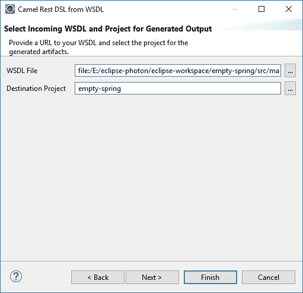
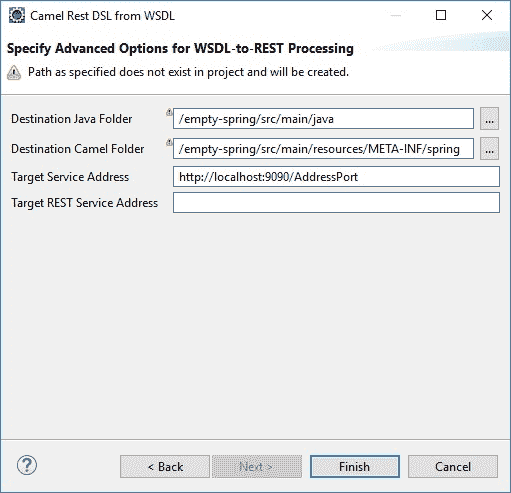
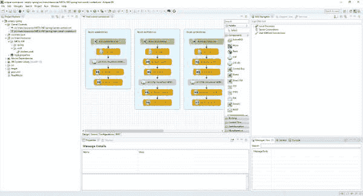
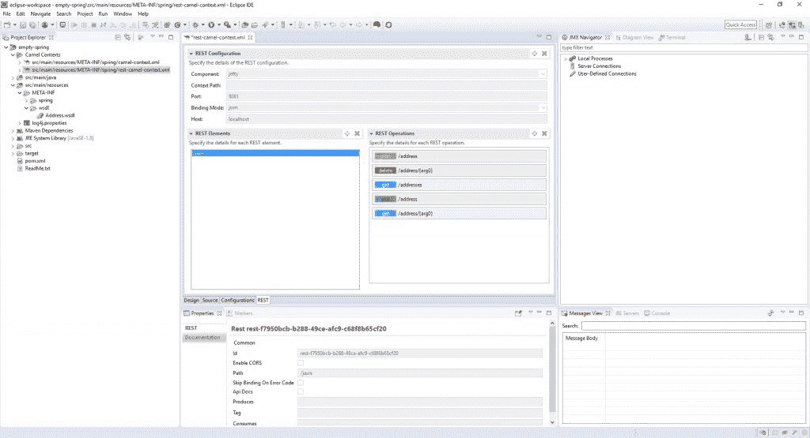

# 如何用 Camel 迁移您的 SOAP web 服务到 REST

> 原文：<https://developers.redhat.com/blog/2018/07/24/migrate-soap-to-rest-with-camel>

基于 SOAP 的服务在许多企业解决方案中大量存在，并且正在慢慢被 RESTful 服务所取代，以简化它们的使用。在最新版本的[Red Hat Fuse toolkit](https://tools.jboss.org/features/fusetools.html)中添加了一个新的向导来帮助您进行转换。本文展示了如何使用新向导从旧的基于 SOAP 的服务过渡到更现代的基于 REST 的服务。

如果你不熟悉， [Red Hat Fuse](https://developers.redhat.com/products/fuse/overview/) 是一个基于 Camel 和许多其他项目的集成平台。更新 Fuse 工具在[Red Hat Developer Studio 12 . 0 . 0](https://developers.redhat.com/blog/2018/07/18/announcing-devstudio-12-jboss-tools-46/)中可用，这是基于 Eclipse 4.8 Photon 的桌面 IDE。您也可以通过直接下载或者通过 Eclipse Marketplace 安装，将 [JBoss Tools 4.6](http://tools.jboss.org/downloads/jbosstools/photon/4.6.0.Final.html) 添加到您现有的 Eclipse 4.8 Photon 安装中来获得新向导。

## 其余 DSL 是什么？

Apache Camel REST DSL 为用户提供了一种使用常见 Rest 动词(如 GET、POST、DELETE 等)定义 Rest 服务的简单方法。它既可用于 XML (Spring 或 Blueprint ),也可用于 Java DSLs，作为一个外观来构建作为 Camel routes 消费者的 REST 端点。

很多例子可以在[阿帕奇骆驼网站](http://camel.apache.org/rest-dsl.html)找到。

## Fuse 工具路由编辑器支持 REST DSL 吗？

在 Eclipse 中 Red Hat Fuse 工具的以前版本中，没有一种好的方法来呈现这种有用的功能。然而，在这个版本中，通过 Fuse Tooling Route Editor 中的一个新的 Rest 选项卡，将提供对 Rest DSL 的只读支持。(该功能将在未来的版本中得到充实，使其更加可用，但是现在，您仍然可以在 Source 选项卡中编辑 Rest DSL，并在 Rest 选项卡中查看详细信息。

## 我的 SOAP 服务在哪里发挥作用？

一个叫做`wsdl2rest`(现在在 https://github.com/jboss-fuse/wsdl2rest 的[有售)的老工具已经作为一个不受支持的项目存在了一段时间。这个工具简化了从现有的 JAX-WS 基于 SOAP 的服务到 RESTful 服务的迁移。该工具已经针对 Red Hat Fuse 7 进行了更新和改进，现在是发行版中受支持的一部分，这意味着您可以使用少量命令行选项在命令行中使用它，并生成一个 Camel 配置，将 SOAP 操作映射到 REST 操作。您所要做的就是将 URL 传递给源 WSDL、生成的 Java 工件的输出路径、Blueprint 或 Spring Camel 上下文文件的输出路径，以及所用端点的 JAX-WS 和 JAX-RS 地址的详细信息。](https://github.com/jboss-fuse/wsdl2rest)

然而，我们还在工具中启用了一个选项来使用这个实用程序。现在你可以启动新的“WSDL 骆驼休息 DSL”向导了！该向导简化了所需选项的收集，将其归结为选择 WSDL 和 Fuse 集成项目，这样它就知道要生成什么 Camel DSL (Spring，Blueprint，Spring Boot ),您就可以开始比赛了！

## “WSDL 骆驼休息 DSL”向导是如何工作的？

该向导在 Eclipse 中可用，安装了 Red Hat Developer Studio 12 和最新版本的 Red Hat Fuse 工具。要使用该向导，您需要在您的工作区中有一个预先存在的 Red Hat Fuse 集成项目，并且能够访问 WSDL 文件。您可以通过选择**文件- >新建- > Fuse Integration 项目**来创建一个新项目，打开新建 Fuse Integration 项目向导，WSDL 文件可以是本地的，也可以是远程的，可以通过 URL 获得。

先决条件就绪后，请执行以下操作:

1.  在 Fuse integration 透视图中右键单击一个 Fuse 集成项目，选择**New->Camel Rest DSL from WSDL**或者点击 **File- > New- > Other…，Red Hat Fuse->Camel Rest DSL from WSDL**。
2.  要在本地选择 WSDL 文件，请使用“...”按钮打开文件选择对话框，并从您的文件系统中选择一个文件。如果您拥有网络上 WSDL 的有效 URL，可以直接在字段中键入该 URL。
3.  如果在项目浏览器中选择了一个 Fuse integration 项目，它将在目标项目字段中被自动选择。如果没有，您可以使用“...”按钮来选择您想要创建工件的项目。
    
4.  点击下一个的**，进入高级选项页面。**
5.  Destination Java Folder 和 Destination Camel Folder 字段是根据所选择的 Fuse integration 项目和项目使用的 Camel DSL 预先填充的。根据项目是 Spring、Blueprint 还是 Spring Boot，有不同的默认路径。请注意，如果目录中存在现有文件，或者必须首先创建目录，则会出现警告，让您了解这些情况。
6.  目标服务地址字段对应于 WSDL 绑定中指定的 SOAP 地址，但是您可以对其进行定制，以匹配 WSDL 引用的 SOAP 服务的实际地址。
    
7.  可选的目标 REST 服务地址字段对应于可以访问 REST 服务的 URL。这个 URL 被分解成 Rest DSL 中的`<restConfiguration>`和`<rest>`标记的设置，以指定映射到 SOAP 服务的 Rest 操作的完整 URL。如果没有在向导中指定，这些细节可以稍后在 Rest DSL 中直接提供。
8.  点击**完成**。

一旦向导完成了对引用的 WSDL 文件的处理，它就会生成一个新的 Camel 配置以及 Java 中的包装器代码，将 SOAP 操作映射到 REST 操作。如果您打开生成的 Camel 文件，您将看到已经创建的各种路线和用于映射操作的其余 DSL。Camel 中生成的 Rest DSL 可以根据需要进一步定制。

以下是在路线编辑器的设计选项卡中生成的 Camel 配置:

Generated Camel Configuration in Design tab of Route Editor
Here's the generated Camel configuration in the REST tab of the Route Editor:">

该实用程序为以更现代的基于 REST 的方式重用旧的基于 SOAP 的服务提供了一个起点。我们期待在 Fuse 工具的未来版本中改进新的 REST 选项卡！

*Last updated: March 19, 2020*