# 采用 Apicurio 和 Red Hat Fuse/Camel 的合同优先 API 设计

> 原文：<https://developers.redhat.com/blog/2018/07/12/contract-first-api-design-with-apicurio-and-red-hat-fuse>

这是我的两篇文章系列的第一部分，展示了如何使用 [Apicurio](https://www.apicur.io/) 和 [Red Hat Fuse](https://www.redhat.com/en/technologies/jboss-middleware/fuse) 实现契约优先的 API 设计。它涵盖了如何使用 Apicurio Studio 创建一个 OpenAPI 标准文档作为 API 提供者和消费者之间的契约。它还展示了如何使用基于 Camel 的 [Red Hat Fuse](https://developers.redhat.com/products/fuse/overview/) 快速创建模拟测试。

创建 API 有两种常见的方法:

*   代码优先(自上而下)
*   契约优先(自下而上)

## 代码优先方法

对于 ESB 开发人员来说，这两种方法并不新鲜。以前，是 WSDL 定义了服务的契约。我们首先做了大量的编码工作，因为编写几个 Java 类并为消费者生成 WSDL 很容易。这就是*代码优先*的方法，这在过去是最常见的。

[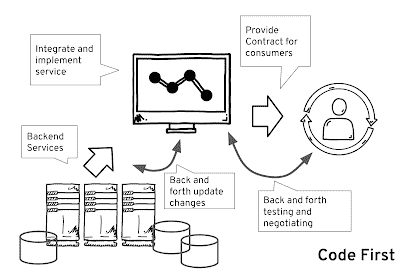](https://4.bp.blogspot.com/-xn1vGjSAAnE/WzqGGNtRwcI/AAAAAAAAFkw/5QNFPyU4AJ4-8S8X8xjwHLL4aEjfA_B3QCLcBGAs/s1600/Screen%2BShot%2B2018-07-03%2Bat%2B4.07.01%2BAM.png)

如果您的应用程序的消费者已经决定了他们希望服务如何工作，那么代码优先的开发会非常简单。对于要交换的数据，开发人员和消费者之间总会有一个初步的讨论。很可能存在某种服务“契约”的概念，但通常是隐含的。使用这种方法，小的变化是不可避免的，并且开发人员要花费很大的精力来完成所有这些更新和使一切正确的漫长过程。由于合同没有明确说明，这些变化实际上可能会破坏事情，因为开发人员和消费者对服务的预期操作有不同的理解。

。

## 契约优先方法

企业用户和公民用户/开发人员可以使用新的 OpenAPI 规范进行协商，并在将设计移交给开发人员之前，可能会与消费者进行一些预先测试。这种设计方法被称为*契约优先*。它变得越来越流行，因为它避免了开发人员在协商如何提供服务时浪费时间。

[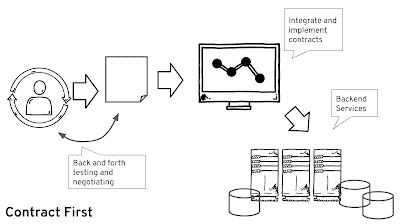](https://1.bp.blogspot.com/-yveltlUuzW4/WzqLuvxMhrI/AAAAAAAAFk8/SbjUNBZ3udIGlMkTSlITPhSqKUT3N6AHgCLcBGAs/s1600/Screen%2BShot%2B2018-07-03%2Bat%2B4.31.35%2BAM.png)

显然，有许多方法可以实现契约优先的 API。我将演示如何使用 Apicurio 和 Red Hat Fuse 来实现这一点。我将使用 Apicurio 来定义 API，并自动生成 Red Hat Fuse 项目，以便进行快速测试。

## 创建客户服务 API

在这个示例演示中，我们将把客户信息作为服务提供给我们的消费者。对于这个演示，我们将从检索和创建一个客户服务开始。

[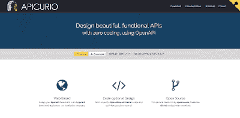](http://1.bp.blogspot.com/-XTDagvBT42k/Wztx7K9XbJI/AAAAAAAAFlM/JqqlHpz7vXA2rKSZZz5eOckSRnVq7NnWACK4BGAYYCw/s1600/Screen%2BShot%2B2018-07-03%2Bat%2B8.03.27%2BAM.png)

### 在 Apicurio 中用 OpenAPI 规范定义应用程序

Apicurio 是一个基于 web 的开源工具，用于设计基于 OpenAPI 规范的 API。

如果您还没有 Apicurio 帐户，您需要先注册一个。

[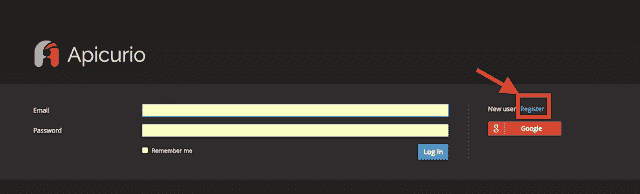](http://1.bp.blogspot.com/-ChQnfK46nzg/WztygyxYt2I/AAAAAAAAFlY/HU51E1gVIqoI1M2OhSgj30wRDV4SsU0BACK4BGAYYCw/s1600/Screen%2BShot%2B2018-07-03%2Bat%2B8.03.42%2BAM.png)

注册后，您将被重定向到 Apicurio 的主屏幕。然后，在与消费者讨论他们对客户服务的期望后，您可以点击**创建新 API** 开始创建合同。[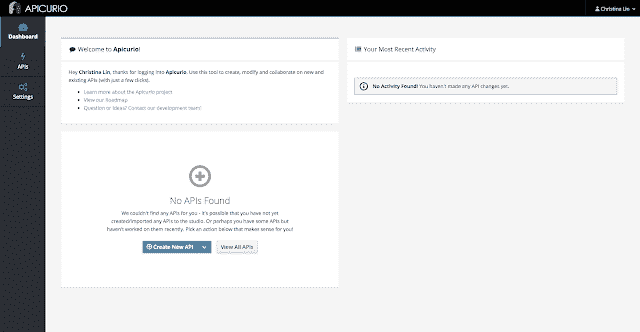](http://2.bp.blogspot.com/-PwRajchevj0/WztyzBw4vQI/AAAAAAAAFlk/YafjXYkrJL0t46mWjImoox8IoAe37u2zACK4BGAYYCw/s1600/Screen%2BShot%2B2018-07-03%2Bat%2B8.06.13%2BAM.png)

接下来你需要做的很简单:

*   创建 API(服务)。
*   创建数据定义(如果需要的话)。
*   添加路径；定义参数和操作；并向路径返回响应。

输入服务的名称，最好为服务添加一个描述，这样人们更容易理解每条路径的含义。

[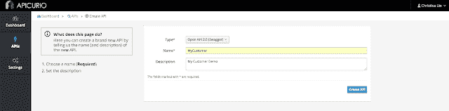](http://1.bp.blogspot.com/-nYGSbZRAjac/WzuWDhWRC8I/AAAAAAAAFpI/jzK4uncQ8FgXzCIj-K9Dc3oBgIhb8pRNgCK4BGAYYCw/s1600/Screen%2BShot%2B2018-07-03%2Bat%2B11.27.59%2BAM.png)

Enter a customer definition to show info about what we are going exchange.

[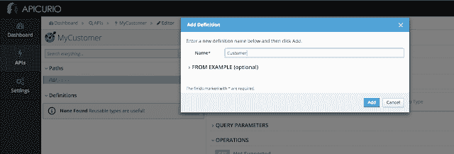](http://3.bp.blogspot.com/-lYJT8fTF56E/Wzt220wWDjI/AAAAAAAAFmI/26TUka6CyPcZfen6tCUQX-Zu1zVuC911gCK4BGAYYCw/s1600/Screen%2BShot%2B2018-07-03%2Bat%2B8.11.25%2BAM.png)

添加并定义属性及其数据类型。

[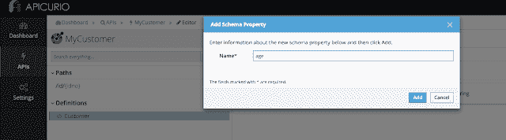](http://1.bp.blogspot.com/-abCM_73sxto/Wzt4Kg7FnpI/AAAAAAAAFmU/qJbyWPUwf2sZKQfTYjPuI8p1aqXDGo3iwCK4BGAYYCw/s1600/Screen%2BShot%2B2018-07-03%2Bat%2B8.24.36%2BAM.png)[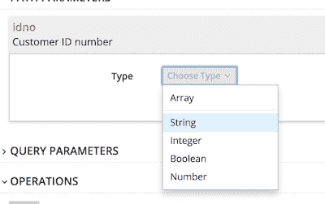](http://4.bp.blogspot.com/-7KqBiY8QYP0/Wzt4MKqqdnI/AAAAAAAAFmc/78f-wIvgAuALhj2g5aFMyQ4gs0b02SE4QCK4BGAYYCw/s1600/Screen%2BShot%2B2018-07-03%2Bat%2B8.27.54%2BAM.png)Then you can start adding the paths to the document.[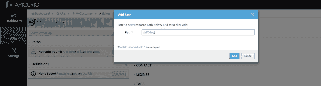](http://4.bp.blogspot.com/-swa98cIRZzs/Wzt_DIkuxMI/AAAAAAAAFms/0TjvMT6wqTI62IOrL8PayzaE9zFE3aMDQCK4BGAYYCw/s1600/Screen%2BShot%2B2018-07-03%2Bat%2B8.07.43%2BAM.png)Add parameters and define their type.[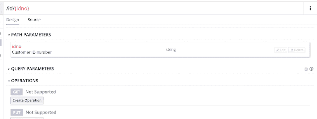](http://4.bp.blogspot.com/-OZ3nXxrFT6I/Wzt_PNEi4HI/AAAAAAAAFm0/AoMy4DeX7ec9PmkurBta2zzT-M7b4qIBwCK4BGAYYCw/s1600/Screen%2BShot%2B2018-07-03%2Bat%2B8.28.04%2BAM.png)

[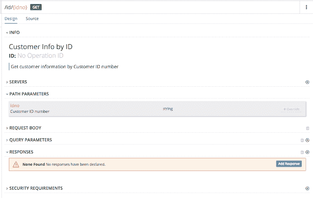](http://1.bp.blogspot.com/-2x-JSSeBHj0/Wzt_mgy1fXI/AAAAAAAAFnE/B7PsCRbU3487BaAP6RnzfRJbPEgTSOHNgCK4BGAYYCw/s1600/Screen%2BShot%2B2018-07-03%2Bat%2B8.28.50%2BAM.png)

[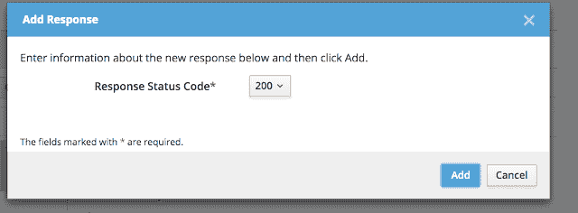](http://4.bp.blogspot.com/-UaS3tO6kqpQ/Wzt_nSLFVHI/AAAAAAAAFnM/2p3CJNQpDRM7c6qHk0noKfcBgTj19F2hQCK4BGAYYCw/s1600/Screen%2BShot%2B2018-07-03%2Bat%2B8.28.58%2BAM.png)
[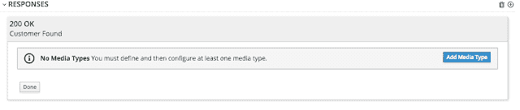](http://3.bp.blogspot.com/-nj6qZhw1GBo/Wzt_tsuHMeI/AAAAAAAAFnU/3ZGagdOEu9Q50qJaxU1QFrKgpCLeX4kxwCK4BGAYYCw/s1600/Screen%2BShot%2B2018-07-03%2Bat%2B8.29.21%2BAM.png)

还可以添加响应(如果您的路径需要的话)。

[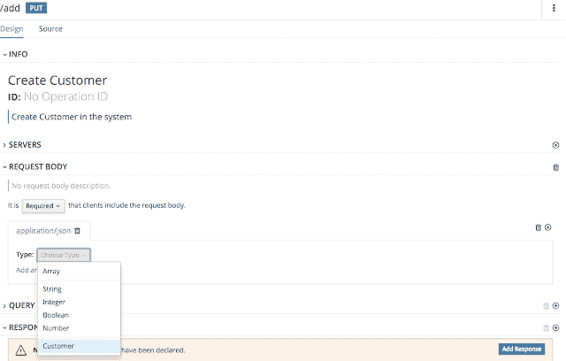](http://1.bp.blogspot.com/-QmmJKkRFnqg/WzuCYXCyjoI/AAAAAAAAFno/bw8o469bwoMuZ07ey1GyZs1r1XGzJEsZQCK4BGAYYCw/s1600/Screen%2BShot%2B2018-07-03%2Bat%2B8.36.37%2BAM.png)

完成后，就可以导出 API 标准文档了。

[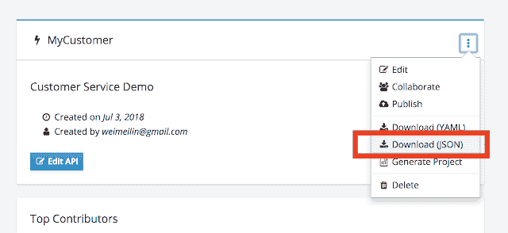](http://4.bp.blogspot.com/-XDM2UyK6Bsk/WzuDBZjtgwI/AAAAAAAAFn0/Ks_HsobFs1EIXRTblCpKXGW0vthr90jhQCK4BGAYYCw/s1600/Screen%2BShot%2B2018-07-03%2Bat%2B8.43.13%2BAM.png)

### **从标准 API 文档生成 Red Hat Fuse 项目**

转到 Red Hat Developer Studio，在导航面板中右键单击并选择**New->Fuse Integration Project**，创建一个新的 Red Hat Fuse 项目。

[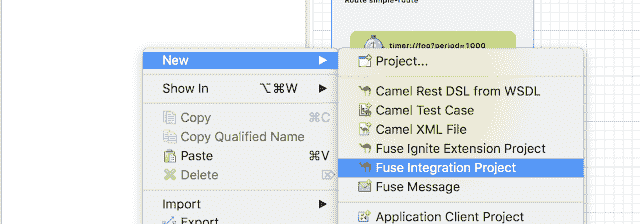](http://4.bp.blogspot.com/-WJPxKJf_8sQ/WzuDXnvgfNI/AAAAAAAAFoI/v5x9AxjkvO0OMc-q_fF1CeW2cBW5IWNIwCK4BGAYYCw/s1600/Screen%2BShot%2B2018-07-03%2Bat%2B10.08.18%2BAM.png)

为项目提供一个名称。

[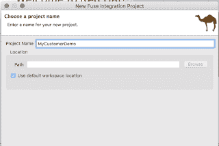](http://1.bp.blogspot.com/-H3aeymLiXIk/WzuDQ6MwfrI/AAAAAAAAFn8/W0u6VQx5AWg8_NPsVMYNwpeh5xZ72NEvQCK4BGAYYCw/s1600/Screen%2BShot%2B2018-07-03%2Bat%2B8.51.36%2BAM.png)

我们将使用微服务方法，因此选择最流行的运行时—Spring Boot。我们将在 Red Hat OpenShift 云平台上运行这个。

[](http://4.bp.blogspot.com/-FG9ynb0VjVg/WzuEF0ADebI/AAAAAAAAFoY/si2x1omk0pwJFHXz2z39ipS3FHMMV1EbwCK4BGAYYCw/s1600/Screen%2BShot%2B2018-07-03%2Bat%2B8.51.45%2BAM.png)

选择 Spring DSL 模板。

[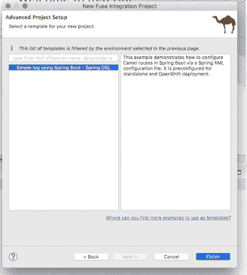](http://1.bp.blogspot.com/-wy1LtMUGz7Y/WzuEaVaCtWI/AAAAAAAAFok/Y6g8jJ3aJEs2rq7uifgEyKOPnxC6N3c5QCK4BGAYYCw/s1600/Screen%2BShot%2B2018-07-03%2Bat%2B8.51.59%2BAM.png)

然后，您将拥有一个示例 Red Hat Fuse 项目:

[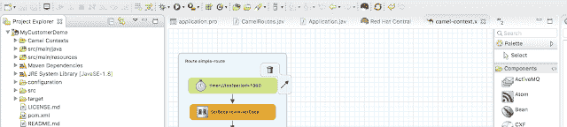](http://2.bp.blogspot.com/-8yKi5i3kJdw/WzuFrH9Y0lI/AAAAAAAAFow/AVHm18CKbkIELG0mL3uSLCnzJOMF_EsgQCK4BGAYYCw/s1600/Screen%2BShot%2B2018-07-03%2Bat%2B10.17.38%2BAM.png)

将生成的 API 规范文档添加到目录`src/spec/`中。

[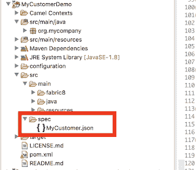](http://3.bp.blogspot.com/-gNgkWcdI64c/WzuNhvUnKmI/AAAAAAAAFo8/kmW2PwCHAg8sjlnNwQvvKgbxZ7dsiUqMACK4BGAYYCw/s1600/Screen%2BShot%2B2018-07-03%2Bat%2B10.50.43%2BAM.png)

编辑`pom.xml`文件，并添加以下内容:

```
<plugins>
....
<plugin>
  <groupId>org.apache.camel</groupId>
  <artifactId>camel-restdsl-swagger-plugin</artifactId>
  <version>2.21.0</version>
  <configuration>
    <specificationUri>src/spec/MyCustomer.json</specificationUri>
    <fileName>camel-rest.xml</fileName>
    <outputDirectory>src/main/resources/spring</outputDirectory>    
  </configuration>
</plugin>
....
</plugin>

```

通过在命令行工具中运行以下命令来生成 XML:

 **`mvn camel-restdsl-swagger:generate-xml`

[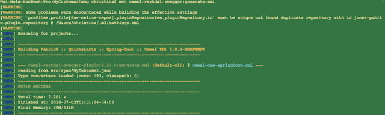](http://3.bp.blogspot.com/-aqD9wgB3KFE/WzuW2nHTU1I/AAAAAAAAFpU/HOO-xkHd89QeWNkBD2kaBjuLMbUCv9ZRQCK4BGAYYCw/s1600/Screen%2BShot%2B2018-07-03%2Bat%2B11.31.08%2BAM.png)

然后您会发现一个新生成的名为`camel-rest.xml`的 Camel 上下文，它包含了 Camel 中所有的路径实现。

[](http://2.bp.blogspot.com/-ZHrnbN0ukGs/WzuYTa0XpxI/AAAAAAAAFps/sAGdtJQUmDgbyJ4Nb8Zzp30F6UJ5jFcpACK4BGAYYCw/s1600/Screen%2BShot%2B2018-07-03%2Bat%2B11.33.36%2BAM.png)

从那个文件中，复制`<rests>`标签中的所有内容，并粘贴到`camelContext`中的原始`camel-context.xml`文件中。在 rest 块的顶部添加以下 rest 配置。

```
<restConfiguration apiContextPath="api-docs" bindingMode="auto"
            component="undertow" contextPath="/customer"
            enableCORS="true" port="8080">
   <apiProperty key="cors" value="true"/>
   <apiProperty key="api.title" value="Customer Service"/>
   <apiProperty key="api.version" value="1.0.0"/>
</restConfiguration>
```

[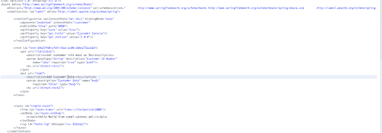](http://3.bp.blogspot.com/-TcwfnhhYf_Y/WzufhZBQE5I/AAAAAAAAFp4/gJ25mM5u_5QW1qKOpiWQddOuh1daxuVIwCK4BGAYYCw/s1600/Screen%2BShot%2B2018-07-03%2Bat%2B12.07.58%2BPM.png)Delete the generated `camel-rest.xml` file.

### 用 Apache Camel 嘲笑 API

我们将通过在 Camel 上下文中添加一个常量、已定义的 bean 来模拟返回的结果。

为此，在`src/main.resource/spring`文件夹中，通过右键单击文件夹并选择 **New- > beans.xml 文件**，添加一个`beans.xml` 文件。

[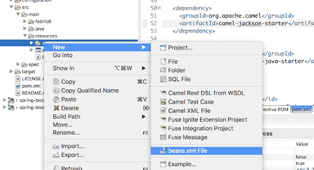](http://2.bp.blogspot.com/-Og8GmwF5Ri8/Wz4sotd7_nI/AAAAAAAAFqI/ZJA_QTS96-0QuhKo0iLClYb4YdL87On7wCK4BGAYYCw/s1600/Screen%2BShot%2B2018-07-05%2Bat%2B10.34.50%2BAM.png)

将以下代码片段插入到`beans.xml`文件中:

```
<util:list id="CustomerList" list-class="java.util.ArrayList">
   <ref bean="Customer"/>
</util:list>
<util:map id="Customer" map-class="java.util.HashMap">
   <entry key="name" value="Christina"/>
   <entry key="age" value="28"/>
   <entry key="contact" value="765483921"/>
</util:map>

```

将骆驼路线添加到`camel-context.xml`文件中。第一个返回模拟客户数据，第二个将客户信息作为输入。

```
<route id="rest1-route">
 <from id="restone" uri="direct:rest1"/>
  <setBody id="route-setBody1">
    <simple>bean:CustomerList?method=get(0)</simple>
  </setBody>
</route>
<route id="rest2-route">
  <from id="resttwo" uri="direct:rest2"/>
  <log id="input-log" message=">>> ${body}"/>
    <setBody id="route-setBody2">
      <simple>Customer created</simple>
    </setBody>
</route>
```

现在，是时候在`pom.xml`文件中设置依赖库了:

```
<dependency>
  <groupId>org.springframework.boot</groupId>
  <artifactId>spring-boot-starter-undertow</artifactId>
</dependency>
<dependency>
  <groupId>org.apache.camel</groupId>
  <artifactId>camel-undertow-starter</artifactId>
</dependency> 
<dependency>
  <groupId>org.apache.camel</groupId>
  <artifactId>camel-jackson-starter</artifactId>
</dependency> 
<dependency>
  <groupId>org.apache.camel</groupId>
  <artifactId>camel-swagger-java-starter</artifactId>
</dependency>

```

Finally, it's time to test by running the following at the command line:

`mvn sprint-boot:run`

将暴露两个端点进行测试:

```
Christina Laptop$ curl http://YOURIP:8080/customer/id/123

{"name":"Christina","age":"28","contact":"765483921"}

Christina Laptop$ curl --header "Content-Type: application/json"   --request PUT   --data '{"name":"Christina","age":28,"contact":"765483921"}'   http://YOURIP:8080/customer/add

"Customer created"

```

现在，您已经为消费者开始测试 API 做好了准备。

在本系列的下一篇文章中，我将带您了解如何实际实现 API，在云中公开它，并管理它。

* * *

有关更多信息，请参见以下 Red Hat 开发人员资源:

*   [DevNation Live] - [云中的骆驼骑士](https://developers.redhat.com/videos/youtube/zuEYtMvHN6g/) -观看《行动中的骆驼》一书的作者克劳斯·易卜生的录音。
*   下载免费电子书- [选自《骆驼行动》第二版](https://developers.redhat.com/books/selections-camel-action/)。
*   了解更多关于 [Red Hat Fuse](https://developers.redhat.com/products/fuse/overview/) 的信息，这是一个基于 Camel 的分布式云原生集成解决方案
*   阅读[API 之旅:以敏捷的方式从想法到部署——第 1 部分](https://developers.redhat.com/blog/2018/04/11/api-journey-idea-deployment-agile-part1/)**