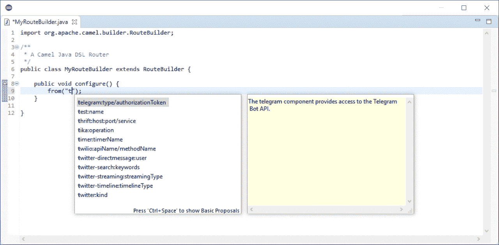
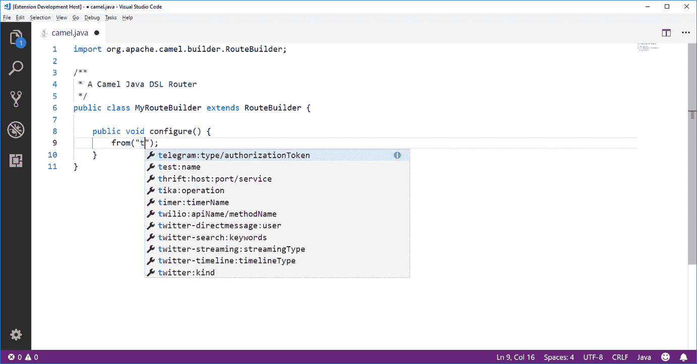

# 用 Java DSL 完成 Apache Camel URI

> 原文：<https://developers.redhat.com/blog/2018/07/10/apache-camel-uri-completion-with-java-dsl>

[阿帕奇骆驼](http://camel.apache.org/) URI 完成[XML DSL](https://developers.redhat.com/blog/2018/02/15/apache-camel-uri-completion/)已经可以在 [Eclipse 桌面](https://marketplace.eclipse.org/content/apache-camel-language-server)、 [Eclipse Che](https://developers.redhat.com/blog/2018/05/21/apache-camel-uri-completion-easy-installation-for-eclipse-vs-code-and-openshift-io/) 、 [Red Hat OpenShift.io](https://developers.redhat.com/blog/2018/05/21/apache-camel-uri-completion-easy-installation-for-eclipse-vs-code-and-openshift-io/) 、 [Visual Studio 代码](https://marketplace.visualstudio.com/items?itemName=camel-tooling.vscode-apache-camel)和 [IntelliJ](https://plugins.jetbrains.com/plugin/9371-apache-camel-idea-plugin) 中使用。然而，对于 Java DSL，它只在 IntelliJ 中可用。但是 Visual Studio 代码和 Eclipse 桌面现在也为 Java DSL 提供了 Apache Camel URI 完成。

下面，你可以看到它的作用:

*   在 Eclipse 桌面 IDE 中:

*   在 Visual Studio 代码中:

目前，完成 URI 的要求是:

*   文件名需要以`.java` *结尾。*
*   该文件需要包含写在某处的`camel`。
*   骆驼 URI 字符串需要直接用作`RouteBuilder.from`或`RouteBuilder.to`方法的参数(这意味着没有空格，没有变量)。

你可能会问“那 Eclipse Che 和 OpenShift.io 呢？”正在进行工作，使 URI 的完成也成为可能。你可以关注[这一期](https://github.com/eclipse/che/issues/10262)来查看进度。

提醒一下，现在很容易在所有这些环境中安装 Apache Camel 参见我的[上一篇描述安装过程的文章](https://developers.redhat.com/blog/2018/05/21/apache-camel-uri-completion-easy-installation-for-eclipse-vs-code-and-openshift-io/)。

如果您有改进建议，请在[问题跟踪器](https://github.com/camel-tooling/camel-language-server/issues)中提出。

享受这一新功能！

*Last updated: July 9, 2018*