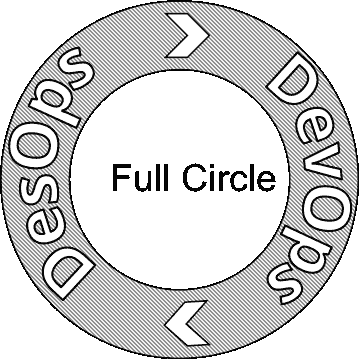
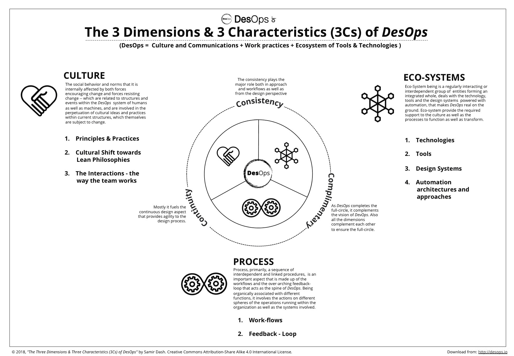

# DesOps——设计的下一波浪潮

> 原文：<https://developers.redhat.com/blog/2018/06/22/desops-the-next-wave-in-design>

*德索普斯，*又名。 *DesignOps，*指的是一种受 *DevOps* 文化启发的设计方法。在这篇文章和后面的文章中，我们将探索

*   如何为下一波设计浪潮做准备，这一浪潮是对文化转变、协作和自动化概念的补充。
*   我们还将看到今天有哪些解决方案有助于在软件开发生命周期的环境中实现完整的设计。

如今，*设计*作为一门学科正得到越来越多的企业家世界的认可，许多行业的努力，如 [*IBM* 的*企业设计思维*](https://www.ibm.com/design/) 框架、 [*红帽*的*开放工作室*](https://openstudio.redhat.com/designing-the-open-source-way/) 和类似的，都在大规模地试图在软件开发生命周期的*敏捷*方法和*设计思维*之间创造一种协同效应这是一个有趣的十字路口，产品交付的下一件大事是将可伸缩性和自动化引入到创作过程中。

在软件行业的背景下，我总是将“设计”视为创造力和技术之间的交叉点，在这里两者在用户需求的帮助下相互塑造，并将结果融合到成功的产品中。

交付的任何典型的软件产品都涉及许多复杂的以及不同的技术、过程、人员和远景。尽管软件交付通常发生在分成两大组的团队成员之间——开发人员和设计人员——最终，最好的结果总是取决于两个团队如何相互交流，以及他们的想法和创意如何有效地被共享、传播和翻译。

当涉及到产品开发时，复杂性的数量和各方面的多样性——从多样化的思维、技术、工具和过程——都是非常重要的。我们已经尝试在各个方面进行改进，以确保交付流程能够得到优化，从而满足不断扩大的需求。在软件和 IT 基础设施行业，最近一个这样的现象是 DevOps，它专注于重新思考开发和运营，以提高生产率和效率。

DevOps 开始于本世纪第一个十年的末期。早在 2008 年，编码人员和软件部署人员的角色之间就有很好的区分。基本上，编码人员负责代码生成，而基础设施人员负责部署软件的过程。

由于敏捷过程的兴起，代码生成和部署作为交付的一部分变得更加频繁和持续，不像古老的瀑布模型，过去周期是每六个月到一年发生一次。在所有主要的软件服务行业中，用固定的日历日期来表示软件发布是很常见的。敏捷*方法的两到三周冲刺在许多方面使得这种周期过时了。*

随着连续交付成为事实上的标准，它缩小了开发团队和基础设施团队之间的差距。这种变化也产生了对多学科角色或个人的需求，他们可以在生产环境和开发服务器之间架起一座桥梁，允许他们的代码以更高效、更快速的方式部署。随着 *DevOps* 运动的形成，围绕它的实践从几个有才华的黑客发展成为一种有自己文化的职业，包括自己的一套工具、实践、技术和工作流，这已成为当今行业的规范。

今天，大多数 *DevOps* 方法关注的是主要影响产品工程或技术方面的流程块，而不是设计方面。为了弥合这一差距，许多人正在尝试定义一种叫做 DesOps *的一致方法。*

DesOps 或 *DesignOps* 是一个相对较新的术语。为了更好地理解*德索普斯*，许多人会参考*德索普斯*，它们有着相似的基本理念和目标。DesOps 是一个相对较新的概念，但对于寻求帮助他们的团队为他们的组织和组织的客户增加价值的设计师来说，它是一个越来越受关注的领域。然而，多年来不同组织所做的许多尝试中，DesOps 的实践并不一致。

即使当我们试图实现一个 *DevOps* 适应的过程来运行一个设计驱动的过程模型时，挑战，比如设计和开发之间或者设计和测试之间的差距，也是不固定的。如果不实施 DesOps 来修复设计流程，DevOps 的实施将永远不会产生预期的结果，也无法维持其背后的核心理念。

*去卵巢*和*去卵巢*是相辅相成的。设计交付流程改进试图优化整体交付流程，从而为 *DevOps* 做出贡献。例如，产品的测试等方面涉及设计方面、可用性、可访问性等等。在测试阶段，需要基准来充当裁判；这只能来自一个过程，其中 *DesOps* 已经实现了输出，然后将基准馈送到 *DevOps* 阶段，测试模块可以使用它。此外，当我们使用敏捷或迭代交付过程模型时，在每个 sprint 周期中，执行端到端的流程，从而使*持续集成* (CI)和*持续交付* (CD)真正有意义。

DesOps 最初诞生于如何大规模设计的基本需求。塑造它的因素与塑造*号 DevOps* 号的因素类似。随着最近一段时间的软件交付，通过*敏捷*过程、 *CI* & *CD* 包括*持续部署*,*devo PS*方法提供了一条更快的高速公路，确保以更低的风险更快地交付。因此，早期的软件开发生命周期模型以其当前的形式从敏捷重新定义为 DevOps。

然而，由于设计是任何交付产品不可或缺的一部分，传统设计生命周期和快速开发生命周期之间的差距需要弥合。设计团队和工程团队之间需要更紧密的整合，这是确保大规模设计的必要条件。在过去的两三年里，五大技术公司在这一领域进行了大量投资，并为其他组织和设计社区在这一领域的探索铺平了道路。 *DesOps* 的含义反映在结果中，团队和学科之间的孤岛减少了。与此同时， *DesOps* 改善了跨职能团队之间的协作和工作实践，有助于最大限度地减少交付过程中的浪费。

历史上有趣的是，一开始，*DesOps*——没有它的正式名称——专注于创建和维护领域以及它的模块化设计系统的共享。在过去的几年里，更多的是关于组织拥有设计系统并使其社会化。这些设计系统主要由视觉设计语言、组件和小部件组成。这些设计系统定义了基本目标、原则、品牌(针对特定的组织身份)和视觉语言，有助于保持设计作品和资产创建的一致性。除此之外，所包含的 UI 模式和小部件库有助于在组织或产品组合内更大范围的界面交互方面实现一致性。

确保这种一致性成为一个组织的用户体验目标的战略方面的一部分，设计团队负责推动这一点。大多数情况下，这项任务成为组织中*设计总监*、*领导、*和*负责人*角色的主要部分，作为他们目标的一部分，以确保为他们的设计团队和实践带来正确的成熟度。

就 *DesOps* 原则所面向的目标而言，这绝对是唾手可得的果实。这种唾手可得的回报在很多方面都是有益的。除了一致性，它还有助于减少团队在设计方面的摩擦。此外，它有助于减少设计工作流程中一些操作效率低下的方面，并减少浪费，从而帮助团队以更快的速度交付产品。

然而，与开发领域的实践不同，设计工作实践更加多样化，设计是整个生命周期中最具创造力的领域。因此，确保设计系统顺利融合到工作流程的流程块中并不容易。事实是，让现有工具适应设计工作流，然后将它与由 *DevOps* 范例推动的整个交付轨道保持一致，这仍然是一个挑战。【T2

 `最近，Airbnb 的设计团队推出了 [*React-Sketch App*](https://airbnb.design/painting-with-code/) 开源库。去年，在 Red Hat UX 团队会议峰会上，作为设计挑战计划的一部分，我提出了一个名为 *[同上](http://desops.io/2018/05/12/video-ditto-design-life-cycle-management-concept-for-desops-2016-17/)、*的概念，该概念旨在重新定义设计集成到 *DevOps* 支持的环境中的方式。我将在本系列的后续文章中分享*和*的细节。最近 [Clearleft](https://clearleft.com/posts/fractal-v1-0) 想出了*分形*开源工具，试图减少甚至消除设计和开发团队之间的距离。注意 *DevOps* 和 *DesOps* 都是由相似的驱动程序产生的；然而，与这两者相关的实践是非常不同的。

从 Salesforce 的设计方法的例子中，可以看出使用“单一真实来源”的技术方法可以成为在组织中建立实用的 *DesOps* 文化的良好起点。因为 *DesOps* 的灵魂是基于文化的转变和对 *CI* 和 *CD* 起作用的实践，使用活的设计系统作为 *DesOps* 总体概念的基础是有意义的。

为了理解 *DesOps* 的总体结构，我们需要探索赋予这个概念形状的各种维度。从框架的角度来看，任何框架的典型三大支柱也适用于此:

1.**一致性:**在 *DesOps* 、的背景下，一致性在方法和工作流程中以及从设计角度来看都扮演着重要角色。

2.**连续性。**这主要推动了为设计流程提供敏捷性的持续设计方面。

3.免费赠送。毫无疑问，随着*德索普斯*完成整个循环，它补充了*德索普斯的愿景。*

在我看来， *DesOps* 不仅仅是关于所使用的工具或技术——它通常指的是在工程意义上带来自动化和改进的流程再造的论述；相反， *DesOps* 是关于通过改进工作实践来定义一种设计文化；设计团队之间以及项目/产品团队内外与利益相关者之间的沟通；以及帮助这些实践——在技术的帮助下，加强相关工具和总体生态系统之间的交流。

请继续收听，和我一起参加 *DesOps* 之旅。

###### **(注:根据我的书*《德索普斯企业:概述&文化* )**

*Last updated: September 3, 2019*`