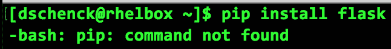
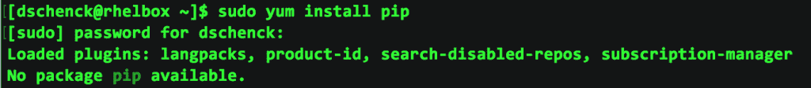
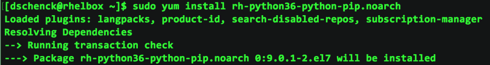
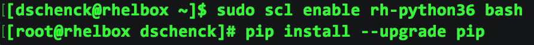
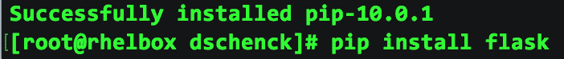

# 如何在红帽企业版 Linux 7 上安装 Python Flask

> 原文：<https://developers.redhat.com/blog/2018/06/05/install-python-flask-on-rhel>

我最近得到了我的零美元开发者版本的 Red Hat Enterprise Linux(RHEL，版本 7.5)，并构建了一个虚拟机来运行它。它就在我的电脑上，运行在 [VirtualBox](https://www.virtualbox.org/) 中...一个闪闪发光，闪闪发光，崭新的虚拟机运行 RHEL。我该拿它怎么办呢？

然后我有了一个想法:我将安装[红帽容器开发工具包(CDK)](https://developers.redhat.com/products/cdk/overview/) 并构建一些基于 Python 的容器。我将使用 [Flask](http://flask.pocoo.org/) ，这是一个非常棒的微框架，让构建 RESTful 服务变得很容易。

## 但是我没有 RHEL 7.5

如果你没有使用 RHEL 7.5，不要担心。因为 Python 3 是 Red Hat Software Collections(RHS cl)的一部分，所以它适用于 RHEL 7 的所有次要版本。

## 我是说...明显地...

显然，安装 Flask 会很容易。带着常常伴随着无知的自信，我走到命令行，键入简单的命令`pip install flask`，等待好消息。

哎呀。



## RHEL 很好吃

嗯，等一下；我在 RHEL 上，所以`yum`是包管理器(也就是安装实用程序)。很明显，正确的命令是`sudo yum install pip`。注:如果`sudo`对你不起作用，请看[如何在红帽企业 Linux](https://developers.redhat.com/blog/2018/08/15/how-to-enable-sudo-on-rhel/) 上启用 sudo。



## `yum search`去营救

沮丧，但不被打败，我想`pip`——[一个 Python 实用程序](https://en.wikipedia.org/wiki/Recursive_acronym#Notable_examples)——一定是 RHEL 的 Python 包的一部分。我使用命令`yum search python36`查看是否有可用的 Python 3.6 包，瞧！


啊哈！红帽专门打造的一个包。最后，我要找的安装命令:`sudo yum install rh-python36-python-pip.noarch`。

**(编者注:要安装 Python 3.6，您需要为`yum`启用 RHSCL 和可选软件 repos。详见 [*如何安装 Python 3、pip、venv、virtualenv、pipenv*](https://developers.redhat.com/blog/2018/08/13/install-python3-rhel/) 。)**



## 我是一个推动者

现在，我需要做的就是在 bash shell 会话中启用它，然后我就可以开始使用 Flask 编写 Python 代码了:

```
sudo scl enable rh-python36 bash
```

然后我立即运行`pip install --upgrade pip`，我的`pip`安装被更新到版本 pip-10.0.1。



## 准备好烧瓶显微结构

现在，我终于可以通过运行`pip install flask`来安装 Flask 了。

**编者按:使用 Python 虚拟环境并避免使用`pip install`作为 root 是最佳实践。详见 [*如何安装 Python 3、pip、venv、virtualenv、pipenv*](https://developers.redhat.com/blog/2018/08/13/install-python3-rhel/) 。**



成功！


最后——这次是真的——我通过创建并运行 [the Flask project 主页](http://flask.pocoo.org/)上的`hello.py`应用程序来测试它。成功了。

## Python 微服务

我现在已经在我的 RHEL 虚拟机上安装了 Python 3.6 和 Flask。我现在需要做的就是安装 CDK，然后我就可以开始构建 [Python 微服务](https://developers.redhat.com/topics/microservices/)。

*Last updated: October 18, 2018*