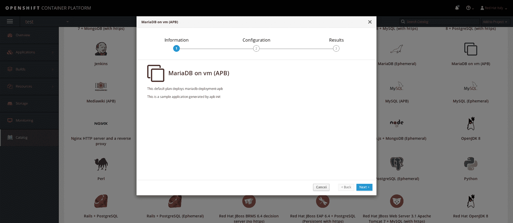
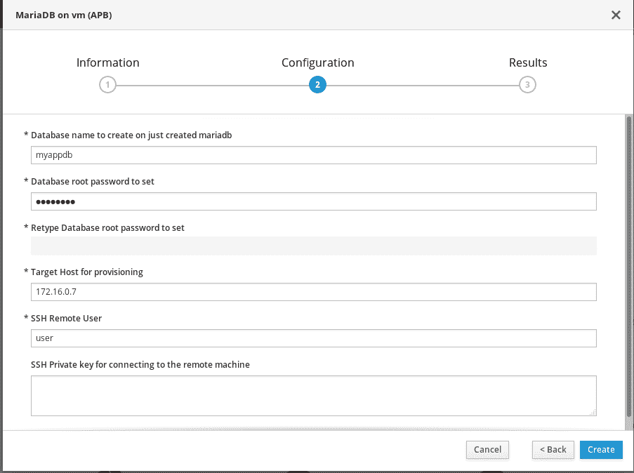

# 定制 OpenShift Ansible 行动手册包

> 原文：<https://developers.redhat.com/blog/2018/05/23/customizing-an-openshift-ansible-playbook-bundle>

今天我想谈谈 Ansible Service Broker 和 Ansible Playbook Bundle。这些组件在 Red Hat OpenShift 生态系统中相对较新，但它们现在是 OpenShift 3.9 的服务目录组件中完全支持的功能。

在深入研究这项技术之前，我想向您提供一些关于所有组件及其特性的基本信息(引用自下面的产品文档):

> *   可行的服务经纪人是[开放服务代理 API](https://github.com/openservicebrokerapi/servicebroker) 的一个实现,它管理 [Ansible 剧本包](https://github.com/ansibleplaybookbundle/ansible-playbook-bundle)中定义的应用程序。
> *   Script is Ansible's configuration, deployment and arrangement language. They can describe a strategy that you want the remote system to implement, or a set of steps in a general IT process.

所以 ASB (Ansible Service Broker)是 APB (Ansible Playbook Bundle)和第三方用户之间的中间人，第三方用户希望通过 OpenShift 上的 [Ansible Playbook](http://docs.ansible.com/ansible/latest/user_guide/playbooks.html) 来消费服务。

通过连接这两个组件，OpenShift 服务目录能够通过 OpenShift Web Portal 及其 API 向 OpenShift 用户提供对这些部署/配置的访问。从 OpenShift 的角度来看，这创造了一个充满可能性的世界:

*   通过打包在 Ansible Playbook 包中的 ansi ble Playbook，轻松定义、分发和供应微服务，如 [RocketChat](https://github.com/ansibleplaybookbundle/rocketchat-apb) 和 [PostgreSQL](https://github.com/ansibleplaybookbundle/postgresql-apb) 。
*   轻松绑定通过 Ansible Playbook 捆绑包调配的微服务，如本视频所示:[使用服务目录将 PostgreSQL APB 绑定到 Python Web 应用](https://www.youtube.com/watch?v=xmd52NhEjCk)。

深入了解该技术，我们将看到如何使用以下步骤创建一个 MariaDB APB，该 APB 将在外部远程主机上设置 MariaDB:

1.  通过创建您的第一个 APB 开始使用该技术。
2.  定制您的第一个 APB，并让它配置一个外部远程主机(通过 SSH)。
3.  建立并发布你的第一个全境通告。
4.  了解 ASB 和 APB 在引擎盖下的操作。
5.  排查全境通告。

你准备好了吗？我们开始吧！

***请注意:**在继续之前，您需要有一个完全配置好的、功能齐全的 OpenShift 3.9 集群。目前，Minishift 和 CDK 不提供服务目录和启用的 Ansible Service Broker。请检查项目文档。*

## 开始使用 APB

从 OpenShift 3.9 开始，您不需要任何额外的配置或部署来让 Ansible Service Broker 和服务目录工作。它们将由 OpenShift 安装程序在首次安装/更新时进行设置。

因此，您需要做的第一件事是让 Ansible Service Broker 在 OpenShift 默认注册表中搜索容器映像。为此，编辑 Ansible Service Broker 使用的`configmap`并编辑白名单:

```
$ oc edit configmap broker-config -n openshift-ansible-service-broker
```

在`configmap`中，为 OpenShift 注册中心添加一个白名单规则，类似于已经为 Docker Hub 注册中心设置的规则:

> -type:local _ open shift
> name:local registry
> 命名空间:
> -open shift
> white _ list:
> **-”。*-apb$"**

有了这个规则，Ansible Service Broker 将在本地 OpenShift 注册表中搜索以字符串`-apb`结尾的容器图像。

之后，我们需要推出 Ansible Service Broker 的新版本:

```
$ oc rollout latest dc/asb -n openshift-ansible-service-broker
```

你现在准备初始化你的第一个 APB。首先，您需要`apb`二进制文件。在 Red Hat Enterprise Linux 上(启用了 OpenShift repos)，您只需运行以下命令:

```
$ yum install -y apb
```

然后，您可以通过运行以下命令来初始化您的第一个 APB:

```
$ apb init mariadb-deployment-apb
```

该命令将建立一个初始目录树(如下所示)，可以根据您的需要进行定制:

```
$ ls -la mariadb-deployment-apb/
total 12
drwxrwxr-x. 4 ocpadmin ocpadmin 85   May 18 14:08 .
drwx------. 9 ocpadmin ocpadmin 255  May 18 14:33 ..
-rw-rw-r--. 1 ocpadmin ocpadmin 1082 May 18 13:57 apb.yml
-rw-rw-r--. 1 ocpadmin ocpadmin 1731 May 18 14:34 Dockerfile
-rw-rw-r--. 1 ocpadmin ocpadmin 769  May 16 12:16 Makefile
drwxrwxr-x. 2 ocpadmin ocpadmin 50   May 18 14:33 playbooks
drwxrwxr-x. 6 ocpadmin ocpadmin 145  May 16 12:30 roles
```

如您所见，该命令创建了一个名为`apb.yml`的描述文件，用于存储需要从剧本包的用户处请求的元数据和参数。元数据将用于显示 ServiceCatalog 中的项目，而参数将用于提示 bundle 的用户提供必要的配置细节。我们将在下一节中查看并定制它。

然后，它创建一个 Dockerfile 来构建最终的容器，当然还有一个 Makefile，它定义了构建容器并将容器推送到 OpenShift 内部注册表的方法。

最后，您会发现两个关键目录，它们包含—猜猜是什么？—可翻译的“行动手册”和“角色”这些目录包含预构建的用于资源调配和取消资源调配的行动手册，以及您可能想要构建的自定义角色的框架。

但让我们来看看它制作的剧本:

```
$ cat playbooks/provision.yml 
- name: mariadb-test-apb playbook to provision the application
  hosts: localhost
  gather_facts: false
  connection: local
  roles:
  - role: ansible.kubernetes-modules
    install_python_requirements: no
  - role: ansibleplaybookbundle.asb-modules
  - role: provision-mariadb-test-apb
```

如您所见，行动手册非常简单。它针对 localhost ( `connection: local`)运行，它将执行两个预定义的角色:`ansible.kubernetes-modules`和`ansibleplaybookbundle.asb-modules`。这两个角色将设置基本动作，让您的容器与当前的 OpenShift 平台及其底层 Kubernetes 层进行通信。

最后，剧本将执行一个定制角色`provision-mariadb-test-apb`。这个角色基本是空的；你应该用你的代码填充它！

## 定制您的第一个 APB 以连接到远程主机

正如在简介中提到的，您不会为您的 APB 使用标准行为。相反，您将让它连接到一个外部主机来安装和配置 MariaDB。

首先，您需要编辑`apb.yml`文件来添加一些元数据和变量，您将在以后的行动手册中使用它们:

```
$ cat apb.yml 
version: 1.0
name: mariadb-deployment-apb
description: This is a sample application generated by apb init
bindable: False
async: optional
metadata:
  displayName: MariaDB on vm (APB)
plans:
  - name: default
    description: This default plan deploys mariadb-deployment-apb
    free: True
    metadata: {}
    parameters:
      - name: dbname 
        title: Database name to create on just created mariadb
        type: string
        default: myappdb
        required: true
      - name: rootpassword
         title: Database root password to set
         type: string
         default: P4ssw0rd!
         required: true
         display_type: password
      - name: target_host
         title: Target Host for provisioning
         type: string
         default: 172.16.0.7
         required: true
      - name: remoteuser
         title: SSH Remote User
         type: string
         default: user
         required: true
      - name: sshprivkey
         title: SSH Private key for connecting to the remote machine
         type: string
         required: true
         display_type: textarea
```

如您所见，您设置了五个参数，将要求用户通过 OpenShift 接口提供这些参数:

1.  数据库名称
2.  数据库的 root 密码
3.  要连接的目标主机
4.  SSH 连接期间使用的远程用户
5.  SSH 连接期间使用的 SSH 私钥

正如您可能会想到的，您不会从头开始编写一个角色来在您的远程系统上安装和配置 MariaDB。在 Ansible 银河网络上有大量的角色可供选择！

对于这个例子，我选择了这两个(您还需要一个配置防火墙的角色):

1.  [MariaDB 责任角色](https://galaxy.ansible.com/bertvv/mariadb)
2.  [防火墙可承担的角色](https://galaxy.ansible.com/geerlingguy/firewall)

下载它们并放在`roles`目录下。

之后，您需要编辑`provision.yml`剧本。为了连接到外部主机，您需要动态地将主机添加到清单中。

```
$ cat playbooks/provision.yml
- name: mariadb-deployment-apb playbook to provision the application
  hosts: localhost
  gather_facts: false
  connection: local
  roles:
  - role: ansible.kubernetes-modules
    install_python_requirements: no
  - role: ansibleplaybookbundle.asb-modules
  - role: provision-mariadb-deployment-apb
    playbook_debug: false
  tasks:
    - name: Adding the remote host to the inventory
      add_host:
        name: "{{ target_host }}"
        groups: target_group
      changed_when: false
    - name: Adding ssh private key
      shell: "mkdir -p /opt/apb/.ssh && chmod 700 /opt/apb/.ssh && echo -e \"{{ sshprivkey }}\" > /opt/apb/.ssh/id_rsa && chmod 600 /opt/apb/.ssh/id_rsa"

- name: Provision mariadb
  hosts: target_group
  remote_user: "{{ remoteuser }}"
  become: true
  vars:
  firewall_allowed_tcp_ports:
  - "22"
  - "3306"
  mariadb_bind_address: "0.0.0.0"
  mariadb_root_password: "{{ rootpassword }}"
  mariadb_databases:
  - name: "{{ dbname }}"
  roles:
  - role: ansible-role-firewall
  - role: ansible-role-mariadb
```

检查剧本，您将看到首先您将主机(从变量)添加到清单，然后您设置 SSH 私有密钥以连接到远程主机。为了实现这一点，我使用了一个 shell 命令，而不是使用所有可用的 Ansible 模块来分解命令。

然后在第二个剧本中，您连接到远程主机来配置防火墙和 MariaDB。

因此，您还需要编辑`deprovision.yml`行动手册:

```
$ cat playbooks/deprovision.yml 
- name: mariadb-deployment-apb playbook to deprovision the application
  hosts: localhost
  gather_facts: false
  connection: local
  roles:
  - role: ansible.kubernetes-modules
    install_python_requirements: no
  - role: ansibleplaybookbundle.asb-modules
  - role: deprovision-mariadb-deployment-apb
    playbook_debug: false
  tasks:
  - name: Adding the remote host to the inventory
    add_host:
      name: "{{ target_host }}"
      groups: target_group
    changed_when: false
  - name: Adding ssh private key
    shell: "mkdir -p /opt/apb/.ssh && chmod 700 /opt/apb/.ssh && echo -e \"{{ sshprivkey }}\" > /opt/apb/.ssh/id_rsa && chmod 600 /opt/apb/.ssh/id_rsa"

- name: Remove mariadb packages
  remote_user: "{{ remoteuser }}"
  become: yes
  hosts: target_group
  tasks:
  - name: Remove the package from the host
    package:
      name: mariadb
      state: absent
```

取消置备只是删除`mariadb`包，并无其他目的。

最后，为了平稳地连接到您的远程主机，而不会让 SSH 提示我们将主机添加到已知列表中，您可以在 docker 文件中添加一些内容来禁用 host_key_checking:

```
$ cat ../mariadb-test-apb/Dockerfile 
FROM ansibleplaybookbundle/apb-base

LABEL "com.redhat.apb.spec"=\

COPY playbooks /opt/apb/actions
COPY roles /opt/ansible/roles
RUN echo "host_key_checking = False" >> /opt/apb/ansible.cfg
RUN chmod -R g=u /opt/{ansible,apb}
USER apb
```

## 建立和推行你的第一个全境通告

首先，您需要准备 APB 以推送至注册表:

```
$ apb prepare
Finished writing dockerfile.
```

该命令将签名添加到 docker 文件中，以便您可以在以后仔细检查构建。

之后，你就可以建立全境通告了。请记住，您需要是`root`(或者拥有访问 Docker 守护进程的适当权限):

```
$ sudo apb build
Finished writing dockerfile.
Building APB using tag: [mariadb-deployment-apb]
Successfully built APB image: mariadb-deployment-apb
```

您可以通过检查 docker 图像列表来仔细检查构件:

```
$ sudo docker images|grep mariadb
mariadb-deployment-apb latest b4d6a95a79b7 2 days ago 604 MB
```

最后，您可以将全境通告发布到注册表中。但是在继续之前，您应该使用有效的令牌作为管理员用户登录到 OpenShift。默认情况下，用户`system:admin`没有令牌，因此创建一个额外的用户，并赋予其`cluster-admin`角色。

```
$ sudo oc whoami
ocpadmin
$ sudo apb push
Didn't find OpenShift Ansible Broker route in namespace: ansible-service-broker. Trying openshift-ansible-service-broker
version: 1.0
name: mariadb-deployment-apb
description: This is a sample application generated by apb init
bindable: False
async: optional
metadata:
 displayName: MariaDB on vm (APB)
plans:
 - name: default
 description: This default plan deploys mariadb-deployment-apb
 free: True
 metadata: {}
 parameters:
 - name: dbname 
   title: Database name to create on just created mariadb
   type: string
   default: myappdb
   required: true
 - name: rootpassword
   title: Database root password to set
   type: string
   default: R3dh4t1!
   required: true
   display_type: password
 - name: target_host
   title: Target Host for provisioning
   type: string
   default: 172.16.0.7
   required: true
 - name: remoteuser
   title: SSH Remote User
   type: string
   default: user
   required: true
 - name: sshprivkey
   title: SSH Private key for connecting to the remote machine
   type: string
   required: true
   display_type: textarea

Found registry IP at: 172.30.3.246:5000
Finished writing dockerfile.
Building APB using tag: [172.30.3.246:5000/openshift/mariadb-deployment-apb]
Successfully built APB image: 172.30.3.246:5000/openshift/mariadb-deployment-apb
Found image: docker-registry.default.svc:5000/openshift/mariadb-deployment-apb
Warning: Tagged image registry prefix doesn't match. Deleting anyway. Given: 172.30.3.246:5000; Found: docker-registry.default.svc:5000
Successfully deleted sha256:0bd78762bbf717333f1e017e3578bcd55a70877810fc7f859d04455e80df0a94
Pushing the image, this could take a minute...
Successfully pushed image: 172.30.3.246:5000/openshift/mariadb-deployment-apb
Contacting the ansible-service-broker at: https://asb-1338-openshift-ansible-service-broker.140.11.34.16.nip.io/ansible-service-broker/v2/bootstrap
Successfully bootstrapped Ansible Service Broker
Successfully relisted the Service Catalog
```

你做到了！您成功地将 APB 加载到 OpenShift 注册表和 Ansible Service Broker 中。

下次登录 OpenShift 时，您应该会在服务目录中找到 APB:



接下来，在“配置”部分，您将看到之前配置的必需变量:



## 了解 ASB 和 APB 在幕后的运作

通过在上一个屏幕中单击 **Create** 从服务目录中请求元素，将在正在运行的 OpenShift 集群中启动一个非常特殊的操作:

```
$ oc get serviceinstance -n test
NAME AGE
localregistry-mariadb-deployment-apb-bd4cb 27s
$ oc get pods --all-namespaces|grep apb
localregistry-mariadb-deployment-apb-prov-6pntf apb-f34a346d-3b25-46a5-95c2-54d480ae6701 1/1 Running 0 28s
```

如您所见，类型为`ServiceInstance`的元素被创建并链接到这个容器，一个新的 pod 被调度:我们的 Ansible playbook 就在这个容器中运行。

通过查看日志，您可以监视正在运行的活动:

```
$ oc logs -n localregistry-mariadb-deployment-apb-prov-6pntf apb-f34a346d-3b25-46a5-95c2-54d480ae6701 -f

PLAY [mariadb-deployment-apb playbook to provision the application] ************

TASK [ansible.kubernetes-modules : Install latest openshift client] ************
skipping: [localhost]

TASK [ansibleplaybookbundle.asb-modules : debug] *******************************
skipping: [localhost]

TASK [Adding the remote host to the inventory] *********************************
ok: [localhost]

TASK [Adding ssh private key] **************************************************
 [WARNING]: Consider using the file module with state=directory rather than
running mkdir. If you need to use command because file is insufficient you can
add warn=False to this command task or set command_warnings=False in
ansible.cfg to get rid of this message.
changed: [localhost]

PLAY [Provision mariadb] *******************************************************

TASK [Gathering Facts] *********************************************************
ok: [10.1.0.11]

TASK [ansible-role-firewall : Ensure iptables is present.] *********************
ok: [10.1.0.11]

TASK [ansible-role-firewall : Flush iptables the first time playbook runs.] ****
ok: [10.1.0.11]

TASK [ansible-role-firewall : Copy firewall script into place.] ****************
ok: [10.1.0.11]

TASK [ansible-role-firewall : Copy firewall init script into place.] ***********
skipping: [10.1.0.11]

TASK [ansible-role-firewall : Copy firewall systemd unit file into place (for systemd systems).] ***
ok: [10.1.0.11]

TASK [ansible-role-firewall : Configure the firewall service.] *****************
ok: [10.1.0.11]
...
```

## APB 故障排除

如果您的测试出错，Ansible pod 失败并产生错误，会发生什么？

当然，您可以浏览所有 APB pods(如前所示),并运行常用的`oc debug PODNAME`命令来创建一个全新的 pod 以进行故障排除。

如果您在删除失败的`ServiceInstance`时遇到一些问题，您可以编辑该元素来删除 Kubernetes 终结器，如下所示:

```
$ oc get serviceinstance -n test -o yaml
apiVersion: v1
items:
- apiVersion: servicecatalog.k8s.io/v1beta1
  kind: ServiceInstance
  metadata:
    creationTimestamp: 2018-05-20T21:14:23Z
    finalizers:
    - kubernetes-incubator/service-catalog
    generateName: localregistry-mariadb-deployment-apb-
    generation: 1
    name: localregistry-mariadb-deployment-apb-bd4cb
    namespace: test
...
```

有时，一些节点可以在 Docker 缓存中获得不同版本的 APB，因此如果您进行多次构建和推送，您可能会体验到不同的行为。您可以手动登录到各种 OpenShift 节点，然后清理过时的 Docker 映像(您可能需要使用 bastion host 中的 Ansible 来完成这项工作)。

仅此而已！

有什么问题尽管问！

## 关于亚历山德罗

Alessandro Arrichiello 是 Red Hat Inc .的解决方案架构师。他从 14 岁开始就对 GNU/Linux 系统充满热情，这种热情一直持续到今天。他使用自动化企业 IT 的工具:配置管理和通过虚拟平台的持续集成。他现在致力于一个分布式云环境，涉及 PaaS (OpenShift)、IaaS (OpenStack)和流程管理(CloudForms)、容器构建、实例创建、HA 服务管理和工作流构建。

*Last updated: October 12, 2020*