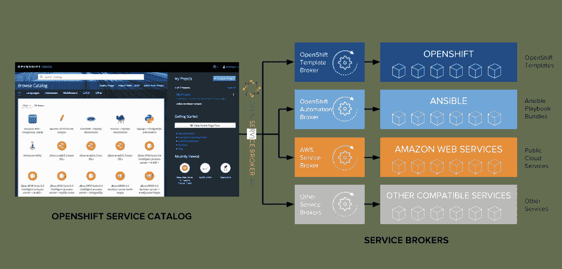

# 在 Ansible 剧本包中使用 Ansible Galaxy 角色

> 原文：<https://developers.redhat.com/blog/2018/05/22/using-ansible-galaxy-roles-in-ansible-playbook-bundles>

【如果你没有关注 [OpenShift 博客](https://blog.openshift.com/)，我在这里交叉发布[我的文章](https://blog.openshift.com/using-ansible-galaxy-roles-in-ansible-playbook-bundles)，因为我认为它会引起红帽开发者社区的兴趣。]

Open Service Broker API 标准旨在将服务(云、第三方、内部部署、遗留等)交付给在 OpenShift 等云平台上运行的应用的方式标准化。这允许应用程序以完全相同的方式使用服务，无论它们部署在哪个云平台上。service broker 可插拔架构使管理员能够将第三方代理添加到平台中，以便直接从 OpenShift 服务目录向应用程序开发人员提供第三方和云服务。举个例子[亚马逊和红帽联合创建的 AWS 服务中介](https://aws.amazon.com/partners/servicebroker/)，微软创建的 [Azure 服务中介](https://github.com/azure/open-service-broker-azure)和谷歌创建的 [Helm 服务中介](https://github.com/google/helm-broker)允许在 Kubernetes 和 OpenShift 上消费 AWS 服务、Azure 服务和 Helm charts。此外，管理员可以[创建自己的代理](https://github.com/openshift/open-service-broker-sdk)，以便通过服务目录向开发人员提供定制服务，如在其内部 Oracle RAC 上配置 Oracle 数据库。



[OpenShift Automation Broker](http://automationbroker.io/)是一个服务代理，包含在 open shift 的开箱即用中，利用一个轻量级的、基于容器的应用程序定义，称为 Ansible Playbook Bundle (APB ),使用 Ansible 自动提供服务。行动手册可以在 OpenShift 平台上执行操作，也可以在平台外执行操作，例如在 VMware 上调配虚拟机并在其上安装数据库。

### 可变星系角色

APBs 的[当前结构要求剧本中使用的所有 Ansible 角色在`roles`目录中可用，Ansible 通常会这样要求。](https://docs.openshift.com/container-platform/3.9/apb_devel/writing/getting_started.html#apb-devel-writing-gs-creating)

```
myapb
├── apb.yml
├── Dockerfile
├── playbooks
│   ├── deprovision.yml
│   └── provision.yml
└── roles
    ├── myrole1
    └── myrole2

```

虽然这很有用，但 Ansible 的强大之处在于由第三方和社区创建的 Ansible 角色的大型生态系统，它简化了几乎任何事情的自动化。“那是有作用的！”在这个不确定的世界里离现实不远。

Ansible Galaxy 是寻找、重用和共享 Ansible 角色的中心。每当需要创建一个 Ansible 角色时，第一步通常是在 Ansible Galaxy 上搜索一个已经完成所需任务的角色。

尽管在路线图中，目前 Ansible Galaxy 角色不能直接在 APB 行动手册中使用，除非它们已经下载到角色目录中。然而，你仍然可以通过一些额外的步骤在 APB 中使用 Ansible Galaxy 角色，这些步骤将在下一节中解释。

### 在 APB 中使用可变星系角色

使用 Ansible Galaxy 角色的第一步是将这些角色作为依赖关系列在 APB 根目录下的一个`requirements.yml`文件中，这是在 Ansible 中描述 Ansible Galaxy 角色的标准方式:

```
- src: siamaksade.openshift_sonatype_nexus
  version: ocp-3.9
- src: siamaksade.openshift_gogs
  version: ocp-3.9
- src: siamaksade.openshift_eclipse_che
  version: ocp-3.9-1

```

APB 目录结构如下所示:

```
myapb/
├── apb.yml
├── Dockerfile
├── requirements.yml
├── playbooks
│   ├── deprovision.yml
│   └── provision.yml
└── roles
    ├── myrole1
    └── myrole2

```

上面的`requirements.yml`文件声明这个 APB 需要来自 Ansible Galaxy 的`openshift_sonatype_nexus`、`openshift_gogs`和`openshift_eclipse_che`角色。

由于 Ansible Galaxy 尚未集成到 APB 中，下一步是在 APB 中添加几行代码`Dockerfile`,以便在构建和打包 APB 时安装依赖项:

```
ADD requirements.yml /opt/apb/actions/requirements.yml
RUN ansible-galaxy install -r /opt/apb/actions/requirements.yml

```

现在，您可以在 APB 行动行动手册中使用已声明的角色，例如在`playbooks/provision.yml`中，这是通过 OpenShift 服务目录提供 APB 时运行的行动手册:

```
  roles:
  - role: ansible.kubernetes-modules
    install_python_requirements: no
  - role: ansibleplaybookbundle.asb-modules
  - role: siamaksade.openshift_sonatype_nexus
  - role: siamaksade.openshift_gogs
  - role: siamaksade.openshift_eclipse_che

```

### 与 Ansible Galaxy 的进一步集成

在 OpenShift 3.11 中，APBs 将成为 Ansible Galaxy 的一等公民，可以方便地共享和重用，就像 Ansible 角色在 Ansible Galaxy 中共享和重用一样。OpenShift Automation Broker 将能够直接从 Ansible Galaxy 发现 APB，这意味着开发人员可以将他们的 APB 源代码发布到 Ansible Galaxy，OpenShift Automation Broker 将直接在特殊的 APB 基本映像上运行源代码。这将允许开发人员测试他们的源代码更改，而无需在每次需要测试时重新构建完整的 APB 容器映像。

此外，与 Ansible Galaxy 的集成将允许基于 APB 元数据自动解析角色依赖性，并将允许使用发布到 Ansible Galaxy 并在元数据中声明为依赖性的任何角色，直接在剧本中。

### 摘要

APB 支持使用 Ansible 行动手册在 OpenShift 和其他平台上自动提供服务。Ansible Galaxy 丰富了 Ansible 的体验，它提供了大量的预置角色，可以用来实现几乎任何事情的自动化。通过创建一个`requirements.yml`文件并修改 APB 中的`Dockerfile`,人们可以在创作 APB 时利用 Ansible Galaxy 角色并构建复杂的自动化流程。

Ansible Galaxy 角色在 APB 创作中起着重要的作用，因此 APB 中的原生 Ansible Galaxy 支持计划在 OpenShift 的未来版本中提供，可能是在 OpenShift 3.11 中。

*Last updated: October 12, 2020*