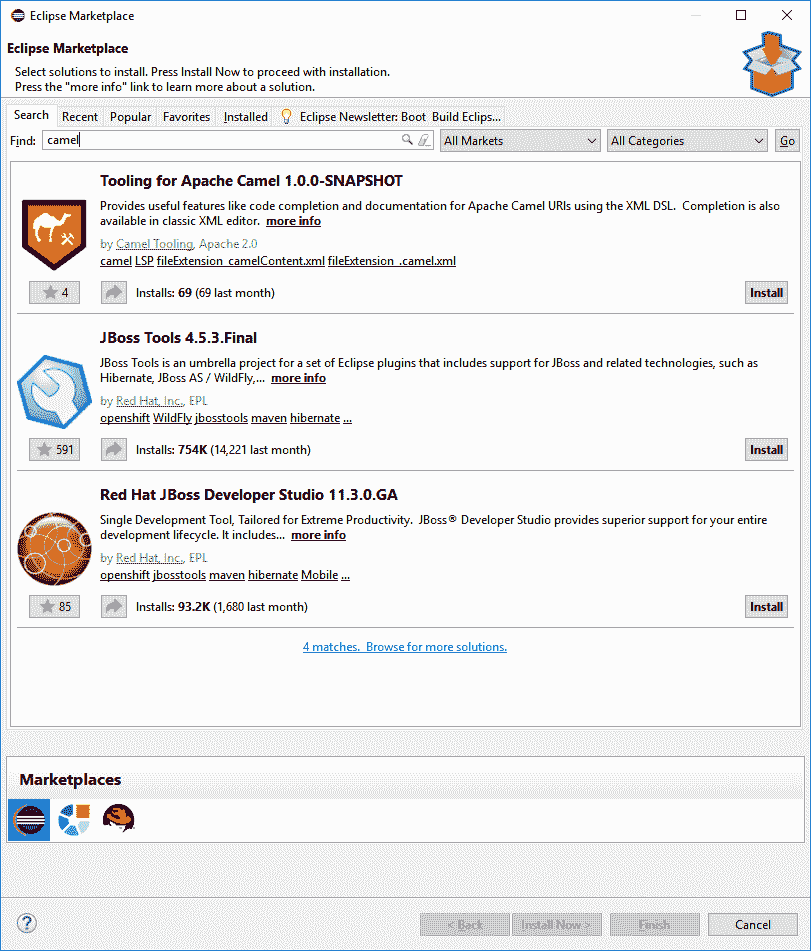
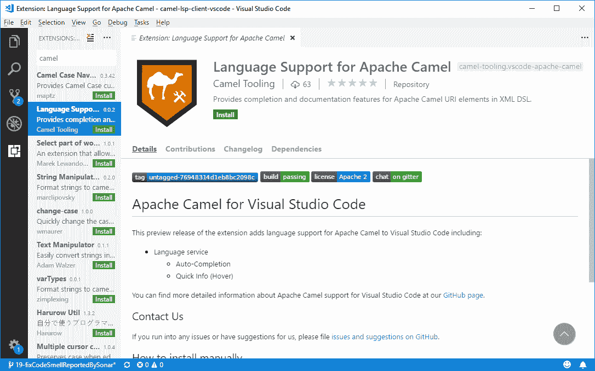
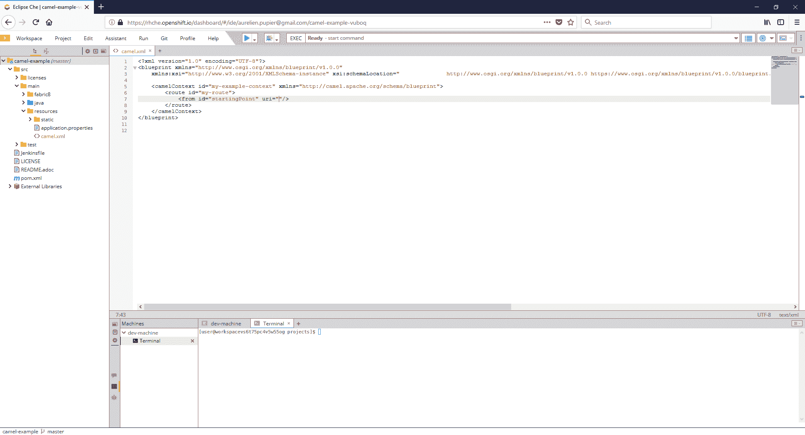
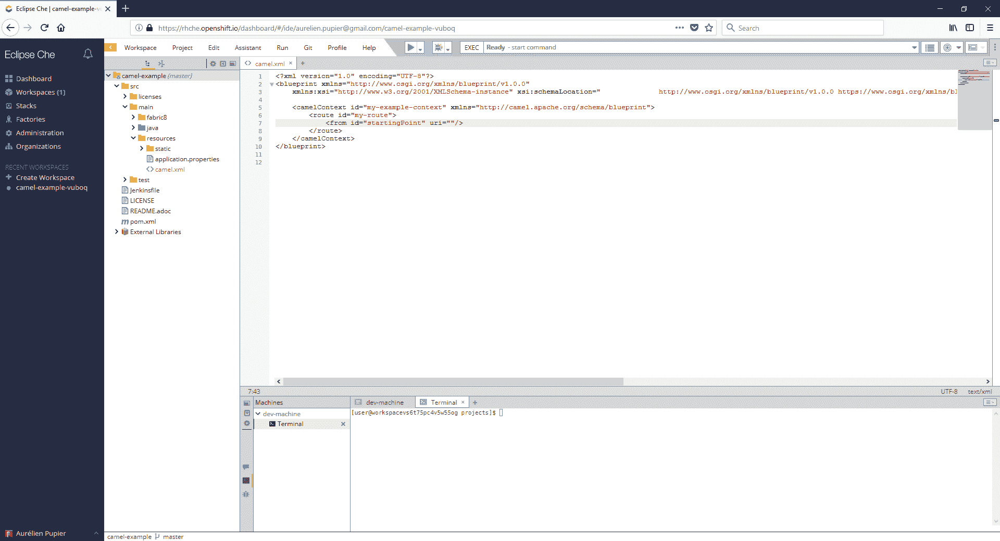
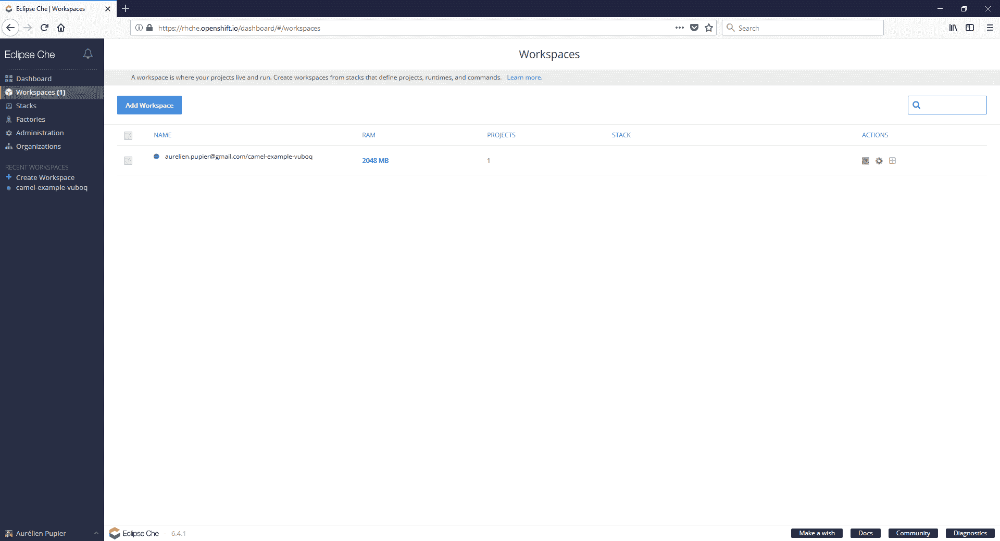
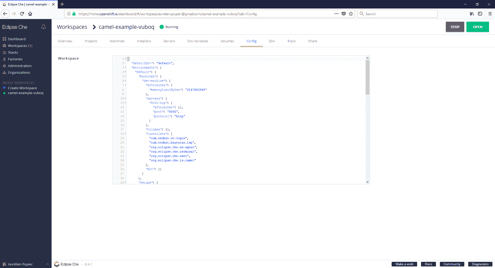
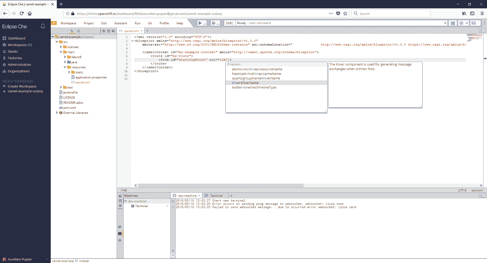

# Apache Camel URI 完成:Eclipse、VS 代码和 OpenShift.io 的简单安装

> 原文：<https://developers.redhat.com/blog/2018/05/21/apache-camel-uri-completion-easy-installation-for-eclipse-vs-code-and-openshift-io>

基于语言服务器协议的 Apache Camel 工具的可发现性和安装简易性得到了改进。不再需要手动下载和安装二进制文件！对于 Eclipse 桌面 IDE 和 VS 代码环境，您现在可以直接从市场上为每个开发环境找到并安装 Camel 工具。

骆驼语言服务器现在也可以在[红帽 OpenShift.io 中使用了！](http://openshift.io/)

在本文中，我将向您展示如何通过 Eclipse 和 VS 代码的市场安装 Camel 工具。我还将展示如何在 OpenShift.io 工作区中启用 Camel 工具。

## Eclipse 和 VS 代码市场

Camel 工具可以在 [Eclipse marketplace](https://marketplace.eclipse.org/content/apache-camel-language-server) 上买到。这意味着您可以直接从您的 [Eclipse 桌面 IDE](https://www.eclipse.org/ide/) 中发现并安装它:

该工具也可以在 [VS 代码市场](https://marketplace.visualstudio.com/items?itemName=camel-tooling.vscode-apache-camel)上获得。这意味着您可以直接从您的 [VS 代码 IDE](https://code.visualstudio.com/) 中发现并安装它:

## 在 OpenShift.io 中使用

骆驼语言服务器现在也可以在 [OpenShift.io 中使用了！](http://openshift.io/)需要打开工作空间配置。

*   前往您的工作区
    
*   点击左上方的黄色箭头
*   点击【工作区】
*   点击与您的工作区相对应的“配置”图标
*   点击“安装程序”菜单，打开“Apache Camel 语言服务器
*   应用并打开工作区
*   重新打开 xml 文件
*   尽情享受吧！
    

## 项目代码的新主页

请注意，骆驼语言服务器有了新家。它现在与骆驼创意插件联合主办。你可以在这里找到:【github.com/camel-tooling/camel-language-server】T2

既然它很容易安装，是时候尝试一下了！

*Last updated: December 11, 2018*