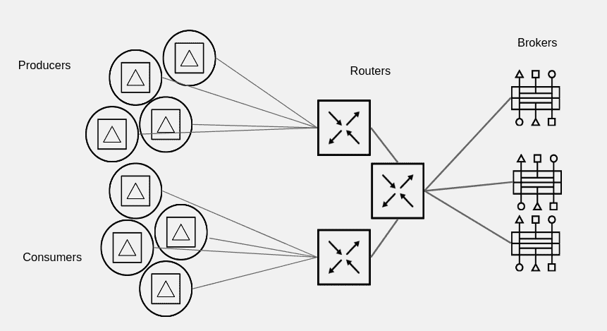
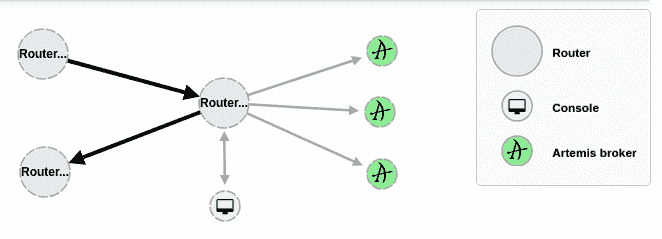
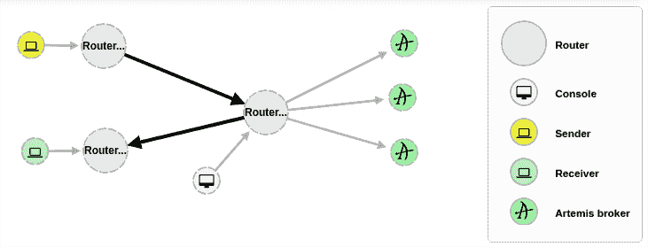

# 通过 AMQ 互联扩展 AMQ 7 代理

> 原文：<https://developers.redhat.com/blog/2018/05/17/scaling-amq-7-brokers-with-amq-interconnect>

Red Hat JBoss AMQ 互连在支持 AMQP 的端点(包括客户端、代理和独立服务)之间提供灵活的消息路由。通过与 AMQ 互连路由器网络的单一连接，客户端可以与连接到网络的任何其他端点交换消息。

AMQ 互联可以创建各种拓扑来管理大量流量，或者在 AMQ 7 代理面前定义一个弹性网络。本文展示了一个用于轻松扩展 AMQ 7 代理的示例 AMQ 互连拓扑。

AMQ 互连不使用主从群集来实现高可用性。它通常部署在具有冗余网络路径的多路由器拓扑中，用于提供可靠的连接。AMQ 互连可以在整个网络中分配消息传递工作负载，并以极低的延迟实现新的规模。

路由器接受来自客户端的基于 AMQP 协议的连接，并创建到代理或 AMQP 服务的 AMQP 连接。路由器对传入的 AMQP 消息进行分类，并在消息生产者和消息消费者之间路由消息。

消息客户端可以将单个 AMQP 连接到由路由器构建的消息总线，并通过该连接与连接到网络中任何路由器的一个或多个消息代理交换消息。同时，客户端可以直接与其他端点交换消息，完全不需要代理。

## 拓扑

AMQ 互联将帮助创建不同的拓扑来管理高流量或在 AMQ 7 经纪人面前定义一个弹性网络。其中一些拓扑可能是:

*   **连接聚合**:客户端会管理大量的连接；但是，路由器将管理更少的到部署在后端的代理的连接。路由器将管理大量的连接，而不是最终的代理实例。
*   **弹性网络**:该拓扑将帮助我们修改 AMQ 7 代理实例拓扑，而不会对客户端造成任何影响。我们可以添加或删除更多的代理，客户端将管理相同的连接。

通常，这些拓扑用例可以提供以下特性:

*   处理大量和高吞吐量的能力
*   能够通过互连路由器纵向扩展代理
*   能够在代理碎片之间自动负载平衡流量
*   在客户不注意的情况下自由添加或删除碎片

## 提议的拓扑

本文将描述一个拓扑示例，展示 AMQ 互连的一些特性。下图显示了建议的拓扑结构:



部署的路由器将是:

*   **聚合路由器**:管理来自或去往 AMQ 7 代理实例的任何连接的路由器。该代理将聚合从其他路由器到 AMQ 7 代理实例的任何连接。
*   **生产者路由器**:管理来自*生产者*应用的连接的路由器。
*   **消费者路由器**:管理来自*消费者*应用的连接的路由器。

完成配置后，我们可以从 AMQ 7 管理 web 控制台看到部署的拓扑结构:



## 先决条件

要部署和测试此拓扑，您应该在某台主机上至少部署并运行一个 AMQ 7 代理。如果有更多实例，所有实例都应该在同一个集群定义中工作。

示例将与您应该在 AMQ 7 经纪人中定义的一组队列一起工作。为此，请在`$AMQ_BROKER/etc/broker.xml`文件的`address`部分添加以下定义:

```
<address name="SampleQueue">
  <anycast>
    <queue name="SampleQueue" />
  </anycast>
</address>
```

此外，我们需要三台主机来部署每种 AMQ 互连路由器。

## 装置

AMQ 互连作为一组 RPM 包分发，可通过您的 Red Hat 订阅获得。启用以下存储库:

```
$ sudo subscription-manager repos --enable=amq-interconnect-1-for-rhel-7-server-rpms --enable=a-mq-clients-1-for-rhel-7-server-rpms

```

运行以下命令安装主软件包:

```
$ sudo yum install qpid-dispatch-router qpid-dispatch-tools
```

在 Red Hat Enterprise Linux 7 中运行路由器服务:

```
$ sudo systemctl start qdrouterd.service
```

AMQ 互连路由器配置文件位于`/etc/qpid-dispatch/qdrouterd.conf`。任何配置都将在该文件中定义。

我们将在用于部署 AMQ 互连路由器的每台主机上重复这些步骤。

## 聚合路由器

该路由器将管理从其他路由器到其背后的 AMQ 7 HA 集群拓扑的传入和传出消息。

以下是路由器的一般定义:

```
router {
    mode: interior
    id: Router.Aggregator
}
```

**监听器**:将定义三个监听器来管理不同的客户端连接:

*   客户端的通用监听器
*   其他路由器的路由器间监听器
*   从 AMQ 7 管理 web 控制台参加连接的一般侦听器

```
# Listener for clients
listener {
  host: 0.0.0.0
  port: amqp
  authenticatePeer: no
  saslMechanisms: ANONYMOUS
}

# Listener for inter-router connections
listener {
  host: 0.0.0.0
  port: 5772
  authenticatePeer: no
  role: inter-router
}

# Listener for AMQ console
listener {
  name: amq-console
  role: normal
  host: 0.0.0.0
  port: 5773
  http: yes
}
```

**连接器**:本节将为后端定义的每个 AMQ 7 代理定义连接器。

```
connector {
   name: amq7.master01
   host: amq7master01host
   port: 5672
   role: route-container
   saslMechanisms: ANONYMOUS
}

# Definitions for other AMQ 7 brokers
...
```

**地址**:这个例子将为`SampleQueue`定义一个地址给在`connector`部分定义的不同代理。

```
address {
  prefix: SampleQueue
  # Routing messages through a broker queue
  waypoint: yes
}
```

路点地址标识代理上路由消息的队列。

现在我们定义地址和不同后端之间的自动链接。这个案例代表了一个分片队列，因为有多个代理。使用队列分片，可以将单个队列分布在多个代理上。

自动链接将路由器连接到代理。自动链接将处理路由器上的客户端流量，而不是代理。客户端将其链接连接到路由器，然后路由器使用内部自动链接连接到代理上的队列。这意味着无论有多少个客户端连接到路由器，队列总是只有一个生产者和消费者。

这些块将定义从路由器向代理发送消息的链路:

```
autoLink { 
  addr: SampleQueue 
  connection: amq7.master01 
  dir: out 
} 

# Definitions for other AMQ 7 brokers 
...
```

这些块将定义从代理接收消息到路由器的链路:

```
autoLink {
  addr: SampleQueue
  connection: amq7.master01
  dir: in
}

# Definitions for other AMQ 7 brokers
...
```

## 生产者路由器

该路由器将管理从生产者到聚合路由器的传入消息。

以下是路由器的一般定义:

```
router {
    mode: interior
    id: Router.Producer
}
```

**监听器**:将定义两个监听器来管理不同的客户端连接:

*   客户端的通用监听器
*   其他路由器的路由器间监听器

```
# Listener for clients
listener {
  host: 0.0.0.0
  port: amqp
  authenticatePeer: no
  saslMechanisms: ANONYMOUS
}

# Listener for inter-router connections
listener {
  host: 0.0.0.0
  port: 5772
  authenticatePeer: no
  role: inter-router
}
```

**连接器**:本节将定义聚合路由器的连接器。请注意，我们将连接到路由器间端口，而不是 AMQP 服务端口。

```
connector {
  name: Router.Aggregator
  host: amqinterconnectaggregatorhost
  port: 5772
  role: inter-router
}
```

**Addresses** :这个示例将为`SampleQueue`定义一个地址，以便在网络中的不同路由器之间分发消息。

```
address {
  prefix: SampleQueue
  distribution: closest
}
```

该地址定义了一个基于最近方法的路由模式，该模式根据到达每个消费者的拓扑成本来确定最短路径。

## 消费者路由器

该路由器将管理从聚合路由器到用户路由器的传出消息。

以下是路由器的一般定义:

```
router {
    mode: interior
    id: Router.Consumer
}
```

**监听器**:将定义两个监听器来管理不同的客户端连接:

*   客户端的通用监听器
*   其他路由器的路由器间监听器

```
# Listener for clients
listener {
  host: 0.0.0.0
  port: amqp
  authenticatePeer: no
  saslMechanisms: ANONYMOUS
}

# Listener for inter-router connections
listener {
  host: 0.0.0.0
  port: 5772
  authenticatePeer: no
  role: inter-router
}
```

**连接器**:本节将定义聚合路由器的连接器。请注意，我们将连接到路由器间端口，而不是 AMQP 服务端口。

```
connector {
  name: Router.Aggregator
  host: amqinterconnectaggregatorhost
  port: 5772
  role: inter-router
}
```

**Addresses** :这个示例将为`SampleQueue`定义一个地址，以便在网络中的不同路由器之间分发消息。

```
address {
  prefix: SampleQueue
  waypoint: yes
}
```

## 测试

下面的 [GitHub 库](https://github.com/rmarting/scale-amq-with-interconnect)包括一组主要的 Java 应用程序，它们使用 [Apache Qpid JMS](https://qpid.apache.org/components/jms/index.html) 依赖关系，通过 AMQP 协议发送和接收消息。在构建和打包应用程序之后，您可以执行示例并测试消息如何从 AMQ 互连路由器路由到 AMQ 7 代理以及如何从其路由。

发布/订阅示例中的发送方应用程序将向生产者路由器发送 10 条消息，生产者路由器将消息路由到聚合器路由，消息将存储在 AMQ 7 代理中。

发送方应用程序将输出以下内容:

```
$ java -DUSER=application -DPASSWORD=application -cp "target/classes/:target/dependency/*" org.apache.qpid.jms.example.pubsub.Sender
Sending up to 10 messages.
Specify a message count as the program argument if you wish to send a different amount.
Sender connected to amqp://producerrouterhost:5672
Sent message 10
Sent 10 messages in 314ms
```

同一个示例中的接收方应用程序将使用来自消费者路由器的 10 条消息。聚合路由器将从 AMQ 7 代理获取消息，并将其路由到用户路由器。

接收器应用程序将输出以下内容:

```
$ java -DUSER=application -DPASSWORD=application -cp "target/classes/:target/dependency/rg.apache.qpid.jms.example.pubsub.Receiver
Consuming up to 10 messages.
Specify a message count as the program argument if you wish to consume a different amount.
Receiver connected to amqp://consumerroutehost:5672
Got message 1\. Body: Text message.
Got message 2\. Body: Text message.
Got message 3\. Body: Text message.
Got message 4\. Body: Text message.
Got message 5\. Body: Text message.
Got message 6\. Body: Text message.
Got message 7\. Body: Text message.
Got message 8\. Body: Text message.
Got message 9\. Body: Text message.
Got message 10\. Body: Text message.
Received 10 messages in 339ms
```

在执行这些应用程序的过程中，您将在 AMQ 7 管理控制台中看到以下内容:



## 结论

本文向您展示了一个简单的 AMQ 互连拓扑，用于轻松扩展您的 AMQ 7 代理，但这不是唯一的拓扑。AMQ 互联允许您设计和部署其他路由器拓扑来扩展您的 AMQ 7 代理。这些拓扑可以涵盖其他使用情形，例如:

*   复杂的内部基础设施:AMQ 互连路由器将消息转发给指定的代理
*   安全代理、防火墙限制:AMQ 互连路由器作为 DMZ 中的反向代理
*   实例数据馈送、信息集成:AMQ 互连路由器直接向接收应用服务发送消息
*   分布式数据中心，跨时区分支:AMQ 互连路由器，通过万维网与代理和应用程序通信

凭借所有这些灵活性，您可以通过使用 AMQ 互联路由器的消息路由功能轻松适应您的使用案例。

以下链接提供了有关该路由器的更多详细信息:

*   [使用 AMQ 互连](https://access.redhat.com/documentation/en-us/red_hat_amq/7.1/html-single/using_amq_interconnect/index)
*   [阿帕奇 Qpid 调度路由器](https://qpid.apache.org/components/dispatch-router/index.html)

*Last updated: May 22, 2018*