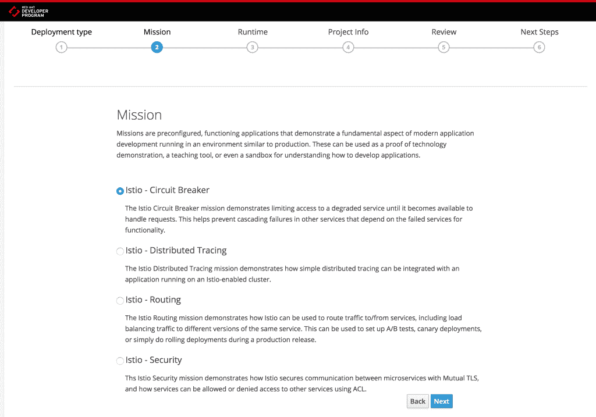

# 在笔记本电脑上开始使用 Istio 和 Jaeger

> 原文：<https://developers.redhat.com/blog/2018/05/08/getting-started-with-istio-and-jaeger-on-your-laptop>

*【十字贴自 [OpenShift 博客】](https://blog.openshift.com/getting-started-with-istio-and-jaeger-on-your-laptop)*

大约一年前，Red Hat 宣布加入 Istio 项目的启动合作伙伴 T1，这是一种服务网格技术，可以创建以应用为中心的网络，透明地保护应用免受环境异常的影响。Istio 的主要目标是通过许多不同的功能，如智能路由、断路、相互 TLS、评级和限制等，增强整体应用的安全性和可用性。最终，Istio 将帮助组织使用嵌入平台的高级设计和部署模式来开发和部署弹性、安全的应用和服务。

作为我们投资的一部分，为了让 Kubernetes 和 OpenShift 用户能够轻松使用这项技术，Red Hat 创建了大量内容:

*   [learn.openshift.com](https://learn.openshift.com/servicemesh/):基于 web 的 OpenShift 和 Kubernetes 学习环境，用户可以通过 web 浏览器与 OpenShift 和 Istio 服务网格的真实运行实例进行交互，无需安装时间，也无需注册。
*   [Istio 教程](https://github.com/redhat-developer-demos/istio-tutorial):想自己从头开始尝试基于 web 的场景吗？这个 Git repo 包含了如何为自己建立一个环境的说明。
*   [Christian Posta 和 Burr Sutter 著《面向微服务的 Istio 服务网格介绍》](https://developers.redhat.com/books/introducing-istio-service-mesh-microservices/)
*   在 [OpenShift](https://blog.openshift.com/tag/istio/) 和[红帽开发者](https://developers.redhat.com/blog/tag/istio/)博客上的博文

# 我们现在提供什么

上述资源已经帮助许多 OpenShift 用户提高了他们对 Istio 和 Jaeger 的理解，现在我们推出了`istiooc`命令行工具和一组预建的 Istio 和 Jaeger 示例场景，使他们更容易开始使用这些技术。

通过修改后的 OpenShift 命令行工具`istiooc`，您可以在笔记本电脑上启动本地单节点 OpenShift 集群，并访问预先构建的场景，向您介绍 Istio 和 Jaeger。这项工作背后的机制与运行流行的[启动器](http://developers.redhat.com/launch)的机制相同，提供了一种创建功能性 Istio 和 Jaeger 示例应用程序的无障碍方式。

通过使用一组作为 Kube jobs 运行的 Ansible 脚本，我们使得在 OpenShift 上使用 Istio 和 Jaeger 变得更加容易，并且因为我们是 Red Hat，这里涉及的一切都是自然开源的，可以在 [GitHub](https://github.com/openshift-istio/origin) 上获得。

你也可以从 [GitHub 发布页面](https://github.com/openshift-istio/origin/releases)下载`istiooc`命令行。

# 了解 Istio 和 Jaeger:预先构建的场景

为了更容易地探索一些关键的 Istio 和 Jaeger 功能，我们建立了示例场景，我们称之为*任务*，可通过发射器获得。当你用`istiooc`启动本地 OpenShift 集群时，启动器已经部署好了，它为你提供了将 Istio 和 Jaeger 功能与 Spring Boot 和 WildFly Swarm 等技术相结合的示例场景。Spring Boot 和 WildFly Swarm 是[红帽 OpenShift 应用运行时(RHOAR)](https://developers.redhat.com/products/rhoar/overview/) 的一部分，后者是一组针对 OpenShift 优化的云原生运行时。你可以在这篇博文的[中阅读更多关于 RHOAR 最新版本的信息。](https://middlewareblog.redhat.com/2018/05/08/red-hat-openshift-application-runtimes-delivering-new-productivity-performance-and-stronger-standards-support-with-its-latest-sprint-release/)



一旦您执行了任何启动程序场景，将会创建并提供以下内容:

*   一个 GitHub 存储库，其中包含您想要运行和修改的示例场景
*   场景的 OpenShift 应用程序定义
*   在 OpenShift 上部署和运行的示例 Istio 场景
*   一条开放的路线，可以让你尝试和学习这个场景
*   下一步做什么的指示

让我们看一下各个场景，以及每个场景包含的内容:

## 安全场景

在微服务拓扑中，并不是所有的服务都会被任何用户调用。事实上，以这种方式打开访问可能会带来潜在的安全问题。因此，谨慎的做法是将调用限制在已知的客户端或相关服务上。

这个场景展示了 Istio 安全概念，通过这个概念，对服务的访问由平台控制，而不是由组成应用程序独立控制。

我们概述了如何应用一个安全策略，允许客户端从问候语服务获取问候语，同时禁止直接访问底层实现。此外，我们探索不同的方法来改变这一政策。

## 分布式跟踪场景

在微服务拓扑中，对集群/服务网格的传入 HTTP 调用最终可能会调用大量其他服务，因此了解各个服务的交互和执行调试变得非常复杂。分布式跟踪使开发人员和操作人员能够通过以图表形式描绘微服务之间潜在的复杂交互来获得洞察力。

这个场景展示了 Jaeger 的分布式跟踪功能和在服务网格中运行的适当仪表化的微服务之间的交互。

## 路由方案

随着参与微服务架构的服务数量的增加，服务需要独立升级和修补的可能性也在增加。这导致部分系统不可用，除非流量可以动态路由到备用端点。从流量的角度来看，受控展示有助于引入新的应用程序版本和测试新的业务功能。

这个场景展示了如何使用 Istio 的动态流量路由功能，以及一组用于模拟现实世界部署场景的示例应用程序。

## 断路情况

现代云应用程序通常由许多较小的服务组成，这些服务以多对多的方式相互交互。了解服务何时失败或不可用至关重要。通过避免对没有响应的服务进行不必要的调用，或者在适当的时候将流量重新路由到其他业务功能，可以提高应用程序的弹性。

这个场景展示了如何使用 Istio 来实现断路器架构模式。在 Istio 服务网格中部署应用程序允许一些横切的、应用程序范围的关注点，以保护组成应用程序的一些服务被移动到应用程序本身之外。本场景通过展示如何仅使用配置文件激活 Istio 断路器，而无需修改应用程序，来演示此功能。

# 怎么试

如果您可以访问 Docker 引擎，那么运行`cluster up`命令可以非常容易地在您的笔记本电脑上启动本地单节点 OpenShift 集群。有了合理的默认设置，您只需要指定您的 GitHub 用户名和您的个性化 GitHub 认证令牌，就可以开始了:

```
$ istiooc cluster up --istio --launcher \
       --launcher-github-username='YOUR-GITHUB-USERNAME' \
       --launcher-github-token='YOUR-GITHUB-TOKEN'

```

上述命令执行以下步骤:

*   启动单节点本地 OpenShift 集群
*   在 OpenShift 上提供 Istio 和 Jaeger 组件
*   为 Istio 代理配置自动边车进样
*   提供一个定制的启动器，使示例场景可以在 OpenShift 上使用

运行`istiooc cluster up --help`获得定制选项和标志的完整列表。

一旦 OpenShift 集群准备就绪，使用 Launcher:
`http://launcher-frontend-devex.127.0.0.1.nip.io/launch/filtered-wizard/all`尝试 Istio 和 Jaeger 示例场景

您本地集群的 OpenShift Web 控制台将于
`http://127.0.0.1:8443`提供。


你可以在文档中找到更多关于用户旅程的细节[这里](https://github.com/openshift-istio/istio-docs/blob/master/user-journey.adoc)。我们很乐意获得您对这项工作的反馈，您可以通过在本博客上发表评论或在 [GitHub](https://github.com/openshift-istio/origin/issues) 上发布问题来提供反馈。

*Last updated: November 15, 2018*