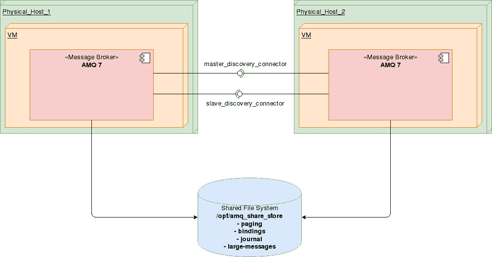

# 自动化 AMQ 7 高可用性部署

> 原文：<https://developers.redhat.com/blog/2018/04/25/automating-amq-7-high-availability-deployment>

红帽 JBoss AMQ 7 为互联网规模的应用程序提供快速、轻量级和安全的消息传递。此外，AMQ 7 组件使用行业标准的消息协议，并支持多种编程语言和操作环境。

因此，AMQ 7 为您构建现代分布式应用程序奠定了坚实的基础。尤其重要的是，AMQ 7 代理的多个实例可以组合在一起，以分担消息处理负载。

每个代理管理自己的消息和连接，并通过“集群桥”连接到其他代理，集群桥用于发送拓扑信息，如队列和使用者，以及负载平衡消息。

AMQ 7 支持两种不同的服务器备份策略:共享存储和复制。

对安装程序进行了分析，决定在手动设置 AMQ 7 配置的基础上提供一个层。因此，实施了以下项目来为 AMQ 7 高可用性(HA)共享存储提供部署自动化:

[https://github.com/AbrahamArellano/amq-ha-shared-store-demo](https://github.com/AbrahamArellano/amq-ha-shared-store-demo)

# 这篇文章涵盖了什么？

*   [部署自动化 AMQ 7 HA 共享商店项目概述](#overview)
*   这个项目提供了什么？
*   [提供了哪些脚本？](#whatarescripts)
*   [安装先决条件](#installprereq)
*   [下载项目](#projectdownload)
*   [配置项目](#projectconfig)
*   [执行项目:AMQ 7 部署](#exec)
*   [测试 AMQ 7 号](#test)
*   [测试设置](#testsetup)
*   [卸载 AMQ 7](#uninstall)
*   [协作](#collaboration)

# 部署自动化 AMQ 7 HA 共享存储项目概述

首先，值得一提的是，AMQ 有两个使用不同策略来实现故障切换的策略:

*   复制:主代理和从代理通过网络同步数据。
*   共享存储:主代理和从代理共享相同的位置来存储它们的消息数据。

使用共享存储时，主代理和从代理都使用共享文件系统共享一个数据目录。这个数据目录包括分页目录、日志目录、大消息和绑定日志。

如果主代理与集群断开连接，则从代理从共享文件系统加载持久存储。客户端可以连接到从属代理并继续它们的会话。

共享存储 HA 的优点是主节点和从节点之间不会发生复制。这意味着在正常操作期间，不会因为复制开销而导致性能损失。

共享存储复制的缺点是它需要共享文件系统。因此，当从属代理接管时，它需要从共享存储中加载日志，这可能需要一些时间，具体取决于存储中的数据量。

这种类型的 HA 不同于数据复制，因为它需要一个主节点和从节点都可以访问的共享文件系统。通常这是某种高性能存储区域网络(SAN)。建议您*而不是*使用网络连接存储(NAS)。

# 这个项目提供了什么？

此项目提供的脚本旨在用于您有以下需求的测试或生产环境:

*   具有部署在不同主机或同一主机上的两个节点(主/从)的群集
*   群集安全和附加设置配置
*   使用共享存储的高可用性
*   管理员用户
*   地址/队列安全:具有有限权限的附加用户(使用属性；没有证书)
*   AMQ 调谐:
    *   消息重新传递
    *   再交付延迟
    *   消息过期
    *   死信地址
    *   缓慢的消费者处理
    *   分页
*   从本地主机和远程主机访问控制台
*   一个可配置的测试套件:消费者和生产者
*   卸载程序脚本
*   Web 控制台端口配置
*   在同一台主机上安装多个实例的可能性——几乎不做任何更改

总体要求是以最少的工作量和配置，通过自动化的方式部署您的 AMQ 集群。

# 提供了哪些脚本？

## 产品部署程序脚本

*   在给定位置部署 AMQ 7 二进制文件。这是执行其他脚本之前的先决条件。

## 安装程序脚本

安装程序脚本允许您部署主和从 AMQ 7 HA 配置。该项目可以部署在同一台主机上，也可以部署在不同的主机上。

*   `master_installer_script`安装主服务器。
*   安装从机。

## 卸载程序脚本

卸载程序脚本允许您删除主服务器和从服务器的 AMQ 7 HA 安装，并清理持久性。

*   `uninstaller_script.sh`卸载部署在执行它的主机上的 AMQ 7 实例。
*   `uninstaller_persistence_script.sh`卸载 AMQ 7 持久存储。

# 安装先决条件

提供的脚本可用于以两种不同的方式安装 AMQ:

*   主机和从机在同一台机器上:需要一台具备下述先决条件的机器。
*   不同机器上的主服务器和从服务器:需要两台具备下述先决条件的机器。

## 硬件要求

*   操作系统:Mac OS X (10.8 或更高版本)、微软 Windows 7 (SP1)、Fedora (21 或更高版本)或 Red Hat Enterprise Linux 7
*   内存:至少 2gb；最好是 4 GB

## 软件要求

*   网络浏览器(最好是 Chrome 或 Firefox)
*   Git 客户端，可以从[这里](https://git-scm.com/book/en/v2/Getting-Started-Installing-Git)下载
*   访问[http://github.com](http://github.com)

## 运行 JBoss AMQ 7 代理的要求

*   Java 运行时引擎(JRE) 1.8，可以在这里下载[。](http://www.oracle.com/technetwork/java/javase/downloads/jdk8-downloads-2133151.html)

*   LibAIO (optional).
*   AMQ 7 经纪人来自红帽开发者门户，可以在这里下载[。如果您使用两台不同的服务器，请在每台服务器上安装它。将下载的文件`amq-broker-7.1.0-bin.zip`放入安装目录:`[SRC_DIR]`。](https://developers.redhat.com/products/amq/download/)
*   一个准备好的共享文件系统。

如果您从受支持的 Red Hat Enterprise Linux 版本安装，您可以使用下面的`yum`命令来安装先决条件:

`$ sudo yum install java-1.8.0-openjdk-devel git`

# 下载项目

Git 将[这个存储库](https://github.com/AbrahamArellano/amq-ha-shared-store-demo)克隆到`[GIT_SOURCE]`，然后将目录名更改为`amq-ha-shared-store`。

# 配置项目

请仔细阅读以下配置设置。

如前一节所述，主服务器和从服务器可以配置在同一台机器上，也可以配置在不同的机器上。在每种情况下，都需要下面描述的特定配置。

## 同一台机器上的主机和从机

检查并调整以下脚本:

### **master _ installer _ script . sh**

正确设置变量:

*   `PRODUCT_HOME`:AMQ 7 经纪人分布的位置。
*   `SRC_DIR`:AMQ 7 安装程序`amq-broker-7.1.0-bin.zip`文件的位置。
*   `SHARED_FILESYSTEM`:主设备和从设备使用的共享文件系统位置。《逃离》中的人物。

### **slave _ installer _ script . sh**

正确设置变量:

*   `PRODUCT_HOME`:AMQ 7 经纪人分布的位置。
*   `SRC_DIR`:AMQ 7 安装程序`amq-broker-7.1.0-bin.zip`文件的位置。
*   `SHARED_FILESYSTEM`:主设备和从设备使用的共享文件系统位置。《逃离》中的人物。

## 不同机器上的主机和从机

检查并调整以下脚本:

### **-master _ installer _ script . sh** 

### **-slave _ installer _ script . sh**

正确设置变量:

*   `PRODUCT_HOME`:AMQ 7 经纪人分布的位置。
*   `SRC_DIR`:AMQ 7 安装程序`amq-broker-7.1.0-bin.zip`文件的位置。
*   `SHARED_FILESYSTEM`:主设备和从设备使用的共享文件系统的位置。一定要“逃离”人物。
*   `MASTER_IP`:部署 AMQ 主实例的主机的 IP 地址。
*   `MASTER_PORT`:主 AMQ 实例的端口。
*   `SLAVE_IP`:安装了从 AMQ 实例的主机的 IP 地址**。**
*   `SLAVE_PORT`:从 AMQ 实例的端口。
*   `CONSOLE_PORT`:web 控制台的端口。
*   `CLUSTER_CONNECTION_NAME`:集群连接的名称。
*   `AMQ_MASTER`:当前 AMQ 主实例的名称。**这允许您在同一台主机上安装多个实例。**
*   `AMQ_SLAVE`:当前 AMQ 从实例的名称。**这允许您在同一台主机上安装多个实例。**

# 执行项目:AMQ 7 部署

按照下面的说明继续安装项目。

## 配置安装程序脚本

配置`product_installer_script.sh`并执行，如下:
1。首先，配置以下变量:

*   `PRODUCT_HOME`:包含 AMQ 7 经纪人分布位置的变量
*   `SRC_DIR`:AMQ 7 安装程序`amq-broker-7.1.0-bin.zip`文件的位置

2.然后，执行脚本`product_installer_script.sh`:

`[GIT_SOURCE]/amq-ha-shared-store/product_installer_script.sh`

## 将主服务器和从服务器安装在同一台机器上

1.在主机上运行脚本`master_installer_script.sh`:

`[GIT_SOURCE]/amq-ha-shared-store/master_installer_script.sh`

2.在主机上运行脚本`slave_installer_script.sh`:

`[GIT_SOURCE]/amq-ha-shared-store/slave_installer_script.sh`

## 将主服务器和从服务器安装在不同的机器上

1.在主控主机上运行脚本`master_installer_script.sh`:

`[GIT_SOURCE]/amq-ha-shared-store/master_installer_script.sh`

2.在从属主机上运行脚本`slave_installer_script.sh`:

`[GIT_SOURCE]/amq-ha-shared-store/slave_installer_script.sh`

最后，在成功部署之后，您可以测试集群。

# 测试 AMQ 7

为了测试您的安装，该项目提供了一个由以下测试脚本组成的测试套件:

*   `[GIT_SOURCE]/amq-ha-shared-store/test_scripts/producer_master_test_execution.sh`在主代理的测试队列中产生 10 条消息。
*   `[GIT_SOURCE]/amq-ha-shared-store/test_scripts/producer_slave_test_execution.sh`在从属代理的测试队列中产生 10 条消息。
*   `[GIT_SOURCE]/amq-ha-shared-store/test_scripts/consumer_master_test_execution.sh`从主代理的测试队列中消耗 100 条消息。
*   `[GIT_SOURCE]/amq-ha-shared-store/test_scripts/consumer_slave_test_execution.sh`消耗从代理的测试队列中的 100 条消息。

此外，还有一个设置测试环境的支持脚本:

`[GIT_SOURCE]/amq-ha-shared-store/test_scripts/create_queue_test.sh`在主代理中创建测试队列。该脚本在主代理上触发。

## 设置测试脚本

检查以下测试脚本中的以下变量是否具有正确的值:

`[GIT_SOURCE]/amq-ha-shared-store/test_scripts/create_queue_test.sh`

*   `PRODUCT_HOME`:AMQ 7 安装的位置
*   `AMQ_MASTER`:当前 AMQ 主实例的名称

`[GIT_SOURCE]/amq-ha-shared-store/test_scripts/producer_master_test_execution.sh`和
`[GIT_SOURCE]/amq-ha-shared-store/test_scripts/consumer_master_test_execution.sh`

*   `PRODUCT_HOME`:AMQ 7 安装的位置
*   `AMQ_MASTER`:当前 AMQ 主实例的名称

`[GIT_SOURCE]/amq-ha-shared-store/test_scripts/producer_slave_test_execution.sh`和
`[GIT_SOURCE]/amq-ha-shared-store/test_scripts/consumer_slave_test_execution.sh`

*   `PRODUCT_HOME`:AMQ 7 安装的位置
*   `AMQ_SLAVE`:当前 AMQ 从实例的名称

## 主主动测试

### 在母版上生成消息

要向主代理发送消息，请执行以下脚本:

`[GIT_SOURCE]/amq-ha-shared-store/test_scripts/create_queue_test.sh`
和
`[GIT_SOURCE]/amq-ha-shared-store/test_scripts/producer_master_test_execution.sh`

### 在主服务器上浏览邮件

检查代理 web 控制台中的队列，验证队列是否收到了消息:

1.  打开网络浏览器，导航至位于`http://localhost:8161/hawtio`的 AMQ 网络控制台。
2.  在左树中，导航到 **127.0.0.1 >地址> haQueue >队列> anycast > haQueue** 。
3.  点击**浏览**(必要时刷新)。

该脚本应该产生 10 条消息。

### 在主服务器上使用消息

要使用来自主代理的消息，请执行以下脚本:

`[GIT_SOURCE]/amq-ha-shared-store/test_scripts/consumer_master_test_execution.sh`

## 从属主动测试

### 在从机上产生消息

要向从属服务器发送消息，请执行以下脚本:

`[GIT_SOURCE]/amq-ha-shared-store/test_scripts/producer_slave_test_execution.sh`

### 浏览从属服务器上的消息

检查代理 web 控制台中的队列，验证队列是否收到了消息:

1.  打开网络浏览器，导航至位于`http://localhost:8261/hawtio`的 AMQ 网络控制台。
2.  在左树中，导航到 **127.0.0.1 >地址> haQueue >队列> anycast > haQueue** 。
3.  点击**浏览**(必要时刷新)。

该脚本应该产生 10 条消息。

### 在从属服务器上使用消息

要使用来自从属代理的消息，请执行下面的脚本 **:**

`[GIT_SOURCE]/amq-ha-shared-store/test_scripts/consumer_slave_test_execution.sh`

# 卸载 AMQ 7

此外，该项目提供了两个卸载程序，用于卸载已部署的 AMQ 7 HA 配置。

1.首先，执行`uninstaller_script.sh`脚本来停止并卸载 AMQ 7 HA 配置。

2.此外，如果需要，配置并执行`uninstaller_persistence_script.sh`脚本来删除持久性。

3.在脚本上:`uninstaller_script.sh`和`uninstaller_persistence_script.sh`检查以下变量是否包含正确的值:

*   `PRODUCT_HOME`:AMQ 7 经纪人分布的位置
*   `SHARED_FILESYSTEM`:主设备和从设备使用的共享文件系统的位置

# 合作

这个项目是基于 Hugo Guerrero 创建的一个项目，在 GitHub 上可以找到:[JBoss demo central/amq-ha-replicated-demo](https://github.com/jbossdemocentral/amq-ha-replicated-demo)。

*Last updated: April 26, 2018*