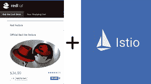
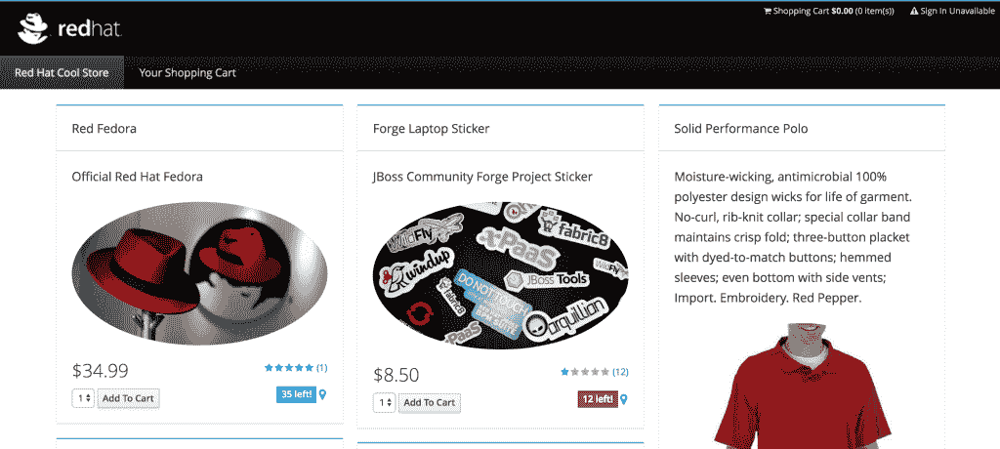
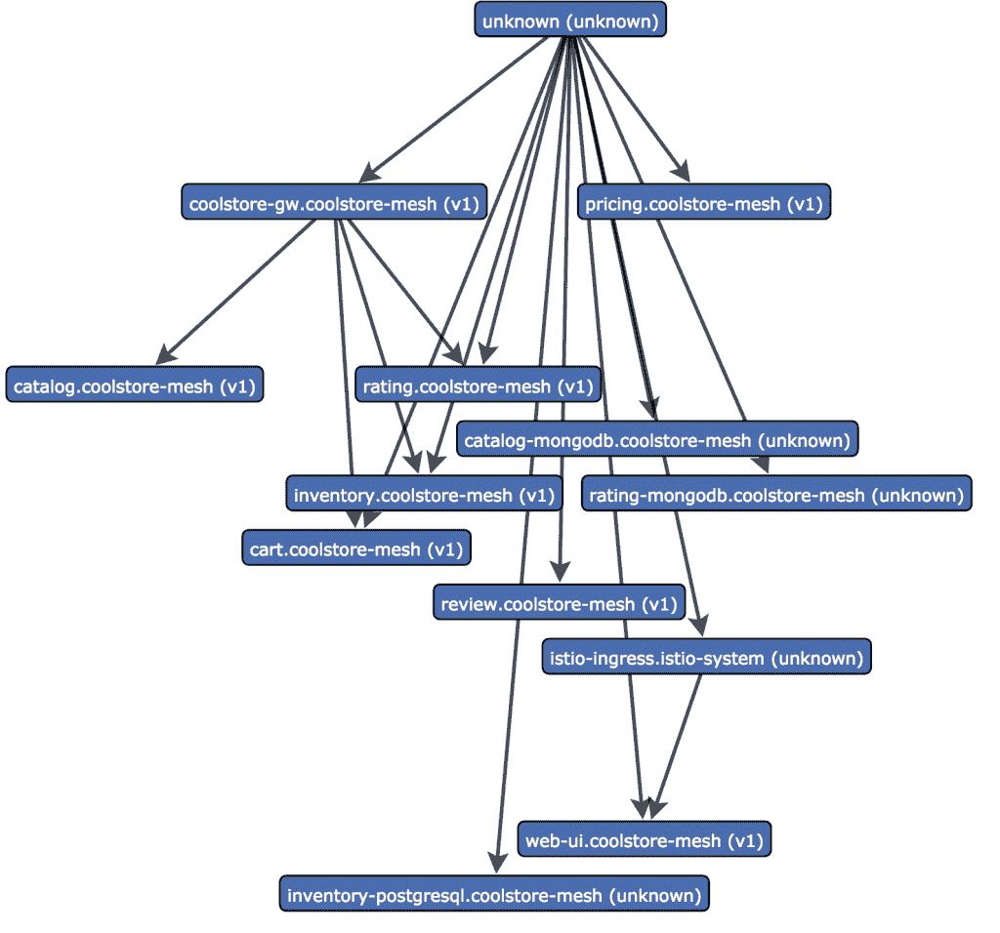

# 将 Coolstore 微服务引入服务网格:第 2 部分-手动注入

> 原文：<https://developers.redhat.com/blog/2018/04/12/bringing-coolstore-microservices-to-the-service-mesh-part-2-manual-injection>



在本系列的第一部分中，我们探讨了 [Istio](https://istio.io) 项目，以及 Red Hat 如何致力于并积极参与该项目，并努力将其集成到 Kubernetes 和 [OpenShift](http://openshift.com) 中，以将服务网络的好处带给我们的客户和更广泛的相关社区。如果你想玩 Istio，查看 learn.openshift.com 上的[服务网格教程。如果您想安装它，请遵循](https://learn.openshift.com/servicemesh/) [Istio Kubernetes 快速入门说明](https://istio.io/docs/setup/kubernetes/quick-start.html)并将其安装在 OpenShift 3.7 或更高版本上。另外，请不要错过 Don Schenck 关于 Istio 技术的系列博客,以了解更多信息以及 Red Hat 在该领域的进展。

在本帖中，我们将部署现有的 [Coolstore 微服务演示](https://github.com/jbossdemocentral/coolstore-microservice)作为服务网格，并开始展示您可以从系统中获得的切实价值，而无需对现有应用进行任何重大重写或重新架构。我们还将不断改进我们的项目，以遵循 Istio(和通用微服务)最佳实践。在现实世界中，您的应用程序和开发人员经常会做出错误的假设，或者无法实现最佳实践，因此有了这些信息，您就可以对自己的项目有所了解。对于 Coolstore 来说，许多这些变通方法最终会在演示的源代码中找到它们的方法。

## 入门指南

让我们假设你已经安装了 OpenShift 3.7+(我使用的是[OpenShift Origin 3 . 9 . 0 . alpha 3](https://github.com/openshift/origin/releases/tag/v3.9.0-alpha.3)，因为截至发稿时，open shift 容器平台 3.9 尚未发布)。让我们进一步假设您已经[安装了 Istio 0.6.0 或更高版本的](https://istio.io/docs/setup/kubernetes/quick-start.html)，包括 Prometheus、Servicegraph、Jaeger 和 Grafana 插件(有关如何安装 Istio 及其插件的说明，请参见下面*更多阅读*部分中的 shell 脚本安装程序)。验证在`istio-system`名称空间中安装并运行了 Istio:

```
% oc get pods -n istio-system
NAME                                READY     STATUS    RESTARTS   AGE
grafana-89f97d9c-2wtxx              1/1       Running   0          7m
istio-ca-59f6dcb7d9-bs9hx           1/1       Running   0          7m
istio-ingress-779649ff5b-jw4hg      1/1       Running   0          7m
istio-mixer-7f4fd7dff-pct4j         3/3       Running   0          7m
istio-pilot-5f5f76ddc8-pvq4d        2/2       Running   0          7m
jaeger-deployment-559c8b9b8-klspv   1/1       Running   0          7m
prometheus-cf8456855-svpmb          1/1       Running   0          7m
servicegraph-59ff5dbbff-7zrfp       1/1       Running   0          7m

```

让我们开始吧。复制 Coolstore repo，然后继续玩下去:

```
% git clone https://github.com/jbossdemocentral/coolstore-microservice
```

并且确保您以集群管理员的身份登录，或者您拥有*集群管理*权限，因为这将要求您稍后进行一些策略和权限更改。(正如在第 1 部分中提到的，这将在未来的 Istio 版本中进行微调，不再需要这么多特权和许可。)您可以以集群管理员的身份登录，或者如果您有 sudoer 权限，您可以将`--as=system:admin`添加到下面的所有`oc`命令中。

## 手动注入边车

在第 1 部分中，我展示了使用 sidecar 自动注入，您的应用程序的 pod 会自动用 Envoy 代理装饰起来，而无需更改应用程序的部署。然而，它有一些问题，目前阻止我们使用它。现在，我们将进行手动注射。手动注入有一个明显的缺点，即您必须进行注入，但它也有一个很大的好处:您只需要做一次(每个 Istio 版本)，一旦完成，您就可以将结果作为代码签入到您的源代码管理系统中。

让我们首先在我们的 Linux shell 中设置一些环境变量，这样我们可以在以后引用它们。(只需将所有这些命令复制并粘贴到您的 Linux 终端中。如果你在 Windows 上，[你就有希望](https://www.howtogeek.com/261591/how-to-create-and-run-bash-shell-scripts-on-windows-10/)。)

```
# Version of Istio we are using
ISTIO_VERSION=0.6.0

# The name of the OpenShift project into which you installed Istio. It should
# be istio-system as that's what the Istio nstaller creates for you
ISTIO_PROJECT=istio-system

# Name of project to house our coolstore service mesh
COOLSTORE_PROJECT=coolstore-mesh

# Location of istio binaries that you downloaded and installed from istio.io
ISTIO_HOME=${HOME}/istio-${ISTIO_VERSION}

# Location of Coolstore microservice demo repo
COOLSTORE_HOME=${HOME}/coolstore-microservice

```

Coolstore 微服务演示使用了大量的 [JBoss 中间件](https://www.redhat.com/en/resources/red-hat-jboss-middleware)，所以让我们将必要的图像流定义安装到`openshift`名称空间中:

```
oc create -n openshift -f https://raw.githubusercontent.com/jboss-fuse/application-templates/master/fis-image-streams.json
oc create -n openshift -f https://raw.githubusercontent.com/jboss-openshift/application-templates/master/eap/eap70-image-stream.json
oc create -n openshift -f https://raw.githubusercontent.com/jboss-openshift/application-templates/master/webserver/jws31-tomcat8-image-stream.json
oc create -n openshift -f https://raw.githubusercontent.com/jboss-openshift/application-templates/master/openjdk/openjdk18-image-stream.json
oc create -n openshift -f https://raw.githubusercontent.com/jboss-openshift/application-templates/master/decisionserver/decisionserver64-image-stream.json
```

接下来，创建一个项目来容纳网格，并在项目中为默认的 *serviceaccount* 提供必要的权限，以便 Istio 完成它的工作:

```
oc new-project $COOLSTORE_PROJECT
oc adm policy add-scc-to-user privileged -z default
oc adm policy add-scc-to-user anyuid -z default
```

现在是*大爆炸*。 [coolstore 微服务演示](https://github.com/jbossdemocentral/coolstore-microservice)带有一个巨大的 [OpenShift 模板](https://docs.openshift.org/latest/dev_guide/templates.html)，它将在您的新项目中创建微服务和相关数据库。它将引发许多最终应该会成功的构建，但像许多现实世界的项目一样，我们的项目并不完全符合基于容器的微服务的最佳实践，所以我们需要解决这些问题。我们将使用`oc process`将模板转换成 Kubernetes 对象的列表，然后通过 Istio [手动注入 CLI](https://istio.io/docs/reference/commands/istioctl.html#istioctl%20kube-inject) 传递它们，这将做与自动注入相同的事情，但是在 OpenShift 本身之外完成。最后，通过手动注射器(istioctl kube-inject)后，结果通过`oc apply`发送到 OpenShift。相反，您可以捕获输出并将其保存到您的源代码管理系统，但是出于演示目的，我们将直接将其发送到 OpenShift。在部署 Coolstore 之后，我们将使用`oc rollout cancel`停止部署，以便在事情启动和运行之前给我们一个做一些黑客攻击的机会:

```
oc process -f ${COOLSTORE_HOME}/openshift/coolstore-template.yaml | \
 ${ISTIO_HOME}/bin/istioctl kube-inject -f - | \
 oc apply -f -

for i in $(oc get dc -o name) ; do
  oc rollout cancel $i
  oc rollout pause $i
done

```

此时，您的构建应该正在进行(并且 CPU 促成了宇宙的[热死](https://en.wikipedia.org/wiki/Heat_death_of_the_universe)):

```
% oc get builds
NAME             TYPE      FROM          STATUS    STARTED          DURATION
cart-1           Source    Git@f63f51d   Running   37 seconds ago
catalog-1        Source    Git@f63f51d   Running   38 seconds ago
coolstore-gw-1   Source    Git@f63f51d   Running   38 seconds ago
inventory-1      Source    Git@f63f51d   Running   38 seconds ago
pricing-1        Source    Git@f63f51d   Running   37 seconds ago
rating-1         Source    Git@f63f51d   Running   37 seconds ago
review-1         Source    Git@f63f51d   Running   37 seconds ago
web-ui-1         Source    Git@f63f51d   Running   38 seconds ago

```

你可以继续运行`oc get builds`直到`STATUS`栏显示`Complete`，但是你不必为了继续下面的操作而等待。

在构建过程中(部署被取消)，该应用程序没有遵循的第一个最佳实践是命名所使用的服务和容器端口。Istio 目前要求，对于加入服务网格的服务，必须对它们暴露的 TCP 端口进行命名，并且必须以`http`或`https`开始命名。Istio 只能智能地路由和跟踪 [SNI 或等效的协议](https://en.wikipedia.org/wiki/Server_Name_Indication)，如 HTTP 和 HTTPS，它们具有指示目的主机的可解析报头，因此通过显式命名服务和容器端口，您可以向 Istio 确认您的服务的参与意图。碰巧所有的 Coolstore 服务都绑定到端口 8080，所以为了简单起见，让我们破解这个演示程序并强行命名所有的服务端口`http`:

```
for i in $(oc get svc -o name) ; do
  PATCH=$(mktemp)
  cat <<EOF > $PATCH
spec:
  ports:
  - name: http
    port: 8080
    protocol: TCP
    targetPort: http
EOF
  oc patch $i -p "$(cat $PATCH)"
  rm -f $PATCH
done
```

有了上面的代码，我们所有服务的端口现在都是名为的*(除了数据库服务端口，您将在输出中看到它们被跳过)*。*我们需要为我们的容器做同样的事情，我们也需要增加一些睡眠时间(参见第一部分或咨询你的医生关于睡眠需求的解释)。Istio 的智能路由也可以在服务版本上操作，所以你可以做一些事情，比如不同版本服务的[金丝雀部署或黑暗启动](https://voxxeddays.com/romania/2018/01/22/istio-on-kubernetes-canaries-chaos-and-dark-launches/)。因此，我们将为所有服务添加一个版本说明符`v1`(稍后，我们将用它做一些有趣的事情)。下面是对我们的部署配置进行所有这些操作的神奇方法:*

```
for i in $(oc get dc -o name) ; do
 oc label $i version=v1
 DCNAME=$(echo $i | cut -d'/' -f 2)
 PATCH=$(mktemp)
 cat <<EOF > $PATCH
spec:
  strategy:
    customParams:
      command:
      - /bin/sh
      - '-c'
      - 'sleep 5; echo slept for 5; /usr/bin/openshift-deploy'
  template:
    metadata:
      labels:
        version: v1
    spec:
      containers:
      - name: $DCNAME
        ports:
        - containerPort: 8080
          name: http
          protocol: TCP
EOF
   oc patch $i -p "$(cat $PATCH)"
   rm -f $PATCH
done
```

接下来，由于此演示通常用于低功耗笔记本电脑，因此默认情况下，我们会禁用(扩展到 0 pods)一些服务。但是因为我们处于大爆炸模式，所以让我们重新打开这些服务:

```
for i in rating rating-mongodb review review-postgresql pricing ; do
  oc scale --replicas=1 dc $i
done
```

我们快到了。下一期是关于 [JBoss EAP](https://developers.redhat.com/products/eap) 。开箱即用，当[容器化 JBoss EAP 映像](https://access.redhat.com/documentation/en-us/red_hat_jboss_enterprise_application_platform/7.0/html/red_hat_jboss_enterprise_application_platform_for_openshift/)启动时，它将其[under flow](http://undertow.io/)监听器绑定到一个私有 IP 地址(即`hostname -i`的输出)。由于 Istio 的网络魔力，它希望容器绑定到它的公共 IP 地址或`0.0.0.0`(即所有接口，我在任何地方都找不到它的文档)。不幸的是，JBoss EAP 的绑定地址是固定的，总是绑定到 Istio 不控制或代理的接口上的私有 IP 地址，所以我们不得不求助于另一个黑客来解决这个问题。这个黑客修改了 [JBoss EAP S2I 构建器映像](https://access.redhat.com/documentation/en-us/red_hat_jboss_enterprise_application_platform/7.0/html/red_hat_jboss_enterprise_application_platform_for_openshift/)，创建了一个派生的构建器映像(使用不应该命名的容器映像格式),然后我们用它来重建我们基于 JBoss EAP 的库存微服务，以便它绑定到`0.0.0.0`:

```
cat <<EOF | oc new-build --name inventory-builder -D -
  FROM registry.access.redhat.com/jboss-eap-7/eap70-openshift:1.6
  RUN sed -i 's/JBOSS_HA_ARGS="-b \${IP_ADDR}/JBOSS_HA_ARGS="-b 0.0.0.0/' /opt/eap/bin/launch/ha.sh
EOF
```

等待它完成:

```
for i in {1..200}; do oc logs -f bc/inventory-builder && break || sleep 1; done
```

然后使用 S2I 重建清单服务:

```
oc new-build --name inventory-hack --to='inventory:latest' ${COOLSTORE_PROJECT}/inventory-builder~${COOLSTORE_HOME} --context-dir=inventory-service
```

并等待它完成:

```
for i in {1..200}; do oc logs -f bc/inventory-hack && break || sleep 1; done
```

最后一击。我们正在使用 [JBoss Fuse](https://developers.redhat.com/products/fuse) 来实现我们的 Coolstore 网关(它面向我们所有的微服务，并在运行时向 UI 返回聚合数据)。不幸的是， [Camel](https://camel.apache.org) 的一些特性(最值得注意的是我们用来实现我们的 [AggregationStrategy](http://camel.apache.org/aggregator.html) ) *在对其他服务进行下游调用时会去除* HTTP 头。这将干扰[正确跟踪](http://opentracing.io/)，导致下游调用显示为具有单个[跨度](http://opentracing.io/documentation/)的单个[轨迹](http://opentracing.io/documentation/)，而不是包含代表下游调用的聚合跨度的单个轨迹。随着 Istio+Prometheus+Jaeger 组合的流行，正确的跟踪变得相对自由，当跟踪工作时，可以提取很多价值，所以让我们通过修改 Coolstore 网关的源代码来保留标题，从而绕过这一限制。

这个黑客假设您已经安装了 [Maven 3.3.9+和](https://maven.apache.org/download.cgi)，因为它将使用`sed`对源代码进行就地编辑，然后使用 Maven 对被攻击的源代码进行本地重建，最后在您的本地机器上启动服务的 OpenShift S2I 二进制重建:

```
sed -i.bak 's/return original;/original.getOut().setHeaders(original.getIn().getHeaders()); return original;/g' \
 $COOLSTORE_HOME/coolstore-gw/src/main/java/com/redhat/coolstore/api_gateway/ProductGateway.java

mvn -f $COOLSTORE_HOME/coolstore-gw clean package -DskipTests -Dfabric8.skip -e -B

oc new-build --name coolstore-gw-hack --to='coolstore-gw:latest' --image fis-java-openshift:2.0 --strategy source --binary

oc start-build coolstore-gw-hack --from-file=${COOLSTORE_HOME}/coolstore-gw/target/coolstore-gw.jar --follow

```

Coolstore 没有遵循的另一个最佳实践是声明您希望访问的容器中所有暴露的端口。Istio 的代理只会将流量代理到已命名和已声明的端口，因此，如果您的容器正在侦听未声明或未命名的端口，您将无法访问它们，甚至无法从正在运行的容器中访问它们，因为 Istio 会透明地拦截所有流量，只在已命名的端口上传递流量。因此，在这种情况下，我们的 Coolstore 网关未能声明端口 8081(暴露其[健康探测器](https://docs.openshift.org/latest/dev_guide/application_health.html)的端口)，因此健康检查将失败。所以现在，让我们禁用 Coolstore 网关健康检查(这本身是一种不好的做法，最终应该在 Coolstore 本身中修复):

```
oc set probe dc/coolstore-gw --readiness --liveness --remove
```

## 最后一步

哇；这是大量的黑客攻击。对于我们新创建和确定的项目，是时候重新部署一切了。我们将在所有部署中使用`oc rollout`来完成这项工作:

```
for i in $(oc get dc -o name) ; do
  oc rollout resume $i
  oc rollout latest $i
done
```

等待重新部署完成:

```
for i in $(oc get dc -o name) ; do
  oc rollout status -w $i
done
```

如果上述命令报告超时，只需重新运行`for`循环，直到所有部署报告成功。

通常，在这一点上，一旦所有部署完成，您就可以直接访问 Coolstore 的 UI，但是我们将使用内置的 [Istio Ingress 组件](https://istio.io/docs/tasks/traffic-management/ingress.html),这样我们就可以完全控制传入请求的路由，并从请求的开始就生成可接受的分布式跟踪:

```
cat <<EOF | oc create -f -
apiVersion: extensions/v1beta1
kind: Ingress
metadata:
  name: coolstore-ingress
  annotations:
    kubernetes.io/ingress.class: "istio"
spec:
  backend:
    serviceName: web-ui
    servicePort: http
  rules:
  - http:
      paths:
      - path: /api/*
        backend:
          serviceName: coolstore-gw
          servicePort: http
EOF
```

这将设置 [Istio Ingress](https://istio.io/docs/tasks/traffic-management/ingress.html) 来将对`/api/*`的请求路由到我们的 Coolstore 网关，而所有其他请求将只进入 web UI 前端。您将通过安装在`istio-system`项目中的入口路径访问应用程序(您运行了`oc expose svc/istio-ingress -n istio-system`，对吗？)

在所有内容都已重建并且所有部署都已成功部署之后，您应该能够通过浏览器中的 Istio Ingress 服务 URL 访问 Coolstore UI，您可以使用以下命令生成该 URL:

```
echo "CoolStore URL: http://$(oc get route istio-ingress -n ${ISTIO_PROJECT} --template='{{ .spec.host }}')"
```



您还可以访问 Prometheus 和 Grafana 等各种服务的 web 控制台。运行这些命令，然后将 URL 复制/粘贴到您的浏览器中，以验证一切正常:

```
echo "Primary web frontend URL: http://$(oc get route istio-ingress -n ${ISTIO_PROJECT} --template='{{ .spec.host }}')"
echo "D3 force layout service graph: http://$(oc get route servicegraph -n ${ISTIO_PROJECT} --template='{{ .spec.host }}')/force/forcegraph.html?time_horizon=5m&filter_empty=true"
echo "Example Prometheus query: http://$(oc get route prometheus -n ${ISTIO_PROJECT} --template='{{ .spec.host }}')/graph?g0.range_input=30m&g0.expr=istio_request_count&g0.tab=0"
echo "Grafana Istio Dashboard: http://$(oc get route grafana -n ${ISTIO_PROJECT} --template='{{ .spec.host }}')/d/1/istio-dashboard?refresh=5s&orgId=1"
echo "Jaeger Tracing Console: http://$(oc get route jaeger-query -n ${ISTIO_PROJECT} --template='{{ .spec.host }}')"
```

我们将在下一篇文章中探讨这些问题，但是您可以随意尝试，访问页面，生成一些负载，并检查结果。

为了增加乐趣和价值，在浏览器中几次访问 *Web 前端 URL* ，然后查看上面的 *D3 Force Layout 端点*。它应该是这样的:



该图非常混乱，因为一些非 HTTP/S 访问(例如，对数据库的访问)没有正确地链接到调用它们的服务，因为 Istio 不能解释这些调用。例如，您可以看到 coolstore-gw 对其他服务(库存、目录、评级、购物车)进行了几次下游调用，这些调用也会在 Jaeger 中显示为适当的跟踪和跨度。

## 总结和意见

这是一种快速查看服务依赖关系并确认网关确实在访问底层微服务的方法。一些观察结果:

*   您应该命名所有的容器和服务端口。您可能已经注意到，在上面的攻击中，我们强行将端口 8080 上的所有服务命名为`http`，但是非 HTTP 服务(最明显的是 PostgreSQL 和 MongoDB，它们都使用非 HTTP 协议)被跳过/忽略。这些服务不能参与服务网格，因为 Istio 当前不能路由这些服务。
*   容器化 JBoss EAP 有一个限制，我们已经解决了。
*   JBoss Fuse 对 HTTP 头有一个不可逆转的副作用，我们已经解决了。
*   在生产中，手动注入很可能比自动注入更好，因为您可以在基础设施源代码中捕获它。自动注入对于演示来说是非常好的(一旦这个问题被解决)。
*   无论是否使用微服务，Istio+OpenShift 对现有的应用程序都有巨大的价值。

在本系列的下一部分中，我们将探索您可以从 Istio+OpenShift 为现有应用程序获得的额外价值，我们甚至将使用 Istio 服务网格和 Red Hat 技术的强大功能来检测和修复我们的分布式微服务应用程序中的一些问题。敬请期待！

## 更多阅读

*   [将 Coolstore 微服务引入服务网格第 1 部分:自动注入](https://developers.redhat.com/blog/2018/04/05/coolstore-microservices-service-mesh-part-1-exploring-auto-injection/)
*   [包括 Istio 安装在内的所有上述攻击的可运行 shell 脚本要点](https://gist.github.com/jamesfalkner/ff51aa7e259d9f9c02fd79be757ef12c)
*   Istio 网站上的克里斯蒂安·波斯塔
*   [Istio 简介；唐·申克](https://developers.redhat.com/blog/2018/03/06/introduction-istio-makes-mesh-things/)
*   [红帽开发者在 Istio 上的博客](https://developers.redhat.com/search?t=istio)

*Last updated: October 6, 2022*