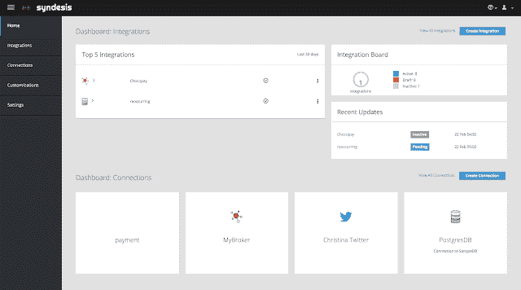
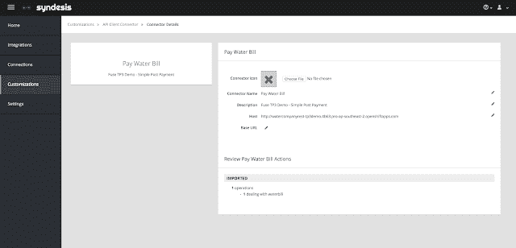
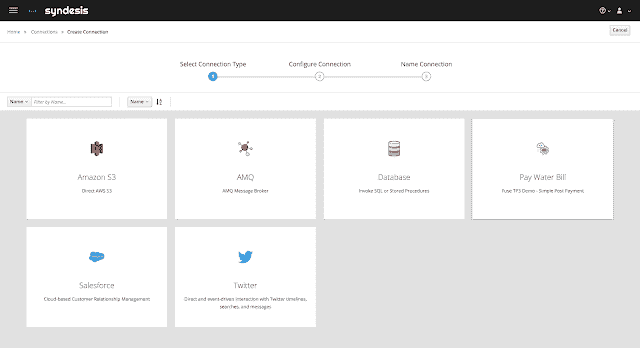
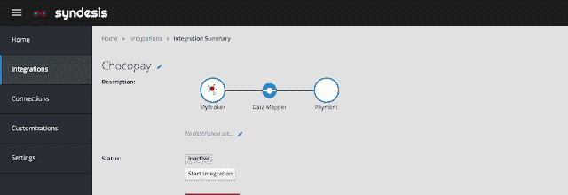
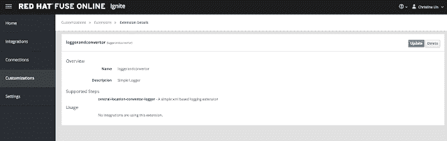

# 立即开始使用红帽 JBoss Fuse 7 技术预览版 3！

> 原文：<https://developers.redhat.com/blog/2018/02/27/red-hat-jboss-fuse-7-tech-preview>

[红帽 JBoss Fuse](https://www.redhat.com/en/technologies/jboss-middleware/fuse) 7.0 技术预览三今天出！在成为最好的云原生集成平台之一的道路上，JBoss Fuse 让开发人员可以自由选择如何开发集成解决方案，以及在哪里部署它。它还具有处理没有开发经验的新集成角色的能力。

*   通过支持**三个主要的运行时**，开发者可以自由地在他们选择的运行时上工作。
*   通过支持**独立和云部署**，它降低了部署到这些环境的复杂性，从而提供了部署灵活性。
*   适用于所有开发专业水平的解决方案。你可以深入创建**定制的复杂集成逻辑**，或者使用新的**低代码平台**快速构建一个简单的集成。

在这个 JBoss Fuse 技术预览版中，您可以了解所有内容:

*   JBoss 独立保险丝
    *   微服务用弹簧靴
    *   OSGi 爱好者的卡拉夫 4
    *   面向 Java EE 开发人员的 JBoss EAP
*   JBoss 保险丝打开移位
    *   易于容器化应用的插件
    *   灵活的云平台——基于 OpenShift (Kubernetes)技术
*   JBoss Fuse 在线
    *   低代码集成开发
    *   支持定制

**JBoss Fuse Online 集锦:**

在此版本中，您现在可以通过将 Swagger 文档导入 JBoss Fuse Online 来定义连接器，从而与现有的 SaaS API 集成:

1.在自定义 API 客户端连接器中上传 Swagger 文档:

2.基于自定义连接器创建连接:

3.开始吧，开始你的整合！

或者通过上传扩展来自定义集成:

观看并关注我的视频，开始使用这项新功能:

[https://player.vimeo.com/video/257550267?autoplay=0](https://player.vimeo.com/video/257550267?autoplay=0)

我希望你喜欢你所看到的。去玩吧。让我们知道你的想法！

[点击这里！开始使用 Fuse Online！](http://redhat.com/en/explore/red-hat-fuse-online)

*Last updated: April 1, 2021*