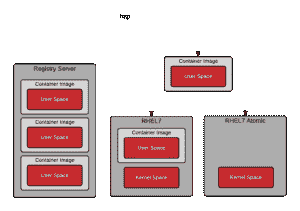
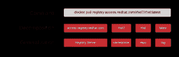
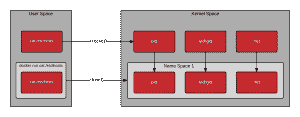
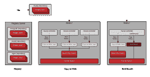

# 集装箱术语实用介绍

> 原文：<https://developers.redhat.com/blog/2018/02/22/container-terminology-practical-introduction>

您可能认为容器似乎是一个非常简单的概念，那么我为什么需要阅读容器术语呢？在我作为容器技术传播者的工作中，我遇到过误用容器术语的情况，这导致人们在掌握容器的道路上磕磕绊绊。像容器和图像这样的术语可以互换使用，但是有重要的概念差异。在容器的世界里，存储库有着与你所期望的不同的含义。此外，容器技术的前景不仅仅是 docker。如果没有很好地掌握术语，就很难理解 docker 和(pick your favorites，CRI-O，rkt，lxc/lxd)之间的主要区别，也很难理解开放容器倡议为标准化容器技术做了什么。

# 背景

开始使用 Linux 容器看似简单。安装像 docker 这样的容器引擎并运行您的第一个命令只需要几分钟。在接下来的几分钟内，您将构建您的第一个容器映像并共享它。接下来，您开始熟悉的构建类似生产的容器环境的过程，并且顿悟到有必要理解幕后的大量术语和技术。更糟糕的是，下面的许多术语可以互换使用……经常给新来者造成相当多的困惑。

*   集装箱
*   图像
*   容器图像
*   图像层
*   注册表
*   储存库
*   标签
*   基础图像
*   平台图像
*   层

理解这本技术词典中的术语将使你对底层技术有更深的理解。这将有助于您和您的团队使用相同的语言，并且还提供了关于如何为您的目标更好地构建您的容器环境的见解。作为一个行业和更广泛的社区，这种更深入的理解将使我们能够构建新的架构和解决方案。注意，这本技术词典假设读者已经理解了如何运行容器。如果你需要一本入门书，试着从 Red Hat 开发者博客上的开始。

## 容器 101

为了理解容器术语，准确理解容器是什么很重要——要有技术上的精确性。容器实际上是两个不同的东西。像普通的 Linux 程序一样，容器实际上有两种状态——静止和运行。静止时，容器是保存在磁盘上的一个文件(或一组文件)。这就是所谓的 [容器镜像](#h.dqlu6589ootw) 或 [容器库](#h.20722ydfjdj8) 。当你输入命令启动一个容器时， [容器引擎](#h.6yt1ex5wfo3l) 解包所需的[文件和元数据](https://docs.google.com/presentation/d/1OpsvPvA82HJjHN3Vm2oVrqca1FCfn0PAfxGZ2w_ZZgc/edit#slide=id.g2441f8cc8d_0_49)，然后将它们交给 Linux 内核。启动一个容器非常类似于启动一个普通的 Linux 进程，需要对 Linux 内核进行 API 调用。 这个 API 调用通常会启动额外的隔离，[会挂载容器映像中文件的副本](https://docs.google.com/presentation/d/1fC9cKR2-kFW5l-VEk0Z5_1vriYpROXOXM_5rhyVnBi4/edit#slide=id.g206624ca32_0_1209)。一旦运行，[容器](#h.j2uq93kgxe0e)只是一个 Linux 进程。启动容器的过程以及磁盘上的图像格式都是由标准定义和管理的。

有几种相互竞争的[容器图像](#h.dqlu6589ootw)格式( [Docker](https://github.com/docker/docker/blob/master/image/spec/v1.md) ，[Appc](https://coreos.com/rkt/docs/latest/app-container.html)，[LXD](https://insights.ubuntu.com/2016/04/01/lxd-2-0-image-management-512/))，但是行业正在以一种标准向前发展，该标准受 [开放容器倡议](https://www.opencontainers.org/faq#n22)——有时简称为开放容器或 OCI OCI 的范围包括 [容器映像格式规范](https://github.com/opencontainers/image-spec/blob/master/README.md) 、 ，其中 定义了容器映像的磁盘格式以及定义了诸如硬件架构和操作系统(Linux、Windows 等)的元数据。行业范围的容器映像格式使得软件生态系统能够繁荣发展——不同的个人贡献者、项目和供应商能够构建可互操作的映像和工具。用户希望在用于签名、扫描、构建、运行、移动和管理容器映像的 工具之间具有互操作性。

还有几款参赛的[集装箱发动机](#h.6yt1ex5wfo3l)包括[码头车](https://www.docker.com/)[CRI-O](http://cri-o.io/)[轨道车](https://github.com/oracle/railcar)[【RKT](https://github.com/coreos/rkt)[LXC](https://linuxcontainers.org/lxc/introduction/)。这些容器引擎获取一个[容器映像](#h.dqlu6589ootw)并将其转换成一个[容器](#h.j2uq93kgxe0e)(也称为运行流程)。这是如何发生的由 OCI 的 [范围决定，其中包括一个](https://www.opencontainers.org/about/oci-scope-table) [容器运行时规范](https://github.com/opencontainers/runtime-spec/blob/master/README.md) 和一个 [引用运行时实现](https://github.com/opencontainers/runc) 调用 [RunC](https://github.com/opencontainers/runc) 。这个参考实现是开源的，由社区开发模型管理，并且通常被许多容器引擎用来在创建容器时与主机内核通信。

针对 OCI [容器映像格式规范](https://github.com/opencontainers/image-spec/blob/master/README.md)和[容器运行时规范](https://github.com/opencontainers/runtime-spec/blob/master/README.md)的工具确保了容器平台、容器引擎和支持工具的广泛生态系统在云提供商和本地架构之间的可移植性。理解术语、容器标准和容器构建块的架构，将确保您可以与其他架构师交流，构建可伸缩的&可支持的容器化应用程序和环境，以便在未来几年高效地运行容器。

# 基本词汇

## 容器图像

亦见。

从最简单的定义来看，容器映像是一个从[注册服务器](#h.4cxnedx7tmvq)下载的文件，当启动[容器](#h.j2uq93kgxe0e)时，该文件在本地用作挂载点。容器社区经常使用“容器映像”,但是这种命名方式可能会很混乱。Docker，RKT，甚至 LXD，都是基于提取远程文件并作为容器运行的概念。每种技术都以不同的方式处理容器图像。LXD 拉一个单一的容器图像([单层](#h.epuvi2fkxbx2))，而 docker 和 RKT 使用基于 OCI 的图像，可以由多层组成。

从技术上讲，它比注册服务器上的单个文件要复杂得多。当人们使用术语“容器图像”时，他们通常意味着暗示[存储库](#h.20722ydfjdj8)，并且指多个容器[图像层](#h.epuvi2fkxbx2)的捆绑，以及提供关于层的额外信息的元数据。

容器图像的概念中隐含了一个[容器图像格式](#h.dgn6r69i32gs)的概念。

## 集装箱图像格式

见 [容器图像](#h.dqlu6589ootw) 和 [背景](#h.61a70hm1gl8x) 。

历史上，每个[容器引擎](#h.6yt1ex5wfo3l)都有其容器图像格式。LXD、RKT 和 Docker 都有自己的图像格式。有的是由一个[单层](#h.epuvi2fkxbx2)组成，有的则是由一堆层组成一个树形 结构 。今天，几乎所有主要的工具和引擎都已经转移到由[开放容器倡议(OCI)](https://www.opencontainers.org/faq#n22) 定义的格式。该图像格式定义了容器图像中的[层和元数据](https://docs.google.com/presentation/d/1OpsvPvA82HJjHN3Vm2oVrqca1FCfn0PAfxGZ2w_ZZgc/edit#slide=id.g2441f8cc8d_0_49)。实际上，OCI 图像格式定义了一个容器图像，由每一层的 tar 文件和一个带有元数据的 manifest.json 文件组成。

[开放容器倡议(OCI)](https://www.opencontainers.org/faq#n22) ，最初基于 [Docker V2 图像格式](https://blog.docker.com/2017/07/demystifying-open-container-initiative-oci-specifications/)，成功统一了容器引擎、云提供商和工具提供商(安全扫描、签名、构建和移动)的广泛生态系统。这将有助于保护用户，因为他们在知识和工具方面进行了投资。

## 集装箱发动机

参见[容器运行时间](#h.6yt1ex5wfo55)。

容器引擎是一种软件，它接受用户请求，包括命令行选项，提取图像，并从最终用户的角度运行容器。集装箱引擎有很多，包括 docker、RKT、CRI-O、LXD 等。此外，许多云提供商、平台即服务(PaaS)和容器平台都有自己的内置容器引擎，这些引擎使用符合 Docker 或 OCI 标准的 [容器映像](#h.dqlu6589ootw) 。拥有一个行业标准 [容器图像格式](#h.dgn6r69i32gs) 允许所有这些不同平台之间的互操作性。

再深入一层，大多数容器引擎实际上并不运行容器，它们依赖于 OCI 兼容的运行时，如 runc。通常，容器引擎负责:

*   处理用户输入
*   通过 API 处理通常来自[容器编排器](#h.6yt1ex5wfo66)的输入
*   从注册服务器中拉出 [容器图像](#h.dqlu6589ootw)
*   扩展使用图形驱动程序解压缩和扩展磁盘上的容器映像(块或文件，取决于驱动程序)
*   准备容器装载点，通常在写入时复制存储上(同样是数据块或文件，取决于驱动程序)
*   准备将被传递给容器[容器运行时](http://h.6yt1ex5wfo55)的元数据，以正确启动[容器](#h.j2uq93kgxe0e)
    *   使用容器映像中的一些默认值(例如。 [ArchX86](https://github.com/opencontainers/runc/blob/master/vendor/github.com/opencontainers/runtime-spec/specs-go/config.go)
    *   使用用户输入覆盖容器图像中的默认值(例如 CMD，入口点)
    *   使用容器映像指定的默认值(例如 [SECCOM](https://github.com/opencontainers/runc/blob/master/vendor/github.com/opencontainers/runtime-spec/specs-go/config.go) 规则)
*   调用容器运行时

如需更深入的了解，请参见[了解容器标准](https://docs.google.com/presentation/d/1OpsvPvA82HJjHN3Vm2oVrqca1FCfn0PAfxGZ2w_ZZgc/edit#slide=id.g2441f8cc8d_0_80)。参见[容器运行时间](#h.6yt1ex5wfo55)。

## 集装箱

容器在操作系统中已经存在很长时间了。一个容器是一个 [容器映像](#h.dqlu6589ootw) 的运行时实例化。容器是一个标准的 Linux 进程，通常通过一个 [clone()系统调用而不是 fork()或 exec()](http://rhelblog.redhat.com/2015/09/17/architecting-containers-part-2-why-the-user-space-matters-2/) 来创建。另外，容器通常通过使用[cgroups](https://en.wikipedia.org/wiki/Cgroups)， [， SELinux](https://en.wikipedia.org/wiki/Security-Enhanced_Linux) 或[AppArmor](https://en.wikipedia.org/wiki/AppArmor)来进一步隔离。

## 集装箱主机

容器主机是运行容器化流程的系统，通常简称为容器。例如，这可能是在虚拟机中运行的 [RHEL 原子主机](https://access.redhat.com/articles/rhel-atomic-getting-started)，作为公共云中的实例，或者在您的数据中心的裸机上运行。一旦容器映像(又名存储库)从[注册服务器](#h.4cxnedx7tmvq)被拉至本地容器主机，它就被称为在本地缓存中。

使用以下命令可以确定哪些存储库与本地缓存同步:

```
[root@rhel7 ~]# docker images -a

REPOSITORY                             TAG                     IMAGE ID                CREATED                 VIRTUAL SIZE
registry.access.redhat.com/rhel7   latest                  6883d5422f4e            3 weeks ago             201.7 MB
```

## 注册服务器

注册服务器本质上是一个奇特的文件服务器，用于存储 docker 存储库。通常，注册服务器被指定为一个普通的 DNS 名称和一个可选的要连接的端口号。docker 生态系统的大部分价值来自于从注册服务器推送和提取存储库的能力。

[](https://rhelblog.files.wordpress.com/2017/01/image01.png)

当 docker 守护程序没有存储库的本地缓存副本时，它会自动从注册服务器中获取副本。大多数 Linux 发行版都将 docker 守护进程配置为从 docker.io 获取，但是在一些 Linux 发行版上它是可配置的。例如，Red Hat Enterprise Linux 被配置为首先从 registry.access.redhat.com 获取存储库，然后它将尝试 docker.io (Docker Hub)。

需要强调的是，注册管理机构服务器中存在隐含的信任。您必须确定您对注册表提供的内容的信任程度，并且您可能希望允许或阻止某些注册表。除了安全性之外，还存在其他问题，例如用户访问授权软件和合规性问题。docker 允许用户下载软件的简单性使得你信任上游内容变得至关重要。

在 Red Hat Enterprise Linux 中，默认的 docker 注册表是可配置的。通过 [修改配置](http://rhelblog.redhat.com/2015/04/15/understanding-the-changes-to-docker-search-and-docker-pull-in-red-hat-enterprise-linux-7-1/) 文件:可以在 RHEL7 和 RHEL7 Atomic 中添加或阻止特定的注册服务器

```
vi /etc/sysconfig/docker
```

在 RHEL7 和 RHEL 7 Atomic 中，红帽的注册服务器是开箱即用的:

```
ADD_REGISTRY='--add-registry registry.access.redhat.com'
```

出于安全考虑，屏蔽 DockerHub: 等公共 docker 库可能是有用的

```
# BLOCK_REGISTRY='--block-registry' 
```

红帽还提供了与 [OpenShift 容器平台](https://docs.openshift.com/container-platform/3.7/install_config/registry/index.html)的集成注册服务器，与 [Quay Enterprise](https://quay.io/plans/?tab=enterprise) 的独立企业注册服务器，以及在 [Quay.io](https://quay.io/plans/) 上基于云的公共和私有存储库。

## 容器编排

通常团队从安装一个[容器主机](#h.8tyd9p17othl)开始，然后提取一些[容器映像](#h.dqlu6589ootw)。然后，他们继续构建一些新的[容器映像](#h.dqlu6589ootw)，并将它们推送到[注册服务器](#h.6yt1ex5wfo3l)与团队中的其他人共享。过了一段时间，他们希望将几个容器连接在一起，作为一个单元进行部署。最后，在某个时候，他们希望将该单元推进到通向生产的管道(开发/质量保证/生产)中。这是实现需要编排的途径。

容器编排器实际上做两件事:

1.  动态调度计算机集群中的容器工作负载。这通常被称为分布式计算。
2.  提供标准化的应用程序定义文件(kube yaml、docker compose 等)

以上两个特性提供了许多功能:

1.  允许应用程序中的容器被完全独立地调度。这在以下情况下很有用:
    *   允许利用大型[容器主机集群](#h.8tyd9p17othl)
    *   单个容器失败(进程挂起，内存不足(OOM))
    *   [容器主机](#h.8tyd9p17othl)出现故障(磁盘、网络、重启)
    *   [容器引擎](#h.6yt1ex5wfo3l)失败(损坏，重启)
    *   单个容器需要放大或缩小
2.  很容易将同一应用程序的新实例部署到新环境中。在云原生世界或传统世界中，您可能希望这样做的原因有很多，包括:
    *   在运行容器编制器的开发人员笔记本电脑上
    *   在私有命名空间中的共享开发环境上
    *   在内部公共名称空间中的共享开发环境中进行可见性和测试
    *   内部质量保证(QA)环境
    *   在云中动态供应和取消供应的负载测试环境中
    *   在黄金环境中测试与生产的兼容性
    *   在生产环境中
    *   在灾难恢复环境中
    *   在升级了[容器主机](#h.8tyd9p17othl)、[容器引擎](#h.6yt1ex5wfo3l)或容器编排器的新生产环境中
    *   在新的生产环境中，在新的地理位置(APAC、EMEA 等)使用相同版本的[容器主机](#h.8tyd9p17othl)、[容器引擎](#h.6yt1ex5wfo3l)和容器编制器

社区和供应商正在开发许多容器调度程序。历史上， [Swarm](https://docs.docker.com/engine/swarm/) 、 [Mesos](http://mesos.apache.org/) 和 [Kubernetes](https://kubernetes.io/) 是三大巨头，但最近甚至 [Docker](https://www.docker.com/) 和 [Mesosphere](https://mesosphere.com/) 都宣布支持 Kubernetes——几乎每一个[主要云服务提供商](https://kubernetes.io/partners/#kcsp)也是如此。Kubernetes 已经成为容器编排的事实上的标准，类似于之前的 Linux。如果您正在考虑容器编排，Red Hat 推荐我们名为 [OpenShift](https://www.openshift.com/) 的企业发行版。

# 高级词汇

## 容器运行时间

容器运行时是一个较低层次的组件，通常用于[容器引擎](#h.6yt1ex5wfo3l)中，但也可以手动用于测试。[开放容器倡议(OCI)](https://www.opencontainers.org/faq#faq1) 运行时标准参考实现是 [runc](https://github.com/opencontainers/runc) 。这是使用最广泛的容器运行时，但也有其他 OCI 兼容的运行时，如 [crun](https://github.com/giuseppe/crun) 、[轨道车](https://github.com/oracle/railcar)和 [katacontainers](https://katacontainers.io/) 。Docker、CRI-O 和许多其他[容器引擎](#h.6yt1ex5wfo3l)依赖于 [runc](https://github.com/opencontainers/runc) 。

容器运行时负责:

*   使用由[容器引擎](#h.6yt1ex5wfo3l) e 提供的容器挂载点(也可以是用于测试的普通目录)
*   消费由[容器引擎](#h.6yt1ex5wfo3l)提供的容器元数据(也可以是手工制作的用于测试的 config.json)
*   与内核通信以启动容器化的进程(克隆系统调用)
*   设置组
*   设置 SELinux 策略
*   设置应用装甲规则

提供一点历史，当 Docker 引擎第一次被创建时，它依赖 LXC 作为容器运行时。后来，Docker 团队开发了自己的名为 libcontainer 的库来启动容器。这个库是用 Golang 编写的，并被编译成最初的 Docker 引擎。最后，在创建 OCI 时，Docker 贡献了 libcontainer 代码，并将其转化为一个名为 runc 的独立实用程序。现在，runc 是参考实现，由 CRI-O 等其他[容器引擎](#h.6yt1ex5wfo3l)使用。在最低级别，它提供了一致启动容器的能力，而不管容器引擎是什么。Runc 是一个非常简洁的实用程序，它需要一个挂载点(目录)和元数据(config.json)。更多关于 [runc](https://github.com/opencontainers/runc/blob/master/README.md) 的内容请看这个教程。

如需更深入的了解，请参见[了解容器标准](https://docs.google.com/presentation/d/1OpsvPvA82HJjHN3Vm2oVrqca1FCfn0PAfxGZ2w_ZZgc/edit#slide=id.g2441f8cc8d_0_80)。参见[容器运行时间](#h.6yt1ex5wfo55)。

## 图像层

存储库通常被称为映像或容器映像，但实际上它们是由一层或多层组成的。存储库中的影像图层以父子关系连接在一起。每个图像层代表其自身和父层之间的变化。

下面，我们将检查本地容器主机上存储库的各层。 自从[Docker 1.7 之后，就没有本地工具来检查本地存储库中的图像层](https://github.com/docker/docker/pull/5001) (有用于在线注册的工具)。借助名为 [Dockviz](https://github.com/justone/dockviz) 的工具，你可以快速检查所有图层。注意，每一层都有标签和一个[【UUID】](https://en.wikipedia.org/wiki/Universally_unique_identifier)。以下命令将返回 UUID 的缩短版本，这些版本通常是唯一的，足以在单台计算机上使用。如果需要完整的 UUID，请使用- no-trunc 选项。

```
docker run --rm --privileged -v /var/run/docker.sock:/var/run/docker.sock nate/dockviz images -t

├─2332d8973c93 Virtual Size: 187.7 MB
 │ └─ea358092da77 Virtual Size: 187.9 MB
 │   └─a467a7c6794f Virtual Size: 187.9 MB
 │         └─ca4d7b1b9a51 Virtual Size: 187.9 MB
 │           └─4084976dd96d Virtual Size: 384.2 MB
 │             └─943128b20e28 Virtual Size: 386.7 MB
 │               └─db20cc018f56 Virtual Size: 386.7 MB
 │                 └─45b3c59b9130 Virtual Size: 398.2 MB
 │                   └─91275de1a5d7 Virtual Size: 422.8 MB
 │                     └─e7a97058d51f Virtual Size: 422.8 MB
 │                       └─d5c963edfcb2 Virtual Size: 422.8 MB
 │                         └─5cfc0ce98e02 Virtual Size: 422.8 MB
 │                           └─7728f71a4bcd Virtual Size: 422.8 MB
 │                             └─0542f67da01b Virtual Size: 422.8 MB Tags: docker.io/registry:latest
```

注意,“docker.io/registry”存储库实际上由许多图像层组成。更重要的是，请注意，用户可能会基于这些层中的任何一层来“运行”容器。下面的命令完全有效，尽管不能保证已经过测试或者实际上能够正确工作。通常，图像构建器会标记(创建名称)您应该使用的特定图层:

```
docker run -it 45b3c59b9130 bash
```

储存库以这种方式构建，因为每当图像构建器创建新图像时，差异被保存为一个层。在存储库中创建新层有两种主要方式。首先，如果 [手动构建一个图像](https://developers.redhat.com/blog/2014/05/15/practical-introduction-to-docker-containers/#manualcommit) ，每次“提交”都会创建一个新层。如果图像构建器是[用 Dockerfile](https://developers.redhat.com/blog/2014/05/15/practical-introduction-to-docker-containers/#dockerfilecommit) 构建图像，文件中的每个指令都会创建一个新层。了解每一层之间的容器存储库中发生了什么变化是非常有用的。

## 标签

即使用户可以指定容器从存储库中的任何层挂载和启动，他们也不一定要这样做。当影像构建者创建新的存储库时，他们通常会标注要使用的最佳影像图层。这些被称为标签，是容器图像构建者与容器图像消费者交流哪些层最适合消费的工具。通常，标签用于指定存储库中软件的版本。这仅仅是约定俗成的——实际上，OCI 或任何其他标准都没有规定标签可以用于什么，它们可以被滥用于用户想要的任何东西。这样做时要小心，因为它会在开发、运营和架构团队中造成许多混乱，所以如果您将它用于软件版本之外的任何事情，请将它记录下来。

有一个特殊的标签——latest——它通常指向存储库中包含软件最新版本的层。这个特殊的标签仍然只是指向一个图像层，就像任何其他标签一样，所以它可能会被滥用。

要远程查看存储库中可用的标签，运行下面的命令( [jq 实用程序](https://stedolan.github.io/jq/) 使输出更具可读性):

```
curl -s registry.access.redhat.com/v1/repositories/rhel7/tags | jq
 {
 "7.0-21": "e1f5733f050b2488a17b7630cb038bfbea8b7bdfa9bdfb99e63a33117e28d02f",
 "7.0-23": "bef54b8f8a2fdd221734f1da404d4c0a7d07ee9169b1443a338ab54236c8c91a",
 "7.0-27": "8e6704f39a3d4a0c82ec7262ad683a9d1d9a281e3c1ebbb64c045b9af39b3940",
 "7.1-11": "d0a516b529ab1adda28429cae5985cab9db93bfd8d301b3a94d22299af72914b",
 "7.1-12": "275be1d3d0709a06ff1ae38d0d5402bc8f0eeac44812e5ec1df4a9e99214eb9a",
 "7.1-16": "82ad5fa11820c2889c60f7f748d67aab04400700c581843db0d1e68735327443",
 "7.1-24": "c4f590bbcbe329a77c00fea33a3a960063072041489012061ec3a134baba50d6",
 "7.1-4": "10acc31def5d6f249b548e01e8ffbaccfd61af0240c17315a7ad393d022c5ca2",
 "7.1-6": "65de4a13fc7cf28b4376e65efa31c5c3805e18da4eb01ad0c8b8801f4a10bc16",
 "7.1-9": "e3c92c6cff3543d19d0c9a24c72cd3840f8ba3ee00357f997b786e8939efef2f",
 "7.2": "6c3a84d798dc449313787502060b6d5b4694d7527d64a7c99ba199e3b2df834e",
 "7.2-2": "58958c7fafb7e1a71650bc7bdbb9f5fd634f3545b00ec7d390b2075db511327d",
 "7.2-35": "6883d5422f4ec2810e1312c0e3e5a902142e2a8185cd3a1124b459a7c38dc55b",
 "7.2-38": "6c3a84d798dc449313787502060b6d5b4694d7527d64a7c99ba199e3b2df834e",
 "latest": "6c3a84d798dc449313787502060b6d5b4694d7527d64a7c99ba199e3b2df834e"
 }
```

## 储存库

使用 docker 命令时，存储库是命令行上指定的内容，而不是图像。在以下命令中，“rhel7”是存储库。

```
docker pull rhel7
```

这实际上是自动展开为:

```
docker pull registry.access.redhat.com/rhel7:latest
```

这可能会引起混淆，许多人将其称为图像或容器图像。事实上，docker images 子命令用于列出本地可用的存储库。从概念上讲，这些存储库可以被认为是容器映像，但是重要的是要认识到这些存储库实际上是由层组成的，并且在一个称为 manifest (manifest.json)的文件中包含元数据:

```
docker images

REPOSITORY                                  TAG                     IMAGE ID                CREATED                 VIRTUAL SIZE
 registry.access.redhat.com/rhel7            latest                  6883d5422f4e            4 weeks ago             201.7 MB
 registry.access.redhat.com/rhel             latest                  6883d5422f4e            4 weeks ago             201.7 MB
 registry.access.redhat.com/rhel6            latest                  05c3d56ba777            4 weeks ago             166.1 MB
 registry.access.redhat.com/rhel6/rhel       latest                  05c3d56ba777            4 weeks ago             166.1 MB
 ...
```

当我们在命令行上指定存储库时，[容器引擎](#h.6yt1ex5wfo3l)会为你做一些额外的工作。在这种情况下，docker 守护进程(不是客户机工具)配置了一个要搜索的服务器列表。在上面的例子中，守护进程将在每个已配置的服务器上搜索“rhel7”存储库。

在上面的命令中，只指定了存储库名称，但是也可以使用 docker 客户端指定完整的 URL。为了突出这一点，让我们从剖析一个完整的 URL 开始。



另一种你会经常看到的指定方式是:

```
REGISTRY/NAMESPACE/REPOSITORY[:TAG]
```

完整的 URL 由一个标准的服务器名、一个名称空间和一个可选的标签组成。实际上，如何指定一个 URL 有许多排列，当你探索 docker 生态系统时，你会发现许多部分是可选的。以下命令都是有效的，并且都拉同一个库的一些排列:

```
 docker pull registry.access.redhat.com/rhel7/rhel:latest
 docker pull registry.access.redhat.com/rhel7/rhel
 docker pull registry.access.redhat.com/rhel7
 docker pull rhel7/rhel:latest
```

## 命名空间

名称空间是一种工具，用于分隔存储库组。在 public [DockerHub](https://hub.docker.com/) 上，名称空间通常是共享图像的人的用户名，但也可以是组名或逻辑名。

Red Hat 使用名称空间根据[Red Hat Federated Registry](https://www.redhat.com/en/about/press-releases/red-hat-announces-pathway-enterprise-ready-linux-containers)服务器上列出的产品来分隔存储库组。以下是 registry.access.redhat.com 返回的一些示例结果。注意，最后一个结果实际上是在另一个注册服务器上列出的。这是因为 Red Hat 还列出了我们合作伙伴的注册服务器上的存储库:

```
registry.access.redhat.com/rhel7/rhel
registry.access.redhat.com/openshift3/mongodb-24-rhel7
registry.access.redhat.com/rhscl/mongodb-26-rhel7
registry.access.redhat.com/rhscl_beta/mongodb-26-rhel7
registry-mariadbcorp.rhcloud.com/rhel7/mariadb-enterprise-server:10.0
```

注意，有时不需要指定完整的 URL。在这种情况下，给定的名称空间有一个默认的存储库。如果用户只指定了 fedora 名称空间，那么来自默认存储库的最新标记将被拉至本地服务器。因此，运行下面的命令本质上是相同的，每一个都更加具体:

```
docker pull fedora
docker pull docker.io/fedora
docker pull docker.io/library/fedora:latest
```

## 内核命名空间

一个[内核名称空间](https://en.wikipedia.org/wiki/Linux_namespaces)与我们在讨论[仓库](#h.20722ydfjdj8)和[注册服务器](#h.4cxnedx7tmvq)时所指的名称空间完全不同。当讨论容器时，内核名称空间可能是最重要的数据结构，因为它们支持我们今天所知道的容器。内核名称空间允许每个容器拥有自己的挂载点、网络接口、用户标识符、进程标识符等。

当您在 Bash 终端中键入命令并按回车键时，Bash 会向内核发出请求，使用某个版本的 [exec()](http://man7.org/linux/man-pages/man3/exec.3.html) 系统调用创建一个普通的 Linux 进程。容器很特殊，因为当你向 docker 这样的容器引擎发送请求时，docker 守护进程会向内核发出请求，使用一个不同的系统调用 [clone()](http://man7.org/linux/man-pages/man2/clone.2.html) 创建一个容器化的进程。这个 [clone()](http://man7.org/linux/man-pages/man2/clone.2.html) 系统调用很特别，因为它可以创建一个拥有自己的虚拟挂载点、进程 id、用户 id、网络接口、主机名等的进程

虽然从技术上来说，Linux 中没有表示容器的单一数据结构，但是内核名称空间和 [clone()](http://man7.org/linux/man-pages/man2/clone.2.html) 系统调用是最接近的。【T2



## 图形驱动

当最终用户指定要运行的容器图像的[标签](#h.mc246mlp25y6)-默认情况下，这是最新的[标签](#h.mc246mlp25y6) -图形驱动程序解包所有必要的依赖[图像层](#h.epuvi2fkxbx2)，以构建所选[标签](#h.mc246mlp25y6)中的数据。 是将[储存库](#h.20722ydfjdj8)中必要的图像图层映射到一个本地存储的软件。可以使用 Overlay2 之类的驱动程序将容器图像层映射到目录中，或者使用 Device Mapper 之类的驱动程序将其映射到块存储中。驱动程序包括:aufs、devicemapper、btrfs、zfs 和 overlayfs。

当容器启动时，图像层以只读方式装载在内核名称空间中。来自[库](#h.20722ydfjdj8)的[图像层](#h.epuvi2fkxbx2)总是以只读方式装载*，但默认情况下，还会设置一个单独的写入时复制层。这允许容器化的流程在容器中写入数据。写入数据时，数据存储在底层主机上的写入时拷贝层中。这个写时复制层可以通过运行带有选项的容器来禁用，例如 *- readonly* 。*

docker 守护进程有它自己的一套图形驱动程序，还有其他开源库提供图形驱动程序，如[容器/图像](https://github.com/containers/storage)，它用于像 [CRI-O](https://github.com/kubernetes-incubator/cri-o) 、 [Skopeo](https://github.com/projectatomic/skopeo) 和其他容器引擎这样的工具中。



使用 docker info 命令可以确定你正在使用的图形驱动:

```
[root@rhel7 ~]# docker info

...
 Storage Driver: devicemapper
 Pool Name: docker-253:1-884266-pool
 Pool Blocksize: 65.54 kB
 Backing Filesystem: xfs
 Data file: /dev/loop0
 Metadata file: /dev/loop1
 Data Space Used: 3.037 GB
 Data Space Total: 107.4 GB
 Data Space Available: 2.56 GB
 Metadata Space Used: 2.707 MB
 Metadata Space Total: 2.147 GB
 Metadata Space Available: 2.145 GB
 Udev Sync Supported: true
 Deferred Removal Enabled: false
 Data loop file: /var/lib/docker/devicemapper/devicemapper/data
 Metadata loop file: /var/lib/docker/devicemapper/devicemapper/metadata
 Library Version: 1.02.107-RHEL7 (2015-10-14)
```

# 容器T2【用例

有多种类型的 [容器](https://www.google.com/url?q=https://rhelblog.wordpress.com/wp-admin/post.php?post%3D2813%26action%3Dedit%23h.j2uq93kgxe0e&sa=D&ust=1506025300441000&usg=AFQjCNHBBfZQGCIs8mcL8VJeRcEtMR9Vmg) 图案图案成型。因为容器是容器映像的运行时版本，所以它的构建方式与运行方式紧密相关。

一些 [容器映像](https://www.google.com/url?q=https://rhelblog.wordpress.com/wp-admin/post.php?post%3D2813%26action%3Dedit%23h.dqlu6589ootw&sa=D&ust=1506025300441000&usg=AFQjCNHiJUkk9qUkWjXlxF_G4GbENDavtA) 被设计为在没有特权的情况下运行，而另一些则更加专门化，需要类似 root 的特权。 有许多维度可以用来评估模式，用户经常会看到多个模式或用例在一个容器映像/容器中一起处理。

本节将深入探讨用户处理容器的一些常见用例。

## 应用容器

应用程序容器是最流行的容器形式。这些是开发者和应用程序所有者关心的问题。应用程序容器包含开发人员处理的代码。它们还包括 MySQL、Apache、MongoDB 和 or Node.js 等

那里 正在形成一个巨大的应用容器生态系统。像软件集合这样的项目正在提供安全和可支持的应用程序容器映像，用于 Red Hat Enterprise Linux。与此同时，Red Hat 社区成员正在开发一些优秀的前沿应用程序容器。

Red Hat 认为应用程序容器通常不需要特殊权限来运行它们的工作负载。也就是说，生产容器环境通常不仅仅需要非特权应用程序容器来提供其他支持服务。

## 操作系统容器

参见[系统容器](http://h.ufrqcl5t9y2i)

操作系统容器是被视为更像完整虚拟操作系统的容器。操作系统容器仍然共享一个主机内核，但是运行一个完整的 init 系统，这允许它们容易地运行多个进程。LXC 和 LXD 是操作系统容器的例子，因为它们被视为完全的虚拟机。

也可以用基于 docker/OCI 的容器来近似操作系统容器，但是需要在容器内部运行 systemd。这允许终端用户像他们通常会做的那样安装软件，并且更像对待完整的操作系统一样对待容器。

```
yum install mysql
```

```
systemctl enable mysql
```

这使得现有应用程序的迁移更加容易。Red Hat 正在努力使操作系统容器变得更容易，它使 systemd 能够在容器中运行，并使 machined 能够管理。虽然许多客户(还)没有准备好采用微服务，但是他们仍然可以从采用基于图像的容器作为软件交付模型中获益。

## Pet 容器

虽然 Red Hat 肯定会推荐、支持和宣传使用[云原生模式](https://www.redhat.com/en/explore/cloud-native-apps)来开发新的应用程序，但实际上并不是所有现有的应用程序都会被重写以利用新的模式。许多现有的应用程序都是独一无二的，而独一无二的应用程序通常被称为[宠物](https://rhelblog.redhat.com/2016/02/08/container-tidbits-does-the-pets-vs-cattle-analogy-still-apply/)。专门为处理这些宠物应用而建造的容器有时被称为[宠物容器](https://rhelblog.redhat.com/2016/09/01/in-defense-of-the-pet-container-part-3-puppies-kittens-and-containers/)

Pet 容器为用户提供了依赖于注册服务器、容器映像和用于基础设施的标准容器主机的标准化容器基础设施的便携性和便利性，但是在容器内提供了传统环境的灵活性。这个想法是为了使现有应用程序的容器化变得更容易，比如在容器中使用 systemd。目标是重用现有的自动化、安装程序和工具来轻松创建一个可以运行的容器映像。

## 超级特权集装箱

当在专用容器主机(如 Red Hat Enterprise Linux Atomic Host)上构建容器基础设施时，系统管理员仍然需要执行管理任务。无论是用于分布式系统，如 Kubernetes 或 OpenShift，还是独立的容器主机， [【超级特权容器(SPC)](https://www.google.com/url?q=https://developers.redhat.com/blog/2014/11/06/introducing-a-super-privileged-container-concept/&sa=D&ust=1506025300448000&usg=AFQjCNECN4PUbIfhkUKQLqnQZvYQQCwMPQ) 都是一个强大的工具。SPCs 甚至可以加载专门的内核模块，比如使用 systemtap。

在为运行容器而构建的基础架构中，管理员很可能需要 SPC 来执行监控、备份等任务。认识到 SPCs 和主机内核之间通常有更紧密的耦合是很重要的，因此管理员需要选择一个坚如磐石的容器主机，并在其上实现标准化，尤其是在大型集群/分布式环境中，那里的问题更难解决。然后，他们需要在 SPC 中选择一个与主机内核兼容的用户空间。

## 工具&操作系统软件

Linux 发行版一直为用户提供系统软件，如 Rsyslogd、SSSD、sadc 等。历史上，这些系统软件是通过 RPM 或 DEB 包安装的。但是随着容器作为一种打包格式的出现，通过容器映像安装系统软件变得既方便又容易。Red Hat 为 Red Hat 虚拟化工具、rsyslog、sssd 和 sadc 等提供了一些预打包的容器。

# 集装箱架构

随着越来越多的人用容器交付软件，新的 设计模式 正在形成。Red Hat engineering 正在利用和推动社区中的许多模式。本节的目标是帮助突出和定义其中的一些模式。

容器在磁盘上的保存方式(即其图像格式)会对其运行方式产生巨大影响。例如，一个被设计来运行 sssd 的容器在运行时需要有特殊的特权，否则它就不能完成它的工作。下面是容器社区中正在形成的模式的简短列表:

## 应用图像

这些图片是最终用户所消费的。用例范围从数据库和 web 服务器到应用程序和服务总线。这些可以在内部构建，也可以由 ISV 交付给客户。最终用户通常会调查并关心使用了哪些位来创建独立映像。独立映像是最容易使用的一种映像，但是最难设计、构建和修补。

## 基础图像

基本图像是最简单的图像类型之一，但是你会发现很多定义。有时，用户会将公司标准构建，甚至是应用程序映像称为“基础映像”从技术上讲，这不是一个基础图像。这些是中间图像。

简单地说，基础图像是没有父层的图像。通常，基本映像包含操作系统的新副本。基本映像通常包括安装包/随着时间的推移对映像进行更新所必需的工具(yum、rpm、apt-get、dnf、[【microdnf】](https://www.google.com/url?q=https://github.com/rpm-software-management/microdnf&sa=D&ust=1506025300450000&usg=AFQjCNHSjUmJW3vk82k_66ZcVoTOI_oA_g))。虽然基本映像可以“手工制作”，但实际上它们通常是由开源项目(如 Debian、Fedora 或 CentOS)和供应商(如 Red Hat)制作和发布的。基本图像的来源对于安全性至关重要。简而言之，基础映像的唯一目的是为创建衍生映像提供一个起点。当使用 dockerfile 文件时，选择使用哪个基本图像是显而易见的:

```
FROM registry.access.redhat.com/rhel7-atomic
```

## 构建器图像

这些是容器映像一种特殊形式，它们产生应用程序容器映像作为后代。除了开发者的源代码，它们什么都包括。构建器映像包括操作系统库、语言运行时、中间件，以及 [源到映像](https://www.google.com/url?q=https://github.com/openshift/source-to-image&sa=D&ust=1506025300451000&usg=AFQjCNHEJPtVf9RKO6KHAnnPxywSrHWZeg) 工具。

运行构建器映像时，它会注入开发人员的源代码，并生成一个随时可以运行的子应用程序容器映像。这个新创建的应用程序容器映像可以在开发或生产中运行。

例如，如果一个开发人员有 PHP 代码，他们想在一个容器中运行它，他们可以使用 PHP 构建器映像来生成一个准备运行的应用程序容器映像。开发人员传递存储代码的 GitHub URL，构建器映像为他们完成剩下的工作。构建器容器的输出是一个应用程序容器映像，其中包括 Red Hat Enterprise Linux、软件集合中的 PHP 和开发人员的代码，所有这些都准备好运行。

构建器映像提供了一种强大的方法，可以快速轻松地从代码到容器，构建可信的组件。

## 集装箱化组件

容器是作为一个更大的软件系统的一部分来部署的，而不是独立的。两大趋势推动了这一趋势。

首先，微服务推动了同类最佳组件的使用——这也推动了更多组件的组合使用，以构建单一应用。容器化组件满足了更快、更容易地部署越来越多的复杂软件的需求。这些组件中的每一个都可以有不同的修订，容器映像有助于实现这一点。Kubernetes/open shift[deployments YAML/JSON](https://kubernetes.io/docs/concepts/workloads/controllers/deployment/)、 [open service broker](https://www.openservicebrokerapi.org/) 、 [OpenShift 模板](https://docs.openshift.org/latest/dev_guide/templates.html)和 [Helm Charts](https://helm.sh/) 等应用程序定义都使得在更高层次上定义应用程序成为可能。

第二，并不是所有的软件都容易作为容器部署。有时，只对某些 组件进行容器化是有意义的，这些组件更容易移动到容器中或者为整个项目提供更多的价值。对于多服务应用程序，一些服务可以部署为容器，而其他服务可以通过传统的 部署，如 RPM 或安装程序脚本等传统方法——参见 [Pet 容器](http://h.def2e0bag2rr)。但是，其他组件可能很难放入容器中，因为它们耦合得太紧密而不能分解，需要访问特殊的硬件，或者可能需要较低级别的内核 API，等等。在一个较大的应用程序中，可能会有部分应用程序可以容器化，而部分不能。容器化的组件表示能够并且已经被容器化的部分。容器化组件旨在作为特定应用程序的一部分运行，而不是独立运行。重要的是要理解容器化的组件并不是为了独立运行而设计的。他们为一个更大的软件提供价值，但是他们自己提供的价值很少。

例如，OpenShift Enterprise 3.0 发布时，大部分核心代码都是使用 RPMs 部署的，但安装后管理员将路由器和注册表部署为容器。随着 OpenShift 3.1 的发布，安装程序中增加了一个选项，将 master、node、openvswitch 和 etcd 组件部署为容器——安装后，管理员可以选择将 elasticsearch、fluentd 和 kibana 部署为容器。

虽然 OpenShift 安装程序 仍然可以对服务器的文件系统进行修改，但是所有主要的软件组件现在都可以使用容器镜像进行安装。例如，使这些容器化组件成为可能的是，内置于 OpenShift 中的 etcd 映像实例不应该也永远不会用于为面向客户的应用程序代码存储数据，因为它是一个容器化组件，旨在作为 OpenShift 容器平台的一部分运行。

随着 OpenShift 的最新发布，有越来越多的容器化组件的趋势。容器化组件模式变得越来越普遍，其他软件供应商看到了作为容器化组件进行部署的优势。

## 部署者图像

部署者映像是一种特殊的容器，当运行时，它部署或管理其他容器。该模式支持复杂的部署技术，比如规定容器的启动顺序，或者首次运行逻辑，比如填充模式或数据。

举个例子， 【图像/容器类型】模式 用于部署 OpenShift 中的日志和度量。使用部署器容器部署这些组件允许 OpenShift 工程团队控制不同组件的启动顺序，并确保它们都启动并一起运行。

## 中间 画面

中间图像是依赖于基础图像的任何容器图像。通常，核心构建、中间件和语言运行时构建为基础映像“之上”的层。然后在另一个图像的 FROM 指令中引用这些图像。这些映像并不单独使用，它们通常用作构建独立映像的构建块。

不同的专家团队拥有不同层次的图像是很常见的。系统管理员可能拥有核心构建层，而“开发人员经验”可能拥有中间件层。中间映像是为构建映像的其他团队使用而构建的，但有时也可以独立运行，尤其是为了测试。

## 联运集装箱图像

联运集装箱图像，类似于[联运海运集装箱](http://www.worldshipping.org/about-the-industry/history-of-containerization/the-birth-of-intermodalism)，是具有混合架构的图像。例如，许多红帽软件收藏的图片 有两种用途。首先，它们可以作为简单的应用程序容器，运行完全包含的 Ruby on Rails 和 Apache 服务器。 其次，它们可以作为 OpenShift 容器平台内部的构建器映像。在这种情况下，包含 Ruby on Rails、Apache 和应用程序代码的输出子映像是在构建阶段由 [源到映像](https://www.google.com/url?q=https://github.com/openshift/source-to-image&sa=D&ust=1506025300456000&usg=AFQjCNH6mW7P-0kgsW6TQjIc6fJZXlPY1Q) 过程指向的。

[联运](http://www.worldshipping.org/about-the-industry/history-of-containerization/the-birth-of-intermodalism)模式变得越来越普遍，用一个集装箱图像解决两个业务问题。

## 系统容器

系统软件作为容器分发时，往往需要运行超级特权。为了使这种部署更容易，并允许这些容器在容器运行时或[编排](#h.6yt1ex5wfo66)之前启动，Red Hat 开发了一种特殊的容器模式，称为 [系统容器](https://www.google.com/url?q=https://access.redhat.com/documentation/en-us/red_hat_enterprise_linux_atomic_host/7/html/managing_containers/running_system_containers&sa=D&ust=1506025300457000&usg=AFQjCNFdTAbrZJF0RVxRSjhXa_pJD-I4ZA) 。系统容器在引导过程的早期启动，并依赖原子命令和 systemd 独立于任何容器运行时或[编排](#h.6yt1ex5wfo66)来启动。Red Hat 为许多软件提供了系统容器，包括 rsyslog、cockpit、etcd 和 flanneld。未来，红帽还会扩大名单。

这种设计模式将使管理员更容易以模块化的方式将这些服务添加到 Red Hat Enterprise Linux 和 Atomic Host 中。

# 结论

容器非常容易使用，但是当构建生产容器环境时，它将复杂性转移到了幕后。为了能够讨论架构，以及您将如何构建您的环境，拥有共享的术语是很重要的。当您更深入地构建和架构您的环境时，会有很多陷阱。我们留给你几个关键的问题来记住。

人们经常互换使用容器映像和存储库这两个词，docker 子命令并没有区分映像和存储库。这些命令非常容易使用，但是一旦架构讨论开始，理解存储库实际上是中心数据结构是很重要的。

也很容易误解名称空间、存储库、图像层和标签之间的区别。每一个都有一个建筑目的。虽然不同的供应商和用户出于不同的目的使用它们，但它们是我们工具箱中的工具。


本文的目标是让您能够掌握这一术语，以便创建更复杂的架构。例如，假设您刚刚负责构建一个基础架构，该基础架构基于角色限制哪些名称空间、存储库，甚至哪些图像层和标签可以基于业务规则进行推送和提取。最后，请记住，容器映像的构建方式将对它的运行方式产生深远的影响([编排](#h.6yt1ex5wfo66)，特权，等等)。

如需进一步阅读，请查看架构容器系列:

*   [设计容器第 1 部分:为什么理解用户空间和内核空间很重要](https://rhelblog.redhat.com/2015/07/29/architecting-containers-part-1-user-space-vs-kernel-space/)
*   [设计容器第二部分:为什么用户空间很重要](https://rhelblog.redhat.com/2015/09/17/architecting-containers-part-2-why-the-user-space-matters-2/)
*   [设计容器第 3 部分:用户空间如何影响你的应用](https://rhelblog.redhat.com/2015/11/10/architecting-containers-part-3-how-the-user-space-affects-your-application/)

一如既往，如果您有任何意见或问题，请在下方留言。

*Last updated: December 6, 2021*