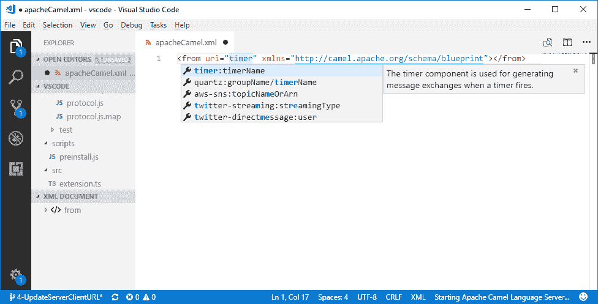
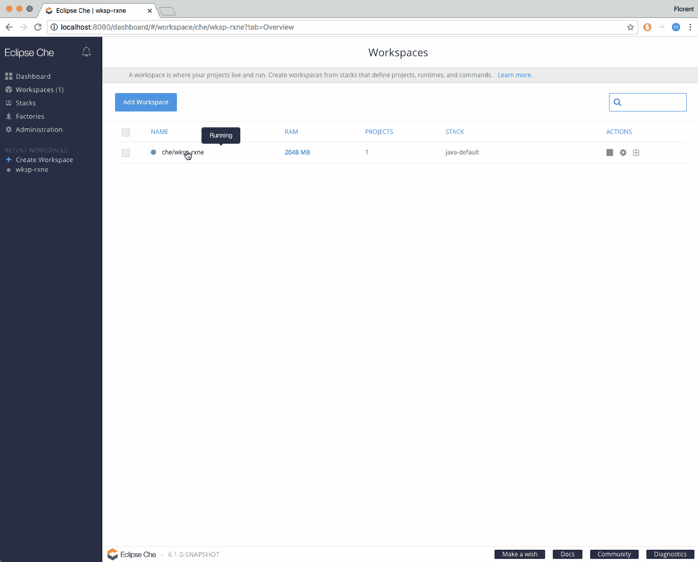

# VS 代码 XML 编辑器和 Eclipse Che 中的 Apache Camel URI 完成

> 原文：<https://developers.redhat.com/blog/2018/02/15/apache-camel-uri-completion>

[Apache Camel](http://camel.apache.org/) 使您能够用各种特定于领域的语言定义路由和中介规则，包括基于 Java 的 [Fluent API](http://camel.apache.org/dsl.html) 、 [Spring](http://camel.apache.org/spring.html) 或 [Blueprint](http://camel.apache.org/using-osgi-blueprint-with-camel.html) [XML 配置](http://camel.apache.org/xml-configuration.html)文件，以及 [Scala DSL](http://camel.apache.org/scala-dsl.html) 。它还使用 [URIs](http://camel.apache.org/uris.html) 直接与任何种类的[传输](http://camel.apache.org/transport.html)或消息模型一起工作，例如 [HTTP](http://camel.apache.org/http.html) 、 [ActiveMQ](http://camel.apache.org/activemq.html) 、 [JMS](http://camel.apache.org/jms.html) 、 [JBI](http://camel.apache.org/jbi.html) 、SCA、 [MINA](http://camel.apache.org/mina.html) 或 [CXF](http://camel.apache.org/cxf.html) ，以及可插入的[组件](http://camel.apache.org/components.html)和[数据格式](http://camel.apache.org/data-format.html)选项 Apache Camel 是一个小型库，具有最小的[依赖性](http://camel.apache.org/what-are-the-dependencies.html)，可以轻松嵌入到任何 Java 应用程序中。

几周前，我写了一篇关于在 Eclipse XML 编辑器中完成 [Apache Camel URI 的博客。本周，我很高兴地宣布，同样的特性也适用于另外两个 ide:](https://developers.redhat.com/blog/2018/01/31/apache-camel-uri-completion-eclipse-xml-editor/)[VS Code](https://code.visualstudio.com/)和 [Eclipse Che](https://www.eclipse.org/che/) 。

## 装置

VSCode 客户端现在可以使用。vsix 文件在[发布页面](https://github.com/lhein/camel-language-server/releases)中可用。通过一个. vsix 文件[在这里看到安装说明。](https://github.com/lhein/camel-language-server/blob/master/clients/vscode/Install.md)

对于 Eclipse Che，它目前只在主分支上。在下一个版本 6.1.0 中，最终用户可以方便地使用它。这意味着它也将在几个月后在 [OpenShift.io](https://openshift.io/) 上发布。

## 下一步是什么？

如果您需要特定的 IDE 支持，请告诉我们。潜在名单是[这里是](https://microsoft.github.io/language-server-protocol/implementors/tools/)。非常欢迎对任何其他 IDE 的贡献。

三个具有相似优先级的主题正在进行中(欢迎提供帮助):

*   开始产业化，为客户提供直接集成到市场/更新站点的服务，而不是安装特定的二进制文件。
*   与 [Camel IDEA 插件](https://github.com/camel-idea-plugin/camel-idea-plugin)合并工作。
*   向语言服务器添加更多功能(更好的完成、验证)。

## 荣誉

感谢[弗洛伦特·伯努瓦](https://twitter.com/florentbenoit)、[孙思德·谭](https://twitter.com/sunsengdavidtan)和[拉斯·海涅曼](https://github.com/lhein)帮助编写/测试这两位客户。

*Last updated: February 14, 2018*