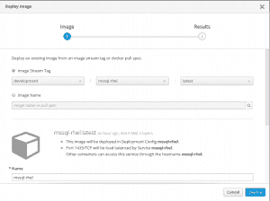
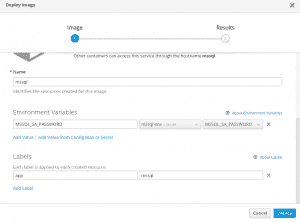
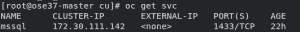
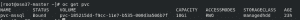
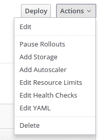
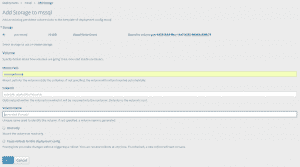
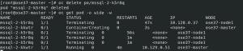
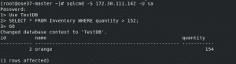

# 在 OpenShift 上运行 Microsoft SQL Server pod

> 原文：<https://developers.redhat.com/blog/2018/01/25/microsoft-sql-server-pod-openshift>

Red Hat 现在支持在 RHEL 服务器上运行的 Microsoft SQL Server。然而，Red Hat 没有为 RHEL 上的 MS SQL Server 提供官方的 docker 映像。这篇文章解释了如何在 RHEL 上为 MS SQL Server 创建 docker 映像，并在 Red Hat OpenShift 上运行它。

## 为 RHEL 上的 SQL Server 创建 docker 映像

微软为 Linux 上的 SQL Server 提供了官方的 docker 镜像，然而这是一个基于 T2 Ubuntu 的镜像。
OpenShift 并不限制运行基于 Ubuntu 的容器映像，但是对于那些出于支持等原因更喜欢基于 RHEL 的映像的人来说，在[微软仓库](https://github.com/Microsoft/mssql-docker/tree/master/linux/preview/RHEL)中有一个 Dockerfile。目前有一些导入拉式请求尚未合并。为了让事情变得更简单，我在我的个人 GitHub 库中提供了一个包含这些变化的 docker 文件。您可以按如下方式构建 docker 映像:

```
$ git clone https://github.com/tanaka-takayoshi/mssql-docker-rhel.git
$ cd mssql-docker-rhel/cu
$ docker build .
```

要在 OpenShift 上运行这个 docker 映像，您必须按照本文档中的[将这个映像推送到 OpenShift 内部映像注册表中。](https://docs.openshift.com/container-platform/3.7/install_config/registry/accessing_registry.html)

## 创建一个 OpenShift secret 来存储密码

为了避免在配置文件中对数据库的 SA (sysadmin)用户的密码进行硬编码，可以指定将密码存储在环境变量中。您可以[在 deploymentconfig](https://docs.openshift.com/container-platform/3.7/dev_guide/environment_variables.html) 中设置环境变量。但是，任何可以读取 deploymentconfig 的用户都可以看到密码。为了提供安全的凭证存储，可以使用 [OpenShift secrets](https://docs.openshift.com/container-platform/3.7/dev_guide/secrets.html) 。要创建密码，请定义一个 yaml 文件:

```
apiVersion: v1
kind: Secret
metadata:
  name: mssql-env
stringData:
  MSSQL_SA_PASSWORD: SpecialStr0ngP@ssW0rd
```

然后创造一个秘密。

```
$ oc create -f mssql-env-secret.yaml
```

它将在部署映像时使用。

## 在 OpenShift 上运行 SQL Server 映像

现在，您可以在 OpenShift 上运行映像。我选择使用 OpenShift 3.7 Web 控制台。或者，您可以使用`oc`命令行工具，点击 Web 控制台上的`Add to Project | Deploy Image`菜单。然后选择`Image Stream Tag`，在推送图像时输入图像流标签名称。



在环境变量部分，点击`Add Value from Config Map or Secret`和密码的名称。



点击`Deploy`按钮后，OpenShift 将启动一个新的 pod。

## 连接到 SQL Server

您可以从 OpenShift 群集网络中使用服务 IP 连接到 SQL Server pod。默认情况下，出于安全原因，SQL Server 不进行远程连接。按照本文档中的[安装 SQL Server 命令行工具。然后获取一个服务 IP 并连接到数据库。](https://docs.microsoft.com/en-us/sql/linux/sql-server-linux-setup-tools)




## 使用永久卷来存储数据

默认情况下，当 pod 死亡时，写在容器中的任何内容都将丢失。您可以使用永久卷来永久存储数据。由于我在 Azure 上运行 OpenShift 3.7，所以我决定使用 Azure 磁盘作为我的持久卷。OpenShift 3.7 支持 Azure 托管磁盘的动态供应。按照本文档中的[创建一个存储类。](https://docs.openshift.com/container-platform/3.7/install_config/persistent_storage/dynamically_provisioning_pvs.html#azure-advanced-disk)

```
kind: StorageClass
apiVersion: storage.k8s.io/v1
metadata:
  name: managedhdd
provisioner: kubernetes.io/azure-disk
parameters:
  storageaccounttype: Standard_LRS
  kind: Managed
```

```
$ create -f managedhdd.yaml
```

```
apiVersion: v1
kind: PersistentVolumeClaim
metadata:
 name: pvc-mssql
 annotations:
   volume.beta.kubernetes.io/storage-provisioner: kubernetes.io/azure-disk
spec:
 accessModes:
  - ReadWriteOnce
 resources:
   requests:
     storage: 10Gi
 storageClassName: slow
```

```
$ oc create -f pvc-mssql.yaml
```

如果配置正确，永久卷声明(PVC)将处于绑定状态。这意味着 OpenShift 为此 PVC 创建了一个新的管理磁盘。


然后，移动到 Web 控制台中的部署，并单击`Actions | Add Storage`菜单。


选择创建的 PVC 并在挂载路径中输入`/var/opt/mssql`。


现在，数据存储在 Azure 磁盘上，即使 pod 已经死亡，也不会被删除。我们删除一个 pod 确认一下吧！下面的屏幕截图显示，删除现有 pod `mssql-2-k5r8q`后，pod 将在新节点上重启。



您也可以确认使用相同的服务 IP 地址进行连接。


*Last updated: January 24, 2018*