# 用微软 VSCode 和红帽 CDK 调试你的 OpenShift Java 应用程序

> 原文 http://developer . red hat . com/blog/2017/12/19/debug-Java-open shift-vscode-CDK

最近，关于两个看似不同的产品有很多议论:Red Hat OpenShift 和 Microsoft Visual Studio Code(vs Code)。由于 Red Hat 的帮助，现在在 VSCode 开发环境中支持 Java 语言。由于 Java 是 Red Hat OpenShift 中的一等公民，我们将看到如何从运行在桌面上的 VSCode IDE 中调试运行在 OpenShift 上的容器中的 Java 代码(感谢 Red Hat 容器开发工具包)。

## 先决条件

为了执行此示例，应该安装以下组件:

*   Java 开发工具包:您的机器上必须安装 Java8 或 Java9 JDK。你可以从[这里](http://www.oracle.com/technetwork/java/javase/overview/index.html)下载。
*   微软 Visual Studio 代码:下载可从[这里](https://code.visualstudio.com/download)获得。
*   安装红帽容器开发工具包(CDK)最简单的方法是使用[红帽开发套件安装程序](https://developers.redhat.com/products/cdk/download/)。

## 配置 Microsoft VSCode

我们需要配置 Microsoft VSCode，以便它支持编辑和调试 Java 项目。

您可以启动 Microsoft VSCode 并单击左侧面板中的扩展图标:

应出现以下屏幕:

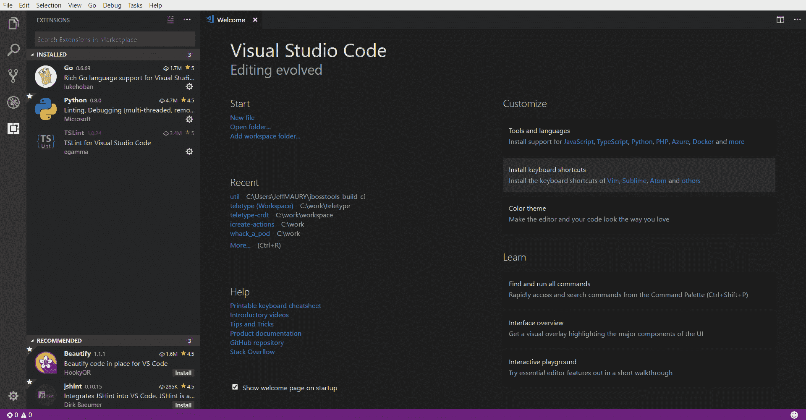

在扩展搜索栏中输入***【Java】***。可用扩展列表已更新:

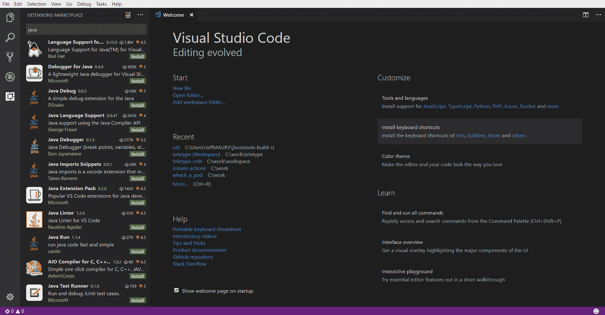

由于我们需要调试支持，在 Java 的 ***调试器上，点击安装按钮。您不需要安装 Red Hat 对 Java 的语言支持，因为它会作为一个依赖项自动安装。***

安装可能需要很长时间才能完成。完成后，在您清除扩展搜索栏后，您应该会看到以下屏幕:

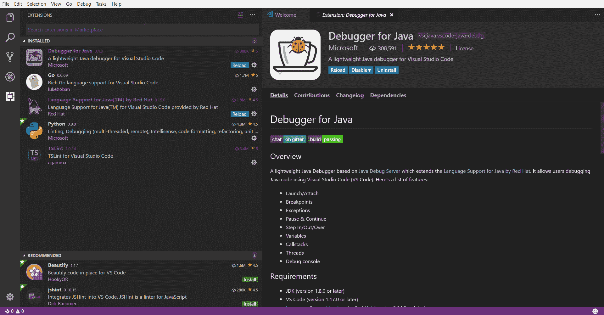

如果你能看到 ***重新加载*** 按钮，那么点击它重新加载微软 VSCode。

用户界面将被重新加载，并应进行如下所示的更新:

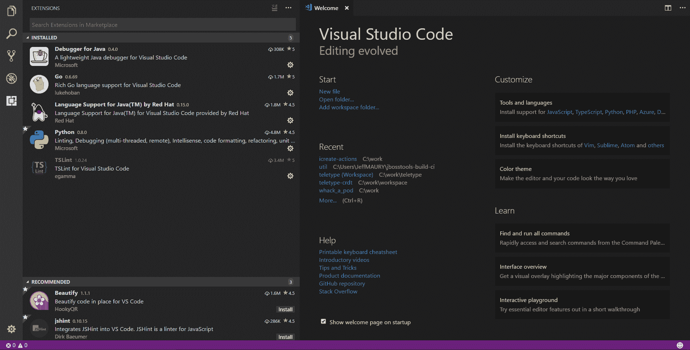

我们现在已经准备好处理来自微软 VSCode 的 Java 项目了！

## 部署 OpenShift 应用程序

以下所有操作都将从 Microsoft VSCode 集成终端执行。为了访问它，进入菜单 ***视图- >综合终端*** 。

### 启动红帽 CDK

在你下载了红帽 CDK 之后，你必须确保它已经启动，然后我们才能玩它。转到下载 minishift 二进制文件的文件夹，输入以下命令:

```
minishift status
```

如果响应状态为 Running，则跳过以下步骤。

红帽 CDK 还没有启动，所以你必须启动它。输入以下命令:

```
minishift start
```

这可能需要很长时间(可能需要创建虚拟机)，如果您没有观察到任何错误消息，红帽 CDK 已经启动。

### 确保 oc 在路径上

运行以下命令:

```
minishift oc-env
```

按照给出的说明，确保 oc 二进制文件在系统路径中，这样我们现在就可以使用它了。

### 为我们的部署创建 OpenShift 项目

发出以下命令:

```
oc new-project eap
```

如果一切正常，您应该会看到以下消息:

```
Now using project "eap" on server "https://192.168.99.xxx:8443".
You can add applications to this project with the 'new-app' command. For example, try:
oc new-app centos/ruby-22-centos7~https://github.com/openshift/ruby-ex.git
to build a new example application in Ruby.

```

### 部署应用程序

发出以下命令:

```
oc new-app --image-stream=jboss-eap70-openshift https://github.com/jboss-developer/jboss-eap-quickstarts.git#7.0.0.GA --context-dir=kitchensink --env DEBUG=true
```

将创建一组 OpenShift 资源，如果一切正常，您应该会看到以下消息:

```
--> Success
```

图像将被删除，一个新的建设将产生，这可能需要一段时间，所以请耐心等待。

### 公开服务

为了通过 web 浏览器访问应用程序，我们必须通过 OpenShift 路由公开刚刚部署的服务。

运行以下命令:

```
oc expose service jboss-eap-quickstarts
```

为了获取用于访问应用程序的 URL，请运行以下命令:

```
oc get routes
```

您应该会看到类似这样的内容:

```
NAME                  HOST/PORT                                       PATH SERVICES              PORT     TERMINATION WILDCARD
jboss-eap-quickstarts jboss-eap-quickstarts-eap.192.168.99.100.nip.io      jboss-eap-quickstarts 8080-tcp             None
```

我们现在需要增加这个路由的超时时间，因为当我们在调试时进入代码时，它可能会过期。运行以下命令:

```
oc patch route/jboss-eap-quickstarts -p  "{\"metadata\":{\"annotations\":{\"haproxy.router.openshift.io/timeout\":\"1h\"}}}"
```

### 导入应用程序的源代码

现在，我们将首先将应用程序源代码导入到您的本地工作站文件夹中，然后将应用程序源代码加载到 Microsoft VSCode 中。

打开 ***命令调色板*** ( ***视图- >命令调色板*** 或 ***Ctrl+Shift+P*** )然后输入 ***git*** 。您应该会看到 Git 的命令列表:

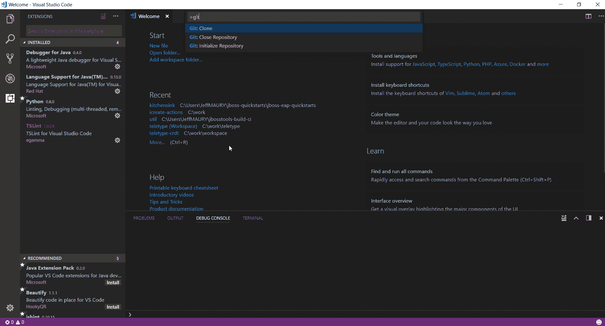

选择 ***Git:克隆*** 命令，按 ***进入*** 。

需要 Git 存储库 URL:

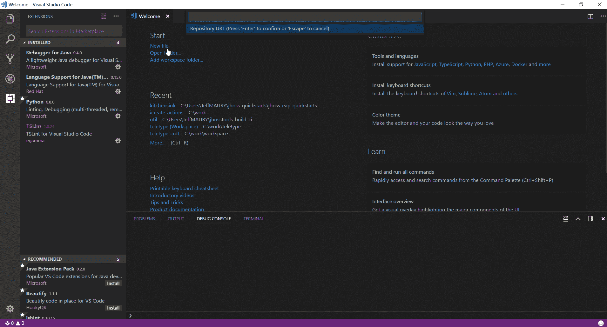

在文本框中输入***https://github . com/JBoss-developer/JBoss-EAP-quick starts . git***按 ***输入*** 。

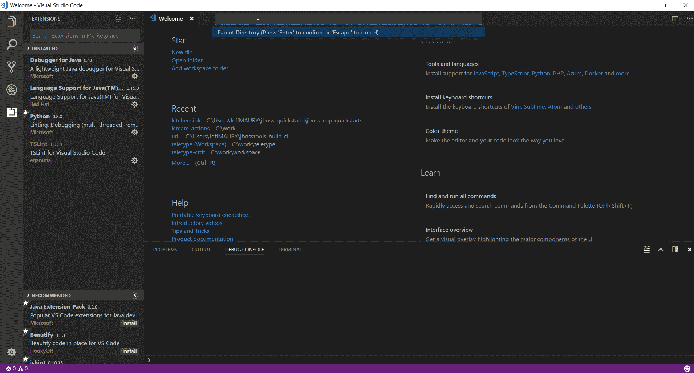

您必须提供一个文件夹，Git 存储库将在其中被克隆。您可以将您的主文件夹指定为一个中间文件夹，它将由 git clone 命令创建。

将启动 git clone 命令，这可能需要一段时间，因为这个存储库包含许多应用程序。

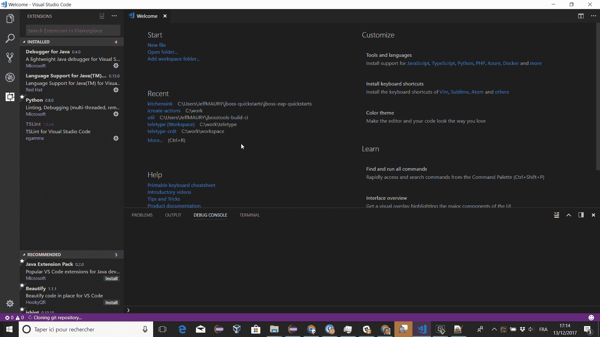

克隆命令完成后，将要求您打开克隆的存储库:

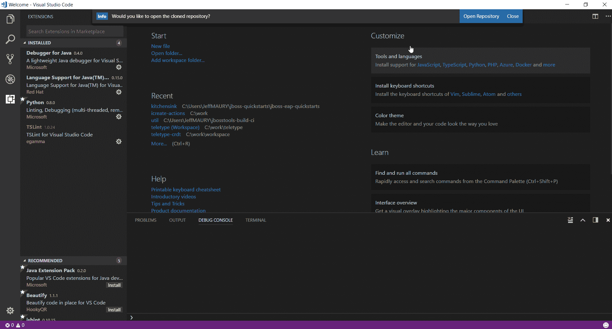

选择 ***【关闭】*** 按钮。我们不打开克隆的存储库，因为它包含太多的应用程序和文件夹，这会导致 Microsoft VSCode 花费太多时间来加载。

相反，我们将加载一个名为“kitchensink”的子文件夹。

选择打开文件夹命令( ***)【文件】- >打开文件夹....*** )并选择您克隆 Git 资源库的 ***kitchensink*** 子文件夹(不要双击该文件夹，仅保持选中状态):

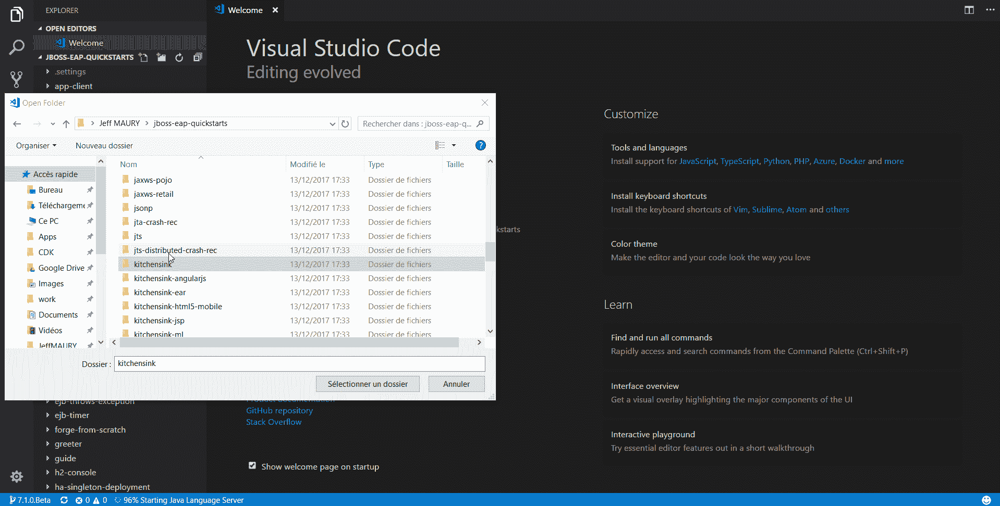

然后按下 ***选择*** 按钮，将选择的文件夹加载到 Microsoft VSCode 中:

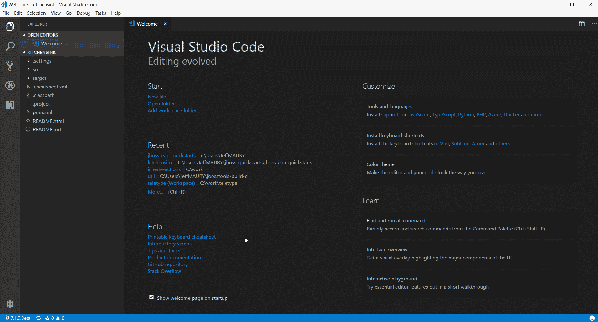

默认情况下， ***主*** 分支已经被检出。但是当我们创建部署时，我们使用了 ***7.0.0.GA*** 分支。

打开 ***命令调色板*** ( ***视图- >命令调色板*** 或 ***Ctrl+Shift+P*** )然后输入 ***git*** 。选择 ***Git:Checkout to...*** 命令，并在文本框中输入 ***7*** 。您应该看到所有包含字母 ***7*** 的分支，从 ***7.0.0.GA*** 开始:

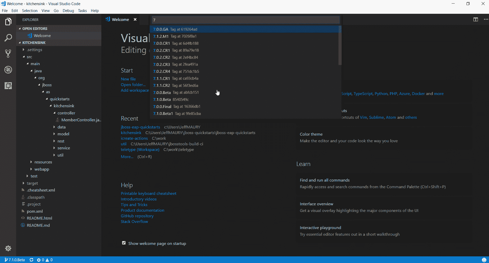

选择 ***7.0.0.GA*** 分支，按 ***进入*** 。

您将看到文本警告您编译文件已被修改:

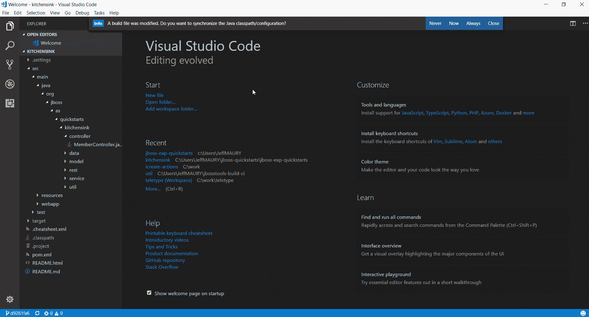

为了同步修改，按下**或 ***总*** 按钮。**

 **### 在应用程序代码中设置断点

### 

在 kitchensink 项目中，打开***src/main/Java/org/JBoss/as/quick starts/controller/member controller . Java***文件:

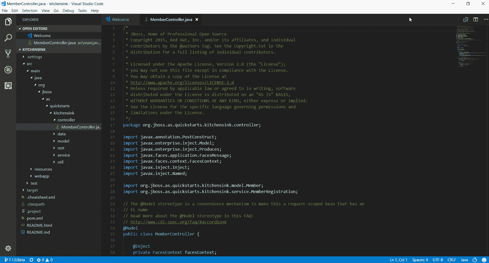

您可以看到这个源文件上的语法突出显示是活动的，因此我们之前刚刚安装的 Java 扩展也是活动的。

向下滚动到 ***寄存器()*** 方法:

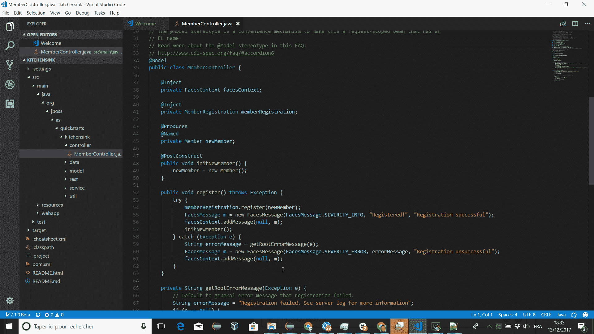

单击第 54 行行号左侧的标尺，在 register()方法的第一条指令处放置一个断点:

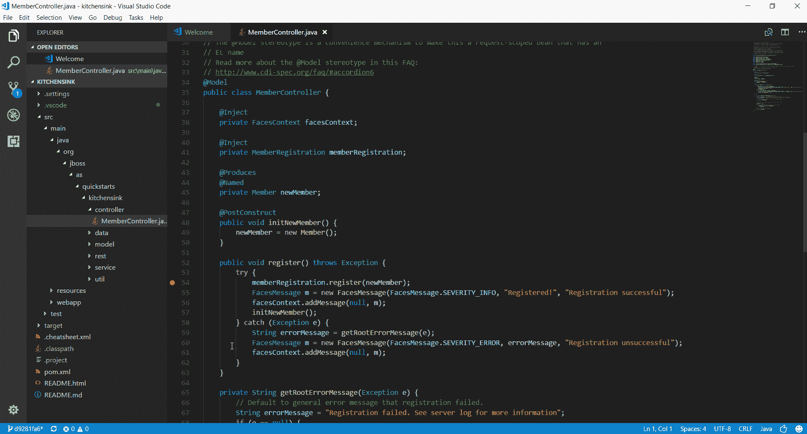

我们现在已经准备好在 Microsoft VSCode 中调试我们的程序了。

### 在 OpenShift 端启用调试

为了能够远程调试 Java 程序，Microsoft VSCode 必须能够通过 TCP 端口与 Java(TM)虚拟机通信。这不能通过 OpenShift 实现，因为它只针对 HTTP(S)流量，而 Java 调试协议并不基于此。在 pod 端，Java 调试器正在监听端口 8787。因此，我们将使用 OpenShift/Kubernetes 特性，该特性允许您将本地工作站 TCP 端口代理到远程 pod TCP 端口，在我们的示例中是 8787 端口。

为了获取 pod 名称，请运行以下命令:

```
oc get pods --show-all=false
```

这将给出一个类似 jboss-eap-quickstarts-n-suffix 的 pod 名称，其中 n 是一个数字，suffix 是一个唯一的字符串。记住这个名称作为 pod 名称。

然后运行以下命令:

```
oc port-forward pod_name 8888:8787
```

您应该会看到以下输出:

```
Forwarding from 127.0.0.1:8888 -> 8787
Forwarding from [::1]:8888 -> 8787
```

我们现在准备调试我们的 OpenShift 部署，就像它是一个本地 Java 程序一样。让我们开始吧。

### 启动 Java 调试会话

首先，启动一个调试会话(***Debug->Start Debug***或***【F5***)，将会显示支持的调试类型列表:

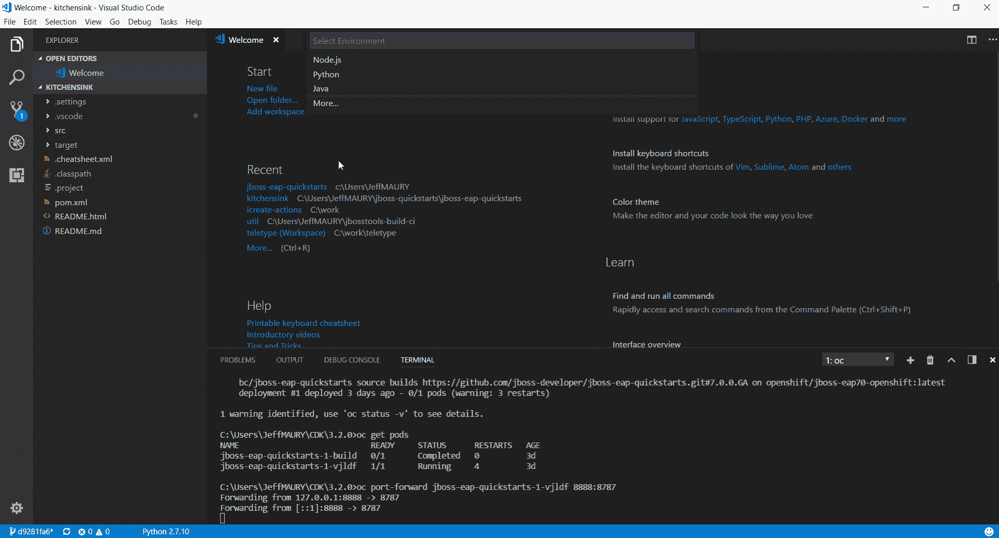

选择***‘Java’***，一个名为 ***launch.json*** 的新文件将在您的项目中创建并显示在编辑器中:

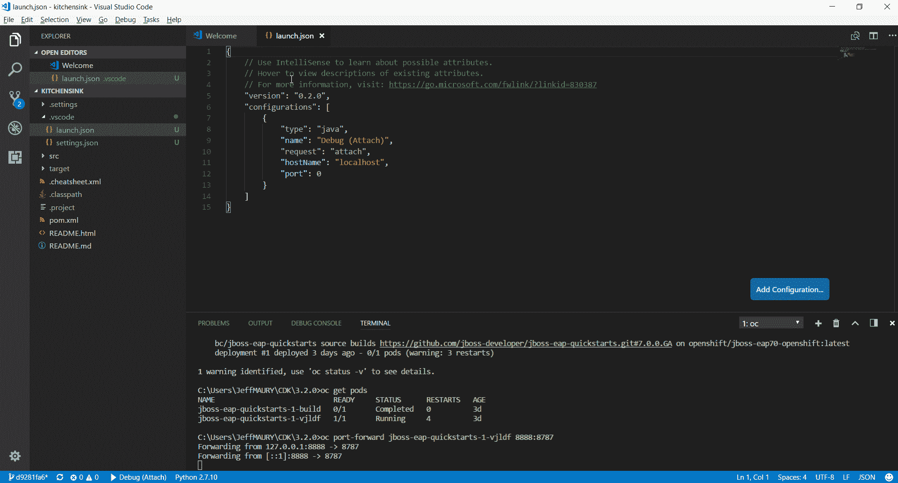

编辑该文件并更改该行:

```
"port": 0
```

到

```
"port": 8888
```

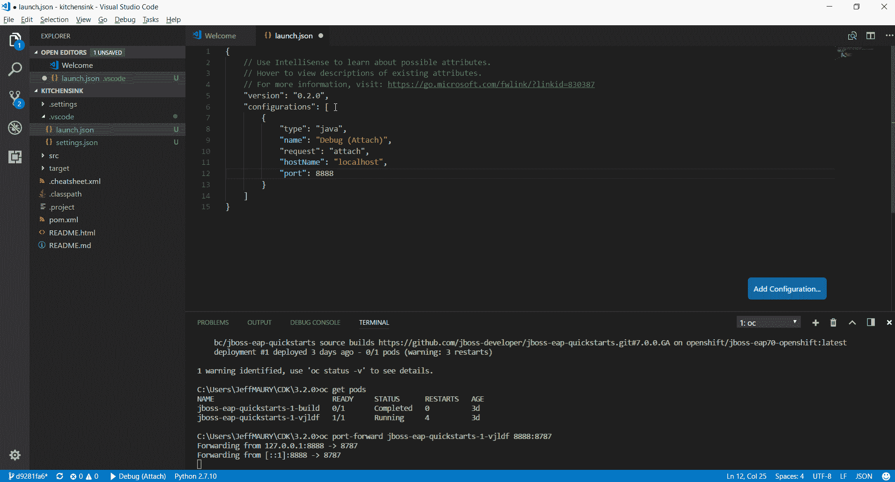

然后保存文件( ***File - >保存*** 或 ***Ctrl+S*** )。

重复启动调试会话命令(调试->启动调试或 F5)，将显示一个新的调试控制台:

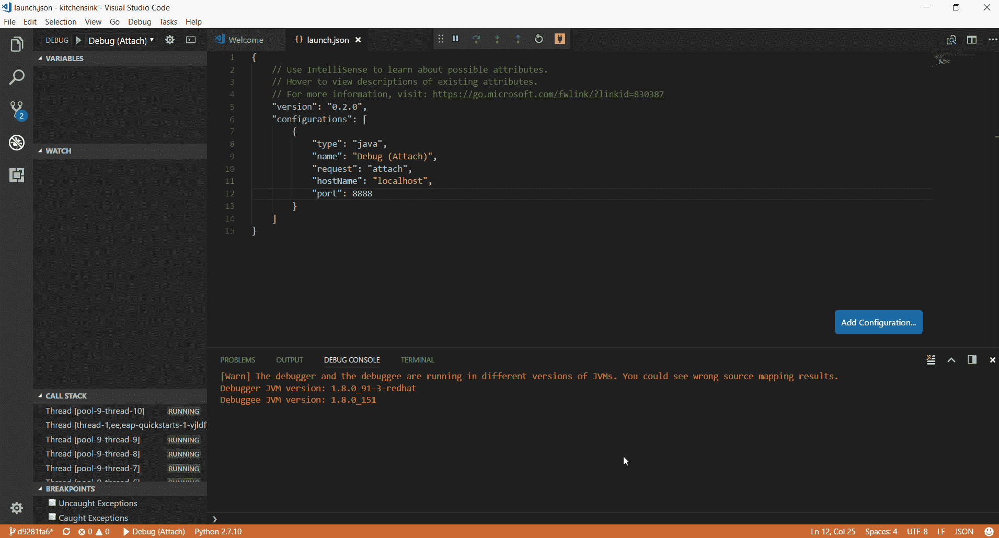

Microsoft VSCode 现在正在调试我们的 OpenShift 部署，等待命中断点。

## 访问应用程序

使用 web 浏览器访问以下 URL:http://JBoss-EAP-quick starts-EAP . 192 . 168 . 99 . 100 . nip . io。请注意，此处的 ip 地址是 Red Hat CDK 虚拟机的 IP，可能与您的配置不同。如果您想知道自己的，请运行以下命令:

```
minishift ip
```

您应该会在浏览器中看到以下内容:

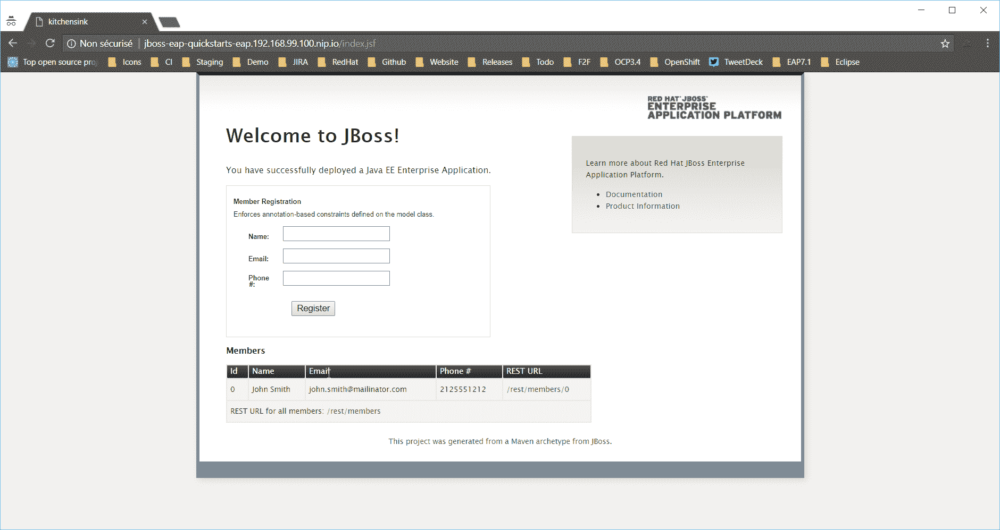

在 ***名称*** 字段中，输入 ***测试***

在 ***邮箱*** 字段，输入【test@redhat.com】

 *在 ***电话*** 字段，输入 ***0123456789***

然后点击 ***注册*** 按钮。您应该看到系统任务栏中的 Microsoft VSCode 图标在闪烁，单击它可以激活 Microsoft VSCode 用户界面。

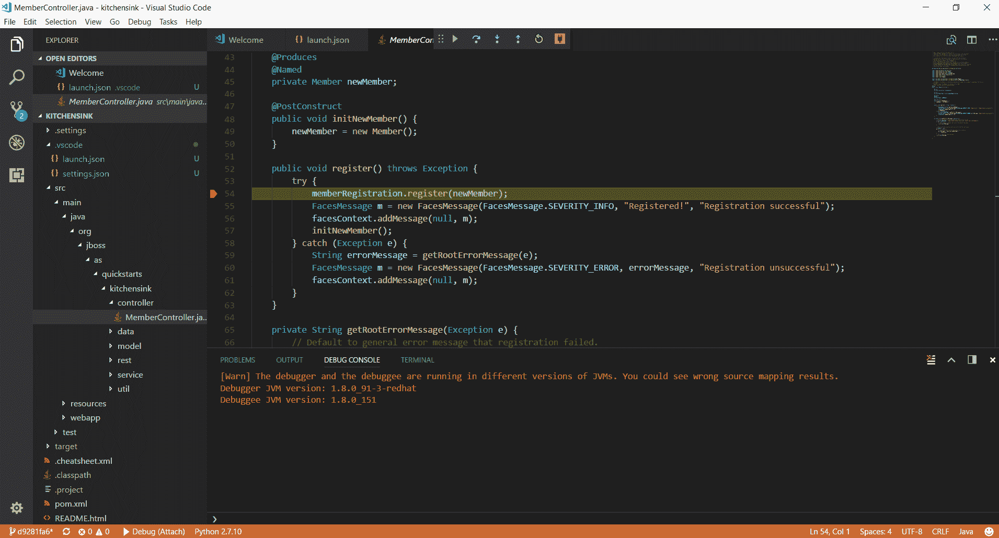

选择左侧的调试图标()切换到调试视图:

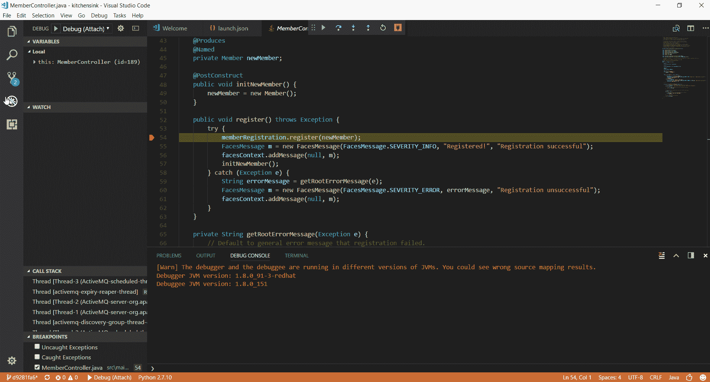

在 ***变量*** 窗口中，展开 ***这个*** 成员:

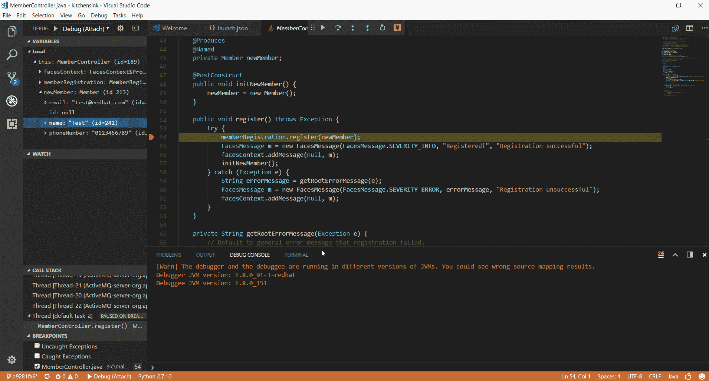

您可以看到我们在应用程序用户界面上设置的值，现在我们可以进入应用程序的代码。

在我的下一篇文章中，我们将看到如何使用 OpenShift Online Starter 在线部署 OpenShift！

* * *

[**加入红帽开发者计划**](https://developers.redhat.com/?intcmp=70160000000xZNgAAM) **(免费)并获得相关的备忘单、书籍和产品下载。**

*Last updated: September 3, 2019****