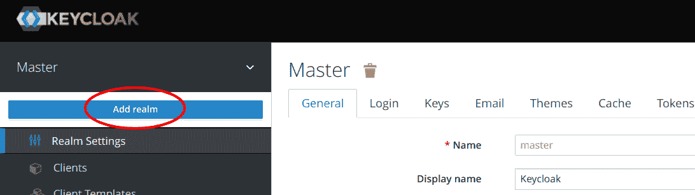
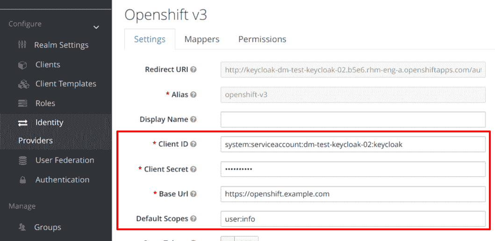
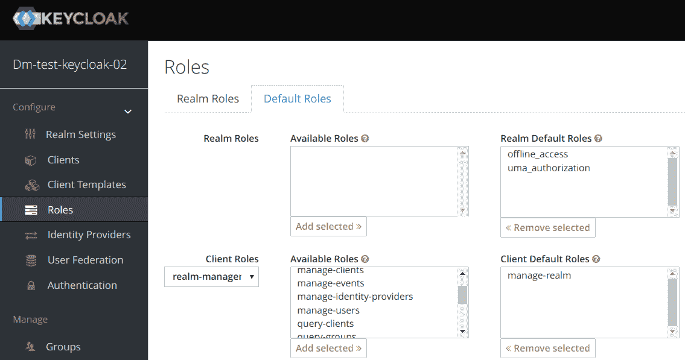
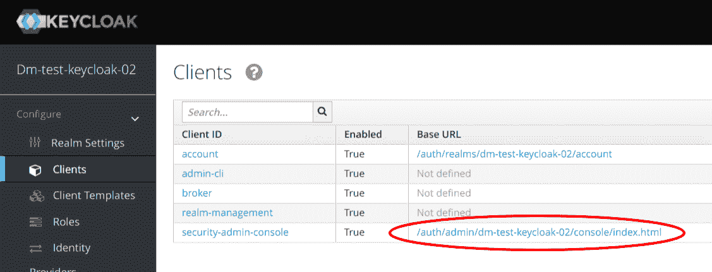
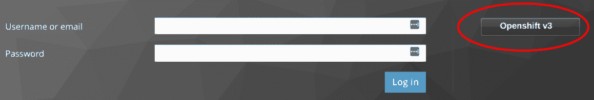

# 使用 OpenShift 的 Keycloak 身份代理

> 原文：<https://developers.redhat.com/blog/2017/12/06/keycloak-identity-brokering-openshift>

本文讨论如何设置和配置 Keycloak 实例，以便通过身份代理使用 OpenShift 进行身份验证。这允许 OpenShift 集群和 Keycloak 实例之间的单点登录。Keycloak 实例将在 OpenShift 集群上运行，并利用 ServiceAccount OAuth 客户端。

## 向您的 OpenShift 名称空间提供 Keycloak

使用下面的命令在 OpenShift 项目中创建 Keycloak 资源。

```
 oc process -f https://raw.githubusercontent.com/david-martin/keycloak-with-openshift-auth-provider/0.0.2/keycloak-with-openshift-auth-provider.yaml | oc create -f -

```

重要提示:该模板仅用于演示目的。

这将创建以下资源:

*   DeploymentConfig -定义要使用的 Keycloak 图像和其他 Pod & container 设置。
*   服务-在键盘锁盒前定义一个服务。
*   Route -在外部可用的主机名上公开 Keycloak 服务。
*   service account——在我们的名称空间中定义 OAuth 客户端的约束形式。

有关 ServiceAccount OAuth 客户端的更多信息，请参见[https://docs . open shift . com/container-platform/3.7/architecture/additional _ concepts/authentic ation . html # service-accounts-as-OAuth-clients](https://docs.openshift.com/container-platform/3.7/architecture/additional_concepts/authentication.html#service-accounts-as-oauth-clients)。

在提供之后，Keycloak 服务将在暴露的路由上可用。使用以下命令获取路由并登录到管理控制台。

```
oc get route keycloak --template "http://{{.spec.host}} "
```

最初，您可以使用“admin”用户和存储在“KEYCLOAK_PASSWORD”环境变量中的生成密码登录。

```
oc env dc/keycloak --list | grep KEYCLOAK_PASSWORD
```

## 创造一个新领域

“admin”用户将登录到“master”领域。该用户对 Keycloak 实例拥有完全控制权。我们可以为 OpenShift 项目创建一个专用领域，并允许 OpenShift 用户管理该领域。只有能够访问我们的 OpenShift 集群的用户才能登录 Keycloak。

创建一个领域，并以我们的 OpenShift 项目命名。



## 配置 Keycloak 以使用 OpenShift 进行身份代理

创建领域后，上下文应该切换到新的领域。从“身份提供者”菜单中，选择“添加提供者...”并选择“OpenShift v3”。填写以下字段。



### 客户端 ID

该字段是 OpenShift 中的 OAuth 客户端标识符。由于我们使用的是 ServiceAccount OAuth 客户端，id 将采用以下格式:

```
system:serviceaccount::keycloak
```

例如，如果我们的项目有一个“我的项目”的 id，客户端 ID 将是:

```
system:serviceaccount:myproject:keycloak
```

### 客户机密

该秘密作为 ServiceAccount 的令牌存储在 OpenShift 中。要检索机密，请执行以下命令:

```
oc sa get-token keycloak
```

### URL 基准

基本 URL 是 OpenShift 主 URL，例如 https://openshift.example.com。

*重要提示:OpenShift 主 URL 需要有一个可信的 CA 签名证书，Keycloak 才能成功调用 OAuth 回调端点。*

### 默认范围

这些是在授权用户时发送给 OpenShift 的范围。因为我们只对认证感兴趣，而不是代表用户对 OpenShift 进行修改，所以我们可以只使用“user:info”范围。

填写完以上所有字段后，就可以创建提供者了。

## 在 Keycloak 中为您的 OpenShift 用户提供一个角色

如果您现在尝试登录该领域，任何成功登录的用户将*只能*在 Keycloak 中管理他们自己的帐户。要允许用户管理该领域，他们需要额外的权限。有两种方法可以赋予用户额外的权限:

*   为每个用户设置默认角色/组。
*   显式设置每个用户的角色。

用户至少登录一次后，可以从“用户”菜单管理显式角色。
但是，我们将设置默认角色，这样用户在首次登录时就可以拥有角色。

要设置默认角色，请从“角色”菜单中选择“默认角色”选项卡。然后选择“领域管理”客户端角色，并将“管理领域”角色添加到“客户端默认角色”中。您可能希望根据自己的需求选择不同的或更具限制性的角色。



## 尝试一下

通过在新的浏览器会话或匿名窗口中导航到领域管理控制台页面来尝试一下。领域管理控制台页面的 URL 可以在“Clients”菜单中找到，作为“security-admin-console”客户端 ID 的基本 URL。



这将显示带有“Openshift v3”选项的登录屏幕。选择“Openshift v3”选项应该会打开一个 Openshift 登录页面。



登录到 OpenShift，你应该最终被重定向回 Keycloak，并能够管理领域。首次登录时，您可能需要填写一些帐户详细信息。

## 从这里去哪里？

如果您希望对 OpenShift 用户在您的 Keycloak 实例中拥有的权限有更多的控制，您可能希望删除默认角色。如果你不认识或不信任所有的 OpenShift 用户，这将特别重要。在这种情况下，您可以删除默认角色，只向您信任的用户添加特定角色。您还可以创建一个具有特定角色的组，使其更易于管理。

本文中使用的 OpenShift 模板可以从 https://github . com/David-Martin/key cloak-with-open shift-auth-provider 获得。

* * *

**[**红帽 OpenShift 容器平台**](https://www.openshift.com/container-platform/) **可供下载。****

***Last updated: December 4, 2017***