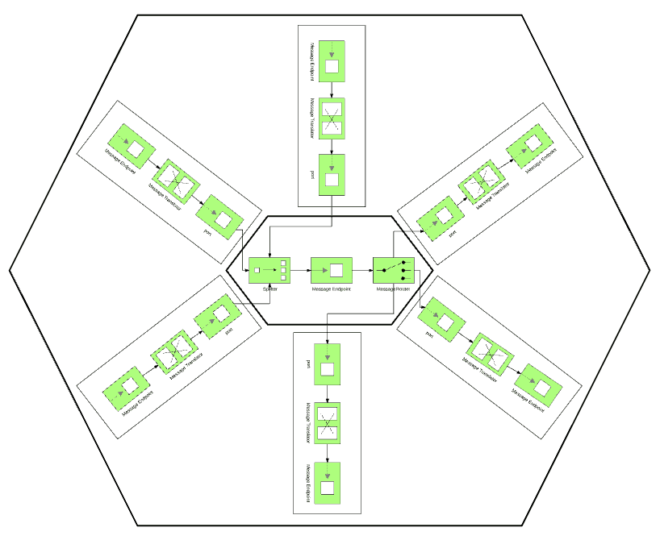
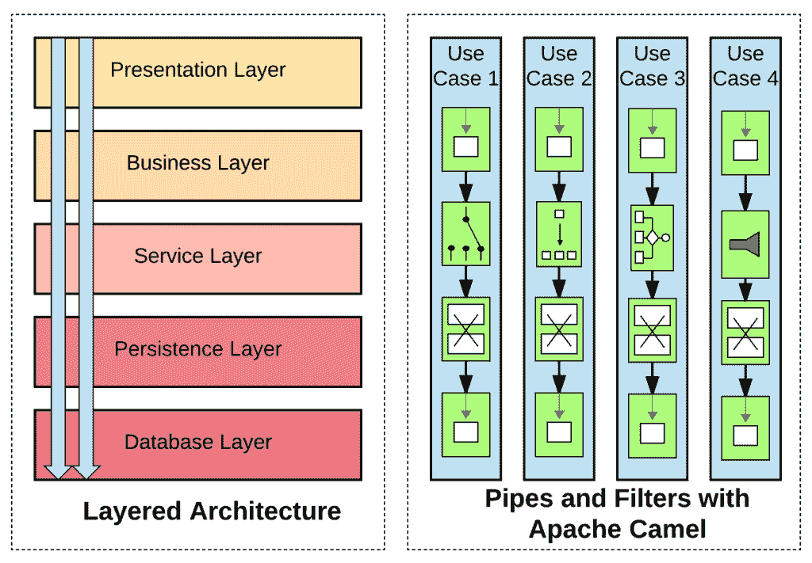
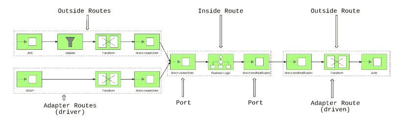

# 六角形建筑是阿帕奇骆驼的天然选择

> 原文：<https://developers.redhat.com/blog/2017/12/05/hexagonal-architecture-natural-fit-apache-camel>

有些架构和模式在纸上看起来很酷，有些在实践中很好。用 Camel 实现六边形架构既是:谈论起来很酷，也是自然的实现结果。我喜欢用 Camel 设计六边形，因为这是建筑和工具自然结合的一种方式，很多人最终都没有意识到。让我们看看为什么会这样。

## 为什么走六边形？

六边形架构最初是由阿利斯泰尔·考克伯恩描述为一种将应用程序分为内部和外部的方法。其目的是将焦点从应用程序的多个概念层转移到应用程序内部和外部之间的区别。内部部分表示领域层或业务逻辑，外部部分由应用程序所有可能的传入或传出交互点组成。同样的架构也被称为 ***端口和适配器*** ，因为应用内部和外部之间的连接是通过端口和适配器实现的。

“端口”一词的灵感来自操作系统的端口，任何符合端口协议的应用程序都可以发送或接收来自应用程序的信号。在某种意义上，端口代表了有目的的对话。适配器代表特定于技术的端口实现。根据端口提供的业务优势，可能有多个适配器希望使用不同的技术来公开端口。

*用骆驼路线可视化的六角形建筑*

请注意，所有端口和适配器在体系结构级别上基本相似，但 Alistair 承认端口和适配器有两种风格:主要和辅助或驱动和被驱动。例如，如果有一个简单的基于 REST 的服务来读写数据库，服务的 REST 端将是主要的参与者端口和适配器，因为它发起并驱动交互。用于写入数据库端的端口和适配器将是次要的和受驱动的角色，因为它不发起任何调用(假设我们不使用任何数据更改捕获侦听器，在这种情况下，该适配器也将是主要的)。

简单来说，六边形架构帮助我们避免多层架构，这些多层架构容易最终成为 [baklava 架构](https://www.johndcook.com/blog/2009/07/27/baklav-code/)(反模式)。相反，它将我们推向简化的关注点分离，以及[洋葱架构](http://jeffreypalermo.com/blog/the-onion-architecture-part-1/)、[干净架构](https://8thlight.com/blog/uncle-bob/2012/08/13/the-clean-architecture.html)等等。

## 为什么骆驼在自然界是六边形的？

让我们来看两个极端:一个[分层架构](https://www.safaribooksonline.com/library/view/software-architecture-patterns/9781491971437/ch01.html)通过分解大型应用程序并将其结构化为称为层的特定抽象级别的子任务组来管理它的复杂性。应用程序中的每一层都有特定的角色和职责，在体系结构的一层中进行的更改通常不会影响其他层的组件。在实践中，这种架构将应用程序分成水平的层，对于 JEE 世界的大型整体 web 或 ESB 应用程序来说，这是一种非常常见的方法。

另一个极端是 Camel，它具有丰富的 DSL 和路由/流抽象。基于[管道和过滤器模式](http://www.enterpriseintegrationpatterns.com/patterns/messaging/PipesAndFilters.html)，Camel 会将一个大的处理任务分成一系列由通道(管道)连接的较小的独立处理步骤(过滤器)。不存在相互依赖的层的概念，事实上，由于其强大的 DSL，只需几行代码和一个层就可以完成简单的集成。在实践中，Camel routes 将您的应用程序按照用例和业务流分割成垂直流，而不是水平层。一个典型的 Camel 应用程序由多个独立工作的 Camel routes 组成，它们为实现共同的业务目标而协作。

*与管道和过滤器模式相比的分层架构*

如前所述，当使用 Camel 时，用它创建的服务往往以单一层结束。虽然这对于大多数较简单的情况来说是好的，但是在处理大型项目时，应用六边形架构原则将有助于创建更好的应用程序。我的意思是，把你的骆驼路线分成两层，分别代表应用程序的内部和外部。应用程序的内部由 Camel routes 表示，它实现了您的集成的业务逻辑，旨在由多个其他路由和协议重用。应用的外部将由 Camel 路由实现，Camel 路由是六边形架构中的适配器，即提供特定技术逻辑的路由，例如处理特定协议、特定于端点的错误处理逻辑、以及特定于端点的事务和恢复动作。

## 如何将六边形建筑映射到驼色？

**识别您的应用程序内部**

即使是用 Camel 创建的最简单的服务也有业务逻辑。通常情况下，这是一个组合的[转换数据](http://camel.apache.org/data-format.html)、[基于内容的路由](http://camel.apache.org/content-based-router.html)、[过滤](http://camel.apache.org/message-filter.html)、[拆分](http://camel.apache.org/splitter.html)、[聚合](http://camel.apache.org/aggregator2.html)等。通常，没有现成的企业集成模式适用，您必须使用自己的定制 Java bean 作为 Camel 路线的一部分。令人惊叹的是，Camel 完全是非侵入性的，您可以在 Camel routes 中开发、测试和使用 Java beans，完全不依赖 Camel APIs。Camel [bean 组件](https://camel.apache.org/bean.html)将确保 bean 方法参数填充了正确的值，并获取返回值，将其放回 Camel routes。

如果您已经确定了包含上述元素的路由，那么这些路由通常代表了您的应用程序的内部。这类路由不应包含特定于技术和协议的逻辑。例如，避免使用由组件直接填充的数据，如 HTTP 头、JMS 头，以及 HTTP 协议常见的错误处理重试逻辑、补偿操作逻辑等。相反，在骆驼路线内部只关注业务逻辑，并与外部骆驼路线隔离开来。

**将内部与外部隔离**

在六边形架构中，应用程序的内部是通过抽象对话的端口来实现的。Camel [direct](http://camel.apache.org/direct.html) 组件是端口的完美实现。它提供同步调用，与 Java 中的方法调用相同。它不特定于技术和协议，没有特定的数据格式或模式验证要求，可用于传入和传出任何类型的数据。通常，要传递的首选数据格式是 POJO，因为它是在 Camel route 中操作起来最简单、最灵活的结构。但是如果在您的领域中，主要的数据格式是 XML、JSON 或任何其他格式，您也可以保持这样的格式。没有严格的规则可循，但只要对你有用就行。直接组件唯一固定的是它是一个同步交互模型，我认为这是默认的正确模型。如果需要异步，那么最好将异步逻辑实现为外部路由的一部分(如果适配器需要异步),或者作为业务逻辑的一部分实现在内部路由中，而不是使用端口的 SEDA 组件。但是不要将端口仅限于异步模式。

端口代表服务上下文中有意义的对话。在 Camel 中，它由一个直接组件表示，在 JVM 的上下文中，它被唯一地标识为一个字符串值。人们可能会认为直接组件是作为对 Alistair 的端口定义的响应而实现的。

**保持外部隔离**

因此，我们将应用程序的业务逻辑实现为只能通过直接组件端点(如端口)访问的 Camel routes。这种设置允许测试、重用业务逻辑，并使用其他途径通过多种协议向外界公开业务逻辑。应用程序的外部包含任何依赖于端点的逻辑。现在最常见的是基于异步交互的消息或文件，以及基于同步交互的 HTTP。但是它也可以是 Camel 中存在的其他 200 多个[连接器](http://camel.apache.org/components.html)中的任何一个。请记住，您用于外部的组件不仅规定了交互模型，而且通常还定义了数据格式、事务语义、错误处理逻辑，甚至潜在地定义了应用程序的其他方面。例如，SOAP 端点将执行模式验证，但是使用 JMS 消息将需要额外的验证步骤。事务性端点将在失败的情况下执行回滚，但是非事务性端点将需要恢复操作，幂等端点将允许重试，而非幂等端点则不允许。我已经在 [Camel 设计模式书](https://leanpub.com/camel-design-patterns/)中更详细地描述了这些考虑因素和其他相关的 Camel 用例。

综上所述，一个基于 Camel 的服务通过 SOAP 和 JMS 公开了一些业务功能，如下图所示。通过 JMS 和基于 SOAP 的路由的直接组件可以访问相同的业务功能。同样，在右边，同样的路线是使用电子邮件通知端口和适配器来发送电子邮件。

*基于 Camel 服务的端口和适配器*

请注意，外部路由不仅在消费者端，也在生产者端，即发送消息到其他系统的路由(记住驱动和被驱动端口/适配器)。外部路由的目的是表示各种适配器，这些适配器应该处理外部特定的一切:协议、数据格式和特定于端点的附加逻辑。此外，外部路由应该通过填充预期的报头和消息体，以端口预期的格式准备数据。这将允许多个适配器路由重用同一个端口。这也包括 Camel 中用于单元测试 Camel 路线的测试装置，甚至错误处理代码。Camel 中的错误处理构造(没有 doTry、doCatch、doFinally，但有 onException 构造)实际上表示一个端口，该端口由框架在不同类型的异常情况下自动调用。这样的概念在 Java 语言中是不存在的，但是在 Camel 中，对于不愉快的场景，这是一个非常常用的执行路径。将错误处理流视为应用程序中的另一个端口(即使它不是由您调用，而是在特定场合由框架调用)，将有助于您在多条 Camel 路线上重用它进行常见的错误处理。

## 概括起来

关于如何用骆驼路线组成应用程序，没有明确的规则或指导方针。在设计时定义这些通常会限制开发人员在实现时的创造力，没有指导方针可能会导致体系结构混乱。按照这种思路，我认为六边形架构是足够轻量级的，不会通过强制特定的结构来扼杀实施过程中的创造力和想象力。同时，它为构建路线提供了足够的指导。最棒的是，它自然符合骆驼编程模型。

我的建议是从 VETRO 模式(验证、丰富、转换、路由、操作)开始，然后应用六边形架构风格(Camel Design Patterns 一书中描述的边缘组件模式)。这是为快乐之路构建骆驼路线的良好起点。然后特别注意用各种错误处理和恢复模式实现数据一致性。别忘了，没有最佳实践，只有在特定环境下的良好实践。专注于你的背景，骆驼会站在你这边。

### 关于作者:

Bilgin Ibryam 是 Apache Software Foundation 的成员，Red Hat 的集成架构师，软件工匠和 T2 的博客作者。他是一个开源狂热者，对分布式系统、消息传递和应用程序集成充满热情。他是[骆驼图案](https://leanpub.com/camel-design-patterns) & [Kubernetes 图案](http://leanpub.com/k8spatterns)书籍的作者。关注 [@bibryam](http://twitter.com/bibryam) 以获取相关主题的未来博文。

* * *

要构建您的 Java EE 微服务 **请访问** [**野生蜂群**](https://developers.redhat.com/promotions/wildflyswarm-cheatsheet/) **并下载备忘单。**

*Last updated: December 4, 2017*