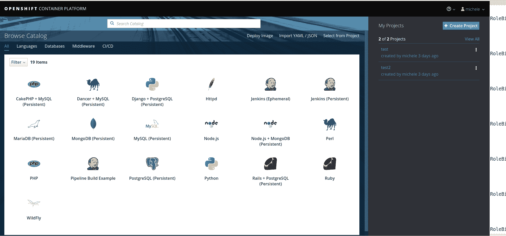
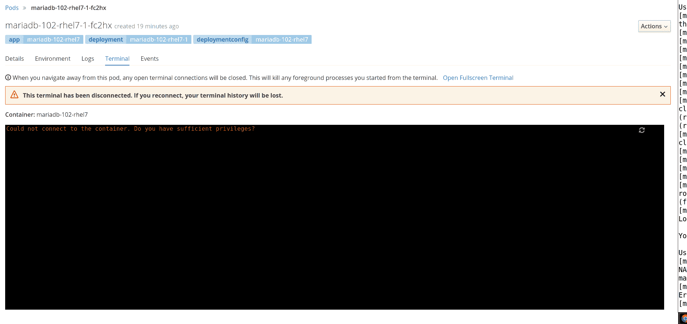

# 如何自定义 OpenShift RBAC 权限

> 原文：<https://developers.redhat.com/blog/2017/12/04/customize-openshift-rbac-permissions>

最近，我收到了一位客户的提问，他希望在 OpenShift 容器平台中限制用户权限，以符合其公司的安全政策。

OpenShift 有丰富的、细粒度的开箱即用的 RBAC 功能，这使您有可能设置谁可以对每种资源执行操作(OpenShift word 中的动词)。

在我们开始深入这个主题之前，我提供了一些资源的链接，我认为这些资源将有助于更好地理解角色、角色范围、角色绑定、组等概念。

### **资源**

[https://docs . open shift . com/container-platform/3.7/admin _ solutions/user _ role _ mgmt . html # determine-default-user-roles](https://docs.openshift.com/container-platform/3.7/admin_solutions/user_role_mgmt.html#determine-default-user-roles)
[https://docs . open shift . com/container-platform/3.7/admin _ guide/manage _ authorization _ policy . html](https://docs.openshift.com/container-platform/3.7/admin_guide/manage_authorization_policy.html)
[https://docs . open shift . com/container-platform/3.7/architecture/additional _ concepts/authorization . html #评估-授权](https://docs.openshift.com/container-platform/3.7/architecture/additional_concepts/authorization.html#evaluating-authorization)

### **先决条件**

在您的笔记本电脑、虚拟机、服务器、虚拟机管理程序或 iaas 上运行 Ocp 3.7 记住 Rhel 在哪里运行 Ocp。

### **让我们开始**

在我的笔记本电脑上，我使用的是一体化版本的 OpenShift，它对执行一些测试非常有帮助。让我们从 **oc 集群启动开始，**使用 host-data-dir 和 host-config-dir 选项授予跨重启的持久性。

[Mike @ Zeus ~]$**sudo oc cluster up-host-data-dir/home/Mike/OCP-data-dir/-host-config-dir/home/Mike/OCP-config-dir/**
使用 registry.access.redhat.com/openshift3/ose:v3.7.9 启动 OpenShift...
拉动图像 registry.access.redhat.com/openshift3/ose:v3.7.9
拉动 1/4 层，27%完成
拉动 1/4 层，57%完成
拉动 2/4 层，76%完成
拉动 3/4 层，82%完成
拉动 3/4 层，91%完成
拉动 4/4 层，100%完成
提取
图像拉动完成
OpenShift 服务器启动。

该服务器可通过 web 控制台访问:
https://127.0.0.1:8443

您登录为:
用户:开发者
密码:<任意值>

以管理员身份登录:
oc login -u system: admin

让我们使用新帐户登录 CLI 或 UI(不要担心用户/密码设置，因为 oc cluster up 是打开的，所以当您尝试登录时，会自动创建新的用户/密码)。

现在，在您花了一些时间查阅文档之后，您知道当 OpenShift 容器平台评估授权时，需要综合几个因素来做出决定。

具体来说，它评估身份(谁)、动作(什么)和绑定(角色如何应用于用户)。

| **身份** | 在授权上下文中，用户所属的用户名和组列表。 |
| **动作** | 

正在执行的操作。在大多数情况下,这包括:

&#124; 项目 &#124; 正在访问的项目。 &#124;
&#124; 动词 &#124; 可以是`get`、`list`、`create`、`update`、`delete`、`deletecollection`或`watch`。 &#124;
&#124; 资源名称 &#124; 被访问的 API 端点。 &#124;

 |
| **绑定** | 绑定的完整列表。 |

默认情况下，OpenShift 上的标准用户是 3 个组的成员:

*system:authenticated*
这被分配给 API 可识别的所有用户。不是 system:anonymous(用户)的每个人都在这个组中。

*system:authenticated:oauth*
这被分配给使用由嵌入式 oauth 服务器发布的 oauth 令牌识别的所有用户。这不适用于服务帐户(它们使用服务帐户令牌)或证书用户。

*系统:未认证*
这是分配给没有出示凭证的用户的。无效的凭据会被拒绝，并出现 401 错误，因此这特别针对根本没有尝试进行身份验证的用户。

让我们看看哪些角色被应用于我们的用户/组，查看组**系统的默认**clusterolebinding**:authenticated。**

[Mike @ Zeus ~]$ oc describe clusterrolebinding | grep-B2 system:auth | awk { ' print $ 1 $ 2 ' } | grep Role | sed ' s/Role://g '
/basic-user
/cluster-status
/self-access-reviewer
/self-provisioner
/system:basic-user
/system:build-strategy-docker
/system:build-strategy-Jenkins pipeline
/system:build-strategy-source

现在我们想知道在我们的 OpenShift 集群中这些角色被授予了什么权限。

例如，我们的**基本用户**能够列出用户和项目(前两行)。

[Mike @ Zeus ~]$**oc describe cluster role 基本用户**
姓名:基本用户
创建时间:大约一小时前
标签:<无>
注释:可以获取项目基本信息的 openshift.io/description=A 用户。
openshift.io/reconcile-protect=false
动词非资源 URL 资源名称 API 组资源
**[get][][~][user . open shift . io][users]**
**【list】[][]【project . open shift . io】【project requests】**
【get list】[]【authorization . open shift . io】【cluster roles】
【get list watch】[]【RBAC . authorization . k8s . io】【cluster roles】
【get list】

检查之前列出的每个群集角色，您可能会注意到单元创建不可用，因此这里的问题是:

没有这个权利，我如何在我的项目中创建 pods？

答案很简单。让我们创建一个项目并检查我们的权限。

[Mike @ Zeus ~]$ oc log in-u michele
使用现有凭证以“Michele”的身份登录“https://127.0.0.1:8443”。

如果你没有任何项目，你可以试着创建一个新的项目，通过运行；

新项目主管<projectname></projectname>

[mike@zeus ~]$ **oc 新项目 mike-rbac**

现在在服务器“https://127.0.0.1:8443”上使用项目“mike-rbac”。

您可以使用“new-app”命令将应用程序添加到此项目中。

例如，尝试:

oc new-app centos/ruby-22-centos 7 ~ https://github . com/open shift/ruby-ex . git

用 Ruby 构建一个新的示例应用程序。

[Mike @ Zeus ~]$**oc get ROLE binding**
NAME ROLE USERS GROUPS SERVICE ACCOUNTS SUBJECTS
**admin/admin Michele**
system:deployers/system:deployer deployer
system:image-builders/system:image-builder builder
system:image-pullers/system:image-pullers system:SERVICE ACCOUNTS:Mike-RBAC

正如你现在看到的，我们的用户 Michele 是自己项目的管理员，管理员能够创建一个 pod。

我们可以通过 RoleBinding 的描述或 ClusterRole admin 的导出来检查它。

[mike@zeus ~]$ **oc 描述 rolebinding admin**
**名称:admin**
**名称空间:mike-rbac**
创建时间:大约一分钟前
标签:<无>
注释:<无>
**角色:/admin**
**用户:michele**
组:<无>
服务帐户

*输出被截断*

[Mike @ Zeus ~]$**oc export cluster role admin | more**
API version:v1
kind:**cluster role**
metadata:
annotations:
openshift.io/description:在项目内拥有编辑权限的用户，可以
更改项目的成员资格。
openshift.io/reconcile-protect:【false】
creation timestamp:null
**名称:admin**
规则:
-API groups:
-
属性限制:null
资源:
**-pods**
-pods/attach
-pods/exec
-pods/port forward
-pods/proxy
动词:
**-create** 

*输出被截断*

[迈克@宙斯~]$ oc whoami
米歇尔
[迈克@宙斯~]$ oc 政策**能-我创建 pod**
是

现在我们已经了解了权限是如何开箱即用的，让我们用两个例子来限制我们的用户可以做什么:

1.  将具有受限权限的现有角色分配给我们的用户，以避免创建 pod。
2.  创建一个自定义角色，拒绝 rsh/控制台对 pod 的访问。

#### **1。向我们的用户分配具有受限权限的现有角色，避免创建 pod。**

让我们将视图角色分配给我们的用户。

**作为系统:管理员**

[Mike @ Zeus ~]$**oc ADM policy add-role-to-user view michele**
role“view”添加了:“Michele”

现在，让我们删除管理员角色。

Mike @ Zeus ~]$**oc ADM policy remove-role-from-user admin michele**
角色“admin”已删除:“Michele”

作为米歇尔

[Mike @ Zeus ~]$**oc log in-u Michele**

让我们看看是否可以再次创建一个 pod **(预期结果是一个错误)**。

[Mike @ Zeus ~]$**oc new-app php**
->在“PHP”的标签“7.0”下的图像流“openshift/php”中找到图像 d43fea2 (3 周大)

Apache 2.4 带 PHP 7.0
-
PHP 7.0 作为 Docker 容器可用，是构建和运行各种 PHP 7.0 应用程序和框架的基础平台。PHP 是一种嵌入 HTML 的脚本语言。PHP 试图让开发者更容易编写动态生成的网页。PHP 还为一些商业和非商业数据库管理系统提供了内置的数据库集成，所以用 PHP 编写一个支持数据库的网页相当简单。PHP 编码最常见的用途可能是作为 CGI 脚本的替代品。

标签:构建器，php，php70，rh-php70

*该映像将部署在部署配置“php”中。
*端口 8080/tcp 将由服务“php”进行负载平衡。
*其他容器可以通过主机名“php”访问该服务。

->创建资源...
**错误:用户“米歇尔”无法在命名空间“迈克-rbac”中创建 deployment configs . apps . open shift . io:用户“米歇尔”无法在项目“迈克-rbac”中创建 deployment configs . apps . open shift . io(post deployment configs . apps . open shift . io)**
**错误:用户“米歇尔”无法在命名空间“迈克-rbac”中创建服务:用户“米歇尔”无法在项目“迈克-rbac”中创建服务(post services) 【T5**

如您所见，我无法在我的项目中创建分配了视图角色的窗格。

**2。创建一个自定义角色，拒绝 rsh/控制台对 pod 的访问。**

我们可以从头开始创建自定义角色，但基本上，最好从现有角色开始，根据我们的需求进行自定义。

让我们以**编辑角色**将它导出到 yaml 文件为基准。

**作为系统:管理员**

[Mike @ Zeus ~]$ oc log in-u system:admin
使用现有凭证以“system:admin”身份登录“https://127.0.0.1:8443”。

您可以访问以下项目，并可以使用“oc project <projectname>”在它们之间切换:</projectname>

默认
kube-public
kube-system
* Mike-RBAC
my project
open shift
open shift-infra
open shift-node

使用“mike-rbac”项目。

[mike@zeus ~]$ **oc 导出集群角色编辑>自定义-编辑-用户. yaml**

我们现在必须编辑该文件，更改字段**名称**并删除控制台访问使用的 row - **pods/exec** 。

现在，我们必须创建新角色，并将其分配给我们的用户。

Mike @ Zeus ~]$**oc create-f custom-edit-user . YAML**
cluster role“编辑-自定义”已创建

[迈克@宙斯~]$ **oc 策略添加-角色-用户编辑-自定义米歇尔**
角色“编辑-自定义”添加:“米歇尔”
【迈克@宙斯~]$ **oc 策略删除-角色-用户管理米歇尔**
角色“管理”删除:“米歇尔”

现在，我们希望能够从 Red Hat 注册表导入我们的图像流，并构建我们的新应用程序。

作为米歇尔

[Mike @ Zeus ~]$ oc log in-u michele
使用现有凭证以“Michele”的身份登录“https://127.0.0.1:8443”。

您在此服务器上有一个项目:“mike-rbac”

使用“mike-rbac”项目。

让我们导入一个新的图像流，稍后用于我们的 pod。

**oc import-image my-RH SCL/Maria db-102-rhel 7-from = registry . access . red hat . com/RH SCL/Maria db-102-rhel 7-confirm**
导入成功完成。

名称:mariadb-102-rhel7
命名空间:mike-rbac
创建时间:不到一秒钟前
标签:<无>注释:open shift . io/Image . dockerrepositorycheck = 2017-11-30t 15:55:02 z
Docker Pull Spec:172 . 30 . 1 . 1:5000/Mike-RBAC/Maria db-102-rhel 7
图片查找:

*输出被截断*

现在我们可以开始我们的 Pod 基于 mariadb 图像流。

Mike @ Zeus ~]$**oc new-app-image-stream = mariadb-102-rhel7-e MYSQL _ USER = Mike-e MYSQL _ PASSWORD = PASSWORD-e MYSQL _ DATABASE = Michele**
->在“Maria db-102-rhel 7”的标签“最新”下的图像流“mike-rbac/mariadb-102-rhel7”中找到图像 9fa6498 (6 周前)

MariaDB 10.2
-
MariaDB 是一个多用户、多线程的 SQL 数据库服务器。容器映像提供了 MariaDB mysqld 守护进程和客户端应用程序的容器化打包。mysqld 服务器守护进程接受来自客户端的连接，并代表客户端提供对 MariaDB 数据库内容的访问。

标签:数据库，mysql，mariadb，mariadb102，rh-mariadb102

*此映像将部署在部署配置“mariadb-102-rhel7”中。
*端口 3306/tcp 将由服务“mariadb-102-rhel7”进行负载平衡。
*其他容器可以通过主机名“mariadb-102-rhel7”访问该服务。
*此映像声明卷，并将默认使用非持久性主机本地存储。
您可以稍后通过运行“volume dc/mariadb-102-rhel7 - add ...”来添加永久卷

->创建资源...
deployment config“mariadb-102-rhel7”创建了
服务“Maria db-102-rhel 7”创建了
- >成功
应用未公开。您可以通过执行以下一个或多个命令向外界公开服务:
‘oc expose SVC/Maria db-102-rhel 7’
运行‘oc status’查看您的应用。

我们的分离舱已经启动并运行。

[Mike @ Zeus ~]$**oc get pods**
名称就绪状态重启年龄
Maria db-102-rhel 7-1-fc2hx 1/1 运行 0 4m

现在让我们尝试登录控制台(预期的结果是一个错误，因为我们已经限制了删除 pods 的 exec 动词的权限)。

[Mike @ Zeus ~]$**oc rsh Maria db-102-rhel 7-1-fc2hx**
**来自服务器的错误:**

此外，从 UI 中，您可以看到我们的用户无法连接到 pod 的控制台。

如果您想了解在尝试一些操作时执行了哪些动词，请记住，您可以使用带有选项 **- log-level=** 的 oc 命令行轻松找到它们

例如

oc rsh-log level = 8 Maria db-102-rhel 7-1-fc2hx

在对 OCP api 服务器的 post 调用中，您可以看到执行的命令是 **exec** ,这解释了为什么我们已经从我们的自定义角色中删除了它。

贴 https://127 . 0 . 0 . 1:8443/API/v1/namespaces/Mike-RBAC/pods/Maria db-102-rhel 7-1-fc2hx/**exec？command**= % 2 fbin % 2 FSH&command =-c&command = TERM % 3D % 22x TERM-256 color % 22+% 2 fbin % 2 FSH&container = Maria db-102-rhel 7&container = Maria db-102-rhel 7&stdin = true&stdout = true&tty = true

* * *

**利用您的红帽开发者会员资格和** [**免费下载 RHEL**](http://developers.redhat.com/products/rhel/download/) **。**

*Last updated: December 1, 2017*