# 宣布为 Eclipse Oxygen.1A 推出 Red Hat Developer Studio 11.1.0.GA 和 JBoss Tools 4.5.1.Final

> 原文：<https://developers.redhat.com/blog/2017/11/07/announcing-red-hat-developer-studio-11-1-0-ga-jboss-tools-4-5-1-final-eclipse-oxygen-1a>

[JBoss Tools 4.5.1](http://tools.stage.jboss.org/downloads/jbosstools/oxygen/4.5.1.Final.html) 和[Red Hat JBoss Developer Studio 11.1](http://tools.stage.jboss.org/downloads/devstudio/oxygen/11.1.0.GA.html)for Eclipse oxygen . 1a 在这里等你。看看吧！

## 装置

JBoss Developer Studio 的安装程序中预捆绑了所有东西。只需从我们的 [JBoss 产品页面](https://www.jboss.org/products/devstudio.html)下载并运行它，如下所示:

```
java -jar jboss-devstudio-<installername>.jar
```

JBoss Tools 或自带 Eclipse(BYOE)JBoss Developer Studio 需要更多:

这个版本至少需要 Eclipse 4.7 (Oxygen)，但是我们建议使用最新的 [Eclipse 4.7.1A Oxygen JEE 包](http://www.eclipse.org/downloads/packages/eclipse-ide-java-ee-developers/oxygen1a)，因为这样你就可以预装大部分的依赖项。

一旦你安装了 Eclipse，你可以在 Eclipse Marketplace 的“JBoss Tools”或者“Red Hat JBoss Developer Studio”下找到我们。

对于 JBoss 工具，你也可以直接使用我们的更新站点。

[http://download.jboss.org/jbosstools/oxygen/stable/updates/](http://download.jboss.org/jbosstools/oxygen/stable/updates/)

## 什么是新的？

我们这次发布的重点是采用 Java 9，改进基于容器的开发和修复错误。Eclipse Oxygen 本身有很多新的很酷的东西，但是让我强调一下 Eclipse Oxygen 和 JBoss 工具插件中我认为值得一提的几个更新。

### OpenShift 3

#### CDK 3.2 服务器适配器

添加了新的服务器适配器来支持下一代 CDK 3.2。虽然服务器适配器本身的功能有限，但它能够通过其 minishift 二进制文件启动和停止 CDK 虚拟机。只需按 Ctrl+3(在 OSX 上是 Cmd+3)并键入 CDK，这将弹出一个命令来设置和/或启动 CDK 服务器适配器。您应该会看到旧的 CDK 2 服务器适配器和新的 CDK 3 服务器适配器(标记为**Red Hat Container Development Kit 3.2+**)。

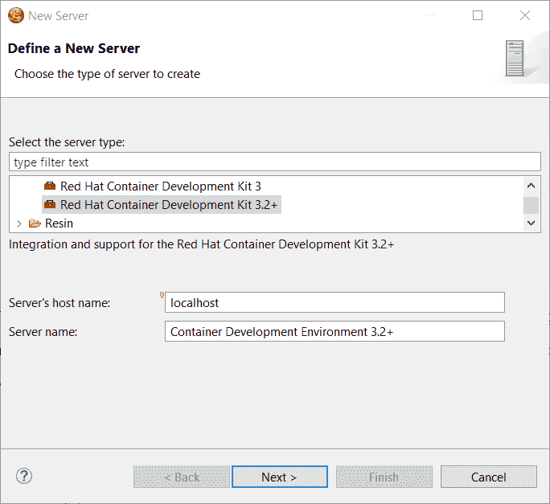

您所要做的就是为您的 Red Hat 帐户设置凭证、CDK 的 minishift 二进制文件的位置、虚拟化管理程序的类型以及可选的 CDK 配置文件名称。

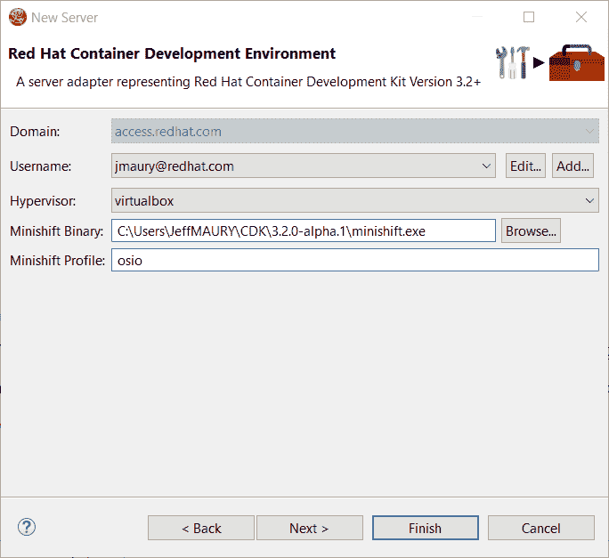

完成后，将创建一个新的 CDK 服务器适配器，并在 Servers 视图中可见。

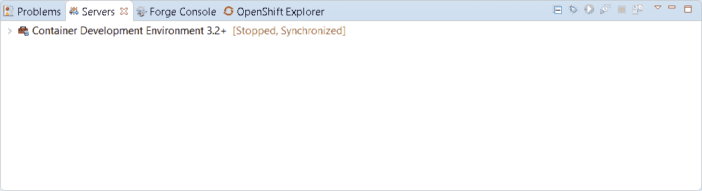

一旦服务器启动，Docker 和 OpenShift 连接应该出现在各自的视图中，允许用户快速创建一个新的 Openshift 应用程序，并开始在一个高度可复制的环境中开发他们的 AwesomeApp。

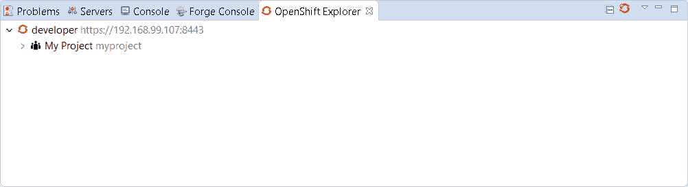

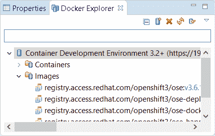

#### 调整资源限制的新命令

添加了一个新命令来优化 OpenShift 部署上的资源限制(CPU、内存)。它可用于服务、部署配置、复制控制器或 Pod。

要激活它，进入 OpenShift explorer，选择 OpenShift 资源，右键单击，然后选择`Edit resource limits`。将出现以下对话框:


在您更改此部署的资源限制后，它将被更新并生成新的窗格(不适用于 ReplicationController)。

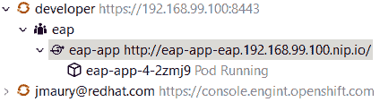

#### 发现 OpenShift 连接的 Docker 注册表 URL

创建 OpenShift 连接时，Docker 注册表 URL 为空。当通过 CDK 服务器适配器启动 CDK 时，如果找到匹配的 OpenShift 连接，则会创建或更新 OpenShift 连接。但是，如果您有几个 OpenShift 连接，那么剩下的连接将保留空 URL。

通过`Discover`按钮编辑 OpenShift 连接时，可以找到匹配的 Docker 注册表 URL:

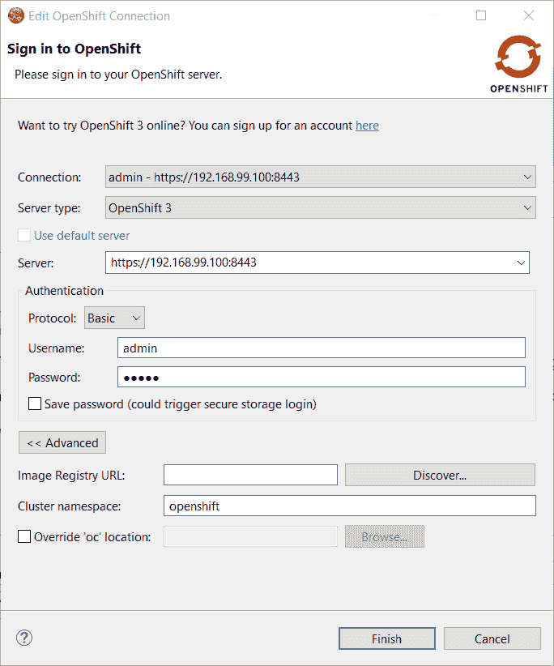

点击`Discover`按钮，如果找到匹配的 CDK 服务器适配器，Docker 注册表 URL 将被填充:

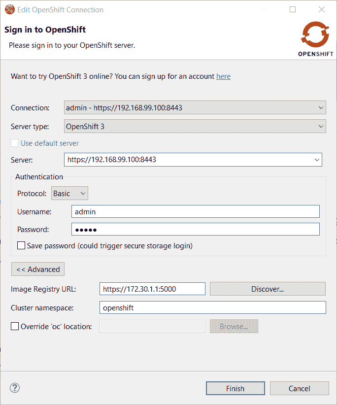

#### OpenShift.io 登录

可以从 JBoss Tools 登录到 OpenShift.io。每个工作区将维护一个帐户。一旦您首次登录 OpenShift.io，所有需要的帐户信息(令牌……)将被安全存储。

登录 OpenShift.io 有两种方式:

*   通过用户界面
*   通过调用适当扩展点的第三方服务

##### 基于 UI 登录到 OpenShift.io

在工具栏中，您应该会看到一个新图标。点击它，它将启动登录。

如果这是您第一次登录 OpenShift.io，或者如果您的 OpenShift.io 帐户令牌不再有效，您应该会看到一个显示以下内容的浏览器启动:

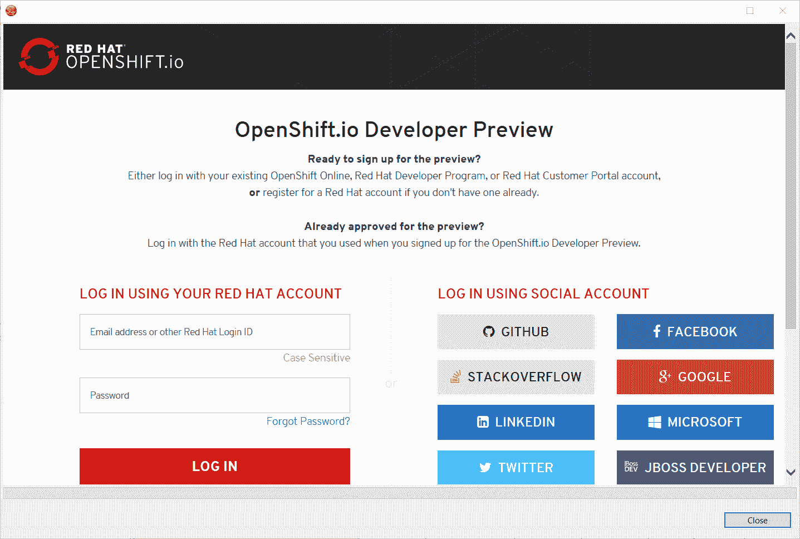

输入您的 RHDP 登录帐户，浏览器将自动关闭，并显示 OpenShift.io 令牌的摘录(出于安全原因):

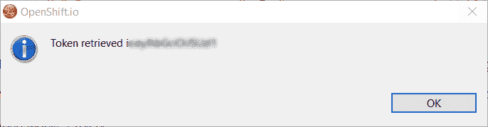

如果在工作空间中配置了 OpenShift.io 帐户，并且帐户信息有效，也会显示此对话框。

##### 通过扩展点

OpenShift.io 集成可以由第三方服务通过`org.jboss.tools.openshift.io.code.tokenProvider`扩展点调用。该扩展点将执行与 UI 相同的操作，但会将 OpenShift.io 的访问令牌返回给第三方服务。这里描述了如何使用这个扩展点的详细解释: [Wiki 页面](https://github.com/jbosstools/jbosstools-openshift/wiki/OpenShift.io-token-provider)

您可以使用 Eclipse `Jboss Tools → OpenShift.io`首选项节点显示帐户信息。如果您的工作空间还不包含 OpenShift.io 帐户，您应该会看到以下内容:

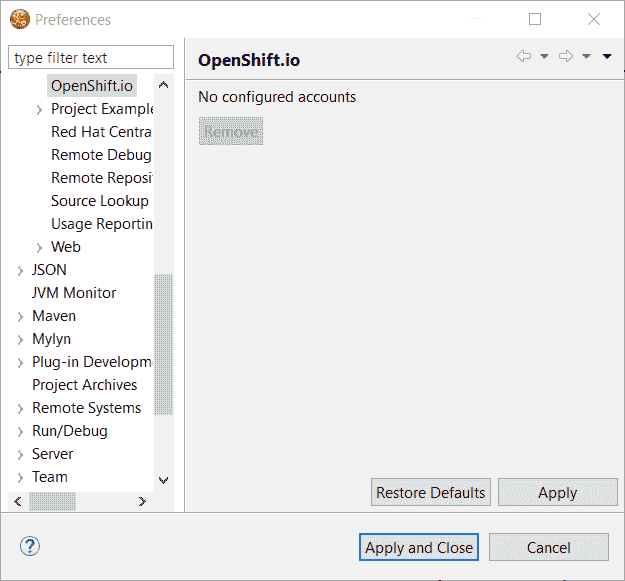

如果您有一个已配置的 OpenShift.io 帐户，您应该会看到:

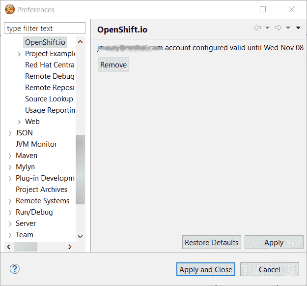

### 服务器工具

#### EAP 7.1 服务器适配器

添加了一个服务器适配器，可用于 EAP 7.1 和 WildFly 11。它是根据《野火 11》改编的。这种新的服务器适配器包括对增量管理部署的支持，就像它的上游 WildFly 11 对应物一样。

### 保险丝工具

#### 全局 Bean:改进对 Bean 引用的支持

现在可以在创建新 Bean 时从用户界面设置 Bean 引用:

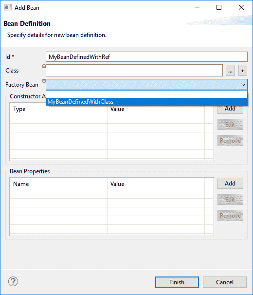

现在，在编辑现有 Bean 时，也可以在 properties 视图中编辑 Bean 引用:

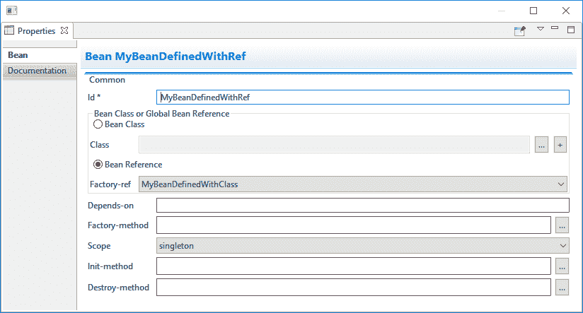

添加了额外的验证，以帮助用户避免混合使用类名定义的 bean 和引用其他 bean 定义的 bean。

#### Apache Karaf 4.x 服务器适配器

我们很高兴地宣布增加新的 Apache Karaf 服务器适配器。您现在可以从您的开发环境中下载并安装 Apache Karaf 4.0 和 4.1。

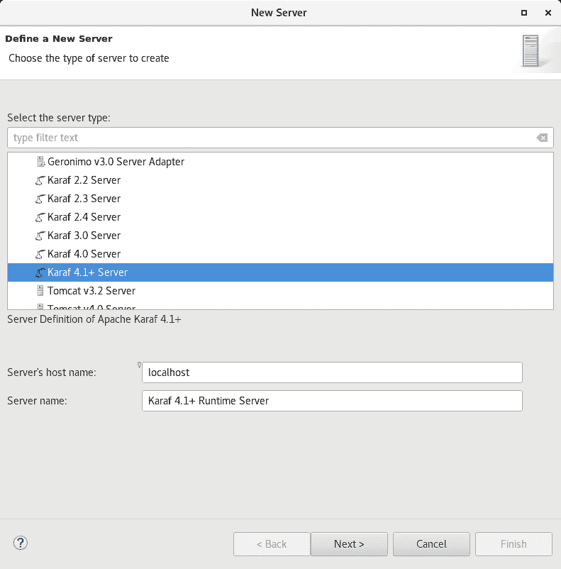

#### 切换阿帕奇骆驼版本

现在，您可以更改项目中使用的 Apache Camel 版本。为此，您需要在项目浏览器中引用项目的上下文菜单，并导航到`Configure`菜单。在那里，您将找到名为`Change Camel Version`的菜单项，它将引导您完成这一过程。

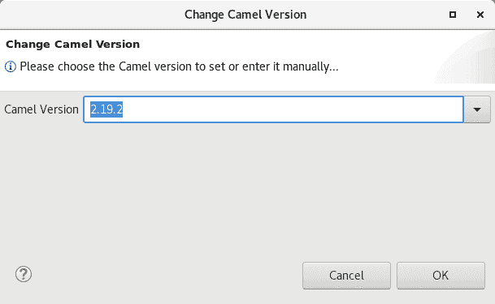

#### 改进的验证

编辑器中的验证已得到改进，可以查找缺少强制子元素的容器。(例如，没有子元素的选择)

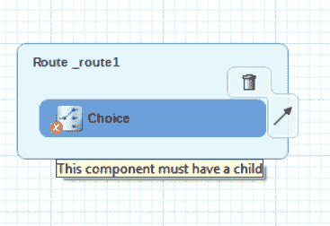

### 还有更多…

您可以在[本页](http://tools.stage.jboss.org/documentation/whatsnew/jbosstools/4.5.1.Final.html)找到更多值得关注的更新。

## 下一步是什么？

随着 JBoss Tools 4.5.1 和 Developer Studio 11.1 的发布，我们已经在为 Eclipse Oxygen 开发下一个维护版本了。

*Last updated: September 3, 2019*