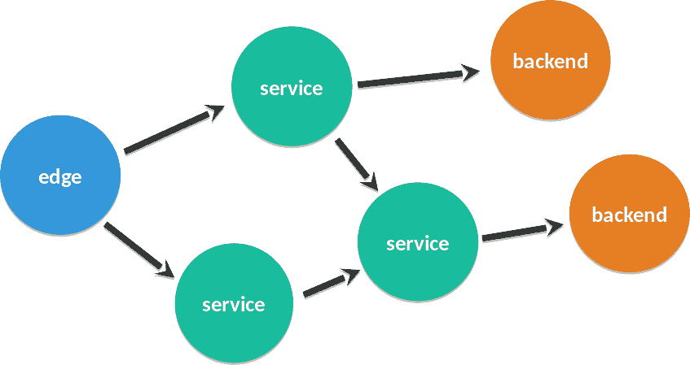

# JavaOne 上带有 Eclipse Vert.x 的服务器端 Kotlin

> 原文：<https://developers.redhat.com/blog/2017/10/13/server-side-kotlin-eclipse-vert-x-javaone>

我有幸在上个月的 JavaOne 大会 2017 上发言。这是我第一次去那里，既是与会者又是演讲者。

我必须说我印象非常深刻。特别是，在主题演讲中，我很高兴看到 Java 是如何向前发展的，跟上了云领域的快速创新步伐。

## 释放您的才能:面向移动开发者的服务器端 Kotlin

我的演讲是关于在 Eclipse Vert.x 的服务器端使用 Kotlin 语言。它们与*“full stack mobile developer”*是完美的搭配。

### 全栈移动开发者

随着越来越多的公司转向微服务架构，移动应用依赖于不同的业务服务。有时只有几个，有时几十个。然后，他们有必要构建并运行一个边缘服务，或者说 [API 网关](http://microservices.io/patterns/apigateway.html)。

fullstack 移动开发者将对移动应用的前端(设备代码)和后端(边缘服务代码)进行编程。

### 科特林的案子

Kotlin 是一种流行的 Android 应用替代语言。移动开发人员喜欢它，因为它带来了现代的编程结构，还允许与一系列设备兼容。事实上，超过 80%的设备使用 2015 年或之前发布的运行时版本。

但是 Kotlin 是通用的，也可以用在服务器端。

### 垂直 x

[Vert.x](http://vertx.io/) 是一个构建反应式应用的工具包。它的线程模型是移动开发人员所熟悉的:一个事件循环运行代码，但是您将阻塞任务卸载到一个工作池。此外，Vert.x 在事件循环上进行非阻塞 I/O。因此，它不会将服务器资源用于不稳定网络上的慢速客户端。是的，我们都曾带着智能手机去过那里...

### 行动:音乐目录和流媒体

一个演示抵得上一千张幻灯片，所以我为一个安卓音乐播放器(T1)编写了移动后端的代码。演示的[代码可以在 GitHub 上获得。在下面的视频中，您可以看到 HTTP 服务器以 JSON 格式提供曲目目录，并将曲目流式传输到仿真移动设备(打开声音，它会在结尾播放曲目！).](https://github.com/tsegismont/vertx-kotlin-music)

https://developers.redhat.com/media/119211

感兴趣吗？演示文稿[幻灯片](https://www.slideshare.net/ThomasSegismont/serverside-kotlin-for-mobile-developerq)可在 Slideshare 上获得。欢迎在这里或在 [Vert.x 用户组](https://groups.google.com/forum/?fromgroups#!forum/vertx)上提问。

* * *

**下载**[**Eclipse vert . x**](https://developers.redhat.com/promotions/vertx-cheatsheet/)**备忘单，该备忘单提供了一步一步的详细信息，让您以自己想要的方式创建应用。**

*Last updated: May 13, 2021*