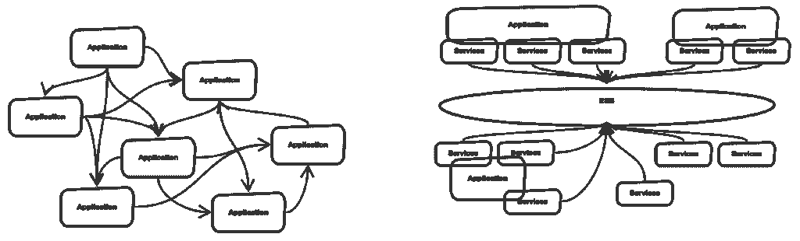
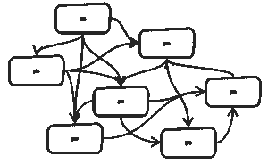
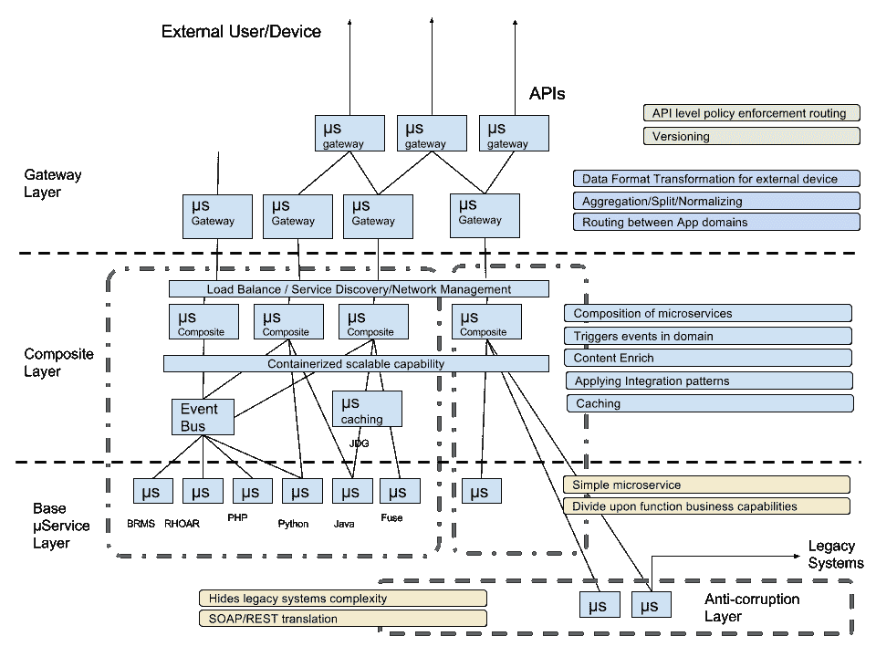
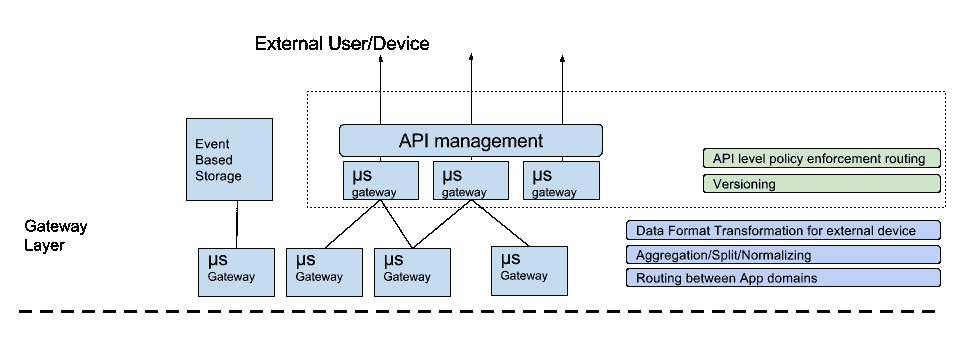
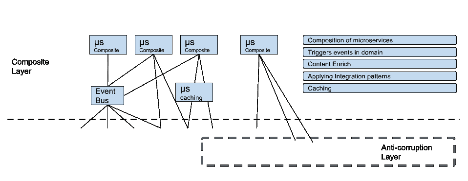
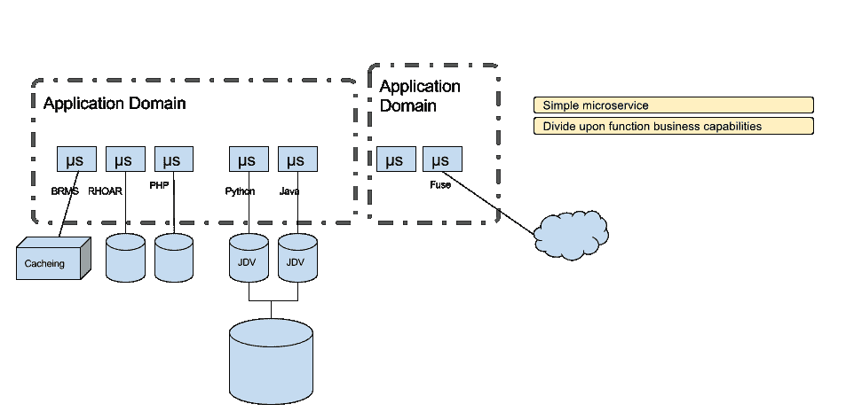

# 组织微服务-现代集成

> 原文：<https://developers.redhat.com/blog/2017/08/02/organizing-microservices-modern-integration>

微服务可能是我的开发者朋友中最流行的词汇之一，我确实喜欢灵活、敏捷和有更多选择的概念。但是作为一个在软件集成领域工作多年的人，我开始看到了过去 ESB 时代的一些相似之处。

从一万英尺高处看问题。十年前，我们必须想出一种更好的方法来组织系统之间的连接，停止在同一个业务逻辑上重复工作。那时面向服务的架构(SOA)开始流行。通过模块化服务，在其他系统之间共享它们，并组织通信方式和数据路由。ESB 是其中的一个实现，也许不一定是应该如何实现。

我非常幸运地参与了许多这类整合项目，并亲自领导了一些项目。我们与各种中间件供应商合作；当时，解决方案都是关于 ESB 的。通过将系统之间复杂的互连逻辑移除到 ESB 中，在团队之间协商数据模型(与应用程序/服务负责人)，为 web 服务设置 WSDL 契约，并在调用之间添加 BPEL 过程(如果需要)。我自己似乎也是这些 ESB 的一部分；在 ESB 之外，一切看起来都很有条理。提起 ESB“盒子”,你会发现它们中的许多以最糟糕的混乱的意大利面条式代码结束(或者图取决于你的工具)。和混乱的巨大捆绑，然后成为在企业中交付变更的瓶颈。

当独立部署微服务的想法出现时。这个巨大的整体怪物有一个 **智能管道** 的想法，它试图做太多的事情，如数据模型定义、流程、互连协议和数据格式转换...etc 和 **哑端点** 服务只是等待被事件激活，很快就被开发者抛弃了。服务之间的关系仍然是混乱的，整体性使得开发周期变得漫长而繁琐。微服务允许开发人员更加敏捷，他们需要“集成”这一块。这就是我曾经试图解决的一个问题的相似之处

更何况我们还需要与微服务之外的其他服务(系统/应用)进行交互。因此，从过去的经验中，我们知道哪些事情不应该做...

*   不再需要大型整体捆绑应用来加快开发周期。
*   停止在系统集成代码中执行复杂的业务流程。
*   数据模型不应该在集成层定义；这只会导致团队之间额外的协商。
*   状态不应该保存在集成层中，以允许最大的可伸缩性。
*   在服务之间创建修复复杂的契约。

尽管如此，旧的“整合”方式还是有我们喜欢的地方。

*   系统的有组织的可视化互联视图。
*   已经为集成应用程序定义的模式，例如数据的聚合、分离和规范化。
*   基于事件的方法。一种更具反应性、耦合度更低的系统集成方式。

这就是我提出微服务分层架构的原因。在现代集成/应用程序开发中，我希望在新的集成架构中实现的主要目标是灵活性。不仅以可扩展的方式，而且允许开发人员轻松地进行任何架构更改。

所以首先，在新的现代敏捷集成中，集成代码本身应该被分类成在商业世界中有意义的不同的小服务。并且被分离，使它们成为可独立部署的微服务单元。然后，我们可以开始对集成代码应用真正的 CI/CD。这将避免成为一个庞大的整体 ESB。

为了给我的微服务意大利面带来一些逻辑感，避免重蹈在单个集成捆绑包中承担太多的错误。我为我的微服务定义了四个层，因此每个层都有自己的职责，从而更容易适应变化。

*   **网关层:** 提供版本控制等简单的网关路由功能，处理不同平台的设备。

最初我想把这一层分成两层，但决定不这样做，因为网关模式现在已经变得如此流行，人们认为网关应该达到一定的能力。(这完全是另外一个故事，我想以后再谈)。这就是为什么我的图中有两种不同形式的网关；一个代表绿色，另一个代表蓝色。

都是关于 *分离的担忧* 。这一层完全是为了生成和组合外部 API 消费所需的内容。此时，不同的应用程序域试图相互集成，并路由到正确的服务版本。显然，两个主要问题是:

*   访问策略规则，端点版本控制。
    *   应用限制和策略设置流量限制。
    *   API 的安全性。
    *   路由到正确的版本。
*   结合；将结果返回给客户端。
    *   公民开发者是这里的主要创造者，他们利用每个微服务团队提供的能力，为外部客户提供有意义的服务。
    *   向外部用户收集、拆分或标准化规范的数据格式。
    *   根据客户翻译数据输出。
    *   应用域之间的路由。

*   **复合层:** 处理多个微服务组合的重要中间层。它们执行更复杂的路由，从处理内容数据到聚合/拆分数据，并通过触发事件或简单地传递它来将拆分/聚合的结果填充到其他微服务。这一层对客户端隐藏了微服务的复杂性。

这一层可能是完成大部分旧时间集成逻辑的层。

*   构建微服务
    *   通过调用微服务提供的 API，根据需要在微服务之间转换数据，并根据其内容将数据路由到相应的微服务。

*   触发域内事件
    *   我坚信 event base 在分离每个服务之间的粘性方面做得最好。并且由于它的异步特性，使性能处于最佳状态。这里的事件总线不一定是消息代理，而是任何形式的总线。
*   丰富内容
    *   此处的内容充实应针对具体的格式，尽可能避免任何业务方面的充实。
*   应用集成模式
    *   在微服务领域，旧的集成问题不会消失。通过应用成熟的模式，我们可以避免犯错误。
*   缓存
    *   REST 架构特别提到了缓存层。对于复合层来说，尝试应用缓存机制是有意义的，因为它与业务无关，但确实会对系统的性能和容错能力产生重大影响。

复合服务也应该包含在应用领域中，我将在基础层中讨论。

*   **基础层:** 顾名思义，它很可能代表了系统的基本组成部分。处理数据检索或业务逻辑处理。每一个都应该是独立的，自成一体的。

借用了 ***有界上下文*** 的思想，在这种情况下逻辑地将一组微服务组织成所谓的 *应用域* 。其中每个域表示共享相同数据模型的业务功能的独立实体，这消除了在代码中进行太多转换的需要。

*   **反腐败层**——这一层处理遗留应用程序或任何违背微服务快速灵活原则的接口。这一层通过完成转换工作，在系统的两个截然不同的实现之间进行转换，构建在系统的保护墙中。

下次见！:)

* * *

要构建您的 Java EE 微服务 **请访问** [**野生蜂群**](https://developers.redhat.com/promotions/wildflyswarm-cheatsheet/) **并下载备忘单。**

*Last updated: August 1, 2017*