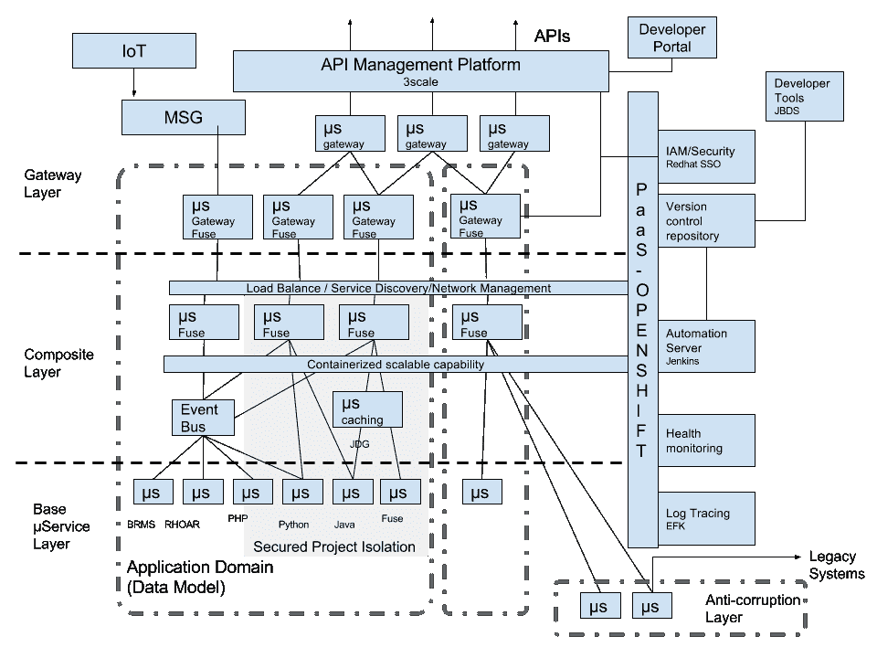

# 敏捷集成的参考架构

> 原文：<https://developers.redhat.com/blog/2017/07/27/reference-architecture-for-agile-integration>

整合仍然存在，但形式不同了。那么，现代集成是什么样子的呢？看看敏捷 scrum 如何接管传统的瀑布开发框架，通过实现更短的交付周期，更快的反馈，以及快速适应变化的灵活性。我相信是时候让传统的集成变得敏捷了。通过将传统 ESB 分解成分布式微服务。

简要回顾一下敏捷集成中应该包含的内容:

*   分布式集成
    *   轻量级，支持分布式部署
    *   基于模式的集成
    *   可重复使用的连接器
    *   微服务
*   集装箱
    *   云原生解决方案
    *   精益工件，可单独部署
    *   基于容器的扩展和高可用性
*   API
    *   定义明确、可重用、管理良好的端点
    *   生态系统杠杆

基于这三个原则，我被要求为它创建一个参考架构。经过一番思考，画出无数的方框和图表，当我看着一个 3 岁的孩子玩耍时，突然有了灵感。而在这里，这是我的回答……

是的。就是这样！敏捷集成的参考架构。在软件项目的设计阶段经常需要架构；它为软件项目提供了一个结构和主干。一旦完成，就完成了；任何架构上的修改都将是困难的，并且会带来灾难性的结果。我们都知道 *在软件开发中永远不变的一件事就是变* 。可能是因为法规要求，市场需求，或者仅仅是对业务领域的了解。所以我开始思考，我们能不能建立一个灵活的架构来适应变化，并能根据需要适应项目的需要？基于这个概念，这是我的敏捷集成参考架构，现代集成应用程序开发从多个角度实现了灵活性。

在我的敏捷集成参考架构图中有一些主要组件:

PaaS——通过允许开发人员自助服务以及支持自动化供应，为快速软件开发提供基础。它还将通过让整个环境做好开发准备来提高运营效率。

**安全/身份管理(IAM)**——处理应用程序接口和平台的基本认证和授权。

**自动化**——自动化构建应用程序的过程和升级的滚动部署策略。与持续集成工具一起，它可以实现应用软件的持续交付。

**日志记录和跟踪**——在一个单一的世界中被认为是容易的事情，现在已经成为分布式微服务架构集成的挑战之一。因为现在越来越难对事情的进展有一个统一的看法。有一种方法将日志作为一个整体来看是很重要的。并且具有对不同活动的跟踪能力。

容器化的包——容器技术允许我们构建不可变的可移植的轻量级应用程序包，这是语言不可知的。配置独立于这个构建，允许在多个环境中快速部署同一个包。

**容器管理**——在大规模系统中，有一个方便的管理平台来管理所有运行应用程序的容器是必不可少的。负责正在运行的容器的监控、发现、恢复和故障转移。

**微服务**——大型应用/服务被分解成易于维护的部分，可以在分布式环境中独立开发和部署。它们中的每一个都应该考虑到失败。

**负载平衡/服务发现/网络管理**——微服务是为了灵活性而构建的，根据当前的系统负载，负载应该为每个运行的实例自动平衡。所有的服务都应该被注册，并且不需要复杂的设置就可以在系统中找到。理想情况下，外部用户使用代理端点来隐藏部署复杂性。

**分层架构**——从逻辑上将微服务组织成一组层，每个层都有自己的职责，以避免重复工作，并使以后的替换更容易。目前有 4 层:

*   网关层-提供简单的网关路由功能，如版本控制，以及处理不同平台的设备。
*   复合层——处理多个微服务组合的重要中间层。它们从处理内容数据本身开始执行更复杂的路由，有时还处理更复杂的数据聚合或规范化。
*   基础层——就像这个名字一样，代表了系统的基本组成部分。处理数据检索或业务逻辑处理。
*   反腐败层——这一层处理遗留应用程序或任何违背微服务快速灵活原则的接口。通过在系统的两个截然不同的实现之间进行转换和翻译，这一层被构建在系统的保护墙中。

**应用领域**——这更像是一种模式，而不是架构。但是既然我们提到了软件中的层，我也想稍微谈一谈这个。因为这一切都是为了让微服务变得更有条理。定义每个应用程序域(使用同一组数据模型)是一个好的实践。并让其他外部集成微服务在每个域之间进行连接。微服务的另一个好处是，您可以灵活地将每个小型微服务移动到更适合它的不同领域。

**API 管理**——通过强化访问策略管理 API，收集 API 使用情况的统计数据。同时在 API 的开发者和用户之间建立一个健康的生态系统。进一步允许来自 API 的直接收入来源。

今天的技术肯定存在一些限制，无法形成一个完全灵活的建筑形式。但是我相信这种模型可以给系统带来灵活性，而不会在发生变化时对系统产生重大影响。我将在接下来的文章中提供更多的细节。

* * *

**利用您的红帽开发者会员资格和** [**免费下载 RHEL**](http://developers.redhat.com/products/rhel/download/) **。**  

*Last updated: July 26, 2017*