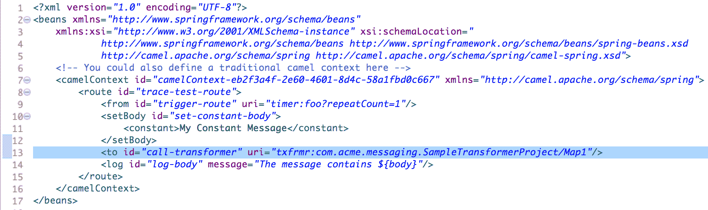
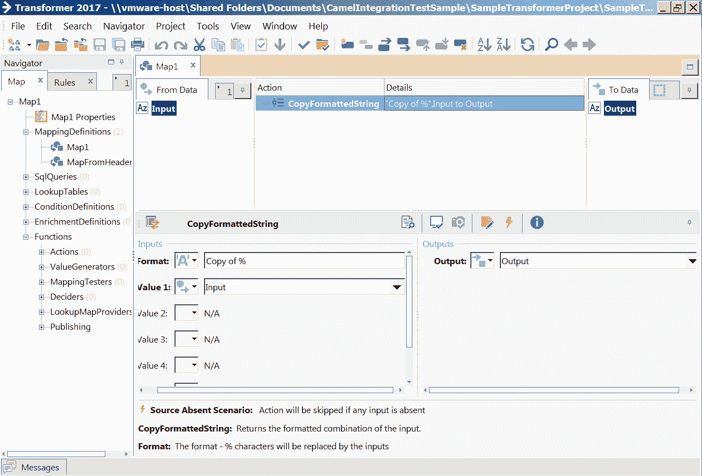
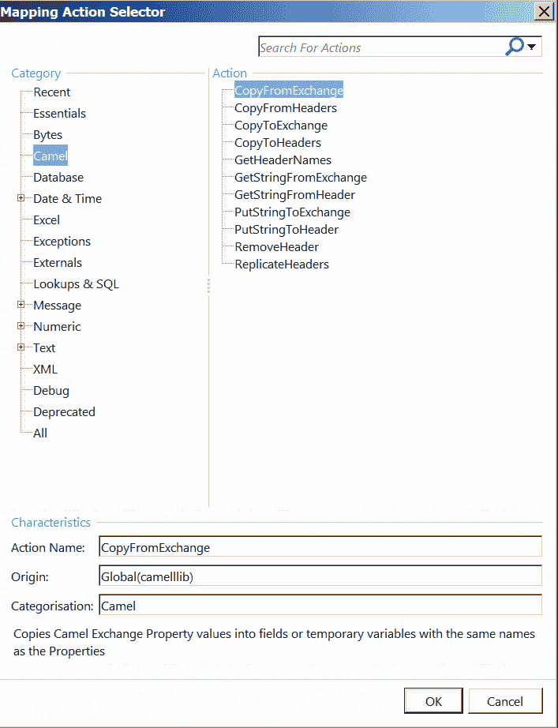

# 使用 Fuse 集成服务进行 EDI 转换(FIS)

> 原文：<https://developers.redhat.com/blog/2017/07/18/edi-transformations-with-fuse-integration-services-fis>

EDI，即电子数据交换，对于组织来说一直是一个具有挑战性的支持领域。由于 EDI 标准涵盖了从供应链到医疗到金融服务(FSI)的大量行业，这些标准会随着时间的推移而快速发展和变化，因此需要不断的维护。维护标准的绝对成本是很高的，不仅对组织来说如此，对努力跟上的 EDI 软件供应商来说也是如此。支付给标准组织的昂贵费用和快速发展的版本是社区中没有像样的开源 EDI 工具的主要原因。

传统上，大型单体专有企业应用集成(EAI)套件的核心包括一个解析器/转换引擎和工具。基于 GUI 的映射工具是 EDI 团队的首选工具，他们可以使用专用的图形映射工具专注于字段级映射和基本的字段操作。随着公司开始从 ESB 架构转向敏捷集成(微服务)方法，支持 EDI 的市场出现了巨大的缺口。一个这样的例子是 Apache Camel——一个用于实现企业集成模式的开源、轻量级、敏捷的集成库(EIP)。不幸的是，Apache Camel 及其竞争对手几乎不支持 EDI。

我们的问题的答案是使用一个专有的映射工具。我发现最好的是 [Trace Transformer](https://www.tracefinancial.com/transformer) 。Trace 过去专注于 FSI EDI 标准，如 SWIFT/CREST/FIX，但也涉足运输(X12)和医疗保健(HL7)等其他领域。Trace Transformer 吸引 Fuse 客户的地方在于它与 Camel 的深度集成能力——在运行时更新 Camel 交换、头或主体以及共享数据源的能力。Trace 已经创建了构建 OSGi 包的能力，它可以与您的骆驼路线对话并部署到 Karaf，以及在 SpringBoot 容器内运行的能力。最棒的是，它使用 Fuse Integration Services(FIS)2.0 xPaaS 映像在 Red Hat OpenShift 上无缝部署和运行。

为了演示 Transformer 在 SpringBoot 容器内的 OpenShift 上使用 FIS 2.0，我在这里创建了一个非常简单的项目。Camel 路线非常简单——将 Camel 主体设置为常量字符串，调用 Transformer 使用 Transformer 映射修改 Camel 主体，然后将 Transformer 返回的输出记录到日志文件中:

Trace 使用标准的 URI 语法创建了一个名为“txfrmr”的 Camel 端点。您可以指定 EDI 项目名称(SampleTransformerProject ),后跟映射名称(Map1 ),如上所述。

Trace Transformer 编辑器(如下)非常简单，任何 EDI 业务分析师(非程序员)都可以掌握。EDI BA 可以专注于他们最了解的东西——业务逻辑和底层 EDI 标准，他们将它们从输入映射到输出消息。一旦映射完成，EDI BA 就简单地生成一个“公开的服务”,它可以是一个简单的 JAR 库或 OSGi 包，然后交给开发人员集成到 Camel route 中。

说到骆驼，Transformer 有一些优秀的功能，可以与您的骆驼路线紧密集成。下面的屏幕演示了一些可用于从 Camel exchange 读取/写入数据的映射操作，甚至是通过验证异常或与共享的 OSGi 数据源进行交互。

在我以后的文章中，我计划介绍一种更复杂的 EDI 格式，如 X12(运输)、BAI2(银行)和 HL7(医疗保健)，以及这在微服务世界中会是什么样子。敬请关注。

* * *

**了解** [**Red Hat Openshift 容器平台**](https://developers.redhat.com/products/openshift/overview/) **，允许您供应、管理和扩展基于容器的应用程序。**