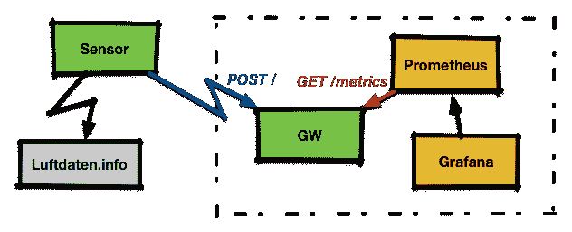
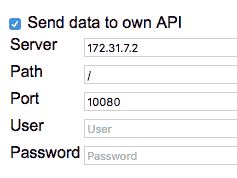
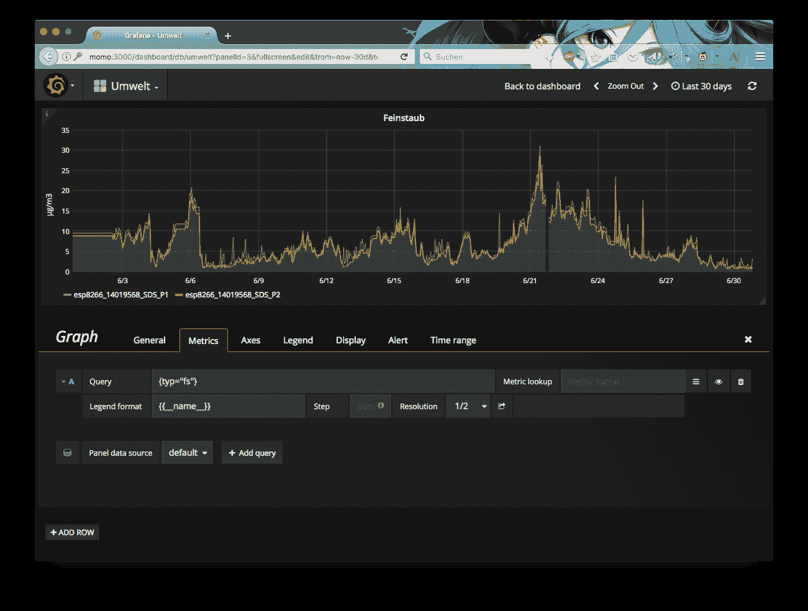

# 借助 Vert.x、Prometheus 和 Grafana 可视化烟雾传感器数据

> 原文：<https://developers.redhat.com/blog/2017/07/06/visualizing-smog-sensor-data-with-the-help-of-vert-x-prometheus-and-grafana>

空气污染是全球许多城市的主要问题。德国斯图加特的一些人开发了廉价的烟雾传感器，人们可以将其安装在阳台和其他方便的地方，然后将数据报告给一个中心站点。我已经在 OpenSource.com 写了这方面的文章。数据被发送到一个中央服务器，从那里它被可视化在地图上。在写上面这篇文章的时候，没有办法看到这个值是如何随时间变化的。与此同时，在地图上可以看到过去 24 小时的图像。

传感器还能够向其他目标发送数据，例如本地数据库。因此，我决定将数据传输到本地服务器进行长期存储，以可视化趋势。

当我在玩普罗米修斯的时候，我想把数据输入其中可能是一个很好的用例来进行进一步的探索。现在，Prometheus 想要抓取数据，而传感器只是推送数据，很明显，我需要一个中间网关来解决这种不匹配，并将传感器发送的数据格式转换为 Prometheus 期望的格式。



为了实现网关，我选择了 [Vert.x](http://vertx.io) 一个运行在 Java 虚拟机(JVM)上的现代反应式框架。我最初考虑的是其他选择，但事实证明，Vert.x 对连接和线程的隐式处理让我的生活变得简单了。

网关从传感器接收带有 InfluxDB 格式测量数据的 Http POST 请求。它以 Prometheus 文本格式公开数据以获取对/metrics 的请求。

最后，存储在 Prometheus 中的数据通过 [Grafana](https://grafana.com) 可视化。

我现在将展示一些代码片段；完整代码可在 [GitHub](https://github.com/pilhuhn/fsgw) 上获得。

## 网关代码

代码由上述两个端点的两个主要部分组成。我已经在同一个[垂直领域](http://vertx.io/docs/apidocs/io/vertx/core/Verticle.html)中实现了这两者。

```
public class MainVerticle extends AbstractVerticle {

  // Label on dust data
  private static final String TYP_FS = "{typ=\"fs\"}";

  @Override
  public void start(Future fut) {

    // [... see below ...]

    vertx
        .createHttpServer()
        .requestHandler(router::accept)
        .listen(
            // Set the port we listen on to 10080
            config().getInteger("http.port", 10080),
            result -> {
              if (result.succeeded()) {
                fut.complete();
   [...]
```

第一部分创建一个新的 verticle，然后在`start()`内部将它监听的 http 端口设置为 10080，然后告诉 Vert.x 配置就绪。然后，Vert.x 启动 is accept 循环并分派传入的请求。

下一步是为端点定义处理程序来完成实际的工作。在处理程序中，我们需要小心不要阻塞或实现缓慢的操作；在这种情况下，Vert.x 可以决定中止处理程序。

让我们先来看看数据抓取的处理程序:

```
router.get("/metrics")
          .handler(routingContext -> {

      HttpServerResponse response = routingContext.response();

      // If we have no data yet, return a 204 'no content'
      if (values.isEmpty()) {
        response.setStatusCode(204).end();
        return;
      }

      // Construct the response
      StringBuilder builder = [...]
      // send it back
      response.setStatusCode(200)
          .putHeader("content-type","text/plain; version=0.0.4")
          .end(builder.toString());
    });
```

现在让我们来看看 POST 处理程序。这稍微复杂一点，因为我们需要明确地告诉 Vert.x to 我们想要获得请求的主体。最重要的是，我们还想获得传感器 ID，它被编码在 Http-Header 中。

//我们需要身体，所以需要启用它。

```
// We need the body, so we need to enable getting it.
    router.route("/").handler(BodyHandler.create());

    // Bind "/" to our fs-input
    router.post("/")
          .handler(routingContext -> {
      // Get the sensor id from the header
      String tmp = routingContext.request().getHeader("X-Sensor");
[...]
      // Get the measurement data
      JsonObject body_json = routingContext.getBodyAsJson();
      JsonArray value_array = body_json.getJsonArray("sensordatavalues");
[...]
      HttpServerResponse response = routingContext.response();
      response.setStatusCode(200).end();
```

## 构建和运行代码

您可以从 GitHub 查看完整的代码，

```
$ mvn install
```

这将在目标目录中创建一个自包含的 Java 归档文件，其中包含我们的 Verticle 以及运行它所需的所有 Vert.x 代码。因此，跑步非常简单:

```
$ java -jar target/fsgw.jar
```

## 配置其他部分

对于设置，我在同一台 IP 地址为 172.31.7.2 的主机上运行 Gateway、Prometheus 和 Grafana。

### 对于传感器

转到传感器配置页面，选择“Send to own API”并输入网关的 IP 和端口，如下所示:



完成后，保存配置并重新启动传感器。

### 普罗米修斯

Prometheus 需要一个外部配置文件`prometheus.yml`,为我们的传感器获取额外的刮擦配置:

```
scrape_configs:
  - job_name: 'feinstaub'
    scrape_interval: 30s

    static_configs:
      - targets: ['172.31.7.2:10080']

```

作为目标，您从 Vert.x 网关输入 IP 地址和端口。完成后，您可以启动 Prometheus 并将配置路径传递给它:

```
$ prometheus -config.file /usr/local/etc/prometheus.yml
```

### 格拉夫纳

启动 Grafana，将浏览器指向 3000 端口；默认登录是*管理员/管理员*。
要设置 Grafana，需要定义一个类型为*普罗米修斯*的数据源，它指向位于`http://localhost:9090/`的普罗米修斯服务器。完成后，我们可以设置一个新的仪表板，并向其中添加图表。



在上面的截图中，您可以看到查询编辑器。由于网关中的代码被设置为根据类型在导出的物品上贴标签(传感器还可以报告温度和湿度)，因此可以使用标签查询`{{typ="fs"}}`来查询值。

## 摘要

本文展示了一个物联网设备以某种格式发送数据的端到端示例。在 Vert.x 框架的帮助下实现了一个网关，它完成了连接处理等所有的魔法。最后，数据存储在普罗米修斯时间序列数据库中，并通过 Grafana 绘制成图表。

* * *

**下载**[**Eclipse vert . x**](https://developers.redhat.com/promotions/vertx-cheatsheet/)**备忘单，该备忘单提供了一步一步的详细信息，让您以自己想要的方式创建应用。**

*Last updated: June 30, 2017*