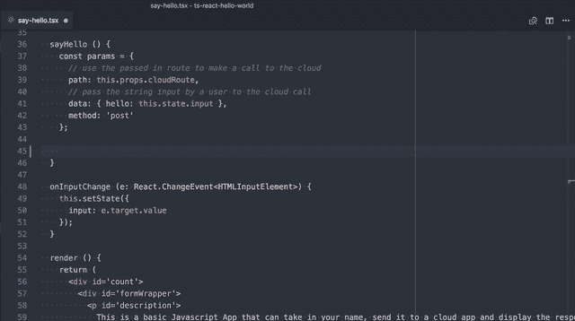
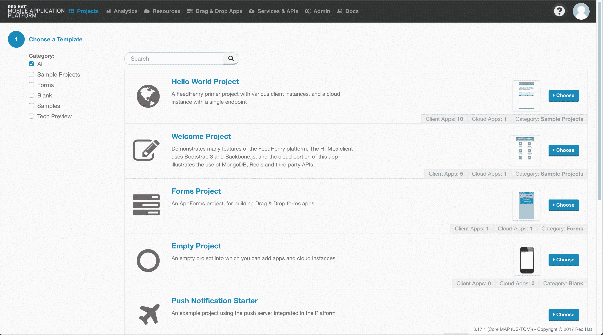
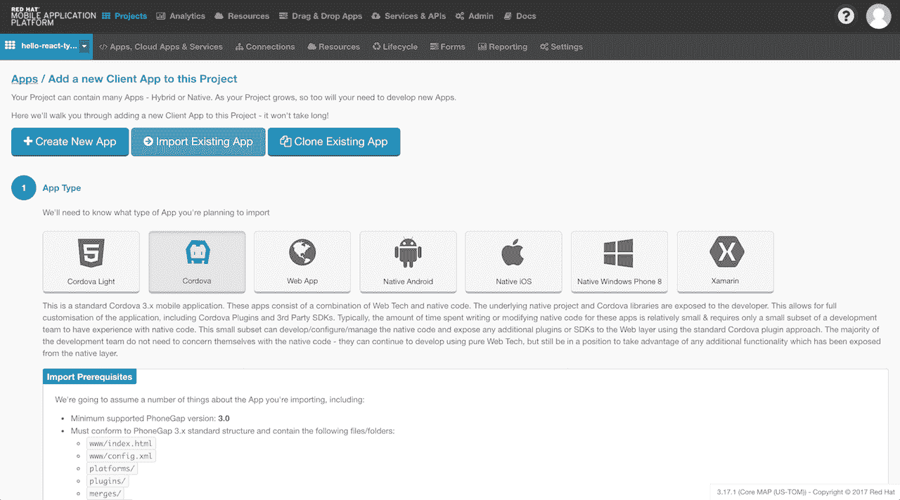
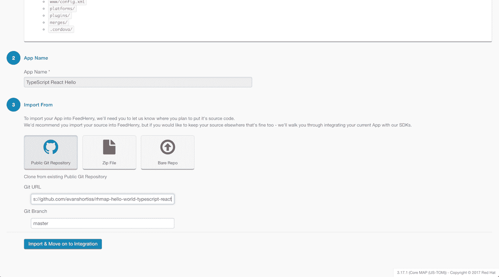
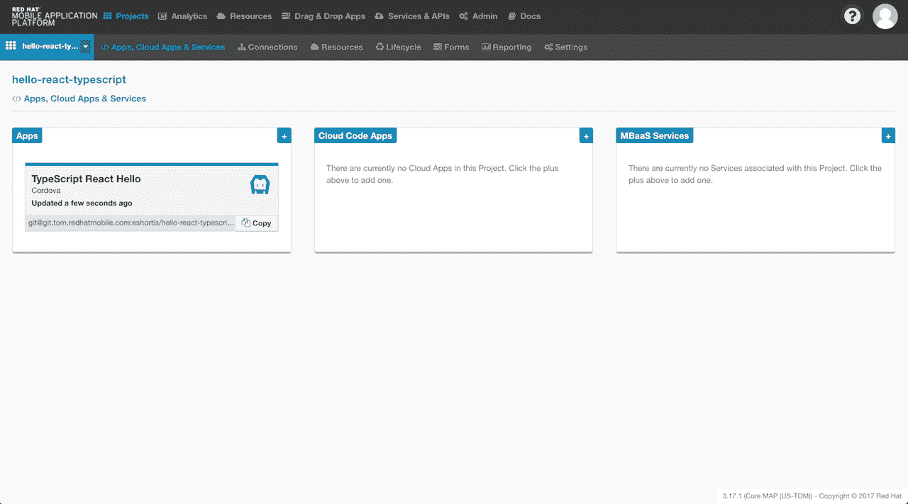
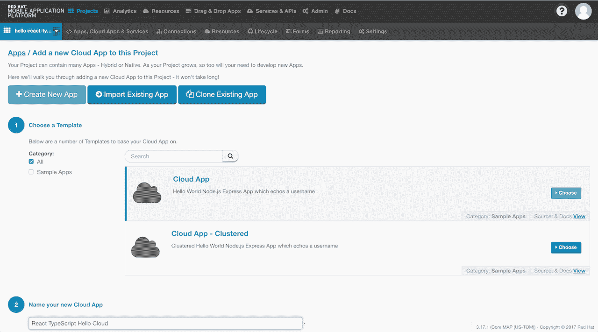
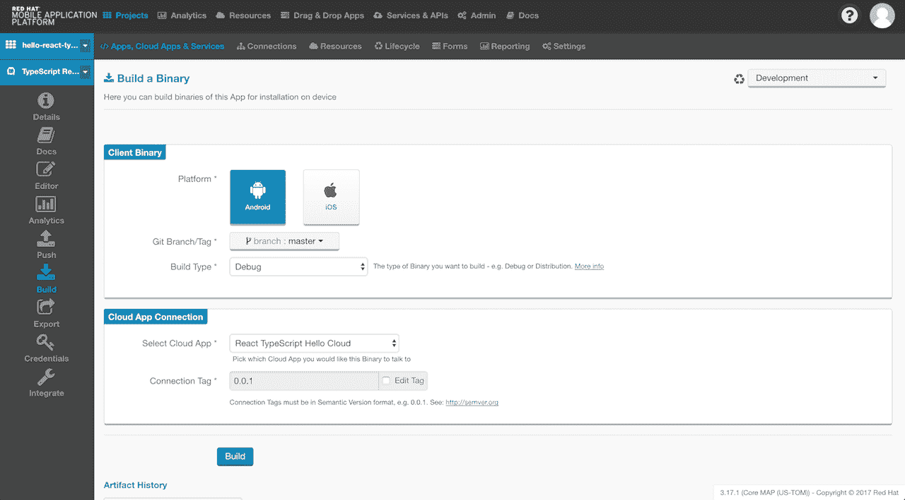
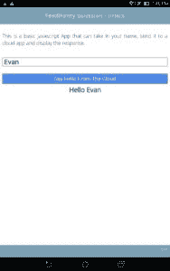

# 在 Red Hat 移动应用平台上使用 TypeScript 开发移动应用

> 原文：<https://developers.redhat.com/blog/2017/07/05/developing-mobile-applications-using-typescript-on-red-hat-mobile-application-platform>

从版本 2.19 开始，Red Hat Mobile JavaScript Client SDK 包含一个类型脚本定义文件。通过提供类型定义，我们的 JavaScript SDK 可以很容易地用于使用 TypeScript 开发的应用程序中。作为一名有几年 JavaScript 经验的开发人员，我最初对 TypeScript 持怀疑态度，但在使用了一段时间后，我不确定没有它我是如何做到的！在这篇文章中，我将看看 TypeScript 提供的好处，并演示如何在 Red Hat 移动应用程序平台上启动并运行用 TypeScript 编写的应用程序。

## 以打字打的文件

如果你不熟悉 TypeScript，那么最好去 project [网站](https://www.typescriptlang.org/)上读一点关于它的内容，但是总的来说，TypeScript 是 JavaScript 的超集，可以编译成普通的 JavaScript 代码。因为它可以编译成 JavaScript，所以几乎可以在任何 JavaScript 平台上运行——甚至是旧的浏览器！对于那些对编写 TypeScript 而不是普通 JavaScript 的好处感到好奇的人，这里有一个快速总结:

*   静态打字。由于更好的可读性、清晰的类型信息和出色的智能感知，这提高了开发速度。
*   编译。由于 TypeScript 被编译成 JavaScript，许多 JavaScript 容易忽略的错误在运行前就被编译器捕捉到了。
*   扩展的语言功能。您可以使用现代 JavaScript 语言特性，否则将需要浏览器的变通方法。
*   易用性。由于 TypeScript 是 JavaScript 的超集，JavaScript 开发人员很快就会熟悉它，对于不习惯 JavaScript 的开发人员来说，这是一个更容易的过渡。

让我们看看如何使用 TypeScript 改进下面的 JavaScript 代码:

```
// return the sum of two numbers
function add (x, y) {
  return x + y;
}
```

这个函数应该返回传递给它的两个数的和，但是没有什么可以阻止开发人员意外地传递这样一个对象:

```
// incorrectly try to use this function to merge two objects
add({firstname: 'red'}, {lastname" hat'});

```

如果你熟悉 JavaScript，你会意识到这段代码实际上会运行并返回结果“[对象对象][对象对象]”。理想情况下，我们希望在运行时之前捕获这些问题——这就是 TypeScript 可以帮助我们的地方:

```
// We specify the type of inputs using TypeScript syntax
// We don't specify the return type of this function since the TypeScript
// engine can use type inference to figure it out!
function add (x: number, y: number) {
  return x + y;
}
```

如果开发人员试图向该函数传递除数字之外的任何东西，TypeScript 编译器将抛出一个错误，从而避免浪费时间调试一个简单的开发人员错误。

下面的 GIF 是一个启用了 TypeScript 的编辑器(Visual Studio 代码)的示例，该编辑器为 RHMAP Client SDK 提供了文档和警告，如 I type:



## RHMAP 上的 TypeScript 入门

为了帮助您入门，我们使用 TypeScript 创建了标准 Hello World HTML5 Cordova 应用程序的新版本。我们还将其移植到 React，以进一步演示如何创建结构化、静态类型的 Cordova 应用程序。您可以在 GitHub 上的 [this repository 中找到这个应用程序的源代码。](https://github.com/evanshortiss/rhmap-hello-world-typescript-react)

那些一直在观察链接的 GitHub 存储库中的代码的人可能已经注意到，通常包含 Cordova 应用程序的 JavaScript 文件的 *www/* 文件夹只包含 CSS、JSON 和 HTML。这样做的原因是 JavaScript 文件很容易生成，所以我们特意选择不通过我们的*中的规则将它们提交给存储库。gitignore* 。您现在可能想知道 Red Hat 移动应用程序平台如何知道如何生成 JavaScript 文件。这个解决方案很简单但是非常强大——它将尝试调用一个可以在我们的 [package.json](https://github.com/evanshortiss/rhmap-hello-world-typescript-react/blob/master/package.json#L7) 中指定的*安装*脚本。这个特性提供了调用我们需要的工具的能力，比如 TypeScript 编译器和 browserify。

让我们将模板导入到您的 Red Hat 移动应用程序平台实例中。打开 web 浏览器并导航到您的域。从显示的创建屏幕左侧的选项中选择“空白”来选择一个现有项目或创建一个新的空白项目:



创建项目后，向其中添加一个新的客户端应用程序。客户端应用程序是将在移动设备或 web 浏览器上运行的应用程序。若要添加客户端应用程序，请点按“应用程序”面板一角的加号图标:


当添加客户端应用程序时选择“导入现有应用程序”，当提示选择类型时选择“Cordova”:



现在选择“Public Git Repository”选项，当提示输入存储库 URL 时，输入 https://github . com/evanshortiss/rhmap-hello-world-typescript-react 并选择*主*分支，如下所示:



导入完成后，您可以返回到项目屏幕进行查看。在项目屏幕中，您需要通过单击加号图标来添加云应用程序，类似于您添加客户端应用程序的方式:



选择我们的常规“云应用”模板，并为其命名:



创建云应用程序后，部署它，然后导航回您的客户端应用程序。转到客户端应用程序中的“Build”屏幕，为您选择的平台创建一个应用程序二进制文件。请记住，iOS 将要求您上传有效的 iOS 开发者凭据，但 Android 调试版本可以在没有任何特殊要求的情况下完成:



构建过程完成后，您将看到一个二维码，您可以在移动设备上扫描该二维码来安装我们的应用程序。这是一个在安卓平板电脑上运行的例子。在文本框中输入您的姓名，然后轻按“从云端向您问好”按钮，让它回显。



* * *

**红帽移动应用平台** [**下载**](https://developers.redhat.com/products/mobileplatform/download/) **，可在** [**红帽移动应用平台**](https://developers.redhat.com/products/mobileplatform/overview/) **了解更多。**

*Last updated: June 29, 2017*