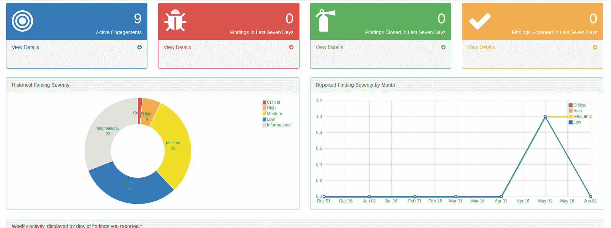
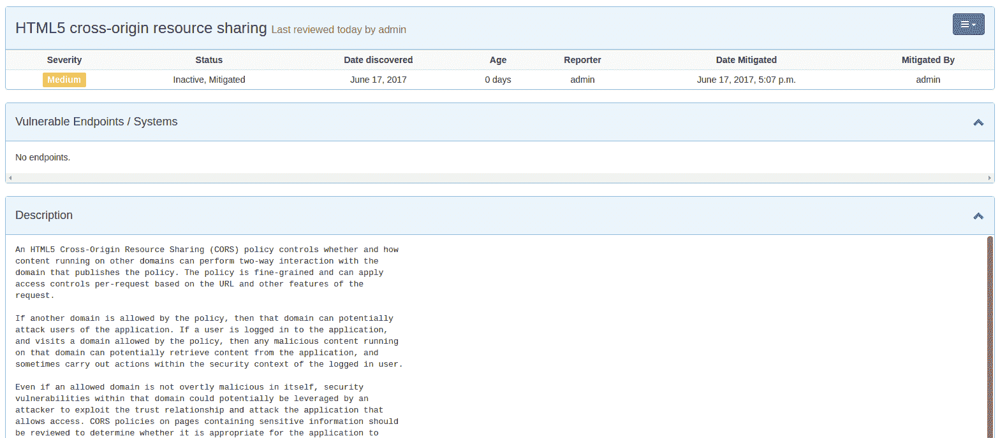
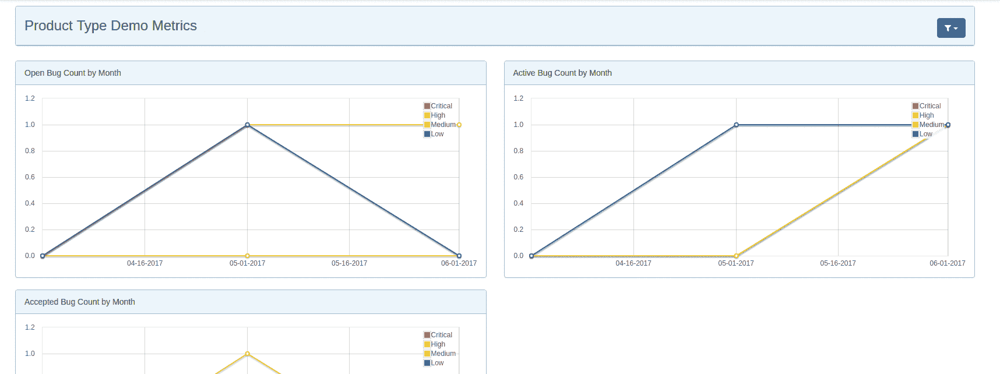
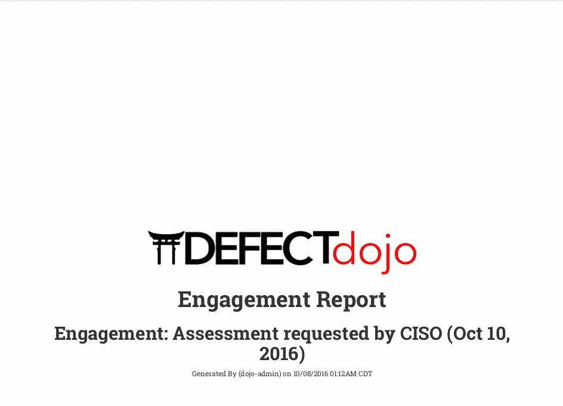
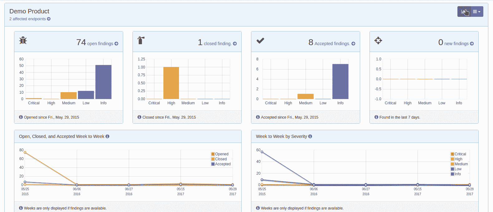

# 未经雕琢的钻石:使用 OWASP DefectDojo 进行有效的漏洞管理

> 原文：<https://developers.redhat.com/blog/2017/06/23/the-diamond-in-the-rough-effective-vulnerability-management-with-owasp-defectdojo>

管理项目应用程序的安全性可能是一项艰巨且难以管理的任务。在当今世界，新创建的框架和语言的数量在持续增加，它们各自都有与之相关的安全缺陷。

各种各样的安全扫描程序可以帮助您找到项目中的漏洞，但是有些扫描程序只适用于某些语言，并且它们各自具有不同的报告输出格式。为客户或经理创建报告以及在不同的项目中使用不同的安全工具查看分析结果可能是一项非常耗时的任务。

进入 DefectDojo。


DefectDojo 是一款开源漏洞管理工具，有助于自动化并减少安全工程师在应用安全流程中需要花费的时间。DefectDojo 将帮助安全工程师花更多的时间进行安全调查和寻找漏洞，而不是创建报告和创建指标。

## 特征

### DefectDojo 仪表板

DefectDojo 仪表板为您提供了总体产品安全约定的摘要和运行状况检查。您可以看到当前正在进行的项目数量以及过去一周的漏洞发现统计数据。

这些快速统计数据可以帮助您掌握最新的发现，并确保漏洞数量不会每周稳步攀升。还有调查结果图表，用于按总数和每月跟踪报告的漏洞的严重性。



### 添加漏洞发现

应用程序或项目中的漏洞“发现”可以手动添加到 DefectDojo 中，以便进行跟踪。此外，如果您认为应用程序中可能存在漏洞，但您不完全确定这是否是一个问题(或需要更多调查)，您可以将其添加为“潜在发现”，如果这确实是一个安全问题，则稍后可以将其提升为已验证的发现。


除了手动添加漏洞发现，DefectDojo 还允许您使用许多渗透测试工具和扫描器来导入扫描结果:

1.  打嗝套件(XML)
2.  无(CSV，XML)
3.  XML 格式
4.  ZAP (XML)
5.  Veracode (XML)
6.  Checkmarx (XML)
7.  应用蜘蛛(XML)
8.  蜘蛛扫描器(JSON)
9.  可视代码抓取器
10.  OWASP 相关性检查(XML)
11.  Retire.js JavaScript 扫描(JSON)
12.  节点安全平台(JSON)

(也支持即将推出的 Qualys 和 Snyk 扫描导入。)

DefectDojo 将解析来自上述任何渗透测试工具的报告，因此您可以在一个地方获得来自多个工具的所有发现。扫描器整合功能将通过比较以前的调查结果来查看问题是否已被报告，从而防止创建重复的调查结果。

如果您还想以某种格式添加手动调查结果，或者有一个输出为 CSV 格式的工具，可以选择使用 CSV 导入格式导入通用调查结果。

### 查找模板

对于任何安全工程师来说，一个重复的任务就是必须重新解释/记录应用程序或项目之间重复出现的漏洞类型。为了节省反复写相同信息的时间，你可以简单地写一个发现“模板”。使用这些模板，您可以将有关某个重复出现的漏洞类型的信息添加到基础模板中，以后可以对其进行修改。



这里的主要好处是节省了解释常见漏洞的时间。如果每次需要为不同的应用程序或项目手动解释某个漏洞，随着时间的推移，如果工程师开始缩短冗长的解释，关键信息或解释细节可能会被遗漏。

预定义的模板不仅会节省安全工程师的时间，而且每次还会为您常见的漏洞发现提供更详细的信息。

### 韵律学

DefectDojo 提供了全面深入的指标。很容易看到跨产品、合约和单个扫描的概述指标。此外，许多页面允许您查看用户界面中表格中包含的调查结果图表。这是一种很好的方式来查看某些特定发现数据的完整可视化表示，无论是针对整个产品还是某些扫描发现的子集。



### 

### 报告

DefectDojo 最强大、最省时的特性之一是报告功能。DefectDojo 将允许您从个人扫描、约定和产品等领域生成报告。这些报告可以以 PDF 或 AsciiDoc 格式生成。



此外，您还可以生成定制的报告，并使用强大的过滤功能来记录您需要的漏洞发现。

这些自定义报告允许您在报告中选择您想要的内容。报告生成器具有直观的拖放系统，允许您包含以下元素，以使报告尽可能详细:

*   封面
*   目录
*   所见即所得内容
*   调查结果列表
*   端点列表
*   分页符

### DefectDojo API

DefectDojo 还提供了一个 API，可以用来与解决方案进行交互。API 中最有用的端点之一是 importScan 端点。这将允许您将扫描结果直接导入 DefectDojo。这可以通过自动将来自渗透测试工具的扫描结果发送到 DefectDojo API 进行处理，从而极大地增强您的安全自动化管道。

```
{
"minimum_severity": "", # Minimum Severity to Report
"scan_date": "datetime", # Date of the Scan
"verified": false, # Manually verified by tester?
"file": "", # The scanner output report file
"tags": "", # User defined tags/labels
"active": false, # Flaw active or historical?
"engagement": "", # Relevant Engagement
"scan_type": "" # Type of Scan. eg. Zap
}
```

### 扫描计划

以及从安全工具导入以前的扫描结果；它目前还支持调度端口扫描使用 NMAP 从应用程序本身。您可以设置执行这些扫描的时间间隔，并通过电子邮件获得结果通知。在未来，DefectDojo 将致力于允许您使用应用程序中的其他工具来执行扫描，并增强 DefectDojo 本身和最终安全工具之间的集成联系。


### 用户角色

虽然安全工程师主要使用这个工具，但是其他用户也可以从 DefectDojo 提供的有洞察力的指标中受益。可以为用户设置有限的访问角色，以便他们只能使用应用程序中的某些功能或查看授权给他们的产品/项目。

这对于允许项目经理在不需要超级用户权限的情况下快速发现影响其产品的漏洞非常有用。



### 吉拉一体化

DefectDojo 也支持与吉拉的整合。您可以在吉拉创建一个新的 webhook 来使用此功能。一旦配置正确，您就可以将 DefectDojo 中的结果推送到吉拉。还有一个额外的好处是，集成是双向的，所以如果一个问题在吉拉关闭，它也会在 DefectDojo 等关闭。

## 示例工作流程

DefectDojo 旨在使跨产品和约定跟踪缺陷变得容易。

1.  使用 DefectDojo 的第一个推荐步骤是创建一个产品类型。产品类型可用于将产品分组在一起。
2.  您现在可以创建一个新产品，它可以是一个项目或独立的应用程序。
3.  下一步是创建一个新的测试类型。这些将帮助你区分你的工作范围。例如，您可能有一个依赖项检查测试类型或静态扫描测试类型。
4.  接下来，创建新的开发环境将是一个好主意。这对于跟踪特定产品的部署非常有用。
5.  一旦我们有了上述项目设置，我们可以添加一个项目。合约记录了在一定时间内获得的调查结果和详细信息。例如，它可以列出从 Nessus 扫描中发现的漏洞以及一些关于评估的注释。
6.  当扫描结果作为合约的一部分导入时，您可以开始为合约生成报告或查看评估指标。

## 摘要

显而易见，DefectDojo 在管理跨产品的漏洞方面做得非常出色，并有助于充分利用您的应用程序安全资源。

简化的用户界面生成的报告和各种度量方案使非安全工程师能够轻松地查看结果，而不必从各种安全工具中搜寻冗长的 XML 和 JSON 结果文件。

从导入扫描结果到在几秒钟内生成有洞察力的报告，DefectDojo 是一个非常有用的工具，在处理漏洞管理的混乱时，它将是一个显著的时间节省器。

DefectDojo 可以在 GitHub 的 OWASP/django-DefectDojo 上找到。

* * *

**利用您的红帽开发者会员资格和** [**免费下载 RHEL**](http://developers.redhat.com/products/rhel/download/) **。**

*Last updated: June 20, 2017*