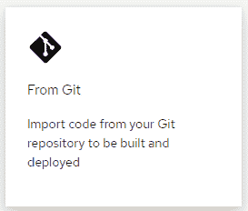
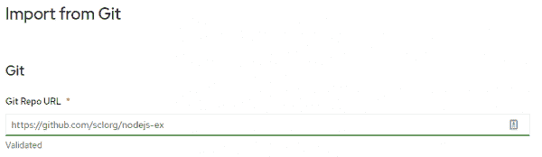
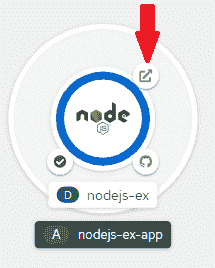
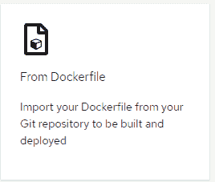
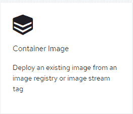

# 开始使用 Red Hat OpenShift 的开发人员沙盒

> 原文：<https://developers.redhat.com/node/225251>

虽然了解最先进的软件开发非常重要，但是没有什么比亲身体验更好的了。挑战在于，并不是每个人都在微服务、容器和无服务器计算技术正在推广的地方工作。现在，您终于可以通过使用 Red Hat OpenShift 的[开发者沙箱获得第一手知识了。](https://developers.redhat.com/developer-sandbox)

现在您已经有了自己的集群，是时候让它开始运行了。

## 得到那个集群

第一步，如果你还没有做的话，就是去红帽 OpenShift 页面的开发者沙箱[，为你自己获得一个免费的 OpenShift 集群。如果你还不是会员的话，你也可以加入](https://developers.redhat.com/developer-sandbox)[红帽开发者计划](https://developers.redhat.com/about)，该计划提供[一些难以置信的好处](https://developers.redhat.com/articles/red-hat-developer-program-benefits#red_hat_knowledgebase_content)。

一旦你有了自己的集群，点击**开始使用你的沙箱**开始你的未来，如图 1 所示。

## 构建选项

在本文中，我们将讨论在集群中构建和部署应用程序的三种方法。它们是:

1.  从源代码构建应用程序
2.  从源代码和 docker 文件构建应用程序
3.  从容器映像构建应用程序

此外，这些示例中涵盖了以下编程语言:

*   C#
*   去
*   Java 语言(一种计算机语言，尤用于创建网站)
*   节点. js
*   服务器端编程语言（Professional Hypertext Preprocessor 的缩写）
*   计算机编程语言
*   红宝石

## 选项 1:从源代码构建应用程序

OpenShift 包括一个称为 *s2i* 的源到映像构建特性。这个特性允许你将一个构建指向一个 Github 库(酷孩子称之为 *repos* )，并让 OpenShift 通过下载源代码、构建映像并部署它来完成剩下的工作。要使用 s2i，请执行以下操作:

1.  切换到开发人员视图(如果您需要选择一个项目，请选择带有“-dev”后缀的项目)。
2.  选择选项**添加新的应用程序**。
3.  从 Git 选项中选择**，如图 2 所示。**

Figure 2: This option will build from your source code in a Git repo.

4.  提供 URL 并点击**创建**。

以下是上述列表的一些详细信息:

*   您需要提供 GitHub repo 的 URL，如图 3 所示。
*   OpenShift 将验证 URL 并尝试检测使用哪个构建引擎。如果不能，你需要选择合适的环境；比如 Java。

Figure 3: Specify the Git repo to use for building your application from source.

点击底部的“创建”按钮，让 OpenShift 完成剩下的工作。

以下是一些可用于相关语言的 URL:

*   [C#(。净核心)](https://github.com/DonSchenck/qotd-csharp)
*   [出发](https://github.com/sclorg/golang-ex.git)
*   [Java](https://github.com/jboss-openshift/openshift-quickstarts)
*   [Node.js](https://github.com/sclorg/nodejs-ex)
*   [PHP](https://github.com/sclorg/cakephp-ex.git)
*   [Python](https://github.com/sclorg/django-ex.git)
*   [红宝石](https://github.com/sclorg/ruby-ex.git)

几分钟后，应用程序图标上的环将从浅蓝色切换到深蓝色，这意味着它已经准备好了。单击外部链接图像，在浏览器中查看您的应用程序，如图 4 所示。

Figure 4: Click to launch your app in a browser.

下一步是什么？你试试自己的源代码怎么样？继续，这就是沙盒的作用——实验和学习。

## 选项 2:从源代码和 docker 文件构建应用程序

遵循选项 1 中的步骤，但是在步骤 3 中选择 Dockerfile 中的**选项，如图 5 所示。**

Figure 5: Use this option to use a Dockerfile to build your app.

在这个场景中，您在 GitHub repo 中有代码，这些代码还包括 Dockerfile，它用于从命令行工具(如 docker 或 podman)构建映像。此选项在构建过程中为您提供了更大的灵活性，因为您的文件包含特定的构建指令。它还允许您使用不包含在 OpenShift 中的图像—例如，我以前可以构建一个. NET 5 应用程序。NET 5 可用于 Git 选项中的**。**

与前一个选项一样，您提供了一个 Git repo 的 URL。您可能需要提供 Dockerfile 文件的路径，但这通常是在项目的根目录中，因此默认值应该可以。您需要的唯一“内部信息”是暴露的端口号。这来自 Dockerfile 中的 EXPOSE 行。我经常忘记检查这一点，当我的应用程序没有出现在浏览器中时，这—错误的端口号—就是原因。记住这个。

如果您愿意，可以使用其他参数，我鼓励您在前进的过程中尝试这些参数。现在，只需使用默认值并点击底部的 **Create** 。OpenShift 将获取源代码，并使用 Dockerfile 指令来构建您的映像并在您的集群中部署应用程序。和以前一样，您可以通过单击外部链接图像在浏览器中查看应用程序输出。

这里有一些 GitHub repos，你可以用来尝试这个选项:

*   [C#(。净核心)](https://github.com/donschenck/qotd-csharp)
*   [出发](https://github.com/redhat-developer-demos/qotd)
*   [Node.js](https://github.com/donschenck/qotd-nodejs)
*   [Python](//github.com/donschenck/qotd-python)
*   您自己的源代码报告，包括一个 docker 文件

## 选项 3:从容器映像构建应用程序

遵循选项 1 中的步骤，但是在步骤 3 中选择如图 6 所示的**容器图像**选项。

Figure 6: Use this option to run a container image in OpenShift.

这是我 100%使用的选项。我喜欢在我的 PC 上构建和测试我的图像，然后将它们推送到我的图像注册中心(quay.io/donschenck)。一旦一个图像被存放在一个注册表中，把它放入 OpenShift 就非常简单了。

就像其他两个选项一样，最简单的方法是提供输入的位置——在本例中是一个图像——如图 7 所示，然后单击 **Create** 。是的，就是这么简单。

Figure 7: Run an image on OpenShift with this option.

## 因此

是的。到处玩。尝试事物。打碎东西。学习。红帽开发者项目中有丰富的知识。

最后，将所有这些构建工作自动化不是很酷吗？好吧，你猜怎么着:你可以。查看我即将发表的关于 Tekton 的文章和视频系列，这是一个开源的图像构建系统。它让你使用你的编程技能来自动化你自己的工作。

为美好的未来干杯。

*Last updated: May 6, 2021*