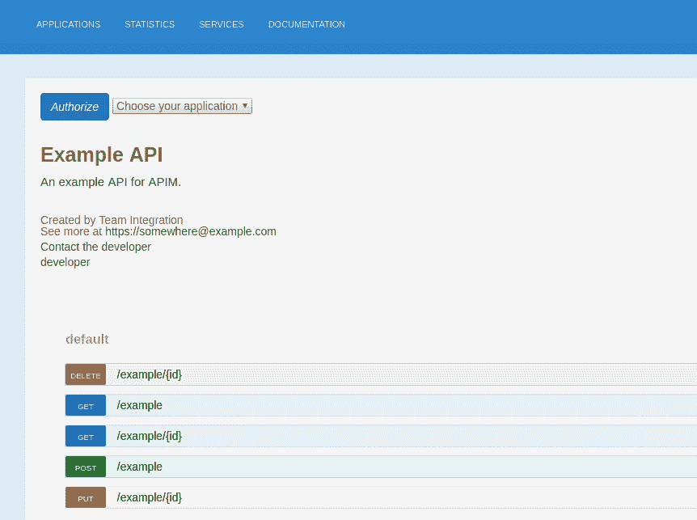
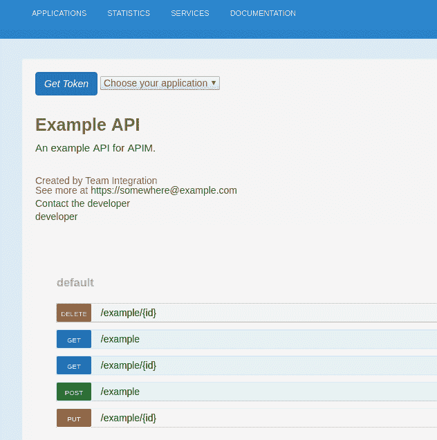
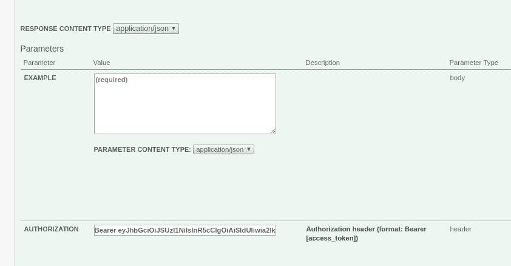

# 3scale ActiveDocs 和 OAuth 2.0

> 原文：<https://developers.redhat.com/blog/2018/03/09/3scale-activedocs-oauth-2-0>

# 如何使用 Red Hat 单点登录保护您的 API 文档？

本指南旨在帮助您将 Red Hat 单点登录服务器与基于 OpenAPI (OAI)的 ActiveDocs 集成到您的 3scale 开发人员门户中。虽然它只是通过这个特定的身份和访问管理解决方案(IAM)实现的，但是理论上，您可以在必要的地方进行一些定制，以便与另一个基于 OpenID Connect 的解决方案集成。

这是一系列文章的第一部分，每个 OAuth 2.0 流程都将单独讨论。这里我们从**授权代码流**开始。


# 什么是 ActiveDocs？

ActiveDocs 是基于[OAI 2.0](https://github.com/OAI/OpenAPI-Specification/blob/master/versions/2.0.md)&[swaggeri](https://github.com/swagger-api/swagger-ui)的 3scale 特性。您可以在 3scale &上托管任何 OAI 兼容规范，并将其发布在开发者门户网站上，供您的社区参考&测试。3scale ActiveDocs 的一大优势是它有自己的代理，支持跨源资源共享(CORS)——这仅在使用 SaaS 平台时适用。完美！不需要为此配置自己的 API 来支持 CORS。

此外，还有一些[自定义 3scale 字段](https://access.redhat.com/documentation/en-us/red_hat_3scale/2.saas/html/api_documentation/create-activedocs-spec#useful_tools)，您可以在 OAI 规范中使用它们来显示当前登录用户的凭证，以便于使用。无需将多组凭据复制粘贴到您永远不会记得的文件中。ActiveDocs 功能不支持 OAuth 2.0 开箱即用。因此，这个“如何做”旨在提供一种在文档页面上启用 OAuth 2.0 流的方法，从而公开您的 API 服务。

# 先决条件

*   根据我们的[支持的配置](https://access.redhat.com/articles/2798521#apicast-3x-support-4)配置的 Red Hat 单点登录服务器。按照[记载的](https://access.redhat.com/documentation/en-us/red_hat_single_sign-on/7.1/html/server_administration_guide/admin_console)创建王国。
*   一个 HTTPS 端点以下列格式访问您的服务器:`https://{my-rhsso-server.com}/auth/realms/{realm-name}`。
*   一个符合 OAI 规范的规范，每个需要令牌来调用 API 的操作都有一个`Authorization`头字段。

# 我们将涵盖哪些内容？

*   如何配置 Red Hat 单点登录服务器和测试客户端。
*   如何配置 3scale？
*   实现自定义 JavaScript 客户端和 [Liquid](http://shopify.github.io/liquid/) 启用**授权代码流**。

## 配置 Red Hat 单点登录和测试客户端

根据上面提到的文档配置好服务器和领域后，按照下面的步骤设置测试客户机。您只需要使用这个客户端作为集成的验证。如果您已经在使用 [OpenID Connect integration，](https://access.redhat.com/documentation/en-us/red_hat_3scale/2.saas/html/api_authentication/rhsso)那么只需根据下面的步骤更新现有的客户端。否则，首先按照[配置 red Hat 单点登录 1.4.1](https://access.redhat.com/documentation/en-us/red_hat_3scale/2.saas/html/developer_portal/authentication#rhsso) 中所述创建一个客户端，然后按照这 3 个步骤操作。

### 第一步

添加一个等同于开发人员门户域的`redirect_uri`,加上文档所在的路径。如果 ActiveDocs 规范将在门户中的多个页面上托管，则该值也可以是通配符。

### 第二步

启用**授权码流**的`Standard Flow enabled`开关。

### 第三步

添加开发者门户域作为`Web Origin`值。比如:`https://{account-name}.example.com`。这是每个客户端的 CORS 请求成功的必要条件。

## 配置 3 个刻度

如果您使用的是 [OpenID Connect integration](https://access.redhat.com/documentation/en-us/red_hat_3scale/2.saas/html/api_authentication/rhsso) ，那么 3scale 平台将为您管理客户端与 Red Hat 单点登录服务器的同步(在这种情况下，您可以跳过步骤 1)。如果你也在使用[红帽单点登录开发者门户集成，](https://access.redhat.com/documentation/en-us/red_hat_3scale/2.saas/html/developer_portal/authentication#enabling_and_disabling_authentication_via_red_hat_single_sign_on_7_0)那么也跳过步骤 2。否则，请遵循以下所有步骤。

### 第一步

如果您已经在 Red Hat 单点登录服务器中创建了客户端，请通过 API 在 3scale 中创建客户端。在示例请求中使用凭证(`client_id` & `client_secret`)，如下所示:

```
curl -v  -X POST "https://{account-name}-admin.3scale.net/admin/api/accounts/{account_id}/applications.xml"\ 
-d 'access_token={access_token}\
&plan_id={application_plan_id}\
&name={application_name}\
&description={application_description}\
&application_id={client_id}\
&application_key={client_secret}' 
```

这对于测试来说可能更快更容易。然而，在生产中，从 3scale 到 Red Hat 单点登录的同步更有意义，因为它们分别是客户端和令牌主机。客户端也可以通过 Red Hat 单点登录中的 [API 创建。](https://access.redhat.com/documentation/en-us/red_hat_single_sign-on/7.0/html/securing_applications_and_services_guide/client_registration#example_using_curl_2)

### 第二步

将 Red Hat 单点登录 URL 添加到您的开发人员门户 SSO 集成，如果您还没有这样做的话。按照[配置 3 标度](https://access.redhat.com/documentation/en-us/red_hat_3scale/2.saas/html/developer_portal/authentication#configuring_3scale)部分进行操作。这将在开发人员门户的动态模板中重用。

**注意:**这将为开发人员门户启用 SSO 集成。如果您不希望这样，您可以将 URL 硬编码在 [keycloak-client partial](https://github.com/kevprice83/activedocs-keycloak-client/blob/master/keycloak-client.js#L8) 中。

### 第三步

使用 ActiveDocs API 导入 OAI 规范。管理所有不同 API 规范的最简单方法是将它们直接托管在 3scale 平台上。这里显示了一个 API 调用示例来导入一个规范。您可以在 [JSON](https://www.json.org/) 规范的主体前添加以下查询参数:

```
access_token={access_token}&name={spec_friendly_name}&system_name={spec_system_name}&body={
  "swagger": "2.0",
  "info": {
    "version": "1.0.0",
    "title": "Echo API",
    "description": "A sample echo APIII"
  },
  "securityDefinitions": {
  .....
} 
```

您可以将 JSON 文件作为参数传递给 **cURL** 请求，如下所示:

```
curl -v  -X POST "https://{account-name}-admin.3scale.net/admin/api/active_docs.json" -d @/path/to/file.json 
```

对于需要令牌来调用 API 端点的每个操作，确保规范在参数数组中具有以下字段定义:

```
"parameters": [
          {
            "type": "string",
            "description": "Authorization header\n(format: Bearer [access_token])",
            "name": "Authorization",
            "in": "header",
            "required": true
          }, 
```

## 添加 JavaScript 客户端和自定义液体

首先，让我们将 [cookie.js](https://github.com/kevprice83/activedocs-keycloak-client/blob/master/cookie.js) 模块添加到 3scale CMS。在管理门户的*开发者门户*选项卡中，您可以从下拉按钮中选择*【新页面】*或*【新文件】*。无论是作为文件还是页面添加，都要配置相关的属性。选择一个合适的**标题**；**部分**应该是*JavaScript；* **路径**应该是格式*/JavaScript s/cookie . js；* **布局**必须为空；最后，将**内容类型**设置为 *JavaScript* 。

将[oauth-widget](https://github.com/kevprice83/activedocs-keycloak-client/blob/master/widget.js)&[key cloak-client](https://github.com/kevprice83/activedocs-keycloak-client/blob/master/auth.js)的片段上传到 CMS。您在此选择的名称将在主模板的``液体标签中重复使用。从同一下拉按钮中选择*“新建部分”*。现在将所需的更改上传到您的文档模板。您可以在[示例文档模板](https://github.com/kevprice83/activedocs-keycloak-client/blob/master/docs.html.liquid)中看到必要的液体标签。这将与**swagger ui 2 . 1 . 3**&2 . 2 . 10 一起工作。在旧版本中，包含 ActiveDocs 规范的 Liquid 标签看起来应该是这样的:```spec_system_name`是您在导入到 3scale 时在前面的 **cURL** 请求中传递的内容。如果您想升级到 3scale 平台支持的最新版本，请遵循[升级教程](https://access.redhat.com/documentation/en-us/red_hat_3scale/2.saas/html/api_documentation/activedocs-upgrade-22)。您应该在第一个``中引用 OAuth 小部件 partial，最后引用 Keycloak 客户端。

JavaScript 和 Liquid 中的一切都是完全动态的，因此所有帐户特定的属性，如开发者门户域、文档页面 URL、应用程序`client_id`、`client_secret`等。，不需要在任何地方硬编码。 [*](#hardcode-rhsso-url)

### 客户端如何工作

OAuth 小部件检查当前页面的 URL 中是否包含一个`state`参数，并呈现适当的按钮以**授权**或 **get_token:**

[](https://developers.redhat.com/blog/wp-content/uploads/2018/03/Screenshot-from-2018-03-01-12-34-59.png)

登录用户可以使用应用程序下拉列表来检索令牌。应用程序名称和服务名称被呈现，但是这是可定制的以满足您的需要。 **authorize** 将执行 cookie.js 模块，它在 cookie 中存储一个`state`值，默认有效期为 60 秒。您可以根据需要配置这个过期时间。然后，浏览器将用户重定向到登录页面，在成功授权后，将显示一条成功消息。在浏览器将用户重定向到开发者门户后，将呈现一个 **get_token** 按钮:

[](https://developers.redhat.com/blog/wp-content/uploads/2018/03/Screenshot-from-2018-03-01-12-36-48.png)

您必须为流程的下一段选择相同的应用程序，如果成功，这将导致令牌返回到浏览器。红帽单点登录服务器在*回调*期间返回状态参数。客户端根据存储在 cookie 中的原始值对此进行验证:

[](https://developers.redhat.com/blog/wp-content/uploads/2018/03/Screenshot-from-2018-03-01-12-37-59.png)

*Last updated: September 3, 2019*