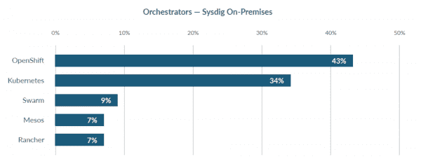

# 2019 年 Sysdig 报告中的 4 个容器使用要点

> 原文：<https://developers.redhat.com/blog/2019/11/08/4-container-usage-takeaways-from-the-2019-sysdig-report>

你可能已经知道开发人员创造的大多数[容器](https://developers.redhat.com/topics/containers/)都是一次性的，但是你有没有意识到其中的一半只存在了不到五分钟？这一点和其他有趣的细节可以在[最新的年度集装箱报告中找到，该报告来自 Sysdig](https://sysdig.com/blog/sysdig-2019-container-usage-report/) ，一家集装箱安全和协调供应商。

这是该公司的第三份此类报告。这些结果是从他们自己的仪器中获得的，这些仪器是在上个月的五天时间里从他们自己的客户使用的 200 多万个容器中收集的。这意味着结果可能有点偏向更有经验的容器开发人员。

然而，这份报告值得仔细研究。这里有四个重要的要点。

### 1.容器比我们大多数人想象的更容易被丢弃

去年的报告发现，只有五分之一的容器持续时间不到五分钟。今年发现五分之一的集装箱运行时间少于 10 秒。这是一个相当重大的飞跃。该报告还发现，一半的容器图像在一周内被替换。综上所述，这些数据点表明更多的容器被用于更具体的应用和处理需求。但它也是开发人员的一个动力，以确保无论这些容器多么短暂，都需要适当的安全措施。

### 2.超过一半的人有已知的安全问题

这引出了下一个数据点，Sysdig 工具扫描的容器中有超过一半的容器被发现存在已知的安全漏洞。这些包括常见的运行时错误，例如允许在 */etc* 和 */root* 目录下创建文件，这可能是草率的编程，也可能表明存在潜在的恶意软件威胁。该报告发现，在接受调查的主机上，有 21 个容器以 root 用户身份运行，这再次表明开发人员在使用和部署它们的方式上缺乏严谨性，因为 root 级别的容器可能会被用于权限提升攻击。

### 3.集装箱密度增加了一倍

该报告还发现，**主机承载的容器数量是去年**的两倍，十分之一的客户正在运行多个公共云来运行他们的容器。至少在 Sysdig 用户中，两者都显示出越来越复杂和成熟的水平。Sysdig 的首席执行官 Suresh Vasudevan 在他们的报告中说:“自我们上次报告以来，集装箱密度翻了一番，很明显，随着使用的成熟，采用率正在加快。”

### 4.Red Hat OpenShift 很受欢迎

如果您忽略使用 Sysdig 的 PaaS 平台进行内部部署的客户数量，那么有 43%的客户使用 **[Red Hat OpenShift](https://developers.redhat.com/openshift/) 进行容器编排和部署。**报告作者表示，这表明更大和更厌恶风险的组织希望利用 [Kubernetes](https://developers.redhat.com/developer-tools/kubernetes) 的优势，但希望将其部署在商业支持的平台上。

Image used with permission from Sysdig.*Image used with permission from Sysdig.*">

红帽开发者同样感兴趣的是报告中容器的使用率上升到 4%。这个工具是 Kubernetes 的轻量级容器运行时。该报告的作者“预计 CRI-O 的使用将在未来几年内攀升，特别是当运行 Red Hat OpenShift 的客户从 v3 迁移到 v4 时，CRI-O 将取代之前提供的 Docker 引擎。”

*Last updated: July 1, 2020*