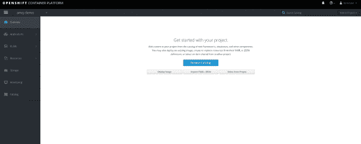
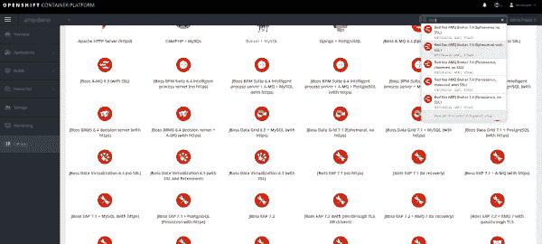
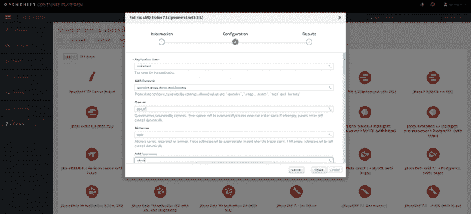
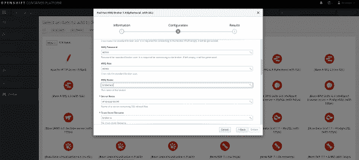
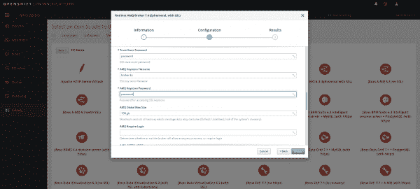
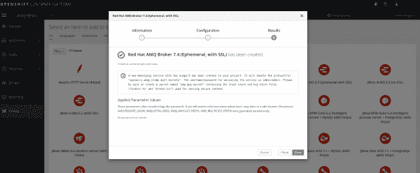

# 在 OpenShift 上为红帽 AMQ 7.4 设置 MQTT 安全客户端的 4 个步骤

> 原文：<https://developers.redhat.com/blog/2019/09/25/4-steps-to-set-up-the-mqtt-secure-client-for-red-hat-amq-7-4-on-openshift>

在本文中，我们展示了如何在[红帽 OpenShift](http://developers.redhat.com/openshift/) 上设置[红帽 AMQ 7.4](https://developers.redhat.com/products/amq/overview) 。此外，我们展示了如何将外部[消息队列遥测传输(MQTT)安全客户端](http://mqtt.org)连接到 AMQ 7.4 平台。MQTT 是一个基于 Java 的客户端，它使用 [Eclipse Paho](https://www.eclipse.org/paho/) 库，并可以使用安全传输在 OpenShift 上发布和使用来自红帽 AMQ 7.4 代理的消息。这些命令和代码已经通过了 OpenShift 3.11 的验证。

按照以下步骤执行此活动。

## 步骤 1:创建一个秘密帐户和一个服务帐户

在新的 OpenShift 项目中，创建一个 secret 和一个具有 view 角色的服务帐户:

```
[cpandey@cpandey AMQ74_CERTIFICATE]$ oc new-project amq-demo
[cpandey@cpandey AMQ74_CERTIFICATE]$ echo '{"kind": "ServiceAccount", "apiVersion": "v1", "metadata": {"name": "amq-service-account"}}' | oc create -f -
[cpandey@cpandey AMQ74_CERTIFICATE]$ oc policy add-role-to-user view system:serviceaccount:amq-demo:amq-service-account
[cpandey@cpandey AMQ74_CERTIFICATE]$ keytool -genkey -alias broker -keyalg RSA -keystore broker.ks
[cpandey@cpandey AMQ74_CERTIFICATE]$ keytool -export -alias broker -keystore broker.ks -file broker_cert
[cpandey@cpandey AMQ74_CERTIFICATE]$ keytool -genkey -alias client -keyalg RSA -keystore client.ks
[cpandey@cpandey AMQ74_CERTIFICATE]$ keytool -import -alias broker -keystore client.ts -file broker_cert
[cpandey@cpandey AMQ74_CERTIFICATE]$ oc create secret generic amq-app-secret --from-file=broker.ks
[cpandey@cpandey AMQ74_CERTIFICATE]$ oc secrets add sa/amq-service-account secret/amq-app-secret

```

**注:**这些步骤在官方[红帽文档](https://access.redhat.com/documentation/en-us/red_hat_amq/7.4/html/deploying_amq_broker_on_openshift_container_platform/install-deploy-broker-ocp)中都有提及，有详细说明。

## 步骤 2:部署红帽 AMQ 7.4 代理

使用 OpenShift web 控制台部署红帽 AMQ 7.4 代理:

1.  使用 OpenShift GUI 可以轻松设置代理。在 *amq-demo* 项目中，浏览目录并搜索模板 *Red Hat A-MQ 7.4(带有 SSL 的短命)。*以下六个数字描述了您需要填写的经纪人设置信息。一旦配置完成，点击*创建*按钮:

[](/sites/default/files/blog/2019/09/Selection_417.png)1\. Browse CatalogFigure 1: Browse the catalog.">[](/sites/default/files/blog/2019/09/Selection_418.png)2\. Select TemplateFigure 2: Select the template.">[](/sites/default/files/blog/2019/09/Selection_423.png)3\. Configuration-1Figure 3: Complete configuration part 1.">[](/sites/default/files/blog/2019/09/Selection_424.png)4\. Configuration-2Figure 4: Complete configuration part 2.">[](/sites/default/files/blog/2019/09/Selection_425.png)5\. Configuration-3Figure 5: Complete configuration part 3.">[](/sites/default/files/blog/2019/09/Selection_426.png)6\. Final StepFigure 6: Complete the final step.">

2.  运行以下命令来检查服务和 pod。成功设置后，您应该可以使用这些工具:

```
[cpandey@cpandey AMQ74_CERTIFICATE]$ oc get service|grep ssl
brokertest-amq-amqp-ssl ClusterIP 172.30.4.207 5671/TCP 2m
brokertest-amq-mqtt-ssl ClusterIP 172.30.145.232 8883/TCP 2m
brokertest-amq-stomp-ssl ClusterIP 172.30.20.224 61612/TCP 2m
brokertest-amq-tcp-ssl ClusterIP 172.30.160.172 61617/TCP 2m
[cpandey@cpandey AMQ74_CERTIFICATE]$

[cpandey@cpandey AMQ74_CERTIFICATE]$ oc get pod
NAME READY STATUS RESTARTS AGE
brokertest-amq-1-z2xjq 1/1 Running 0 3m
[cpandey@cpandey AMQ74_CERTIFICATE]$
```

3.  现在，在当前项目 *(* amq-demo)中为 MQTT 服务 *brokertest-amq-mqtt-ssl* 创建一个路由，以便外部客户端可以在 OpenShift 中访问红帽 AMQ 7.4。将该路由的终止类型设置为 *[passthrough](https://docs.openshift.com/container-platform/3.11/architecture/networking/routes.html#passthrough-termination)* ，这样加密流量将到达红帽 AMQ 7.4 代理，TLS 终止不会在该路由上完成，具体如下:

```
[cpandey@cpandey AMQ74_CERTIFICATE]$ oc create route passthrough --service brokertest-amq-mqtt-ssl route.route.openshift.io/brokertest-amq-mqtt-ssl created
```

4.  现在，如果我们检查当前项目中可用的路线(amq-demo):

```
[cpandey@cpandey AMQ74_CERTIFICATE]$ oc get route
NAME HOST/PORT PATH SERVICES PORT TERMINATION WILDCARD
brokertest-amq-mqtt-ssl brokertest-amq-mqtt-ssl-amq-demo.192.168.42.111.nip.io brokertest-amq-mqtt-ssl passthrough None
console console-amq-demo.192.168.42.111.nip.io brokertest-amq-jolokia passthrough None
[cpandey@cpandey AMQ74_CERTIFICATE]$

```

## 步骤 3:设置 Java MQTT 客户机

现在，在 OpenShift 环境外部设置 Java MQTT 客户机。一旦配置了路由，我们只需在客户机中提供该 URL。查看我的个人 [GitHub 代码](https://github.com/1984shekhar/Artemis_POC/tree/master/MQTT_CLIENT/MQTT_ECLIPSEPAHO_CLIENT_SSL)的例子:

*   对于 MQTT publisher 客户端，请查看[MqttPublishSample.java](https://github.com/1984shekhar/Artemis_POC/blob/master/MQTT_CLIENT/MQTT_ECLIPSEPAHO_CLIENT_SSL/src/main/java/com/mycompany/mqtt/client/MqttPublishSample.java#L17)。
*   对于 MQTT 订户客户端，请查看[MqttSubscribeSample.java](https://github.com/1984shekhar/Artemis_POC/blob/master/MQTT_CLIENT/MQTT_ECLIPSEPAHO_CLIENT_SSL/src/main/java/com/mycompany/mqtt/client/MqttSubscribeSample.java#L13)。
*   要执行这些客户端，请使用[ThreadFactory.java](https://github.com/1984shekhar/Artemis_POC/blob/master/MQTT_CLIENT/MQTT_ECLIPSEPAHO_CLIENT_SSL/src/main/java/com/mycompany/mqtt/client/ThreadFactory.java#L29)。

注意，我们使用的是在步骤 1 中生成的客户端信任库`client.ts,`。

## 步骤 4:监控主题统计信息

现在您已经设置好了，您可以监控您的主题统计数据:

```
[cpandey@cpandey AMQ74_CERTIFICATE]$ oc get pods
NAME READY STATUS RESTARTS AGE
brokertest-amq-1-z2xjq 1/1 Running 0 14m
[cpandey@cpandey AMQ74_CERTIFICATE]$ oc rsh brokertest-amq-1-z2xjq
sh-4.2$ cd /opt/amq/bin
sh-4.2$ ./artemis queue stat
OpenJDK 64-Bit Server VM warning: If the number of processors is expected to increase from one, then you should configure the number of parallel GC threads appropriately using -XX:ParallelGCThreads=N
|NAME |ADDRESS |CONSUMER_COUNT |MESSAGE_COUNT |MESSAGES_ADDED |DELIVERING_COUNT |MESSAGES_ACKED |
|DLQ |DLQ |0 |0 |0 |0 |0 |
|ExpiryQueue |ExpiryQueue |0 |0 |0 |0 |0 |
|activemq.management.b75e216e-902d-4393-8961-4a45dc54e4b6|activemq.management.b75e216e-902d-4393-8961-4a45dc54e4b6|1 |0 |0 |0 |0 |
|paho3709101254858.MQTT_paho|MQTT_paho |0 |0 |9 |0 |9 |
|queue1 |queue1 |0 |0 |0 |0 |0 |
sh-4.2$
```

## 包扎

就是这样。我希望这篇文章能帮助你在 OpenShift 上快速设置红帽 AMQ 7.4，以及使用 MQTT 协议的外部安全客户端。你也可以看看这个[开发者博客](https://developers.redhat.com/blog/2019/03/28/red-hat-amq-6-3-on-openshift-set-up-connect-ssl-client-and-configure-logging/)，在 OpenShift 上用基于 Camel 的 Openwire 客户端使用 SSL 设置红帽 AMQ 6.3。

*Last updated: July 1, 2020*