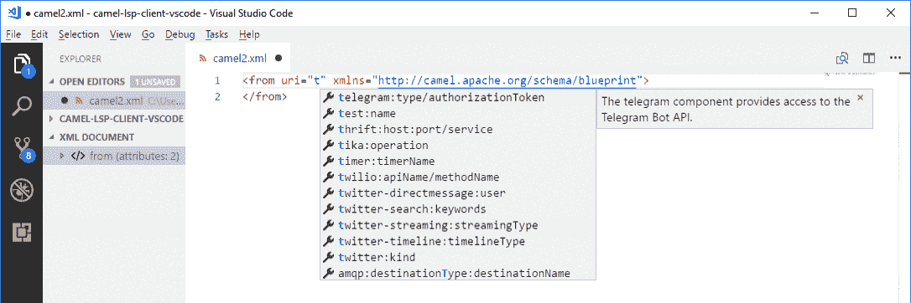
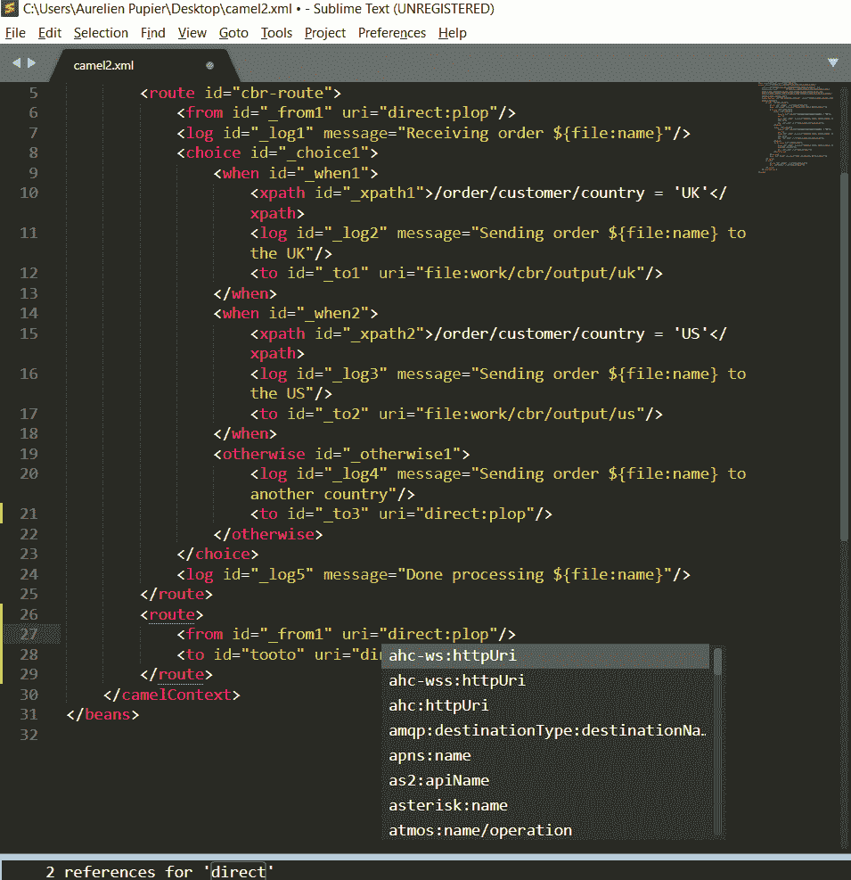

# 用 Apache Camel 语言的特定工具看开发环境

> 原文：<https://developers.redhat.com/blog/2019/09/17/a-look-at-development-environments-with-specific-tooling-for-apache-camel-language>

越来越多的编辑器和 ide 为基于 [Apache Camel](https://camel.apache.org/) 的应用程序开发提供了特定的工具。历史上，只有 Eclipse Fuse 工具，它是基于 Eclipse 桌面 IDE 的。然后，一个 [IntelliJ 插件](https://plugins.jetbrains.com/plugin/9371-apache-camel-idea-plugin)被创建。这两个工具都与特定的 IDE APIs 紧密耦合。因此，他们的缺点是不容易分享开发成果。

## 支持的编辑器和 ide

由于有了[语言服务器协议](https://microsoft.github.io/language-server-protocol/)，有了[核心服务器](https://github.com/camel-tooling/camel-language-server)和一些配置或小型客户端开发，Apache Camel 语言现在可以在越来越多的环境中使用:

### [月蚀 Che 扩展](https://github.com/camel-tooling/camel-lsp-client-che)

它也可以在 che.openshift.io 和 [Code Ready Workspaces](https://developers.redhat.com/products/codeready-workspaces/overview) 上使用(目前只支持 CRW 1.x 上的 xml，CRW 2.x 将提供全面支持)。

### [VS 代码](https://marketplace.visualstudio.com/items?itemName=redhat.vscode-apache-camel)

这里有一个[视频](https://www.youtube.com/watch?v=-gkO4hLM5Yc&list=PLU-T8l-XOWONfIGaEp53PJht-RQce0JFa&index=3)介绍主要功能。

### [Eclipse 桌面](https://marketplace.eclipse.org/content/language-support-apache-camel)插件

注意，它默认嵌入在 [Fuse 工具](https://tools.jboss.org/features/fusetools.html)、 [JBoss 工具](https://tools.jboss.org/)和 [Code Ready Studio 中。](https://developers.redhat.com/products/codeready-studio/overview)这个[视频](https://www.youtube.com/watch?v=cf6Z-sR05gA&list=PLU-T8l-XOWOPh0z14IXs0Oa3OJpwSLHqr&index=6&t=0s)提供了更深入的见解。

### [Atom](https://atom.io/packages/camel-lsp-client-atom)

这个[视频](https://www.youtube.com/watch?v=alR85m-p0oY&list=PLU-T8l-XOWONfIGaEp53PJht-RQce0JFa&index=5&t=0s)解释了如何安装和开始使用它。

### [升华](https://github.com/camel-tooling/camel-lsp-client-sublime)

## 其他编辑器和 ide

理论上，可以将 Camel LSP 用于其他几个编辑器和具有特定配置的 ide。我鼓励这些其他环境的用户测试 Camel LSP 的性能，然后分享使用它们的步骤。你可以在这里找到潜在客户的列表[(我建议搜索你喜欢的 IDE，因为没有全部列出)。为](https://langserver.org/#implementations-client) [Vim](https://github.com/camel-tooling/camel-lsp-client-spacevim/issues/1) 或 [Emacs](https://github.com/camel-tooling/camel-lsp-client-emacs/issues) 提供一些指针。如果在 [Camel 工具组织](https://github.com/camel-tooling)中没有针对您的 IDE 的特定 Git 库，您可以在 [Camel 语言服务器 Git 发布库](https://github.com/camel-tooling/camel-language-server)上提出请求或提供反馈。

*Last updated: July 1, 2020*