# OpenShift 容器平台上基于微概要文件的微服务——第二部分

> 原文：<https://developers.redhat.com/blog/2017/08/28/a-microprofile-based-microservice-on-openshift-container-platform-part-2>

# 使用基于微概要文件的微服务创建、关联和使用数据库

在这篇博文中，我将介绍如何创建、填充数据库，以及将数据库关联到基于 MicroProfile 的微服务。我还将介绍如何修改您的微服务，以便它能够利用数据库。

这是《OpenShift 容器平台上基于 MicroProfile 的微服务——第一部分》 [的延续；创建一个简单的基于 MicroProfile 的微服务，并将其部署到 OpenShift 容器平台](https://developers.redhat.com/blog/2017/08/25/a-microprofile-based-microservice-on-openshift-container-platform-part-1/)”博文中，它假设你已经完成了所有的步骤。如果您尚未完成第 1 部分，请立即完成。

## 步骤

### 创建数据库，将其关联到微服务并填充它

Eclipse MicroProfile 1.0 规范还没有包含 ORM/JPA/DatabaseAccess 类型的 API，将来可能会也可能不会包含。如果您想就未来版本中应该包含哪些 API 提供反馈，请访问 [Eclipse MicroProfile 社区](https://groups.google.com/forum/#!forum/microprofile) 并创建一个新线程，因此我们需要将数据源 WildFly Swarm fraction 以及 Postgresql 的依赖项包含到我们的应用程序中。

第一件事是建立一个 postgresql 数据库，并将其连接到基于 MicroProfile 的微服务。为了将非微概要文件部分的数量保持在最小，我决定采用一种更加内联的实现方法来创建数据库并集成到基于微概要文件的微服务中。最佳实践和更具声明性的方法是使用 JPA 将 Java 对象映射到数据库，并在微服务中使用这些 Java 对象，但是，这需要包含另一个 WildFly Swarm 部分，即 JPA 部分。

确保首先进入项目页面:

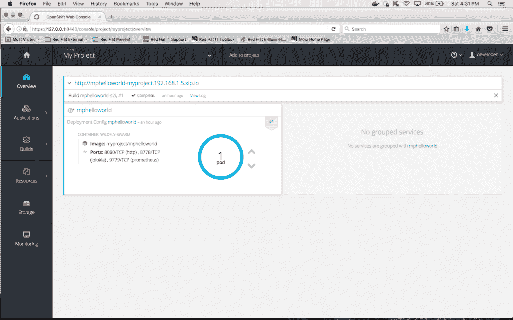

并点击“添加到项目”:

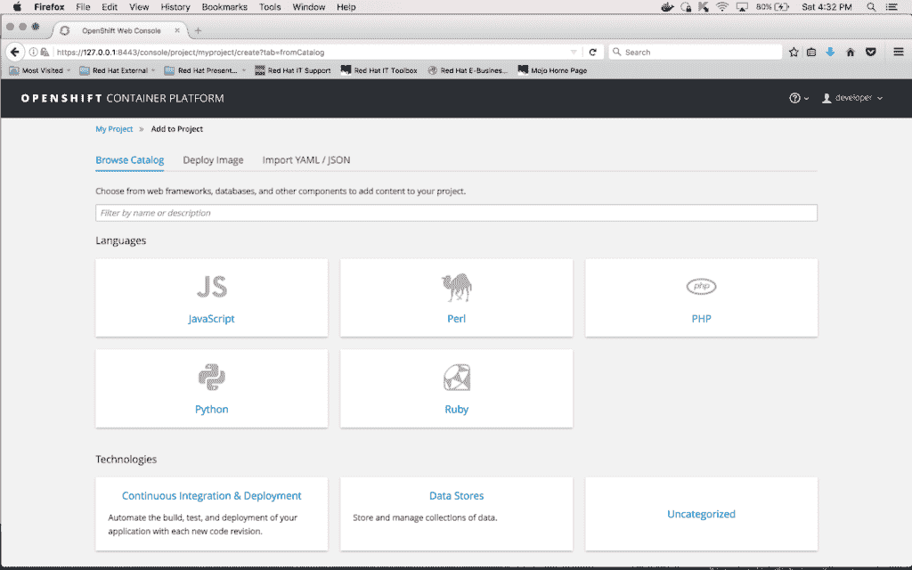

在过滤框中输入“postgres”并点击“PostgreSQL (Persistent)”标题上的“选择”按钮:

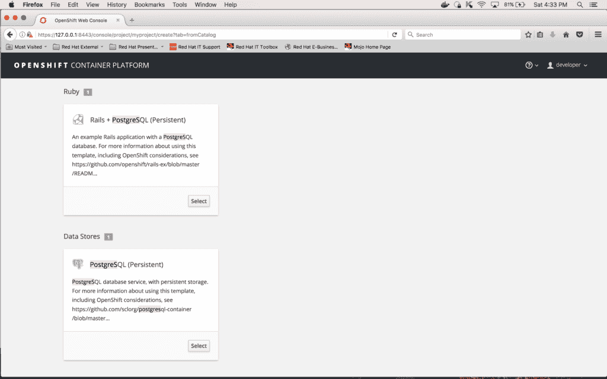

按下“选择”后，您将看到即将创建的数据库的配置设置屏幕。为数据库输入以下限制(保留默认值):

内存限制:512Mi
数据库服务名称:PostgreSQL
PostgreSQL 连接用户名:mphello world
PostgreSQL 连接密码:mphello world
PostgreSQL 数据库名称:mphelloworlddb
标签名称:项目
标签值:mpHelloWorld

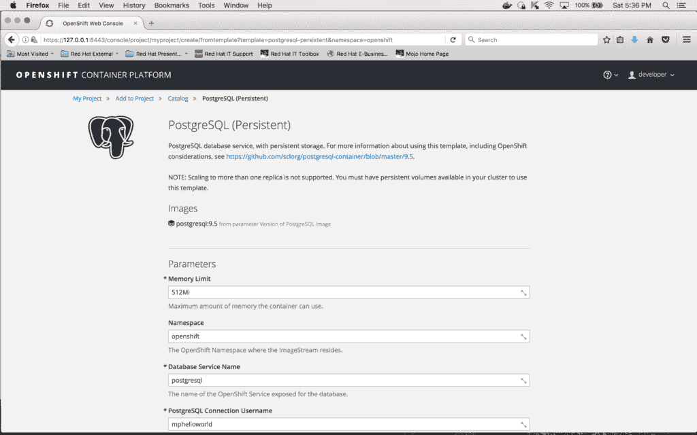

输入所有值后，点击页面底部的“创建”按钮(您需要向下滚动直到看到它):

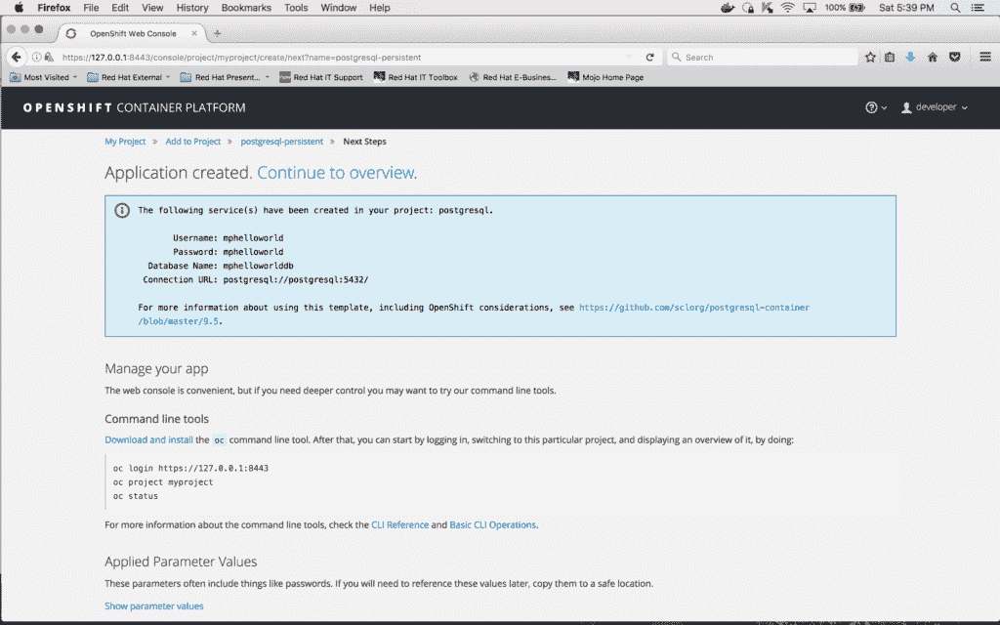

点击“继续概述”；将显示以下屏幕:

### 将数据库关联到微服务

为了让微服务“mphelloworld”能够与数据库通信，我们需要在其 DeploymentConfig 中包含一些环境变量。这可以通过输入以下命令来完成(确保您位于笔记本电脑上基于微文件的微服务的顶层目录中):

*oc env DC mphello world-e POSTGRESQL _ USER = mphello world-e pg password = mphello world-e POSTGRESQL _ DATABASE = mphello world db*

下面是上面命令的屏幕快照:

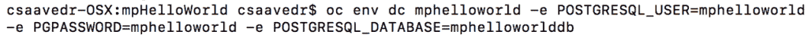

此更新将导致“mphello world”pod 的自动重新部署。

如果您想验证这些环境变量现在是新部署的“mphello world”pod 的一部分，您可以到 pod 的终端并在终端提示符下输入“set:

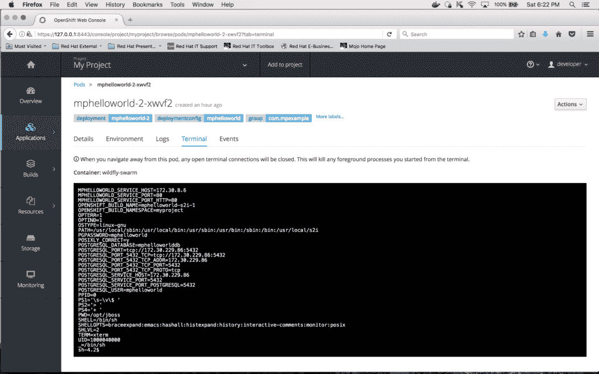

### 填充数据库

我们现在需要填充数据库，为此，您需要创建一个包含以下内容的文件(注意，表名是“names”，其列是“id”和“string”):

*如果存在名称则删除表格；*
*开始；*
*创建表名(id 序列主键，string varchar)；*
*插入到名称(字符串)值(' Johnny ')；*
*插入到人名(字符串)值('珍妮')；*
*插入到人名(字符串)值(' Billy ')；*
*插入到人名(字符串)值(' Mary ')；*
*插入到人名(字符串)值(' Bobby ')；*
*提交；*

您可以剪切上面的文本，并将其粘贴到本地驱动器上的文件中。保存该文件，并将其命名为“names.sql”。确保创建一个暂存目录，将其命名为“stage”，然后将文件“names.sql”移动到目录“stage”中。

下一步是将该文件复制到您的“PostgreSQL”pod 中。但是首先，您需要获得 pod 的实例名。点击左侧垂直工具栏上的“概览”图标，进入列出项目中所有单元的概览屏幕:

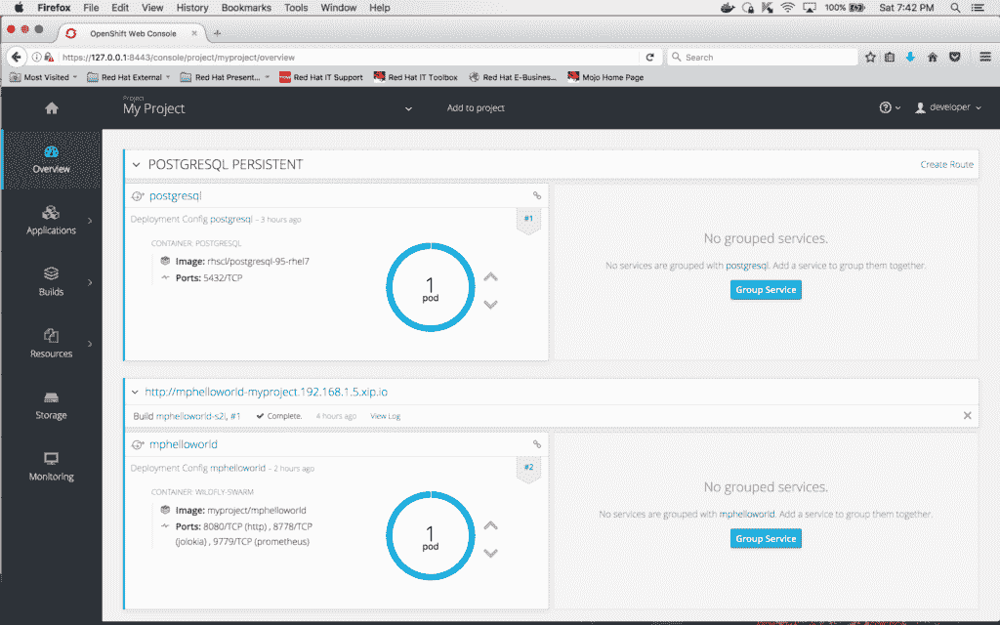

然后，点击“postgresql”的“1 pod”标签周围的圆圈；这将带您进入详细的 pod 信息屏幕:

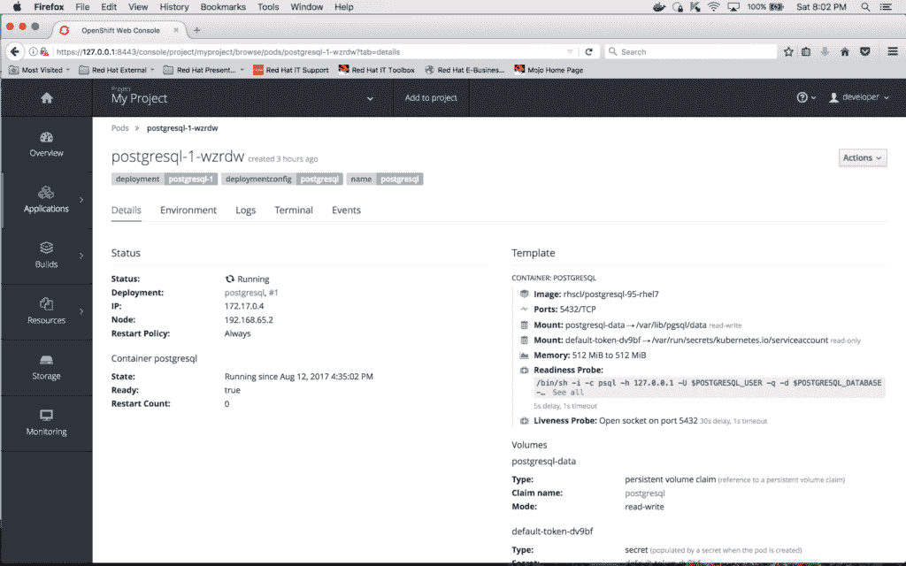

在这个屏幕上，您可以看到容器的名称，即“postgresql-1-wzrdw”。

OpenShift 对权限和容器里可以写什么目录不可以写什么目录的要求非常严格。目录/tmp 是一个在容器中总是可写的好地方。因此，通过执行以下命令，将文件" names.sql "从本地驱动器(rsync 命令将一个目录作为其参数——这就是我们需要创建一个名为" stage "的目录并将" names.sql "文件移动到其中的原因)复制到 pod "postgresql-1-wzrdw "

*oc rsync stage/PostgreSQL-1-wzrdw:/tmp*

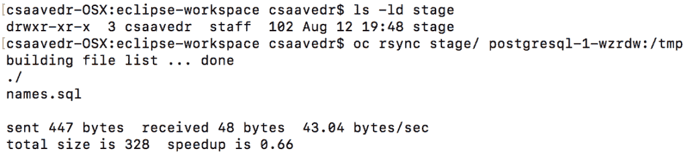

在前面的命令中，目录“stage”末尾的斜杠告诉 rsync 移动目录“stage”的内容(在这种情况下，该命令只会将文件“names.sql”复制到容器中)。

要验证文件是否被成功复制到容器中，请转到容器“postgresql-1-wzrdw”的终端，并执行/tmp 目录，如下所示:

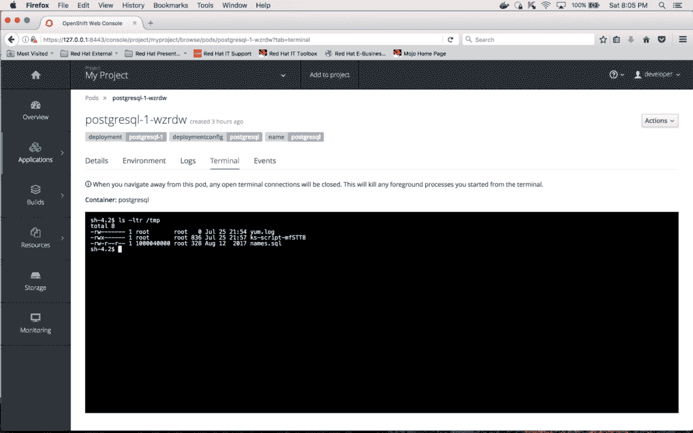

上面的截图显示文件“names.sql”被成功复制到容器中。

接下来要做的是运行“names.sql”脚本来加载数据库。您可以通过在容器的终端窗口中输入以下命令来做到这一点:

*psql-h $ POSTGRESQL _ SERVICE _ HOST-p $ POSTGRESQL _ SERVICE _ PORT-U $ POSTGRESQL _ USER $ POSTGRESQL _ DATABASE</tmp/names . SQL*

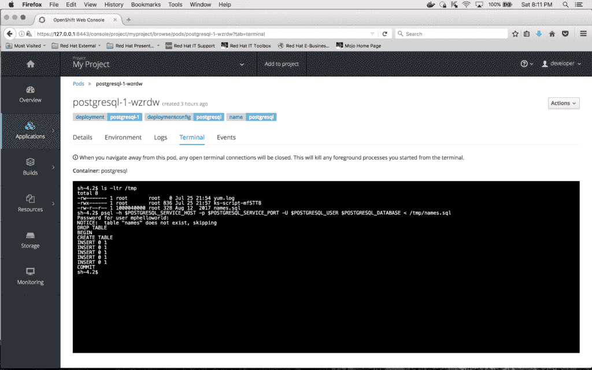

要验证“names”表的内容，首先在容器的终端窗口输入以下命令以连接到数据库:

*psql-h $ POSTGRESQL _ SERVICE _ HOST-p $ POSTGRESQL _ SERVICE _ PORT-U $ POSTGRESQL _ USER $ POSTGRESQL _ DATABASE*

和下面的查询查看“姓名”表的内容

*从名称中选择*号；*

下面是上面两个命令的执行快照:

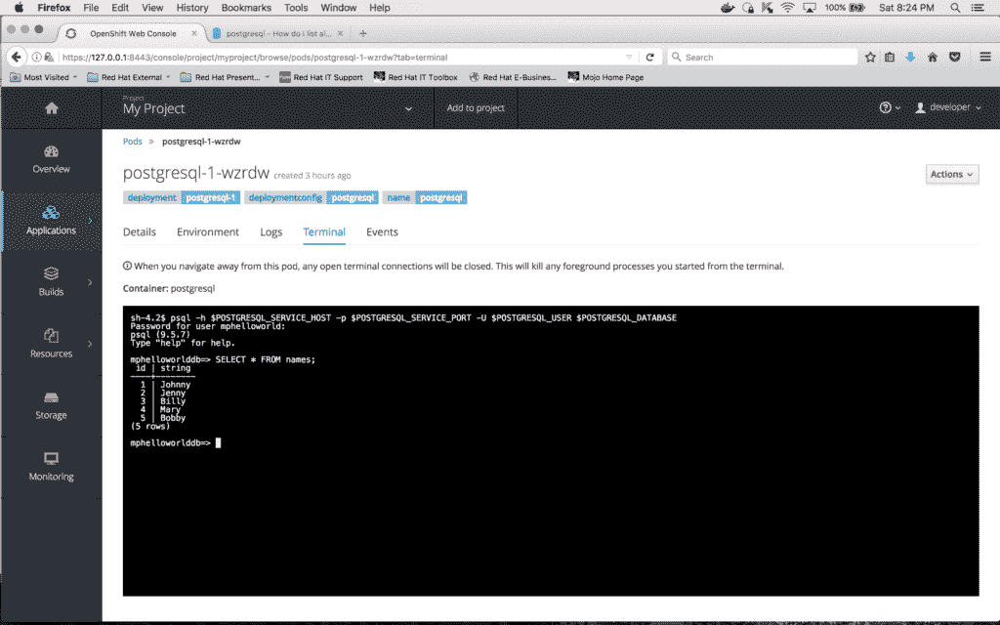

### 修改微文件微服务访问数据库

微服务可能需要使用数据库，因此展示微档案微服务如何完成这一任务非常重要。MicroProfile 1.0 不包含任何数据库访问库/API，所以我们首先需要手动将两个依赖项包含到应用程序 pom.xml 中:

1.  第一个是对 postgresql 数据库的依赖:

*<依赖>*
*<groupId>org . PostgreSQL</groupId>*
*<artifactId>PostgreSQL</artifactId*
*<版本>9.4-1200-JDBC 41【9*

2.  第二个是数据源对野生蜂群的依赖性:

*<依赖关系>*
*<groupId>org . wildly . swarm</groupId>*
*<artifactId>数据源</artifactId>*
*</依赖关系>*

使用文本编辑器或 IDE，打开项目的 pom.xml 并输入上面的依赖项。

下面是 pom.xml 的图片的一个片段:

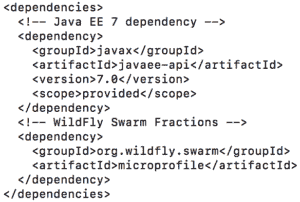

下面是 pom.xml 的图片的一个片段:

其次，我们需要在项目中添加逻辑来利用数据库。将目录更改为 src/main/Java/com/MP example/mpHelloWorld/rest，这是 HelloWorldEndpoint.java 程序所在的位置。

*cd <您选择的目录>/mpHelloWorld*
*CD src/main/Java/com/mpexample/mpHelloWorld/rest*

编辑位于该目录中的文件“HelloWorldEndpoint.java ”,并用以下代码替换其全部内容:

*包 com . MP example . mphelloworld . rest；T3
T5导入 Java . SQL . connection；*
*导入 Java . SQL . driver manager；*
*导入 Java . SQL . resultset；*
*导入 Java . SQL . statement；*
*导入 javax . enterprise . context . applicationscoped；*
*导入 Java x . ws . RS . path；*
*导入 javax . ws . RS . core . response；*
*导入 Java x . ws . RS . get；*
*导入 javax . ws . RS . produce；*
*@ ApplicationScoped*
*@ Path("/hello ")*
*public class HelloWorldEndpoint {*
*@ GET*
*@ Produces(" text/plain ")*
*try {*
*String dbURL = " JDBC:PostgreSQL://"；*
*dbURL+= system . getenv(" POSTGRESQL _ SERVICE _ HOST ")；*
*dbURL+= ":"+system . getenv(" POSTGRESQL _ SERVICE _ PORT ")；*
*dbURL+= "/"+system . getenv(" POSTGRESQL _ DATABASE ")；*
*字符串 USER = system . getenv(" POSTGRESQL _ USER ")；*
*String pass = system . getenv(" pg password ")；*
*连接 conn = driver manager . getconnection(dbURL，user，pass)；*
*如果(conn！= null){*
*String sqlStmt = " select id AS the key，String AS the name from names ORDER BY random()limit 1 "；*
*语句 stmt = conn . create Statement()；*
*ResultSet RS = stmt . execute query(SQL stmt)；*
*while(RS . next()){*
*greeting = " Hello "+RS . getstring(" theName ")+" from micro profile microservice "；*
*}*
*RS . close()；*
*conn . close()；*
*}*
*} catch(异常 e){*
*return response . ok("数据库连接问题！"+ e.toString())。build()；*
*}*
*return response . ok(greeting . tostring())。build()；*
*}*
*}*

更新源代码后，您需要通过执行以下命令来重新构建并重新部署应用程序:

*mvn clean fabric 8:build fabric 8:deploy-DskipTests*

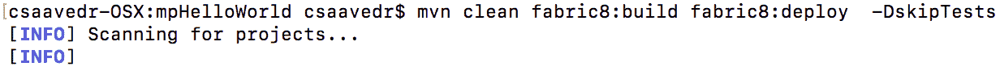

此更新将导致“mphello world”pod 的自动重新部署，因此需要再次更新其部署配置。您可以通过输入以下命令来完成这个任务:

*oc env DC mphello world-e POSTGRESQL _ USER = mphello world-e pg password = mphello world-e POSTGRESQL _ DATABASE = mphello world db*

这里是 xterm 窗口的屏幕快照:

此部署配置更新将导致“mphello world”pod 再次自动重新部署。

部署完 pod 后，您可以通过打开浏览器窗口并输入 URL 地址来测试它:

*http://mphelloworld-myproject.192.168.1.5.xip.io/hello*

每次刷新此链接，您都会看到以下消息，但每次的名称不同:

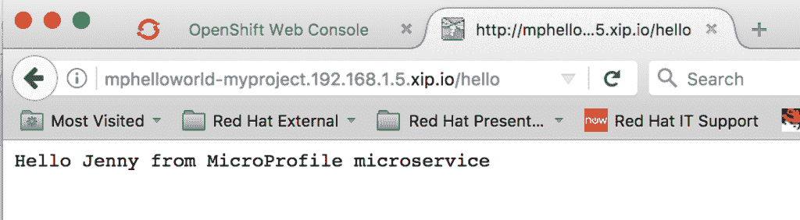

本系列的第二篇文章到此结束。在这篇博文中，您了解了如何创建数据库、填充数据库、将数据库与基于微概要文件的微服务相关联，您修改了微服务以利用数据库中的数据，所有这些都是在 OpenShift 容器平台上完成的。最后，通过从 web 浏览器调用基于微概要文件的服务，并观察每次调用返回的消息如何变化，验证了该服务运行良好。

在下一篇博文的[中，您将了解如何添加 JBoss 数据网格来缓存来自数据库的数据，以提高基于 MicroProfile 的微服务的性能。](https://wp.me/p8e0as-1QpT)

* * *

要构建您的 Java EE 微服务 **请访问** [**野生蜂群**](https://developers.redhat.com/promotions/wildflyswarm-cheatsheet/) **并下载备忘单。**

*Last updated: October 12, 2017*