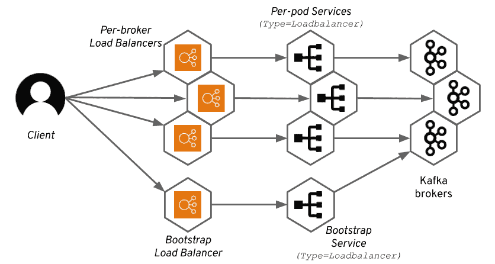
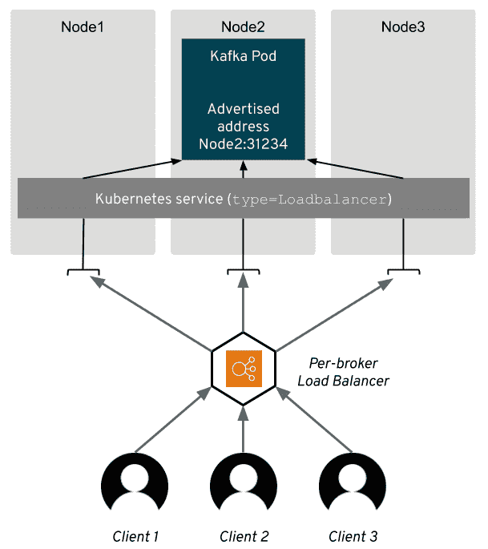

# 在 Strimzi 中访问 Apache Kafka:第 4 部分——负载平衡器

> 原文：<https://developers.redhat.com/blog/2019/06/11/accessing-apache-kafka-in-strimzi-part-4-load-balancers>

在我们关于访问 [Strimzi](https://strimzi.io/) 中的 [Apache Kafka](https://developers.redhat.com/videos/youtube/CZhOJ_ysIiI/) 集群系列的第四篇文章中，我们将看看如何使用负载平衡器来展示 Kafka 代理。(见末尾以前文章的链接。)本文将解释如何在公共云环境中使用负载平衡器，以及如何将它们与 Apache Kafka 一起使用。

**注:**strim zi 和 Apache Kafka 项目的产品化和支持版本作为[红帽 AMQ](https://www.redhat.com/en/technologies/jboss-middleware/amq) 产品的一部分提供。

## 负载平衡器

负载平衡器自动将传入流量分配给多个目标。不同的实现在不同的级别上进行流量分配:

*   [第 7 层](https://en.wikipedia.org/wiki/OSI_model#Layer_7:_Application_Layer)负载平衡器可以在单个请求(例如 HTTP 请求)的级别上分配流量。
*   第 4 层负载平衡器分配 TCP 连接。

大多数公共云和私有云都有负载平衡器。负载平衡器的例子有亚马逊 AWS 的弹性负载平衡服务、微软 Azure 公共云中的 Azure 负载平衡器和谷歌的谷歌云负载平衡服务。OpenStack 中还提供了[负载平衡服务。如果您在裸机上运行您的](https://docs.openstack.org/mitaka/networking-guide/config-lbaas.html) [Kubernetes](https://developers.redhat.com/topics/kubernetes/) 或 [Red Hat OpenShift](https://developers.redhat.com/openshift/) 集群，您可能无法按需获得负载平衡器。在这种情况下，使用[节点端口](https://developers.redhat.com/blog/?p=601137)、 [OpenShift routes](https://developers.redhat.com/blog/?p=601277) 或 Ingress 可能是您更好的选择。

没有必要被一长串不同的负载平衡服务吓倒。他们中的大多数都与 Kubernetes 很好地结合在一起。当 Kubernetes `Service`配置了类型`Loadbalancer`时，Kubernetes 将通过云提供商自动创建负载平衡器，它了解给定云提供的不同服务。由于这一点，Kubernetes 应用程序——包括 strim zi——不需要理解差异，应该可以在云基础设施和 Kubernetes 正确集成的任何地方工作。

## 在 strizzi 中使用负载平衡器

常见的负载均衡服务都不支持 Kafka 协议，所以 Strimzi 总是使用第 4 层负载均衡。因为第 4 层工作在 TCP 层，负载均衡器将总是获取整个 TCP 连接并将其定向到其中一个目标。这种方法有一些优点；例如，您可以决定是启用还是禁用 TLS 加密。

为了让 Kafka 客户能够访问各个经纪人，Strimzi 为每个经纪人创建了一个单独的服务，并带有`type=Loadbalancer`。因此，每个代理将获得一个单独的负载平衡器。请注意，尽管 Kubernetes 服务属于负载平衡器类型，但负载平衡器仍然是由基础设施/云管理的独立实体。一个有 N 个代理的 Kafka 集群需要 N+1 个负载平衡器。



在本文的开始，我们将负载均衡器定义为*在多个目标*之间分配传入流量的东西。但是，从上图中可以看出，每个代理的负载平衡器只有一个目标，并且从技术上讲不是负载平衡。这是真的，但是，在大多数情况下，实际的实现要复杂一些。

当 Kubernetes 创建负载平衡器时，他们通常将它定位到 Kubernetes 集群的所有节点，而不仅仅是应用程序实际运行的节点。因此，尽管 TCP 连接总是在同一个代理的同一个节点上结束，但是它们可能会通过集群的其他节点进行路由。

当负载平衡器将连接发送到没有托管 Kafka 代理的节点时，Kubernetes 的`kube-proxy`组件会将它转发到运行代理的正确节点。这可能会导致延迟，因为一些连接可能会通过比绝对必要的更多跳来路由。



唯一的例外是引导负载平衡器，它将连接分发到 Kafka 集群中的所有代理。

通过在外部监听器中选择`loadbalancer`类型，您可以轻松地配置 Strimzi Kafka operator 来使用负载平衡器公开您的 Kafka 集群:

```
apiVersion: kafka.strimzi.io/v1beta1
kind: Kafka
metadata:
  name: my-cluster
spec:
  kafka:
    # ...
    listeners:
      # ...
      external:
        type: loadbalancer
    # ...

```

负载平衡器与节点端口外部侦听器一样，默认情况下启用 TLS。如果您不想使用 TLS 加密，可以很容易地禁用它:

```
    # ...
    listeners:
      external:
        type: loadbalancer
        tls: false
    # ...

```

在 Strimzi 创建了负载平衡器类型 Kubernetes 服务之后，将会自动创建负载平衡器。大多数云会自动为负载均衡器分配一些 DNS 名称和 IP 地址。这些将被自动传播到 Kubernetes 服务的`status`部分。Strimzi 将从那里读取它，并使用它来配置 Kafka brokers 中的广告地址。

当可用时，Strimzi 当前更喜欢 DNS 名称而不是 IP 地址。原因是 IP 地址经常是不稳定的，而 DNS 名称在负载平衡器的生命周期内是固定的(这至少适用于亚马逊 AWS ELB 负载平衡器)。如果负载平衡器只有一个 IP 地址，Strimzi 当然会使用它。

作为用户，您应该始终将引导负载平衡器地址用于初始连接。您可以使用以下命令从`status`部分获取地址(用您的集群的名称替换`my-cluster`):

```
kubectl get service my-cluster-kafka-external-bootstrap -o=jsonpath='{.status.loadBalancer.ingress[0].hostname}{"\n"}'

```

如果没有设置主机名，您也可以尝试 IP 地址(用您的集群名称替换`my-cluster`):

```
kubectl get service my-cluster-kafka-external-bootstrap -o=jsonpath='{.status.loadBalancer.ingress[0].ip}{"\n"}'

```

这些命令之一返回的 DNS 或 IP 地址可以在您的客户端中用作引导地址。负载平衡器总是使用端口`9094`来暴露 Apache Kafka。以下示例使用了`kafka-console-producer.sh`实用程序来连接集群，该实用程序是 Apache Kafka 的一部分:

```
bin/kafka-console-producer.sh --broker-list :9094 --topic 

```

有关更多详情，请参见 [Strimzi 文档](https://strimzi.io/docs/latest/full.html#proc-accessing-kafka-using-loadbalancers-deployment-configuration-kafka)。

## 自定义

### 公布的主机名和端口

在上一节中，我解释了在 Kafka brokers 中配置广告侦听器地址时，Strimzi 总是更喜欢使用 DNS 名称而不是 IP 地址。有时，这可能是一个问题，例如，当出于某种原因 DNS 解析对您的 Kafka 客户端不起作用时。在这种情况下，您可以在`Kafka`定制资源中覆盖公布的主机名。

```
# ...
listeners:
  external:
    type: loadbalancer
    overrides:
      brokers:
      - broker: 0
        advertisedHost: 216.58.201.78
      - broker: 1
        advertisedHost: 104.215.148.63
      - broker: 2
        advertisedHost: 40.112.72.205
# ...

```

我希望在未来的某个版本中，我们会给用户一个更舒适的选项来选择 IP 地址和主机名。但是，这个特性对于处理不同类型的网络配置和转换可能也很有用。如果需要，您也可以使用它来覆盖节点端口号。

```
# ...
listeners:
  external:
    type: route
    authentication:
      type: tls
    overrides:
      brokers:
      - broker: 0
        advertisedHost: 216.58.201.78
        advertisedPort: 12340
      - broker: 1
        advertisedHost: 104.215.148.63
        advertisedPort: 12341
      - broker: 2
        advertisedHost: 40.112.72.205
        advertisedPort: 12342
# ...

```

请记住,`advertisedPort`选项并没有真正改变负载均衡器本身使用的端口。它只改变在`advertised.listeners` Kafka broker 配置参数中使用的端口号。

### 内部负载平衡器

许多云提供商区分*公共*和*内部*负载平衡器。公共负载平衡器将获得一个公共 IP 地址和 DNS 名称，可通过整个互联网访问。另一方面，内部负载平衡器将仅使用私有 IP 地址和主机名，并且将仅从某些私有网络可用(例如，从同一亚马逊 AWS VPC 中的其他机器)。

您可能希望与运行在 Kubernetes 或 OpenShift 集群之外的应用程序共享由 Strimzi 管理的 Kafka 集群，但不一定要与整个世界共享。在这种情况下，内部负载平衡器可能会很方便。

默认情况下，Kubernetes 通常会尝试创建一个公共负载平衡器，用户可以使用特殊的注释来指示具有负载平衡器类型的给定 Kubernetes 服务应该将负载平衡器创建为内部负载平衡器。

例如:

*   对于 Google Cloud，使用注释`cloud.google.com/load-balancer-type: "Internal"`。
*   在微软 Azure 上，使用`service.beta.kubernetes.io/azure-load-balancer-internal: "true"`。
*   亚马逊 AWS 用的是`service.beta.kubernetes.io/aws-load-balancer-internal: 0.0.0.0/0`。
*   并且，OpenStack 使用`service.beta.kubernetes.io/openstack-internal-load-balancer: "true"`。

如你所见，这些大部分是完全不同的。因此，我们决定让您选择为 Strimzi 创建的服务指定注释，而不是将所有这些集成到 Strimzi 中。由于这一点，你可以在我们从未听说过的云提供商那里使用这些注释。可以在`Kafka.spec.kafka`中的`template`属性中指定注释。以下示例显示了 OpenStack 批注:

```
apiVersion: kafka.strimzi.io/v1beta1
kind: Kafka
metadata:
  name: my-cluster
spec:
  kafka:
    # ...
    template:
      externalBootstrapService:
        metadata:
          annotations:
            service.beta.kubernetes.io/openstack-internal-load-balancer: "true"
      perPodService:
        metadata:
          annotations:
            service.beta.kubernetes.io/openstack-internal-load-balancer: "true"
    # ...

```

您可以为引导和每个代理服务指定不同的注释。在您指定这些注释之后，它们将被 Strimzi 传递给 Kubernetes 服务，并且负载平衡器将被相应地创建。

### DNS 注释

从 Strimzi 0.12.0 开始，将提供此功能。

许多用户使用额外的工具，如 [ExternalDNS](https://github.com/kubernetes-incubator/external-dns) ，为他们的负载平衡器自动管理 DNS 记录。ExternalDNS 使用负载平衡器类型服务(和`Ingress`资源——下一次将详细介绍)上的注释来管理它们的 DNS 名称。它支持许多不同的 DNS 服务，如亚马逊 AWS Route53、谷歌云 DNS、Azure DNS 等。

Strimzi 允许您使用名为`dnsAnnotations`的字段通过`Kafka`定制资源分配这些注释。前面提到的模板注释之间的主要区别是，`dnsAnnotations`允许您为每个代理配置注释，而`template`字段的`perPodService`选项将在*所有*服务上设置注释。

使用 DNS 注释很简单:

```
# ...
listeners:
  external:
    type: loadbalancer
    overrides:
      bootstrap:
        dnsAnnotations:
          external-dns.alpha.kubernetes.io/hostname: kafka-bootstrap.mydomain.com.
          external-dns.alpha.kubernetes.io/ttl: "60"
      brokers:
      - broker: 0
        dnsAnnotations:
          external-dns.alpha.kubernetes.io/hostname: kafka-broker-0.mydomain.com.
          external-dns.alpha.kubernetes.io/ttl: "60"
      - broker: 1
        dnsAnnotations:
          external-dns.alpha.kubernetes.io/hostname: kafka-broker-1.mydomain.com.
          external-dns.alpha.kubernetes.io/ttl: "60"
      - broker: 2
        dnsAnnotations:
          external-dns.alpha.kubernetes.io/hostname: kafka-broker-2.mydomain.com.
          external-dns.alpha.kubernetes.io/ttl: "60"
# ...

```

同样，Strimzi 允许您直接配置注释，这给了您更多的自由，并且有望使这个特性即使在您使用 ExternalDNS 之外的工具时也是可用的。它还允许您配置除 DNS 名称之外的其他选项，如 DNS 记录的生存时间等。

请注意，注释中使用的地址不会被添加到 TLS 证书中，也不会在 Kafka 代理的广告侦听器中进行配置。为此，您需要将它们与前面一节中描述的广告名称配置结合起来:

```
# ...
listeners:
  external:
    type: loadbalancer
    overrides:
      bootstrap:
        dnsAnnotations:
          external-dns.alpha.kubernetes.io/hostname: kafka-bootstrap.mydomain.com.
          address: kafka-bootstrap.mydomain.com
      brokers:
      - broker: 0
        dnsAnnotations:
          external-dns.alpha.kubernetes.io/hostname: kafka-broker-0.mydomain.com.
          advertisedHost: kafka-broker-0.mydomain.com
      - broker: 1
        dnsAnnotations:
          external-dns.alpha.kubernetes.io/hostname: kafka-broker-1.mydomain.com.
          advertisedHost: kafka-broker-1.mydomain.com
      - broker: 2
        dnsAnnotations:
          external-dns.alpha.kubernetes.io/hostname: kafka-broker-2.mydomain.com.
          advertisedHost: kafka-broker-2.mydomain.com
# ...

```

## 利弊

将负载平衡器集成到 Kubernetes 和 Red Hat OpenShift 中很方便，并且使它们易于使用。Strimzi 可以使用 Kubernetes 的能力在许多不同的公共云和私有云上提供负载平衡器。由于 TCP 路由，您可以自由决定是否要使用 TLS 加密。

负载平衡器位于 Kubernetes 集群的应用程序和节点之间。它们最大限度地减少了攻击面，因此，许多管理员更喜欢负载平衡器而不是节点端口。

负载平衡器通常提供非常好的性能。典型的负载平衡器是一种在集群之外运行的服务。因此，您不需要担心它需要的资源，它会给您的集群带来多少负载，等等。但是，需要记住一些注意事项:

*   在大多数情况下，Kubernetes 会将它们配置为跨所有集群节点进行负载平衡。因此，尽管流量最终到达的地方只有一个代理，但是不同的连接可能通过不同的集群节点被路由到该代理，通过`kube-proxy`被转发到 Kafka 代理实际运行的正确节点。例如，对于节点端口，这种情况不会发生，在节点端口中，通告的地址直接指向运行代理的节点。
*   负载平衡器本身是连接需要经过的另一个服务，这可能会增加一点延迟。

另一个要考虑的方面是价格。在公共云中，负载平衡器通常不是免费的。通常，您必须为每个实例支付一笔固定费用，这笔费用只取决于负载平衡器存在的时间以及每传输千兆字节的费用。Strimzi 总是需要 N+1 个负载平衡器(其中 N 是代理的数量)，每个代理一个，另一个用于引导。这意味着您将总是需要多个负载平衡器，并且费用会增加。此外，这些负载平衡器中有 N 个甚至不平衡任何负载，因为它们背后只有一个代理。

### 阅读更多

*   [在 Strimzi 中访问阿帕奇卡夫卡:第 1 部分-简介](https://developers.redhat.com/blog/?p=601077)
*   [访问 Strimzi 中的 Apache Kafka:第 2 部分-节点端口](https://developers.redhat.com/blog/?p=601137)
*   [在《Strimzi:第三部-红帽 OpenShift 路线》中访问阿帕奇卡夫卡](https://developers.redhat.com/blog/?p=601277)
*   [在 Strimzi 中访问 Apache Kafka:第 4 部分-负载平衡器](https://developers.redhat.com/blog/?p=601357)
*   [在《斯特里姆齐:第五部分——入口》中访问阿帕奇卡夫卡](https://developers.redhat.com/blog/?p=601457)

*Last updated: March 18, 2020*