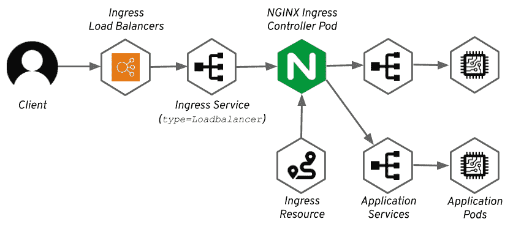
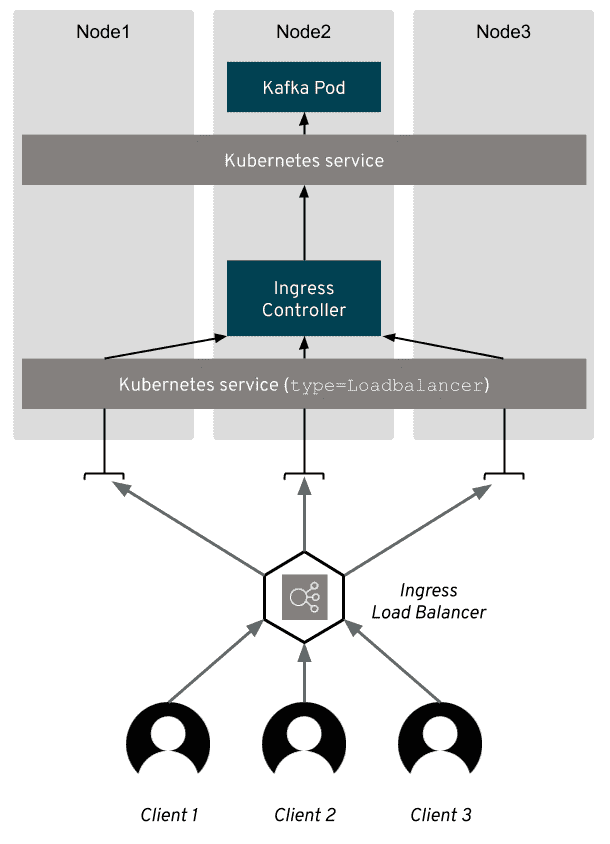
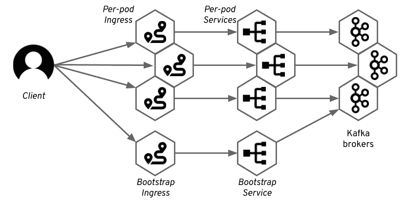

# 在 Strimzi 中访问 Apache Kafka:第 5 部分-入口

> 原文：<https://developers.redhat.com/blog/2019/06/12/accessing-apache-kafka-in-strimzi-part-5-ingress>

在这个系列的第五部分也是最后一部分，我们将看看如何使用 [Kubernetes](https://developers.redhat.com/topics/kubernetes/) Ingress 在 [Strimzi](https://strimzi.io/) 中揭露[阿帕奇卡夫卡](https://developers.redhat.com/videos/youtube/CZhOJ_ysIiI/)。本文将解释如何在 Kubernetes 上使用 Ingress 控制器，Ingress 如何与 [Red Hat OpenShift](https://developers.redhat.com/openshift/) 路线进行比较，以及它如何与 Strimzi 和 Kafka 一起使用。从 Strimzi 0.12.0 开始，只能使用 Kubernetes Ingress 进行集群外访问。(本系列以前文章的链接可以在最后找到。)

**注:**strim zi 和 Apache Kafka 项目的产品化和支持版本作为[红帽 AMQ](https://www.redhat.com/en/technologies/jboss-middleware/amq) 产品的一部分提供。

## 永恒的入口

Ingress 是一个 Kubernetes API，用于管理对 HTTP/HTTPS 服务的外部访问，是在 Kubernetes 1.1 中添加的。Ingress 是 Kubernetes 与 Red Hat OpenShift routes 的对应物，我们在前面的中已经讨论过了[。它充当 HTTP 或 HTTPS 流量的](https://developers.redhat.com/blog/?p=601277)[第 7 层](https://en.wikipedia.org/wiki/OSI_model#Layer_7:_Application_Layer)负载平衡器。入口资源将定义将流量路由到不同服务和 pod 的规则。入口控制器负责实际的路由。更多关于 Ingress 的信息，请查看 [Kubernetes 网站](https://kubernetes.io/docs/concepts/services-networking/ingress/)。

入口是 Kubernetes API 的一个奇怪的部分。入口 API 本身是每个 Kubernetes 集群的一部分，但是执行路由的入口控制器不是核心 Kubernetes 的一部分。因此，虽然您可以创建入口资源，但实际上可能没有路由流量的东西。

为了让入口资源真正做一些事情，您需要确保安装了入口控制器。有许多不同的入口控制器。Kubernetes 项目本身有两个控制器:

*   [NGINX 控制器](https://github.com/kubernetes/ingress-nginx)
*   [用于谷歌云的 GCE 控制器](https://github.com/kubernetes/ingress-gce)

许多额外的控制器由不同的社区和公司创建和维护。不同控制器的列表可以在 Kubernetes 网站上找到。

大多数控制器依赖于负载平衡器或节点端口服务，这将使外部流量流向控制器。一旦流量到达控制器，控制器将根据入口资源中指定的规则将其路由到不同的服务和 pod。控制器本身通常也作为 Kubernetes 集群中的另一个应用程序运行。



有些控制器是为特定的公共云定制的。例如， [AWS ALB 入口控制器](https://github.com/kubernetes-sigs/aws-alb-ingress-controller)提供 AWS 应用负载平衡器来执行路由，而不是在 Kubernetes 集群中的 pod 内执行。

Ingress 为 HTTP 应用程序提供了许多功能，例如:

*   TLS 终止
*   从 HTTP 重定向到 HTTPS
*   基于 HTTP 请求路径的路由

有些控制器，比如 NGINX 控制器，也提供 TLS 直通，这是我们在 Strimzi 中使用的一个特性。

## 在 strizzi 中使用入口

Strimzi 0.12.0 中增加了 Strimzi 中的入口支持。它使用 TLS 直通，并用 [NGINX 入口控制器](https://github.com/kubernetes/ingress-nginx)进行了测试。使用前，请确保 TLS 穿越在控制器中[已启用。注意 Strimzi 0.12.0 中的入口支持是*实验性的*。如果你有任何反馈或者想要帮助它与不同的入口控制器一起工作，你可以通过](https://kubernetes.github.io/ingress-nginx/user-guide/tls/#ssl-passthrough) [Slack、我们的邮件列表或者 GitHub](https://strimzi.io/contributing/) 与我们联系。

尽管一些入口控制器也支持直接使用 TCP 连接，但 TLS 直通似乎得到了更广泛的支持。因此，我们决定在 Strimzi 中首选 TLS 穿越。这也意味着使用 Ingress 时，TLS 加密将始终处于启用状态。

与 OpenShift 路由相比，Ingress 的主要区别之一是，对于 Ingress，您必须在 Kafka 自定义资源中指定主机地址。OpenShift 中的路由器会根据路由名称和项目自动分配主机地址。但是，在入口中，必须在入口资源中指定主机地址。您还必须注意 DNS 将主机地址解析到入口控制器。Strimzi 不能为您生成它，因为它不知道为入口控制器配置了哪些 DNS 地址。

例如，如果您想在 Minikube 或其他没有任何托管 DNS 服务的环境中尝试为 Kafka 集群添加主机，您可以使用通配符 DNS 服务，如 [nip.io](https://nip.io/) 或 [xip.io，](http://xip.io/)，并将其设置为指向您的入口控制器的 ip 地址。比如可以做:`broker-0.<minikube-ip-address>.nip.io`。



Strimzi 使用 Ingress 暴露 Apache Kafka 的方式，你应该从之前的文章中已经很熟悉了。我们创建一个服务作为引导服务，并为集群中每个 Kafka 代理的单独访问创建附加服务。对于这些服务中的每一项，我们还将使用相应的 TLS 直通规则创建一个入口资源。



当配置 Strimzi 使用入口时，您必须将外部监听器的类型指定为`ingress`，并在`configuration`字段中指定用于不同代理以及引导的入口主机:

```
apiVersion: kafka.strimzi.io/v1beta1
kind: Kafka
metadata:
  name: my-cluster
spec:
  kafka:
    # ...
    listeners:
      # ...
      external:
        type: ingress
        configuration:
          bootstrap:
            host: bootstrap.192.168.64.46.nip.io
          brokers:
          - broker: 0
            host: broker-0.192.168.64.46.nip.io
          - broker: 1
            host: broker-1.192.168.64.46.nip.io
          - broker: 2
            host: broker-2.192.168.64.46.nip.io
    # ...

```

在您的客户端中使用入口非常类似于 OpenShift 路由。因为它总是使用 TLS 加密，所以您必须首先下载服务器证书(用您的集群名称替换`my-cluster`):

```
kubectl get secret cluster-name-cluster-ca-cert -o jsonpath='{.data.ca\.crt}' | base64 -d > ca.crt
keytool -import -trustcacerts -alias root -file ca.crt -keystore truststore.jks -storepass password -noprompt

```

拥有 TLS 证书后，您可以使用在 Kafka 自定义资源中指定的引导主机，并连接到 Kafka 集群。因为 Ingress 使用 TLS passthrough，所以您总是必须连接到端口`443`。以下示例使用了`kafka-console-producer.sh`实用程序，它是 Apache Kafka 的一部分:

```
bin/kafka-console-producer.sh --broker-list :443 --producer-property security.protocol=SSL --producer-property ssl.truststore.password=password --producer-property ssl.truststore.location=./truststore.jks --topic 

```

例如:

```
bin/kafka-console-producer.sh --broker-list bootstrap.192.168.64.46.nip.io:443 --producer-property security.protocol=SSL --producer-property ssl.truststore.password=password --producer-property ssl.truststore.location=./truststore.jks --topic 

```

有关更多详情，请参见 [Strimzi 文档](https://strimzi.io/docs/master/full.html#proc-accessing-kafka-using-ingress-deployment-configuration-kafka)。

## 自定义

### DNS 注释

许多用户使用额外的工具，如 [ExternalDNS](https://github.com/kubernetes-incubator/external-dns) ，为他们的负载平衡器自动管理 DNS 记录。ExternalDNS 使用`Ingress`资源上的注释来管理它们的 DNS 名称。它还支持许多不同的 DNS 服务，如亚马逊 AWS Route53、谷歌云 DNS、Azure DNS 等。

Strimzi 允许您使用名为`dnsAnnotations`的字段通过`Kafka`定制资源分配这些注释。使用 DNS 注释很简单:

```
# ...
listeners:
  external:
    type: ingress
    configuration:
      bootstrap:
        host: kafka-bootstrap.mydomain.com
      brokers:
      - broker: 0
        host: kafka-broker-0.mydomain.com
      - broker: 1
        host: kafka-broker-1.mydomain.com
      - broker: 2
        host: kafka-broker-2.mydomain.com
    overrides:
      bootstrap:
        dnsAnnotations:
          external-dns.alpha.kubernetes.io/hostname: kafka-bootstrap.mydomain.com.
          external-dns.alpha.kubernetes.io/ttl: "60"
      brokers:
      - broker: 0
        dnsAnnotations:
          external-dns.alpha.kubernetes.io/hostname: kafka-broker-0.mydomain.com.
          external-dns.alpha.kubernetes.io/ttl: "60"
      - broker: 1
        dnsAnnotations:
          external-dns.alpha.kubernetes.io/hostname: kafka-broker-1.mydomain.com.
          external-dns.alpha.kubernetes.io/ttl: "60"
      - broker: 2
        dnsAnnotations:
          external-dns.alpha.kubernetes.io/hostname: kafka-broker-2.mydomain.com.
          external-dns.alpha.kubernetes.io/ttl: "60"
# ...

```

同样，Strimzi 允许您直接配置注释。这给了您更多的自由，即使您使用 ExternalDNS 以外的工具，也可以使用这个特性。它还允许您配置除 DNS 名称之外的其他选项，例如 DNS 记录的生存时间等等。

## 利弊

Kubernetes Ingress 并不总是易于使用，因为您必须安装 Ingress 控制器，并且您必须配置主机。由于 Strimzi 使用的 TLS 直通功能，它也只能用于 TLS 加密。但是，对于节点端口不是一个选项的集群，它可以提供一个有趣的选项，例如，出于安全原因以及使用负载平衡器太昂贵的情况。

在使用 Strimzi Kafka 运算符和 Ingress 时，还必须考虑性能。入口控制器通常作为另一种部署运行在您的集群中，并增加了一个额外的步骤，您的数据必须通过该步骤在您的客户端和代理之间流动。您需要适当地扩展它，以确保它不会成为您的客户端的瓶颈。

因此，当您使用 Kafka 的大多数应用程序都在 Kubernetes 集群之外，并且您需要每秒处理几十兆或几百兆的吞吐量时，Ingress 可能不是最佳选择。但是，特别是在大多数应用程序在集群内部，只有少数在集群外部，并且您需要的吞吐量不是很高的情况下，入口可能是一个方便的选择。

Ingress API 和 Ingress 控制器通常也可以安装在 OpenShift 集群上，但是它们与 OpenShift 路由相比没有任何优势。因此，在 OpenShift 上，您可能希望使用 OpenShift 路径。

## 下一步是什么？

目前，这是关于访问 Strimzi Kafka 集群的系列文章的最后一篇。在这五篇文章中，我们讨论了 Strimzi 操作符支持的从 Kubernetes 或 Red Hat OpenShift 集群内部和外部访问 Apach Kafka 的所有机制。当然，我们会继续发布关于其他主题的文章，如果将来关于访问卡夫卡的一些事情发生变化，我们会添加到这个系列中。

如果你喜欢这个系列，请在 [GitHub](https://github.com/strimzi/strimzi-kafka-operator) 上关注我们，并在 [Twitter](https://twitter.com/strimziio) 上关注 Strimzi，了解项目的最新进展。

### 阅读更多

*   [在 Strimzi 中访问阿帕奇卡夫卡:第 1 部分-简介](https://developers.redhat.com/blog/?p=601077)
*   [访问 Strimzi 中的 Apache Kafka:第 2 部分-节点端口](https://developers.redhat.com/blog/?p=601137)
*   [在《Strimzi:第三部-红帽 OpenShift 路线》中访问阿帕奇卡夫卡](https://developers.redhat.com/blog/?p=601277)
*   [在 Strimzi 中访问 Apache Kafka:第 4 部分-负载平衡器](https://developers.redhat.com/blog/?p=601357)

*Last updated: March 18, 2020*