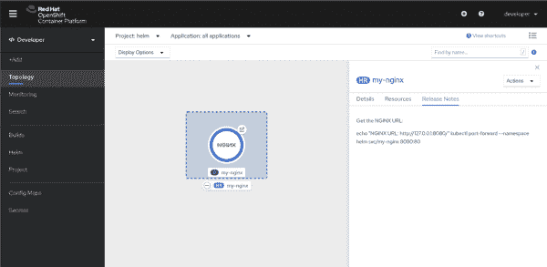
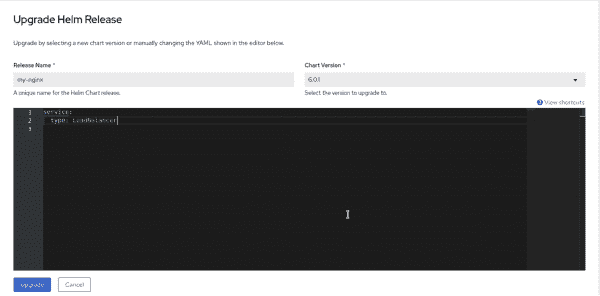
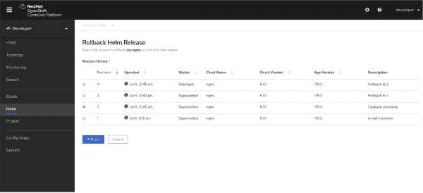

# OpenShift 4.5 web 控制台中的高级头盔支持

> 原文：<https://developers.redhat.com/blog/2020/07/20/advanced-helm-support-in-the-openshift-4-5-web-console>

Helm 是一个受欢迎的 Kubernetes 包管理器，在 T2 红帽 open shift T3 上得到完全支持。从 [OpenShift 4.5](http://www.openshift.com/try) 开始，我们使得在 OpenShift web 控制台中使用舵图比以往更加直观。在本文中，我们将介绍访问和管理舵图的新特性。

## OpenShift 控制台中的舵图表

每当您安装新的 Helm 图表时，都会在您的项目名称空间中创建一个 Helm 版本。然后，您可以直接从 OpenShift web 控制台管理每个图表，包括升级和卸载现有图表。您还可以从 OpenShift 控制台访问任何已安装的舵图表的发行说明，并且可以从控制台控制完整的舵图表的生命周期。您甚至可以使用 Helm 的命令行界面(CLI)或从外部 Helm 图表存储库控制已经安装的图表的生命周期。

OpenShift 4.5 还增加了新的控制台功能，以管理和控制舵图的发布和修订。图 1 中的演示概述了在 OpenShift 4.5 控制台中管理舵图的所有新特性。

Figure 1: New Helm features available in the OpenShift 4.5 web console.

让我们仔细看看这些新功能！

### 发布说明

发行说明提供了关于如何使用已安装的舵图的详细信息。安装新图表后，您可以立即获得这些信息。如图 2 所示，您可以从 OpenShift 4.5 中的新拓扑视图访问任何 Helm chart 的发行说明。您还可以使用 Helm Release Details 页面上的一个选项卡来访问发行说明，如图 2 所示。

Figure 2: Access any Helm chart's release notes using a tab in the Topology view.

### 升级头盔版本

您可以通过更新到新版本的舵图表或修改提供给图表的值来升级现有的舵版本。升级 Helm 版本使 OpenShift 可以直接从控制台更新该版本部署的任何应用程序。图 3 显示了为现有的 Helm 版本选择新的海图版本或更新 YAML 文件的选项。

Figure 3: Options for upgrading a Helm release.

### 回滚舵部署

在 OpenShift 4.5 控制台中，回滚以前的 Helm 部署从未像现在这样简单。从修订历史列表中，您可以选择任何以前的头盔部署，并恢复到它在一次点击。图 4 显示了 OpenShift 4.5 控制台中的回滚舵发布页面和修订历史列表。

Figure 4: Select a previously deployed Helm release, then click the Rollback button.

OpenShift 4.5 改善了开发者使用舵和舵图的体验。它通过完全控制和 OpenShift web 控制台内部的直观集成为开发人员提供了强大的支持，并且可以使用 OpenShift 开发人员目录或 Helm CLI 轻松安装 Helm。安装 Helm 后，您可以从外部存储库升级和回滚 Helm 图表，也可以在本地开发环境中创建和测试新图表。

## 请给我们您的反馈！

OpenShift 开发人员体验流程的很大一部分是接收反馈并与我们的社区和客户合作。我们希望收到您的来信。我们希望您能在 [OpenShift 4.5 开发者体验反馈页面](https://forms.gle/zDd4tuWvjndCRVMD8)上分享您的想法。您还可以加入我们的 [OpenShift 开发者体验谷歌小组](https://groups.google.com/forum/#!forum/openshift-dev-users)，参与讨论并了解我们的办公时间会议，在那里您可以与我们合作，并提供关于您使用 OpenShift web 控制台的体验的反馈。

## 开始使用 OpenShift 4.5

你准备好开始使用新的 OpenShift 4.5 web 控制台了吗？[今天试试 open shift 4.5](http://www.openshift.com/try)。

*Last updated: July 24, 2020*