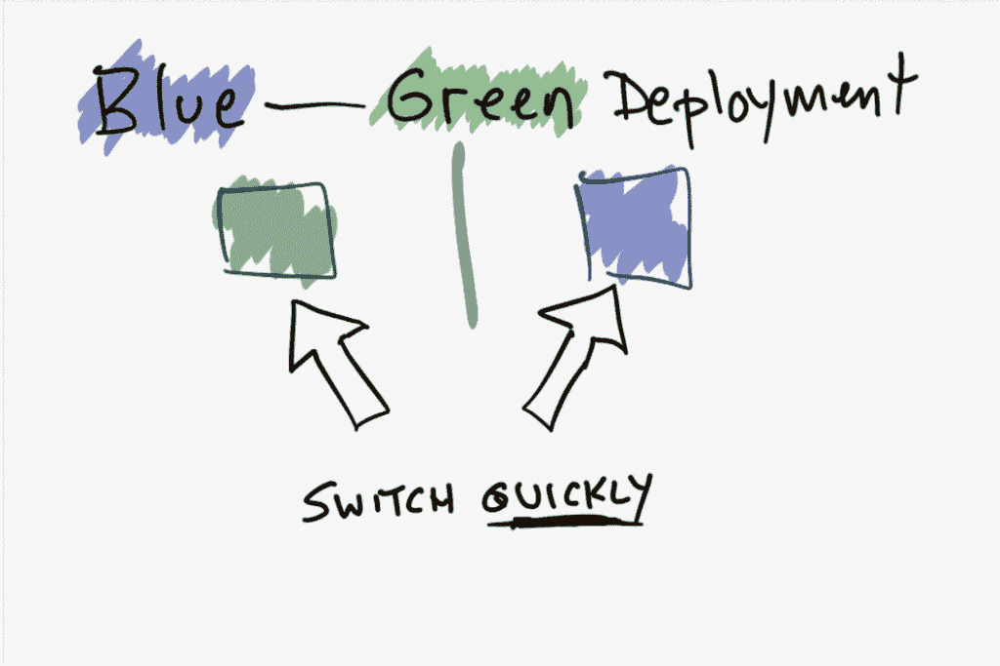
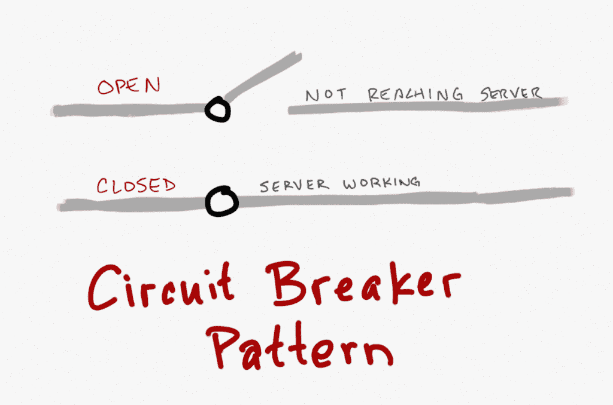

# 先进的微服务。网

> 原文：<https://developers.redhat.com/blog/2017/07/31/advanced-microservices-with-net>

在今年 5 月的 Red Hat 峰会期间，我和来自微软的 Scott Hunter 参加了一个名为“微服务和 OpenShift with”的会议。网芯和。NET 标准 2.0。我先去了，说的是搭建微服务。

这是一个概述，展示了通过在命令行运行一个程序——RHEL 的一个. NET 核心程序——的发展。完成后，我展示了获取图像并将其放入 OpenShift，然后通过 Docker 放大和缩小图像是多么容易。

**蓝绿色展开**

接下来是如何进行蓝绿色部署的演示，您只需推出新版本，但可以快速切换回旧版本。 通过运行两个相同的生产环境 **蓝色** 和 **绿色** ，减少停机时间和风险。

**金丝雀部署**

在那里，你推出一个新版本，然后慢慢地 y 向它迁移。Canary 版本背后的概念是部署到节点的子集，测试它，然后将更改推广到其余的节点。这可以作为一个早期预警指标，最大限度地减少影响:如果金丝雀部署失败。

**断路器模式**

我提到了针对微服务的断路器模式，并展示了一个程序如何优雅地响应服务器上的错误，而不会导致系统崩溃。

**。NET Core 2.0 和。网络标准 2.0**

斯科特谈到。NET Core 2.0 和。网络标准 2.0...现在 API 覆盖范围有了巨大的增长。网芯。举例来说，在。NET Core 2.0，它涵盖了。NET Framework 与。NET Core 1.1，覆盖了 16%。

这将有助于使现有代码兼容，无需修改即可在 Core 上工作，同时也有助于未来的计划。网芯。包括明年，一个叫做。你可以把一个. NET 程序编译成一个可执行文件，就像在 Go 语言中一样。现在你在一个目录中得到程序和一堆依赖项。在未来，它将只是一个程序。

第一个问题是 2.0 将于何时发布，答案是今年夏天晚些时候，这是本次会议的关键要点。这是人们一直在等待的。

有关的更多信息和文章。网核心访问我们的[。NET Core web page](https://developers.redhat.com/topics/dotnet/) 了解关于这个主题的更多信息。

* * *

**如果你知道 Linux 的基本命令，那么下载** [**高级 Linux 命令备忘单**](https://developers.redhat.com/cheat-sheets/advanced-linux-commands/) **，这个备忘单可以帮助你把你的技能提升到一个新的水平。**

*Last updated: September 3, 2019*