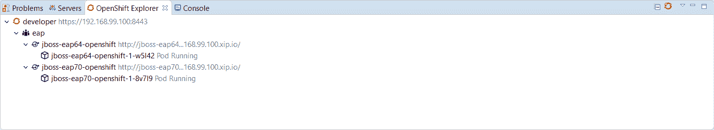
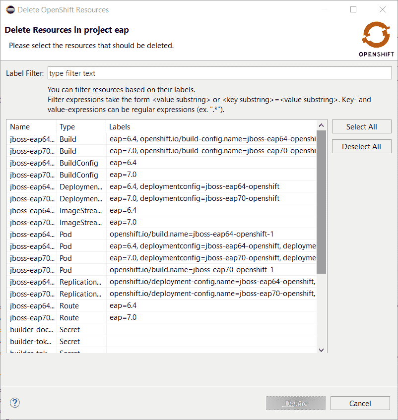
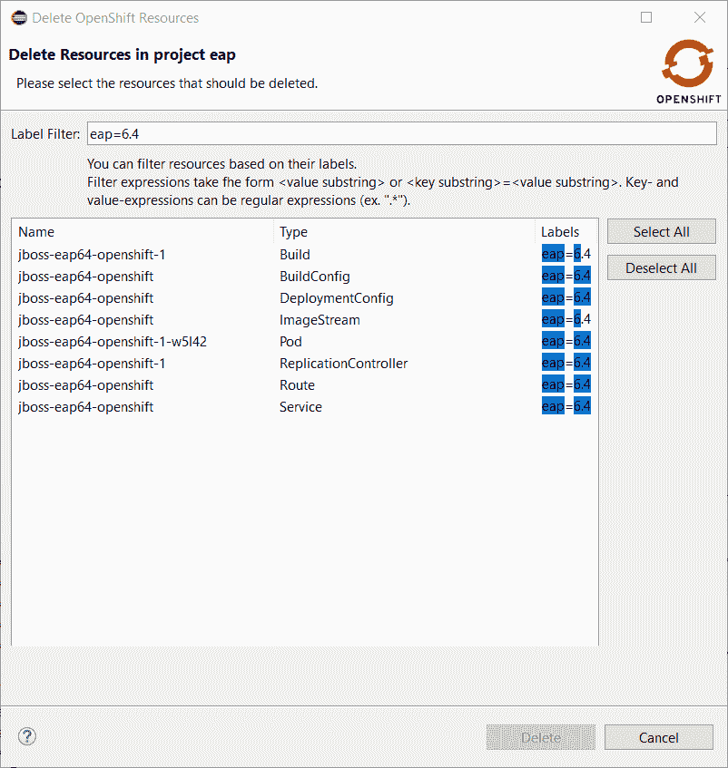
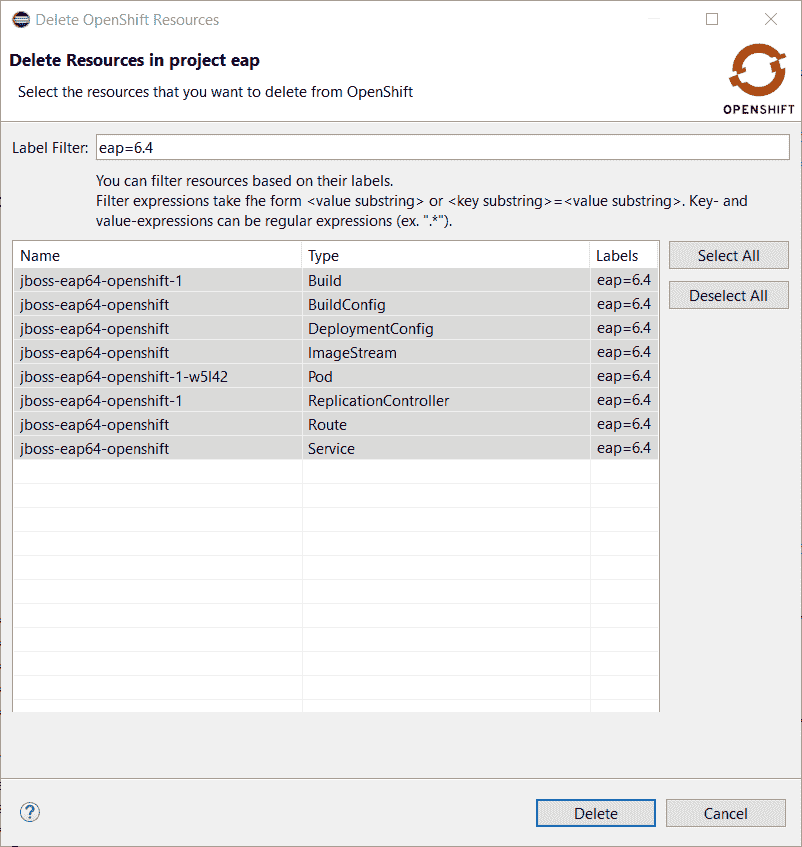
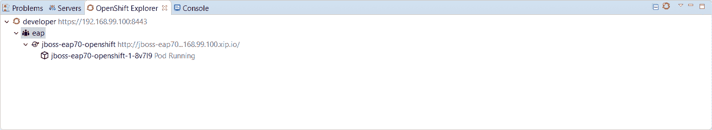

# 宣布面向 Eclipse Oxygen 的 Developer Studio 11.2.0.GA 和 JBoss Tools 4 . 5 . 2 . final。2

> 原文：<https://developers.redhat.com/blog/2018/01/30/announcing-developer-studio-11-2-0-ga-jboss-tools-4-5-2-final-eclipse-oxygen-2>

Eclipse Oxygen.2 的 [JBoss Tools 4.5.2](http://tools.stage.jboss.org/downloads/jbosstools/oxygen/4.5.2.Final.html) 和 [JBoss Developer Studio 11.2](http://tools.stage.jboss.org/downloads/devstudio/oxygen/11.2.0.GA.html) 社区版在这里等你。看看吧！

## 装置

JBoss Developer Studio 的安装程序中预捆绑了所有东西。只需从我们的 [JBoss 产品页面](https://www.jboss.org/products/devstudio.html)下载并运行它，如下所示:

```
java -jar jboss-devstudio-<installername>.jar

```

JBoss Tools 或自带 Eclipse(BYOE)JBoss Developer Studio 需要更多:

这个版本至少需要 Eclipse 4.7 (Oxygen)，但是我们建议使用最新的 [Eclipse 4.7.2 Oxygen JEE 包](http://www.eclipse.org/downloads/packages/eclipse-ide-java-ee-developers/oxygen2)，因为从那时起，您就可以预装大多数依赖项。

一旦你安装了 Eclipse，你可以在 Eclipse Marketplace 的“JBoss Tools”或者“Red Hat JBoss Developer Studio”下找到我们。

对于 JBoss 工具，你也可以直接使用我们的更新站点。

```
http://download.jboss.org/jbosstools/oxygen/stable/updates/
```

## 什么是新的？

我们这次发布的主要焦点是 Java9 的采用、基于容器的开发的改进和错误修复。Eclipse Oxygen 本身有很多新的很酷的东西，但是让我强调一下 Eclipse Oxygen 和 JBoss 工具插件中我认为值得一提的几个更新。

### OpenShift 3

#### OpenShift 服务器适配器中的 Spring Boot 应用程序支持

OpenShift 服务器适配器允许对基于 JEE 和 NodeJS 的应用程序进行热部署和调试。它现在支持 Spring Boot 应用程序，但有一些限制:必须将 Spring Boot devtools 模块添加到您的应用程序中，因为它监视代码更改，并且应用程序必须以分解模式启动，所以您必须使用上游映像(docker.io/fabric8/s2i-java)而不是下游映像生成器 fis-java-openshift。

例如，我们已经提供了一个 OpenShift [模板](https://raw.githubusercontent.com/jbosstools/jbosstools-website/master/documentation/whatsnew/openshift/spring.json)，它将基于上游应用程序和 Git 存储库创建一个 OpenShift 应用程序，该存储库将 Spring Boot 开发工具添加到 Fabric8 Spring Boot 快速入门中。

您可以在此处看到 OpenShift 服务器适配器用于 Spring Boot 应用程序的演示:

[https://www.youtube.com/embed/M6q6tm1ztyU?autoplay=0&start=0&rel=0](https://www.youtube.com/embed/M6q6tm1ztyU?autoplay=0&start=0&rel=0)

#### 支持 OpenShift 服务器适配器调试配置的路由超时和活性探测

在调试 OpenShift 部署时，您可能会面临两个不同的问题:

*   如果您通过 Web 浏览器启动您的测试，那么您很可能会通过 OpenShift 路由访问您的 OpenShift 部署。问题是，默认情况下，OpenShift 路由对每个请求有 30 秒的超时。因此，如果您正在单步调试您的一个断点，您将在浏览器窗口中得到一个超时错误消息，即使您仍然可以调试您的 OpenShift 部署。现在你被困在了 OpenShift 应用程序的导航中。
*   如果您的 OpenShift 部署配置了活跃度探测器，根据您的虚拟机功能或调试器的配置方式，如果您单步执行一个断点，活跃度探测器可能会失败，因此 OpenShift 将重新启动您的容器，并且您的调试会话将被销毁。

 So, from now, when the OpenShift server adapter is started in `debug` mode, the following action are being performed:

*   如果发现 OpenShift 路由链接到要调试的 OpenShift 部署，路由超时将被设置或增加到 1 小时。当 OpenShift 服务器适配器以`run`模式重启时，将恢复原始值或默认值。
*   如果您的 OpenShift 部署配置了活动探测器，并且该字段的定义值小于 1 小时，则`initialDelay`字段将增加到 1 小时。如果此字段的值定义为大于 1 小时的值，则保持不变。当 OpenShift 服务器适配器以`run`模式重启时，将恢复原始值

### 删除资源的增强命令

在删除 OpenShift 资源时，您有两种不同的选择:

*   单独删除每个资源，但由于一些资源被 OpenShift explorer 隐藏，这可能会变得很麻烦
*   删除包含 OpenShift 的项目，但是您删除的资源比需要的多

现在有一个新的增强命令来删除资源。它在 OpenShift 项目级别可用，它将首先列出所选 OpenShift 项目的所有可用 OpenShift 资源。现在，您可以选择要删除的资源，还可以使用过滤器过滤列表，该过滤器将应用于每个检索到的 OpenShift 资源的标签。

因此，如果您在一个 OpenShift 项目中有两个不同的部署(例如，如果您使用 OpenShift Online Starter ),或者如果您在一个部署中有不同种类的资源，您现在可以区分它们。

让我们来看看实际情况:

在这个例子中，我部署了一个基于 EAP6.4 的应用程序和一个基于 EAP7.0 的应用程序。以下是您在 OpenShift 浏览器中看到的内容:



现在，让我们在 *eap* OpenShift 项目上调用新的删除命令:右键单击 OpenShift 项目并选择**删除资源…** :



假设我们想要删除 EAP6.4 部署。在过滤器字段中输入 *eap=6.4* :



按下**全选**按钮:



按下 **OK** 按钮关闭该对话框。资源将被删除，OpenShift explorer 将相应更新:



### 服务器工具

#### EAP 7.1 服务器适配器

添加了一个服务器适配器，可用于 EAP 7.1 和 Wildfly 11。它是根据《野火 11》改编的。这种新的服务器适配器包括对增量管理部署的支持，就像它的上游 WildFly 11 对应物一样。

### 保险丝工具

#### 基于 Fuse 7 Karaf 的运行时服务器适配器

Fuse 7 正在制作中，初步版本已经可以在[早期访问库](http://origin-repository.jboss.org/nexus/content/groups/ea/org/jboss/fuse/jboss-fuse-karaf)上获得。Fuse 工具已经准备好利用它们，以便您可以尝试即将推出的主要 Fuse 版本。

服务器适配器的经典功能是可用的:自动重新部署、Java 调试、通过创建的 JMX 连接的图形化 Camel 调试。请注意:-您还不能直接从 Fuse tooling 中检索 Fuse 7 运行时，需要将其下载到您的机器上，并在创建服务器适配器时指向它。-提供的模板需要一些修改，以使它们与 Fuse 7 一起工作，主要是调整 bom。请参见本 [JIRA 任务](https://issues.jboss.org/browse/FUSETOOLS-2578)及其子任务中与之相关的工作。

#### 在 Camel 图形编辑器(设计选项卡)中显示“routeContext”中定义的路线

“routeContext”标签是 Camel 中使用的一个特殊标签，它提供了重用路线和在不同文件中拆分路线的能力。这对大型项目非常有用。更多信息见 Camel [文档](http://camel.apache.org/how-do-i-import-routes-from-other-xml-files.html)。从这个版本开始，在“routeContext”标签中定义的路线的设计现在被显示。

#### 可用性改进:“更改 Camel 版本”时的进度条

自 Fuse 工具 10.1.0 以来，可以更改 Camel 版本。如果 Camel 版本没有在本地缓存，并且互联网连接较慢，此操作可能需要一段时间。现在有一个进度条来查看进度。

#### 支持创建 Fuse Ignite 技术扩展

我们很高兴地宣布增加对为 **Fuse Ignite** *创建技术扩展项目的支持。这包括使用*“New Fuse Ignite Extension Project”*向导创建项目，以及支持直接从 Eclipse 环境内部构建可部署工件。

***Fuse Ignite** 是 JBoss Fuse 的一个特性，为集成应用程序提供了一个 web 接口。无需编写代码，业务专家就可以使用 Ignite 连接到应用程序，并在不同应用程序的连接之间操作数据。在 Ignite 中，数据操作被称为集成中的一个步骤。Ignite 提供了过滤和映射数据等操作的步骤。要以 Ignite 内置步骤未提供的方式操作数据，您可以开发 Ignite 扩展来定义一个或多个自定义步骤。保险丝 Ignite 作为[保险丝](https://developers.redhat.com/products/fuse/overview/)和[保险丝在线](https://www.redhat.com/en/explore/fuse-online)的一部分。有关如何创建和配置 Fuse Ignite 技术扩展的更多信息，请参考[在线文档](https://access.redhat.com/documentation/en-us/red_hat_jboss_fuse/6.3/html-single/tooling_user_guide/#IgniteExtension)。*

提供的项目模板允许您定义一条 [Apache Camel](http://camel.apache.org/) 路线作为新技术扩展的基本流程。

要配置新的技术扩展，您可以使用用新项目创建的 JSON 文件。

### 锻造工具

#### Forge 运行时更新至 3.8.1.Final

包含的 Forge 运行时现在是 3.8.1.Final .在这里阅读官方公告[。](http://forge.jboss.org/news/jboss-forge-3.8.1.final-is-here)

### 还有更多…

您可以在本页的[中找到更多值得注意的更新。](http://tools.stage.jboss.org/documentation/whatsnew/jbosstools/4.5.2.Final.html)

## 下一步是什么？

随着 JBoss Tools 4.5.2 和 Developer Studio 11.2 的发布，我们已经在为 Eclipse Oxygen 开发下一个维护版本了。

*Last updated: September 9, 2022*