# 开始使用 Eclipse 2019-06 的 Red Hat code ready Studio 12 . 12 . 0 . ga 和 JBoss Tools 4.12.0.Final

> 原文：<https://developers.redhat.com/blog/2019/07/12/announcing-red-hat-codeready-studio-12-12-0-ga-and-jboss-tools-4-12-0-final-for-eclipse-2019-06>

[JBoss Tools 4.12.0](http://tools.jboss.org/documentation/whatsnew/jbosstools/4.12.0.Final.html) 和[Red Hat CodeReady Studio 12.12](https://developers.redhat.com/products/codeready-studio/overview)Eclipse 2019-06 在这里等你。在本文中，我将介绍新版本的亮点，并展示如何开始。

## 装置

Red Hat CodeReady Studio(以前称为 Red Hat Developer Studio)在安装程序中预装了所有东西。只需从我们的 [Red Hat CodeReady Studio 产品页面](https://developers.redhat.com/products/codeready-studio/overview)下载并运行它，如下所示:

```
java -jar codereadystudio-<installername>.jar
```

JBoss Tools 或自带 Eclipse (BYOE) CodeReady Studio 需要更多。

这个版本至少需要 Eclipse 4.12 (2019-06)，但我们建议使用最新的 [Eclipse 4.12 2019-06 JEE 捆绑包](http://www.eclipse.org/downloads/packages/release/2019-06/r/eclipse-ide-java-ee-developers)，因为这样你就可以预装大多数依赖项。

一旦你安装了 Eclipse，你可以在 Eclipse Marketplace 的“JBoss Tools”或者“Red Hat CodeReady Studio”下找到我们

对于 JBoss 工具，您也可以直接使用我们的更新站点:

```
http://download.jboss.org/jbosstools/photon/stable/updates/
```

## 有什么新鲜事？

我们这次发布的主要焦点是对基于容器的开发和 bug 修复的改进。Eclipse 2019-06 本身有很多新的很酷的东西，但我将强调 Eclipse 2019-06 和 JBoss Tools 插件中我认为值得一提的几个更新。

### 红帽 OpenShift

#### Red Hat OpenShift 容器平台 4 支持

新的 [OpenShift 容器平台(OCP)](https://developers.redhat.com/products/openshift/overview) 4 现已可用(参见这篇[文章](https://www.redhat.com/en/about/press-releases/red-hat-redefines-enterprise-kubernetes-through-full-stack-automation-red-hat-openshift-4?source=pressreleaselisting))，与 OCP 3 相比是一个重大转变，但是 JBoss Tools 以透明的方式与这个重大版本兼容。就像对 OCP 3 集群一样，定义到基于 OCP 4 的集群的连接，并使用工具！

### 服务器工具

#### Wildfly 17 服务器适配器

一个服务器适配器已被添加到 Wildfly 17 中。它增加了对 Java EE 8 的支持。

### 休眠工具

#### 新运行时提供程序

添加了新的 Hibernate 5.4 运行时提供程序。它集成了 Hibernate 核心版本 5.4.3.Final 和 Hibernate 工具版本 5.4.3.Final

#### 运行时提供程序更新

Hibernate 5.3 运行时提供程序现在合并了 Hibernate 核心版本 5.3.10.Final 和 Hibernate 工具版本 5.3.10.Final。

### 专家

#### Maven 支持更新至 M2E 1.12

Maven 支持基于 Eclipse M2E 1.12。

### 平台

#### 视图、对话框和工具栏

##### 通过将项目作为命令行参数传递来导入项目

通过将项目路径作为参数传递给启动器，可以将项目导入 Eclipse。该命令在 Linux 和 Windows 上看起来像`eclipse /path/to/project`，在 macOS 上看起来像`open Eclipse.app -a /path/to/project`。

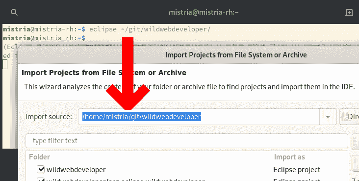

##### 从快速访问启动运行和调试配置

从*快速访问*提议(可通过`Ctrl+3`快捷方式访问)，您现在可以直接启动工作区中可用的任何运行或调试配置。

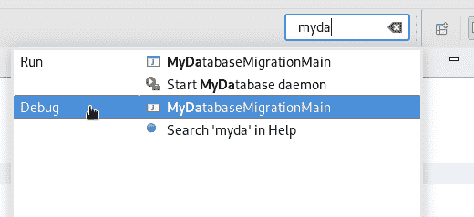

**注意:**出于性能原因，额外的*快速访问*条目仅在`org.eclipse.debug.ui`包已经被工作台中的一些先前操作激活时才可见，例如编辑启动配置，或者展开*运行方式…* 菜单。

用于视图菜单的图标得到了改进。它现在在高分辨率显示器上清晰，在黑暗主题下也看起来更好。比较顶部的旧版本和底部的新版本:


##### 在 Mac 上绘制的高分辨率图像

在 Mac 上，图像和文本现在在 GC 操作期间以高分辨率绘制。您可以在编辑器标尺、表单等的高分辨率显示器上看到清晰的图像。在月蚀中。比较顶部的旧版本和底部的新版本:


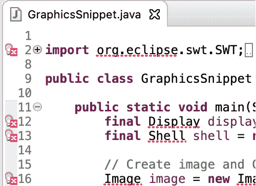

##### 在 Mac 上以深色主题显示的表格/树背景线

在 Mac 上的黑暗主题中，当`setLinesVisible(true)`被设置时，Eclipse 中的表格和树现在在背景中显示交替的暗线。以前，即使线可见性是真实的，它们也有灰色背景。

Eclipse 中的树和表的示例，背景中有交替的深色线条:

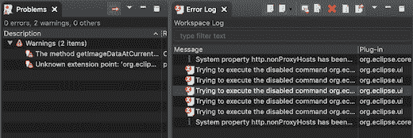

#### 春分

当 Equinox OSGi 框架启动时，已安装的包会根据其配置的启动级别被激活。具有较低起始级别的包首先被激活。同一起始级别内的包从单个线程中顺序激活。

添加了一个新的配置选项`equinox.start.level.thread.count`,使框架能够在相同的启动级别内并行启动包。默认值是`1`，它保持了之前从单个线程激活包的行为。将该值设置为`0`可使用等于`Runtime.getRuntime().availableProcessors()`的线程数来启用并行激活。将该值设置为大于`1`的数字将使用指定的数字作为并行包激活的线程数。

默认值是`1`，因为并行激活包时可能会有死锁的风险。在考虑在产品中启用该选项之前，必须对安装在框架中的一组捆绑包进行广泛的测试。

### Java 开发工具(JDT)

#### Java 12 支持

##### 将项目合规性和 JRE 更改为 12

快速修复*更改项目符合性，并提供 JRE to 12* 来更改当前项目以与 Java 12 兼容。

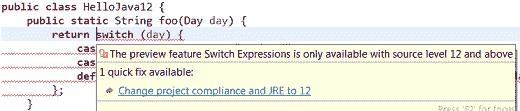

##### 启用预览功能

Java 12 中的预览功能可以使用*首选项> Java >编译器>启用预览功能*选项来启用。这些预览功能的问题严重性可以使用严重性级别为的*预览功能选项进行配置。*

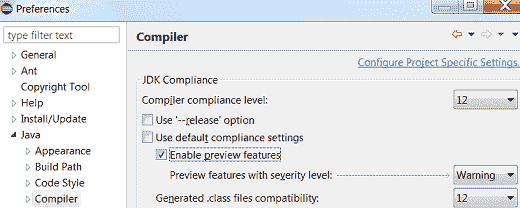

##### 设置启用预览功能

提供快速修复*配置问题严重性*来更新 Java 12 中预览功能的问题严重性。


##### 将默认情况添加到 switch 语句中

快速修复*添加“默认”case* 用于在 Java 12 中向增强的 switch 语句添加默认 case。

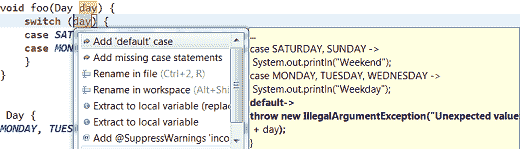

##### 将缺少的 case 语句添加到 switch 语句中

Java 12 中为增强的 switch 语句提供了一个快速修复方法*添加缺失的 case 语句*。

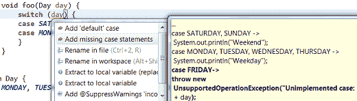

##### 将默认情况添加到开关表达式中

快速修复*添加“默认”案例*用于将默认案例添加到开关表达式中。

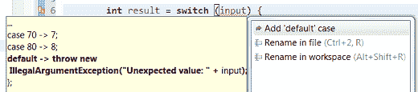

##### 将缺少的 case 语句添加到 switch 表达式中

为开关表达式提供了快速修复*添加缺失的 case 语句*。

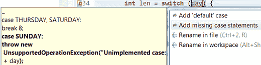

##### 在“开关”中格式化空白

随着 Java 12 在`switch`构造中引入了一些新特性，格式化程序配置文件也有了一些新的设置。这些设置允许您控制箭头运算符周围的空格(分别用于`case`和`default`)以及多值情况下逗号周围的空格。

这些设置可以在*配置文件编辑器(首选项> Java >代码样式>格式化程序>编辑… )* 中的*空白>控制语句>‘开关’*小节下找到。

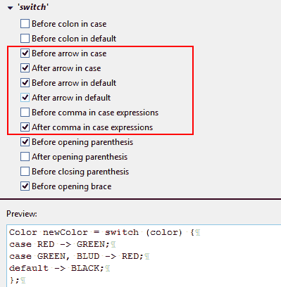

##### 分离开关盒标签

由于 Java 12 引入了将多个`switch` case 标签分组到一个 case 表达式中的能力，所以提供了一个快速助手，允许将这些分组的标签拆分到单独的 case 语句中。

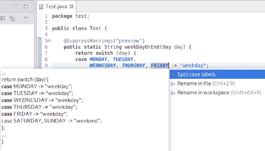

#### Java 编辑器

在 *Java >编辑器>代码挖掘*首选项中，您现在可以启用*显示参数名*选项。这将在方法或构造函数调用中以代码挖掘的形式显示参数名，以防读者不清楚解决方法。

例如，如果方法调用中的参数名与参数名不完全匹配，或者参数名不包含作为子字符串的参数名，则会显示代码挖掘。

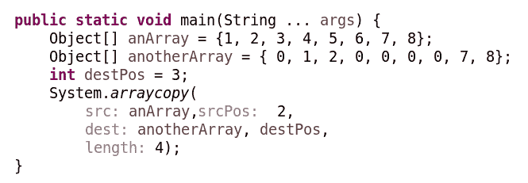

##### 将方法实现的数量显示为代码挖掘

在 *Java >编辑器>代码挖掘*首选项中，选择*显示实现并显示→方法*选项的引用(包括实现)现在显示方法的实现。

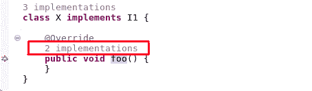

点击方法实现会弹出*搜索*视图，显示子类型中方法的所有实现。

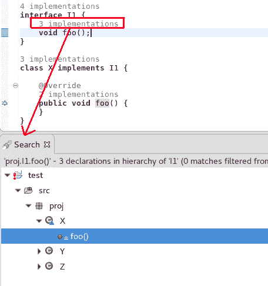

##### 通过代码挖掘在编辑器中打开单个实现/引用

当 *Java >编辑器>代码挖掘*首选项被启用并且显示单个实现或引用时，将光标移动到注释上并使用 Ctrl+Click 将打开编辑器并显示单个实现或引用。

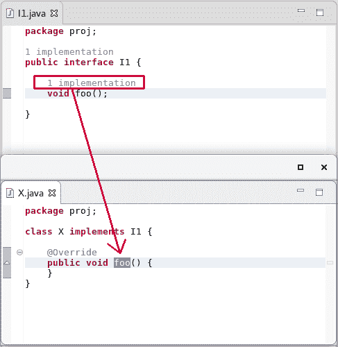

##### 服务提供者构造函数的附加快速修复

当一个在`module-info.java`文件中定义的服务有一个服务提供者实现，它的无参数构造函数不可见或不存在时，可以提供适当的快速修复。

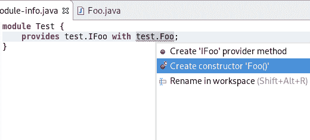

##### 用于创建开关标记语句和开关表达式的模板

Java 编辑器现在提供了新的模板，用于创建 switch 标记的语句和 switch 表达式。在 switch 语句上，有三个新的模板: *switch 标签语句、switch case 表达式、*和 *switch 标签表达式*，如下图所示。这些新模板可用于 Java 12 或更高版本的 Java 项目。

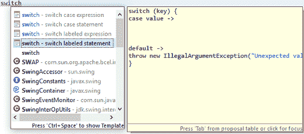

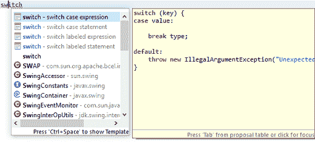

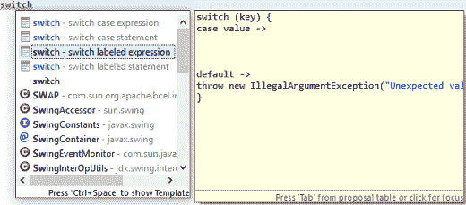

如果*开关*被用作表达式，那么只有*开关案例表达式*和*开关标签表达式*模板可用，如下图所示:

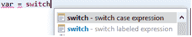

#### Java 视图和对话框

##### 在模块和包中启用注释生成

创建`module-info.java`或`package-info.java`时，现在可以选择启用/禁用注释生成。

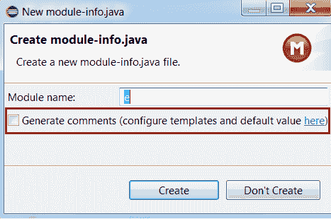

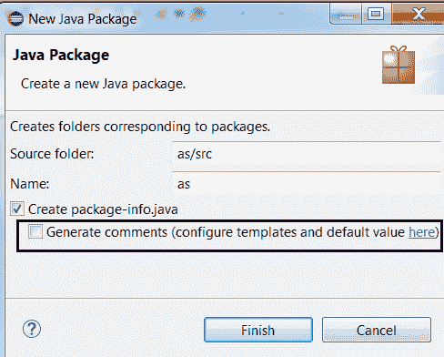

##### 改进的“创建 getter 和 setter”快速助手

从字段创建 getter 和 setter 方法的快速助手不再强迫您创建这两个方法。

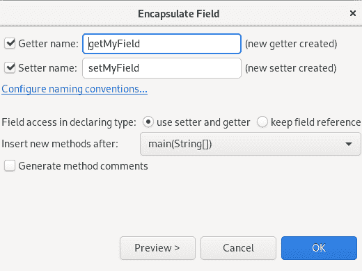

##### 快速修复以打开所有必需的已关闭项目

在 *Problems* 视图中可以快速打开所有需要关闭的项目。

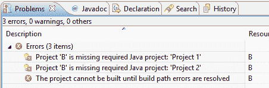

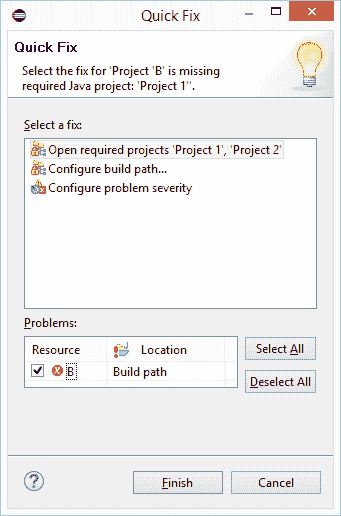

##### 用于配置模块依赖关系的新 UI

Java 构建路径配置现在有了一个新的选项卡，*模块依赖项，*，它将逐渐取代之前隐藏在该对话框其他选项卡上的*模块*节点后面的选项。新的选项卡为配置所有这些模块相关的选项提供了一种直观的方式，Java 9 为此引入了新的命令行选项，如`--limit-modules`等。


这个对话集中在如何构建一个 Java 项目，这里是 *org.greetings* 。

在这个焦点模块下面，左边的窗格显示了所有参与构建的模块，其中装饰 A 和 S 分别标记了自动模块和系统模块。通过*添加系统模块…* 和*移除*按钮(对应`--add-modules`和`--limit-modules`)可以修改系统模块(来自 JRE)的范围。

在左侧窗格中选择模块后，右侧窗格允许为此模块配置以下属性:

**读取模块:**

从所选模块中选择可访问的附加模块(对应于`--add-reads`)。

**暴露包:**

从所选模块中选择要暴露的附加包(“导出”或“打开”)(对应于`--add-exports`或`--add-opens`)。

**用**打补丁

向所选模块添加更多的包和类(对应于`--patch-module`)。

#### Java 编译器

##### 实验性 Java 索引退役

Eclipse 4.7 引入了一个新的实验性 Java 索引，该索引在默认情况下是禁用的。

由于缺乏适当支持所有 Java 9+语言变化的资源，从 Eclipse 4.12 开始，该索引不再可用。

在*首选项> Java* 中启用它的首选项被移除，旧的索引将总是被使用。

**注意:** *首选项> Java >重建索引*按钮可以用来删除现有的索引文件并释放磁盘空间。

#### 调试

##### Ctrl+Alt+单击批注标尺中的“运行到行”

一个新的快捷方式，Ctrl+Alt+Click，已经被添加到注释标尺中，它将调用*‘Run to Line’*命令并将程序执行到调用行。

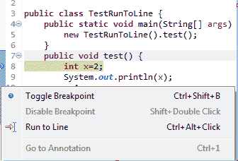

##### 调试外壳中的内容帮助

内容辅助(Ctrl+Space)支持现在在*调试外壳*中可用。

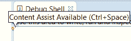

##### 第一次编辑时清除 Java 堆栈跟踪控制台用法提示

Java 堆栈跟踪控制台在第一次打开时会显示用法提示。现在，当用户开始键入或粘贴堆栈跟踪时，此消息会自动移除。

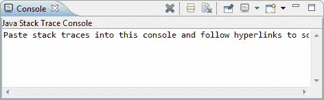

##### 变量视图中显示的 Lambda 变量名

在工作区中调试项目时，Lambda 变量名现在显示在*变量*视图中。

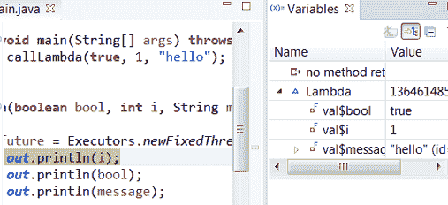

#### JDT 开发人员

##### 支持新的 Javadoc 标签

编译器现在支持以下 Javadoc 标记，并且这些标记是自动完成的。

JDK 引入的标签 8:

`@apiNote`

`@implSpec`

`@implNote`

JDK 引入的标签 9:

`@index`

`@hidden`

`@provides`

`@uses`

JDK 引入的标签 10:

`@summary`

### 还有更多…

你可以在[这个页面](https://tools.jboss.org/documentation/whatsnew/jbosstools/4.12.0.Final.html)找到更多值得关注的更新。

## 下一步是什么？

随着 JBoss Tools 4.12.0 和 Red Hat CodeReady Studio 12.12 的发布，我们已经在为 Eclipse 2019-09 的下一个版本工作。敬请关注更多更新。

*Last updated: September 3, 2019*