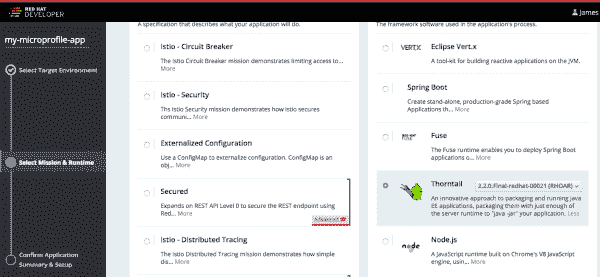
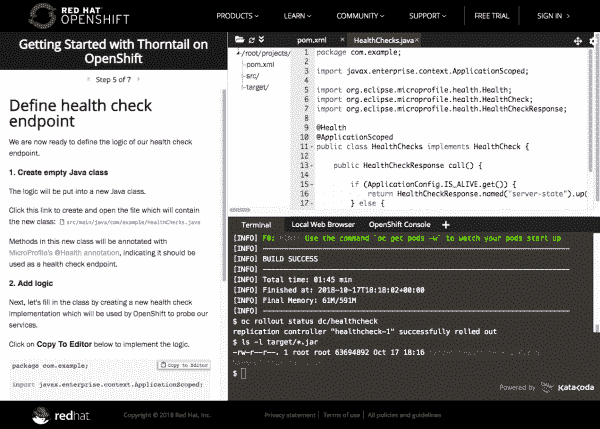

# 宣布:Thorntail 2.2 正式上市

> 原文：<https://developers.redhat.com/blog/2018/10/17/announcing-thorntail-2-2-general-availability>

## 索恩泰尔简介

今天，Red Hat 正在通过订阅 [Red Hat OpenShift 应用运行时](https://developers.redhat.com/products/rhoar/overview/) (RHOAR)向 Red Hat 客户提供 Thorntail 2.2。RHOAR 为应用开发者提供了多种运行在 [OpenShift 容器平台](https://www.openshift.com/)上的应用运行时。

Thorntail 是 WildFly Swarm 的新名称，它通过将服务器运行时库与您的应用程序代码打包并与`java -jar`一起运行，捆绑了您开发和运行 [Thorntail](https://developers.redhat.com/blog/2018/08/23/eclipse-microprofile-and-red-hat-update-thorntail-and-smallrye/) 和 [MicroProfile](https://microprofile.io/) 应用程序所需的一切。它加速了从单片到[微服务](https://developers.redhat.com/topics/microservices/)的过渡，并利用了您现有的行业标准 [Java EE 技术经验](https://developers.redhat.com/topics/enterprise-java/)。

## Thorntail 包括什么？

该版本是 WildFly Swarm 7.1 的增量版本，增加了对 MicroProfile 1.3 的支持，这是一个功能丰富的 API 集合，用于开发企业[微服务](https://developers.redhat.com/topics/microservices/)。除了 JAX-RS、CDI 和 JSON-P 等核心 Java EE 技术之外，MicroProfile 1.3 还包括:

*   [**配置 1.2**](https://microprofile.io/project/eclipse/microprofile-config) :将配置外部化，将业务逻辑与服务配置分离。用 Thorntail 2.2 开发的服务配置可以从 [OpenShift ConfigMaps](https://docs.openshift.com/container-platform/3.11/dev_guide/configmaps.html) 中读取。
*   [**容错 1.0**](https://microprofile.io/project/eclipse/microprofile-fault-tolerance) :实现一组编程模式，如隔板、超时、断路器和回退，以监控潜在的故障情况并做出适当的反应。利用这些模式可以消除微服务架构中级联故障的可能性。
*   [**Metrics 1.1**](https://microprofile.io/project/eclipse/microprofile-metrics) :使用计量器、计数器和计量器等结构公开一组公共运行时指标和自定义应用程序定义的指标。用 Thorntail 2.2 开发的服务可以在 OpenShift 上暴露给 Prometheus 监控。
*   [**健康检查 1.0**](https://microprofile.io/project/eclipse/microprofile-health) :向底层平台公开定制开发的服务的健康状况的标准端点。当在 OpenShift 上运行时，健康检查探测器可以监视这个端点，并重新启动运行不健康服务的容器。
*   [**OpenTracing 1.0**](https://microprofile.io/project/eclipse/microprofile-opentracing) :当请求遍历微服务架构中的多个服务时，支持跟踪请求流。当 Thorntail 与 Jaeger(一种分布式跟踪服务)一起使用时，组织可以快速跟踪性能瓶颈。
*   [**Open API 1.0**](https://microprofile.io/project/eclipse/microprofile-open-api):Open API 规范的 Java 实现，公开了自定义开发的 RESTful 端点的机器可读格式。
*   [**Rest 客户端 1.0**](https://microprofile.io/project/eclipse/microprofile-rest-client) :调用 RESTful 服务的类型安全 API。
*   [**JWT RBAC 1.0**](https://microprofile.io/project/eclipse/microprofile-jwt-auth) :使用基于 OpenID Connect (OIDC)的 JSON Web Tokens (JWT)对微服务端点进行基于角色的访问控制。

Thorntail 还包括许多特性，使得部署和管理 Thorntail 项目变得容易，比如集成数据源、支持 [Keycloak](https://www.keycloak.org/) 和 [Red Hat SSO](https://access.redhat.com/products/red-hat-single-sign-on) 等等。查阅[发行说明](https://access.redhat.com/documentation/en-us/red_hat_openshift_application_runtimes/1/html/red_hat_openshift_application_runtimes_release_notes/)获取完整列表。

## Thorntail 野生蜂群用户的其他变化

除了构建配置文件(`pom.xml`)和日志输出(更多内容见下文)，Thorntail 与 WildFly Swarm 是 API 兼容的。构建配置文件需要用 Thorntail 工件的名称进行更新:

*   `org.wildfly.swarm`参考文献需要更改为`io.thorntail`
*   如果你使用的是野生蜂群 [Maven 插件](https://access.redhat.com/documentation/en-us/red_hat_openshift_application_runtimes/1/html-single/thorntail_runtime_guide/#using-thorntail-maven-plugin_wf-swarm)，你需要将 Maven `artifactId`更新为`thorntail-maven-plugin`

这可以使用一个简单的 Maven 命令(从项目的基本目录运行)自动完成:

```
mvn io.thorntail:thorntail-maven-plugin:2.2.0.Final-redhat-00021:migrate-from-wildfly-swarm
```

注意，生成的 *uberjar* 的名字中使用的后缀也变成了`-thorntail.jar`。如果您有依赖于这个后缀的 CI/CD 逻辑，您将需要更新以考虑到这一点。

其他一些注意事项:

*   因为 Thorntail 被认为是 WildFly Swarm 的“下一个 dot 版本”，所以有新的特性可用，最显著的是对 [MicroProfile 1.3](https://github.com/eclipse/microprofile-bom/releases/tag/1.3) 的支持(见上文)
*   重命名为 Thorntail 后，RHOAR 提供的 Thorntail 版本将与上游项目版本相同。这将使您更容易将 Thorntail 版本映射到上游版本。
*   日志信息代码从`WFSnnnnn`或`WFSWARMnnnn`变为`THORNnnnnn`或`TTnnnnn`。任何对错误代码的监控都需要更新。
*   最后，Thorntail 有一个新的标志，你可以在这篇文章的顶部看到！

## 启动 OpenShift

[](/sites/default/files/blog/2018/10/Screen-Shot-2018-10-17-at-10.51.04-AM.png)Thorntail featured in Launcher

Thorntail featured in Launcher

使用[developers.redhat.com/launch](https://developers.redhat.com/launch)你可以立即创建一个 Thorntail 应用并直接部署到 [OpenShift Online](http://openshift.com/) 或者你自己的本地 OpenShift 集群。它提供了一种创建示例应用程序(称为 booster)的简单方法，以及一种在 OpenShift 上构建和部署这些 booster 的简单方法。

支持者可以展示开发人员如何使用 Thorntail 来构建云原生应用和服务的基本构建块，如创建安全的 RESTful APIs、实现健康检查、外部化配置或与基于 [Istio](https://developers.redhat.com/topics/service-mesh/) 项目的 OpenShift 服务网格集成。

## 使用 Thorntail 测试一个示例应用程序

Thorntail 是一个 Java 框架，因此它可以使用 [OpenJDK](https://developers.redhat.com/products/openjdk/overview/) 运行。让我们在 OpenShift 上测试其中一个 Thorntail 助推器(这里我使用的是[红帽 CDK](https://developers.redhat.com/products/cdk/overview/) ，但是任何 OpenShift 集群都可以)。下面是一组命令，您可以使用这些命令将 OpenJDK 映像拖到本地系统，以便与 Thorntail 一起使用:

```
oc new-project thorntail
oc import-image java:8 --from=registry.access.redhat.com/redhat-openjdk-18/openjdk18-openshift --confirm
```

然后，可以使用以下命令来构建 Thorntail 应用程序并将其部署到 Red Hat OpenShift:

```
oc new-app --name rest-example 'java:8~https://github.com/thorntail-examples/rest-http-redhat#2.2.0-redhat-1'
oc expose svc/rest-example
```

您可以观看构建过程:

```
oc logs -f bc/rest-example
```

构建完成后，等待部署完成:

```
oc rollout status -w dc/rest-example
```

然后访问示例应用程序的用户界面:

```
open http://$(oc get route rest-example -o jsonpath='{.spec.host}{"\n"}')
```

使用带有 Thorntail 的 OpenJDK 发行版的 Red Hat 客户将能够获得最新的更新、安全建议，了解容器更新的时间和原因，并保持最新的可用标记图像。

## 证明文件

RHOAR 团队一直在不断增加和改进 Thorntail 的官方文档。这包括[发行说明](https://access.redhat.com/documentation/en-us/red_hat_openshift_application_runtimes/1/html/red_hat_openshift_application_runtimes_release_notes/)、[入门指南、](https://access.redhat.com/documentation/en-us/red_hat_openshift_application_runtimes/1/html/getting_started_with_red_hat_openshift_application_runtimes/)和新的 [Thorntail 运行时指南](https://access.redhat.com/documentation/en-us/red_hat_openshift_application_runtimes/1/html/thorntail_runtime_guide/)中的更新。

## 开发者互动学习场景

这些[自定进度场景](https://learn.openshift.com/middleware/rhoar-getting-started-thorntail/)为您提供了一个预配置的 OpenShift 实例，无需任何下载或配置即可从您的浏览器访问。用它来[试验 Thorntail](https://learn.openshift.com/middleware/rhoar-getting-started-thorntail/) ，或者了解 RHOAR 中的其他技术，看看它如何帮助解决现实世界的问题。

[](/sites/default/files/blog/2018/10/Screen-Shot-2018-10-17-at-2.25.40-PM.png)Interactive Learning Scenario for Thorntail

Interactive Learning Scenario for Thorntail

## 获得对 Thorntail 的支持

Red Hat 客户可以通过订阅 Red Hat OpenShift 应用程序运行时来获得对 Thorntail 的支持。请联系您当地的 Red Hat 代表或 [Red Hat 销售人员](https://www.redhat.com/en/about/contact/sales)了解如何享受 Red Hat 及其全球合作伙伴网络提供的世界级支持。

展望未来，根据 [Red Hat 产品更新和支持生命周期](https://access.redhat.com/support/policy/updates/jboss_notes/)，客户可以期待对 Thorntail 和其他 RHOAR 运行时的支持。

## 荆棘谷的下一步是什么？

Thorntail 团队不断地从客户和更广泛的开源开发者社区获得反馈，同时跟踪上游 Thorntail 的发布(T2)。他们正在根据反馈对 RHOAR 运行时进行更新，并考虑支持来自 Red Hat 和大型 Java 社区的其他模块。Thorntail 社区也在继续跟踪 [Jakarta EE](https://developers.redhat.com/blog/2018/04/24/jakarta-ee-is-officially-out/) 以及 [MicroProfile 项目](https://microprofile.io)的进展并做出贡献。

## 索恩泰尔背后的人

该版本由 Red Hat 的 RHOAR 产品团队制作，涉及许多小时的开发、测试、编写文档、测试以及与更广泛的 Red Hat 客户、合作伙伴和 Thorntail 开发人员社区合作，以整合大大小小的贡献。我们很高兴你选择使用它，并希望它达到或超过你的期望！

## 钍资源

*   [Red Hat OpenShift 应用运行时开发者主页](https://developers.redhat.com/products/rhoar/overview/)
*   [Eclipse MicroProfile 和 Red Hat 更新:Thorntail 和 SmallRye](https://developers.redhat.com/blog/2018/08/23/eclipse-microprofile-and-red-hat-update-thorntail-and-smallrye/)
*   [索恩泰尔博客](https://thorntail.io/archive/)
*   [索恩泰尔运行时指南](https://access.redhat.com/documentation/en-us/red_hat_openshift_application_runtimes/1/html/thorntail_runtime_guide/)
*   [索恩泰尔讨论组](https://groups.google.com/forum/#!forum/thorntail)
*   [推特上的索恩泰尔](http://twitter.com/thorntail_io)
*   [IRC 上的 thorn tail](http://webchat.freenode.net/?channels=thorntail)
*   [荆棘问题跟踪器](https://issues.jboss.org/projects/THORN/issues?filter=allopenissues)
*   [版本 1.3 中的微文件状态](https://developers.redhat.com/blog/2018/05/07/microprofile-status-version-1-3/)
*   [微文件](https://microprofile.io)

*Last updated: October 18, 2018*