# Eclipse Che 7 上的 Apache Camel 开发

> 原文：<https://developers.redhat.com/blog/2019/05/21/apache-camel-development-on-eclipse-che-7>

与 Che 6 相比， [Eclipse Che](https://www.eclipse.org/che/) 7 的开发有所改进。在 Che 6 上，它仅限于 XML DSL，没有经典的基于 XSD 的 XML 支持。在 Che 7 中，Camel Java DSL 是可用的，基于 XSD 的 XML 支持与 Camel XML DSL 支持配合得很好。请注意，Che 7 仍处于测试阶段。

## 提供骆驼语言功能

在同一个编辑器中，可以访问经典的 XML 工具和 Camel XML DSL 支持。

基于 XSD 的经典 XML 工具完成:
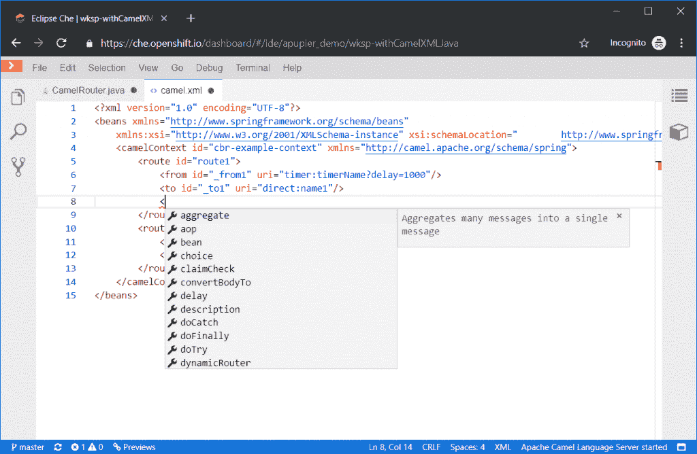

Camel XML DSL 工具完成:
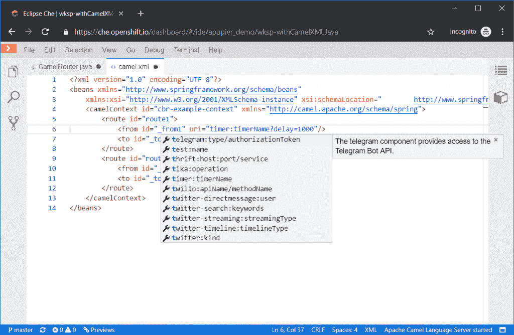

经典 XML 工具验证:
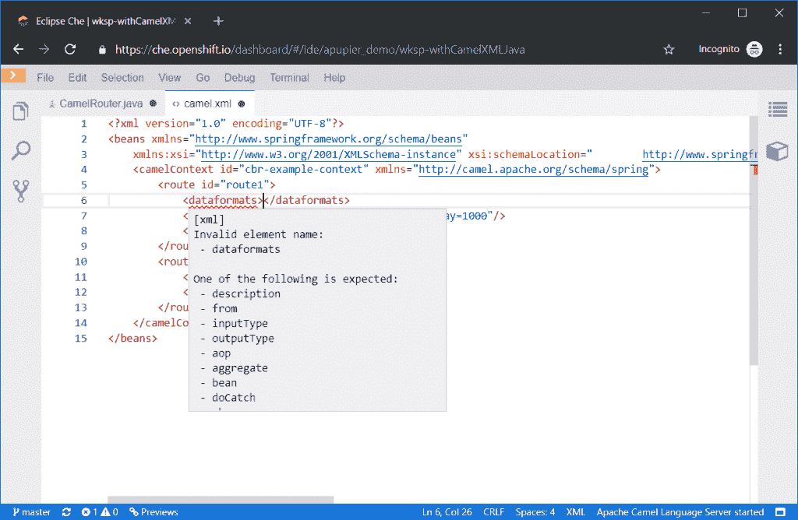

Camel XML DSL 工具验证:
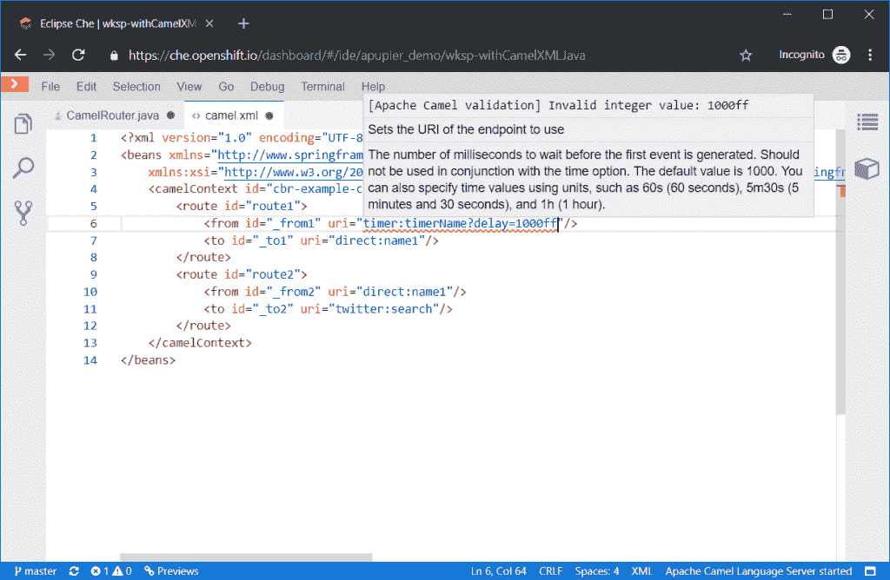

在同一个编辑器中，可以访问经典的 Java 工具和 Camel Java DSL 支持。

经典 Java 工具完成:
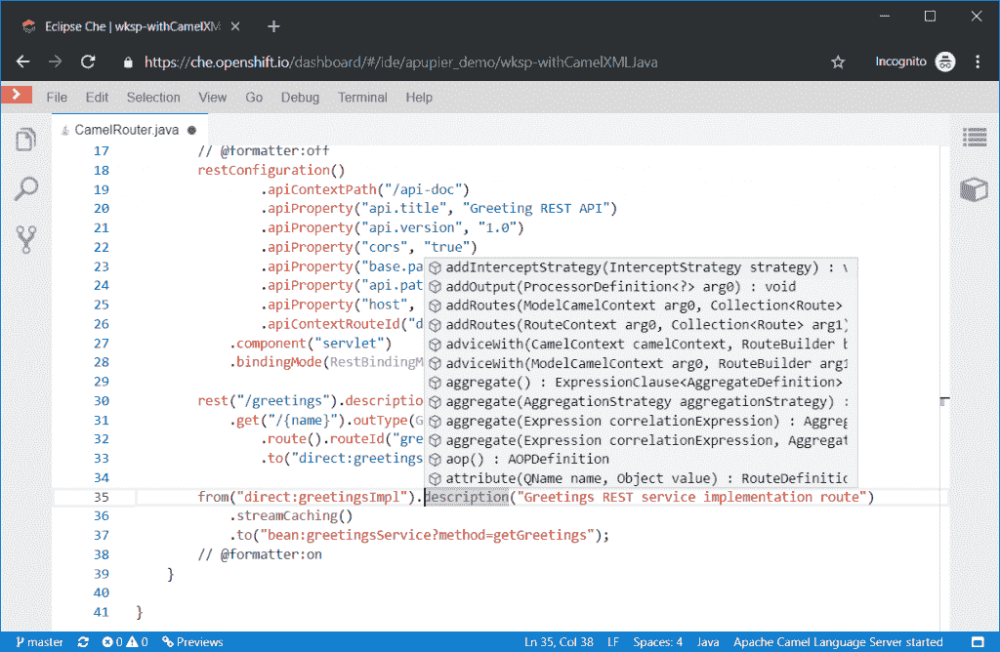

Camel Java DSL 补全:
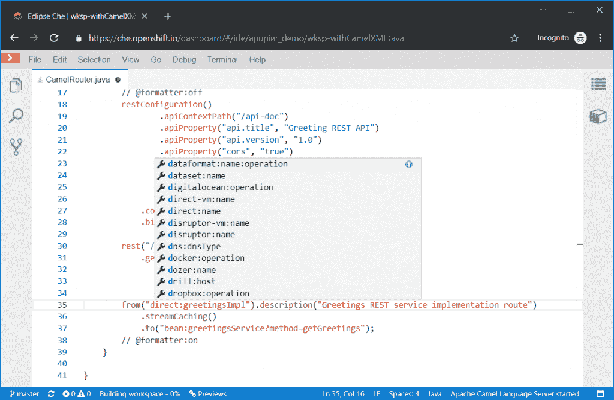

经典 Java 工具验证:
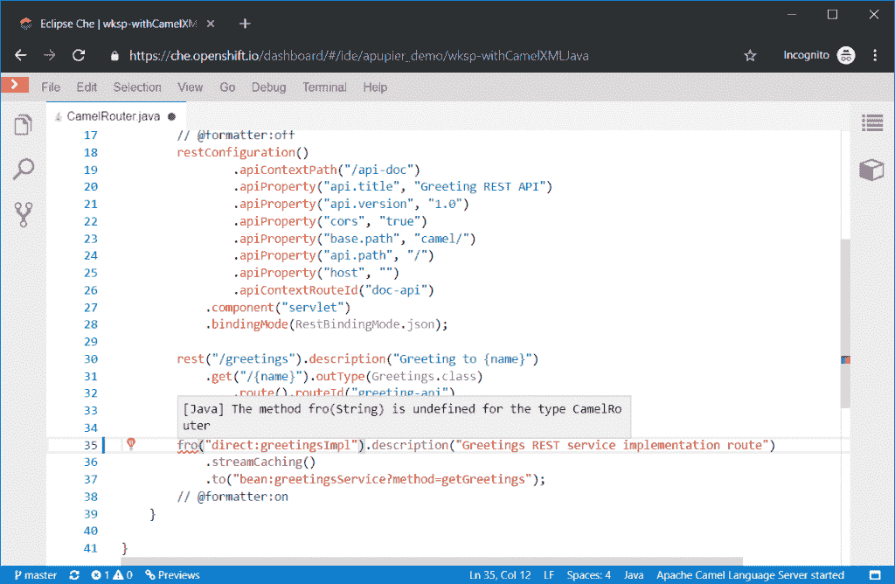

Camel Java DSL 工具验证:
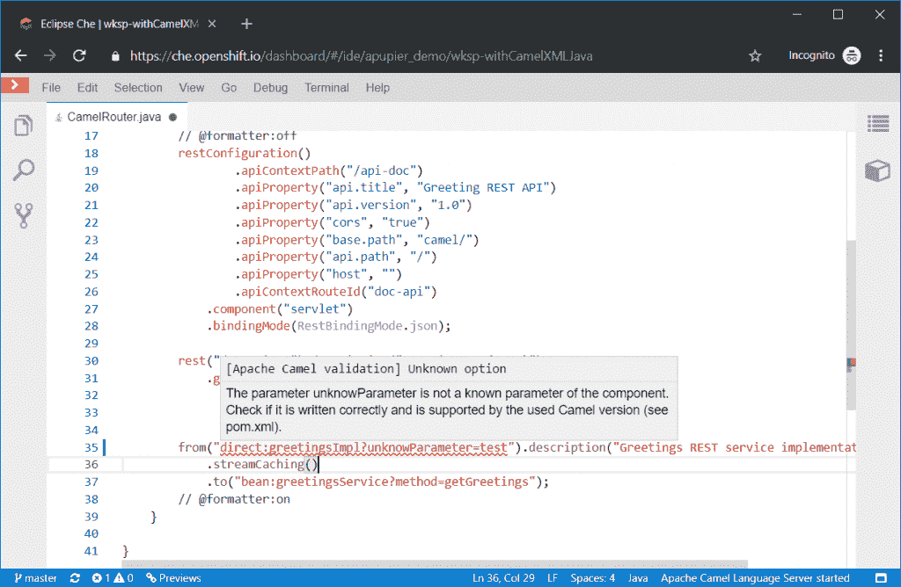

## 如何在 che.openshift.io 上配置

目前，需要一些高级步骤来使所有扩展在资源有限的 Che 环境中协同工作，这是 che.openshift.io 的默认设置。让我们看看如何激活它。

*   进入 [che.openshift.io](https://che.openshift.io) (如果你还没有注册，你必须注册)。
*   基于 Che 7 创建一个工作区。

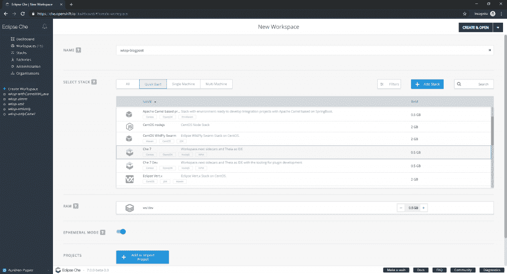

*   等待工作区创建完成。
*   导入所需的 Camel/Fuse 项目。
*   使用左上角的黄色箭头并单击工作区，返回工作区配置。

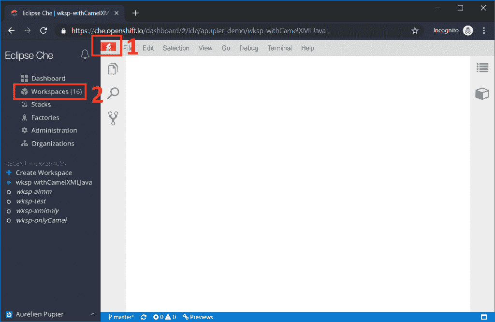

*   单击正在运行的工作区。
*   单击右上角的停止。
*   转到插件选项卡。
*   启用对 Apache Camel 的语言支持，对 Java 和 XML 的语言支持。

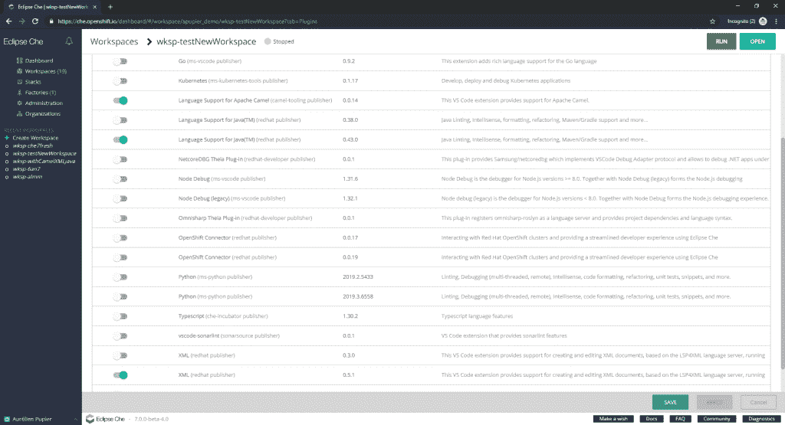

*   转到配置选项卡。
*   搜索“属性”，为每个插件添加内存限制，应该以类似于:

    ```
    "attributes": {
    "sidecar.redhat/java.memory_limit": "1280Mi",
    "sidecar.camel-tooling/vscode-apache-camel.memory_limit": "128Mi",
    "sidecar.redhat/vscode-xml.memory_limit": "128Mi",
    "sidecar.eclipse/che-theia.memory_limit": "512Mi",
    "editor": "eclipse/che-theia/next",
    "plugins": "eclipse/che-machine-exec-plugin/0.0.1,redhat/java/0.43.0,camel-tooling/vscode-apache-camel/0.0.14,redhat/vscode-xml/0.5.1"
    }
    ```

    结尾
*   点击右上角的打开按钮。
*   打开一个 Java 文件，等待 Java 语言服务器启动(这可能需要几分钟)。
*   尽情享受吧！

## 下一步是什么？

正如你已经注意到的，安装目前有点麻烦，因为它需要你接触 YAML 配置文件。不用担心；改进安装体验的工作正在进行中，比如提供一个[特定的 Camel stack](https://github.com/eclipse/che/issues/13182) 。这将允许您创建一个预配置的工作区，这意味着只执行前三个步骤，而不是配置的 11 个步骤。通过将现有的 VS 代码扩展整合到 Che 7 中，其他几个特性也正在开发中。敬请关注。

*Last updated: May 22, 2019*