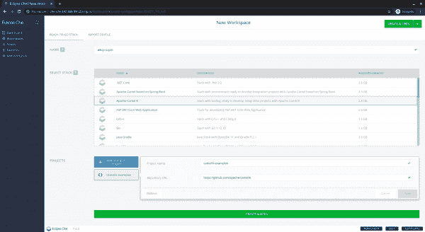
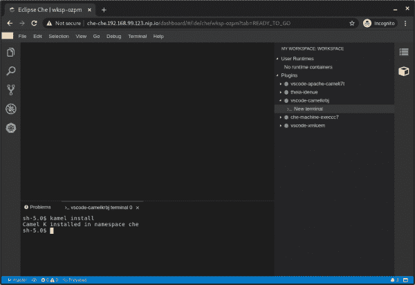
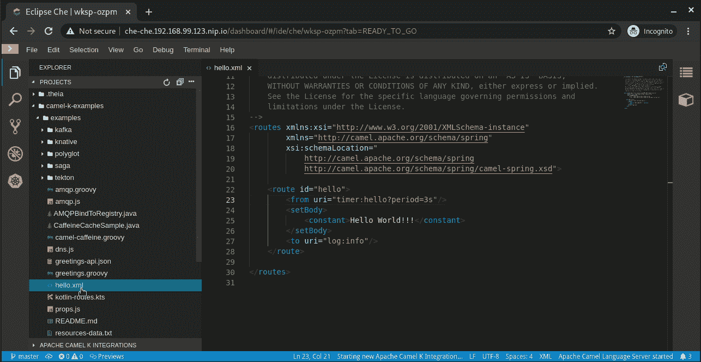
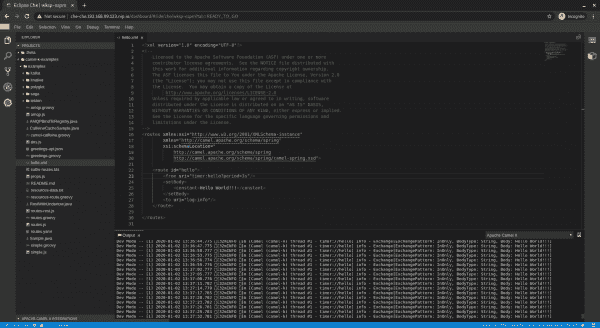
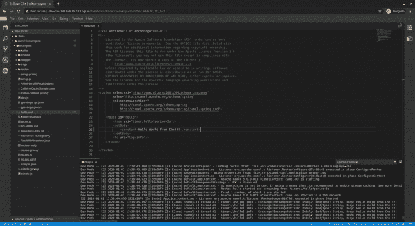

# Eclipse Che 中的 Apache Camel K 开发:迭代 1

> 原文：<https://developers.redhat.com/blog/2020/01/24/apache-camel-k-development-inside-eclipse-che-iteration-1>

Eclipse Che [7.6.0 版本](https://github.com/eclipse/che/releases/tag/7.6.0)为 [Apache Camel K](https://camel.apache.org/camel-k/latest/index.html) 集成开发提供了一个新的堆栈。这个版本是第一个给出可能的预览的迭代。如果你喜欢你所看到的，大声喊出来，更多肯定会到来。

本文详细介绍了如何在部署于 [minikube](https://minikube.sigs.k8s.io/) 上的本地实例上测试这个版本。托管实例的不同之处在于，我们避免了集群中涉及 Camel K 安装和用户特定权限的先决条件。

## 设置 Che 实例

容器主机需要可用。例如，您可以使用 minikube。Che 需要大量的内存，所以你需要增加默认分配的内存。例如:

```
$ minikube start --memory=4096
```

该命令提供如下输出:

```
?  minikube v1.3.1 on Fedora 31
?  Creating virtualbox VM (CPUs=4, Memory=4096MB, Disk=50000MB) ...
?  Preparing Kubernetes v1.15.2 on Docker 18.09.8 ...
?  Pulling images ...
?  Launching Kubernetes ... 
⌛  Waiting for: apiserver proxy etcd scheduler controller dns
?  Done! kubectl is now configured to use "minikube"

```

更多细节见[官方 Che 7 文档](https://www.eclipse.org/che/docs/che-7/running-che-locally/#using-minikube-to-set-up-kubernetes_running-che-locally)。然后，从 [GitHub 发布](https://github.com/che-incubator/chectl/releases)下载`chectl`。您可以使用以下命令在 minikube 实例上安装 Che:

```
$ chectl server:start --platform minikube
```

该命令提供如下输出:

```
  ✔ Verify Kubernetes API...OK
  ✔ ?  Looking for an already existing Che instance
    ✔ Verify if Che is deployed into namespace "che"...it is not
  ✔ ✈️  Minikube preflight checklist
    ✔ Verify if kubectl is installed
    ✔ Verify if minikube is installed
    ✔ Verify if minikube is running
    ↓ Start minikube [skipped]
      → Minikube is already running.
    ✔ Verify if minikube ingress addon is enabled
    ↓ Enable minikube ingress addon [skipped]
      → Ingress addon is already enabled.
    ✔ Retrieving minikube IP and domain for ingress URLs...192.168.99.123.nip.io.
  ❯ ?‍  Running Helm to install Che
    ✔ Verify if helm is installed
    ✔ Check Helm Version: Found v3.0.0+ge29ce2a
    ✔ Create Namespace (che)...done.
  ✔ ?‍  Running Helm to install Che
    ✔ Verify if helm is installed
    ✔ Check Helm Version: Found v3.0.0+ge29ce2a
    ✔ Create Namespace (che)...done.
    ✔ Check Cluster Role Binding...does not exists.
    ✔ Preparing Che Helm Chart...done.
    ✔ Updating Helm Chart dependencies...done.
    ✔ Deploying Che Helm Chart...done.
  ✔ ✅  Post installation checklist
    ✔ Devfile registry pod bootstrap
      ✔ scheduling...done.
      ✔ downloading images...done.
      ✔ starting...done.
    ✔ Plugin registry pod bootstrap
      ✔ scheduling...done.
      ✔ downloading images...done.
      ✔ starting...done.
    ✔ Che pod bootstrap
      ✔ scheduling...done.
      ✔ downloading images...done.
      ✔ starting...done.
    ✔ Retrieving Che Server URL...http://che-che.192.168.99.123.nip.io
    ✔ Che status check
Command server:start has completed successfully.

```

有关更多细节和选项，请参见 Che 7 官方文档。

## 创建和配置 Camel K-ready 工作空间

要创建和配置您的 Camel K-ready 工作区，您首先需要从 Camel K 栈创建一个工作区。在前一个命令日志的末尾，在“检索 Che 服务器 URL ...”之后提供了访问 Che 实例的 URL

在浏览器中打开此 URL。选择 **Apache Camel K** 栈，然后点击**创建&打开**按钮，打开如图 1 所示的页面:

[](/sites/default/files/blog/2020/01/Screenshot-from-2020-01-02-14-05-03.png)Figure 1: Create your new Apache Camel K workspace in Eclipse Che.">

等待工作区准备就绪。这个过程可能需要几分钟，取决于您的互联网连接速度。

接下来，您需要将 kubeconfig 登录上下文注入到 Che 工作区中。为此，您可以返回到您的主机并调用:

```
$ chectl workspace:inject -k
```

确保`vscode-camelkXXX`的注射成功。该命令提供如下输出:

```
  ✔ Verify if namespace che exists
  ✔ Verify if the workspaces is running
  ✔ Injecting configurations
    ↓ injecting kubeconfig into container che-machine-execcc7 [skipped]
      → the container doesn't support file injection
    ↓ injecting kubeconfig into container theia-idenue [skipped]
      → kubeconfig already exists in the target container
    ✔ injecting kubeconfig into container vscode-xmlcem...done.
    ↓ injecting kubeconfig into container vscode-apache-camelt7t [skipped]
      → kubeconfig already exists in the target container
    ✔ injecting kubeconfig into container vscode-camelkrbj...done.
```

现在，安装 Camel K，在右栏点击**我的工作区**展开面板。然后，展开**插件- > vscode-camelkXXX** 树。点击**新建终端**，然后输入:

```
$ kamel install
```

结果如图 2 所示:

[](/sites/default/files/blog/2020/01/Screenshot-from-2020-01-02-14-24-11.png)Figure 2: Create your new terminal inside your new workspace's **Plugins**.">

## 部署并自动重新部署 Camel K 集成

默认情况下会填充[官方骆驼 K 示例](https://github.com/apache/camel-k/tree/master/examples)。你可以打开例如`hello.xml` *。*注意，集成只是简单地记录了“Hello World！！!"每三秒钟。

右键单击**项目**面板中的这个例子。选择**开始 Apache Camel K 集成**，然后选择**开发模式——开发模式下的 Apache Camel 集成**，如图 3 所示:

[](/sites/default/files/blog/2020/01/startInDevMode.gif)Figure 3: Deploy the Hello World example.">

等待几秒钟(或几分钟)进行首次部署。同样，这需要多长时间取决于您的互联网连接速度。

准备好后，进入**输出**面板。选择 **Apache Camel K** 输出，应该显示“Hello World！！!"每三秒记录一次，如图 4 所示:

[](/sites/default/files/blog/2020/01/Screenshot-from-2020-01-02-14-37-37.png)Figure 4: View the output log.">

修改`hello.xml`文件的内容。例如，您可以将常量更改为“Hello World from Che！！!"集成会在几毫秒内自动重新部署，如图 5 所示:

[](/sites/default/files/blog/2020/01/Screenshot-from-2020-01-02-14-39-07.png)Figure 5: The output log now shows the updated results from the automatic redeployment.">

因为 Che 工作空间重用 VS 代码扩展，所以您可以使用 Apache Camel K VS 代码扩展的所有[工具。参见我们之前关于](https://marketplace.visualstudio.com/items?itemName=redhat.vscode-camelk)[如何创建一个集成的文章，发送一封电报](https://developers.redhat.com/blog/2019/09/30/sending-a-telegram-with-apache-camel-k-and-visual-studio-code/)来进一步说明这个例子。

## 已知限制

有两个主要的已知限制。Camel K 实例的登录需要在每次工作空间启动时重新进行，在远程集群上，需要给予特殊的权限，以便您可以安装和访问 Camel K 实例。

*Last updated: June 29, 2020*