# API 之旅:以敏捷的方式从想法到部署——第二部分

> 原文：<https://developers.redhat.com/blog/2018/04/19/api-journey-idea-deployment-agile-way-part2>

这是一个由三部分组成的系列的第二部分，描述了一个从构思到生产部署的敏捷 API 生命周期的建议方法。如果您错过了第 1 部分或需要复习，请花点时间阅读第一部分。

这个系列是与 Nicolas Massé合著的，他也是一名红帽商，它是基于我们在与我们遇到的红帽顾客打交道时的真实经历。

在第一部分中，我们探讨了 ACME Inc .如何为其新的`Beer Catalog API`进行敏捷 API 之旅，ACME 完成了 API 构思、合同设计和取样阶段。让我们现在去嘲讽。

## 里程碑 3: API 模拟和随时可用的测试

在第 1 部分中，我们花了一些时间来举例说明我们的 API 或微服务，并定义了补充性的期望。这一切值得吗？是的，肯定的。第一个原因是因为样本和期望是有帮助的文档，可以让你理解 API 的实际用途。第二，我们将能够使用它们来加速事情和并行开发。让我们看看我们能做些什么。

本阶段的目的是能够:

*   将提供的样品转换成随时可用的模型。
*   重用样本和期望作为未来 API 实现的真实测试套件。

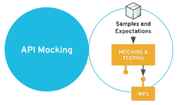

在这里，再次出现了关于工具的“本地”与“团队”方法的讨论。

从开发人员的角度来看，制作模拟的“本地”方法非常容易设置和使用。通过 [Hoverfly](https://hoverfly.io/) 和[wire mock](http://wiremock.org/)等多种工具实现。你也可以争辩说，一些开发工具非常容易使用，以至于嘲讽只是几行代码。在我看来，那可能是真的，但是忽略了两个重要的点。

第一个是关于模拟背后的文档和交流目的。它们也是为了帮助我们理解 API，所以它们应该在很大程度上是可及的。 第二个是关于一生的一个嘲弄。在集成测试期间，由开发人员管理的模拟对于他们的项目范围非常有用。然而，最有用的模拟是那些活的，准备好供未来几周、几个月或几年出现的每个消费者使用的模拟。

“团队”方法提供了这些好处。一些工具如[hover fly Cloud](https://cloud.hoverfly.io)甚至[Postman mocks](https://www.getpostman.com/docs/postman/mock_servers/setting_up_mock)都允许这种团队方式。然而，我们仍然认为缺少一些要点，因为作为仅 SaaS 的解决方案，它们仅致力于 REST APIs，并且仅处理模拟部分，而不是测试部分。

再次在这里，我们建议看一看这个阶段的 [微芯片](http://microcks.github.io/) 。Microks 能够存在于您的数据中心中，并接管您的 REST APIs 和您现有的 SOAP web 服务。Microcks 还支持测试您的 API 实现，如下所述。

回到我们的 ACME 用例:在 Microcks 中唯一要做的事情是在您的 Git 存储库中注册 Postman 集合文件的 URL。Microcks 有一个*作业*的概念，可以被调度或触发来刷新其存储库中的模拟和期望定义。

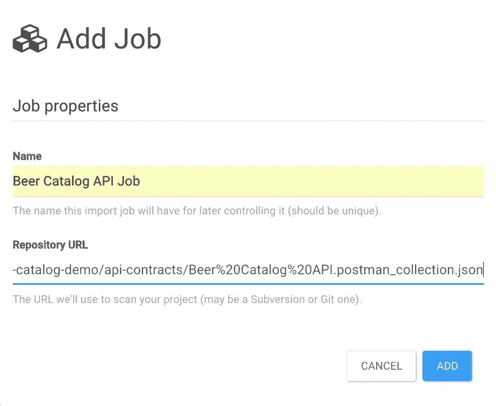

一旦创建并激活作业，它将扫描指定的 URL。这样，它就能够发现您的 API 或服务定义。我们立即获得了 API 的完整描述和有意义的附加样本。即时部署模拟，并为每个新的 API 及其操作提供特定的端点。

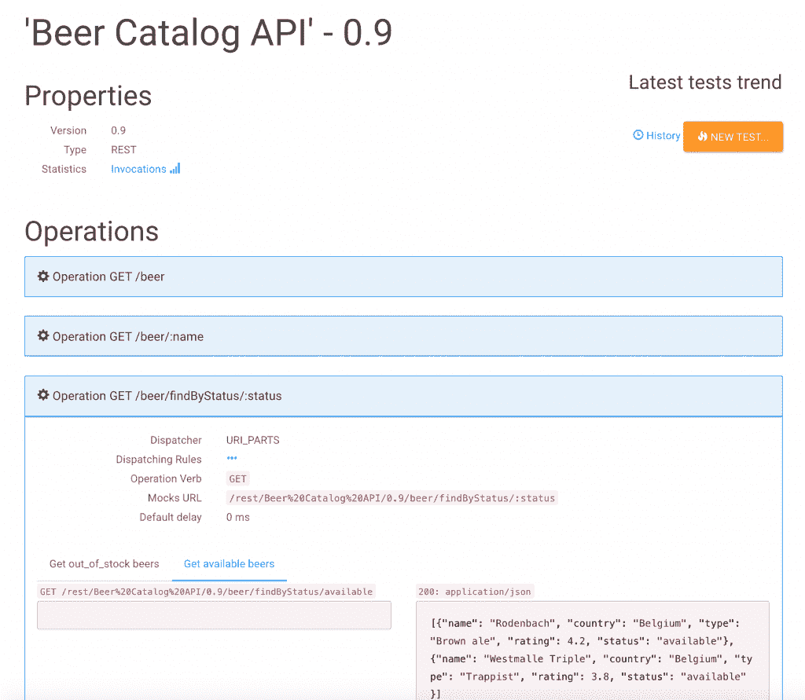

检索 `Mocks URL` 信息并将其附加到服务器基本 URL，我们现在可以检查我们已经准备好使用模拟。

使用分页选项，我们可以在目录中列出所有的 啤酒 。

```
$ curl 'http://microcks.example.com/rest/Beer%20Catalog%20API/0.9/beer?page=0'                                                  [
    {
        "name": "Rodenbach",
        "country": "Belgium",
        "type": "Brown ale",
        "rating": 4.2,
        "status": "available"
    },
    {
        "name": "Westmalle Triple",
        "country": "Belgium",
        "type": "Trappist",
        "rating": 3.8,
        "status": "available"
    },
    {
        "name": "Weissbier",
        "country": "Germany",
        "type": "Wheat",
        "rating": 4.1,
        "status": "out_of_stock"
    }
]
```

然后我们可以只检索一个 啤酒 资源，使用它的名字:

```
$ curl 'http://microcks.example.com/rest/Beer%20Catalog%20API/0.9/beer/Weissbier'
{
    "name": "Weissbier",
    "country": "Germany",
    "type": "Wheat",
    "rating": 4.1,
    "status": "out_of_stock"
}
```

我们还可以只检索具有 `available` 状态的 啤酒:

```
$ curl 'http://microcks.example.com/rest/Beer%20Catalog%20API/0.9/beer/findByStatus/available'
[
    {
        "name": "Rodenbach",
        "country": "Belgium",
        "type": "Brown ale",
        "rating": 4.2,
        "status": "available"
    },
    {
        "name": "Westmalle Triple",
        "country": "Belgium",
        "type": "Trappist",
        "rating": 3.8,
        "status": "available"
    }
]
```

注意在 Microcks API 详情页上橙色的 `NEW TEST...` 按钮；我们将在下一阶段使用它。我们现在准备开始并行的两个开发流:

*   API 的开发完全实现
*   任何消费者的发展

消费者将使用 Microcks 展示的模拟来体验未来的实现。在下一阶段，我们将关注 API 实现，看看我们设置的期望将如何用于测试，并确保实现尊重它们。

## 里程碑 4:开发、部署和测试

开发、部署和测试是这个 API 旅程中最明显的阶段，你可能已经选择了你的堆栈。但是，我们认为强调现代应用程序开发和部署的一些要求可能会有所帮助。

我们可以假设，如今，每个支持 API 的新应用都应该是云就绪型应用。到*云就绪*，我们期望它应该具有以下属性:

*   动态适应负载的能力
*   灵活集中的配置
*   依赖性发现机制
*   用于通信的本地负载平衡机制
*   强大的弹性、监控和可观察性
*   自动日志和分布式痕迹收集

所有这些功能都应该在手边，集成到开发者体验中。这就是为什么基于[Kubernetes](https://kubernetes.io/)容器编排器的 PaaS 解决方案是当今构建和部署 API 实现的最佳选择。此阶段的目的是使 API 部署快速且可重复，以便我们可以按照预期测试不同的环境。

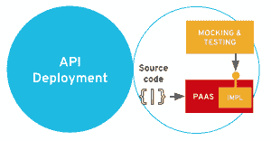

在这个阶段，ACME 选择了 Spring Boot 框架作为其开发堆栈，并将它部署到基于 Kubernetes 的红帽 PaaS 解决方案[【open shift](https://www.openshift.com/)。一旦您准备好您的 OpenShift 实例，我们将创建一个新项目来托管我们的 ACME API 实现的开发环境。这就像执行一个 `oc` 命令一样简单，也可以通过 OpenShift web 控制台来完成:

T2`oc new-project beer-catalog-dev --display-name="Beer Catalog (DEV)"`

在 OpenShift 中拥有一个专用的项目可以使它与另一个项目隔离开来(在网络、用户授权和资源消耗方面)。您现在可以轻松地部署您的应用程序，从目录中选择 `Red Hat OpenJDK 8` ，并填写高级属性。

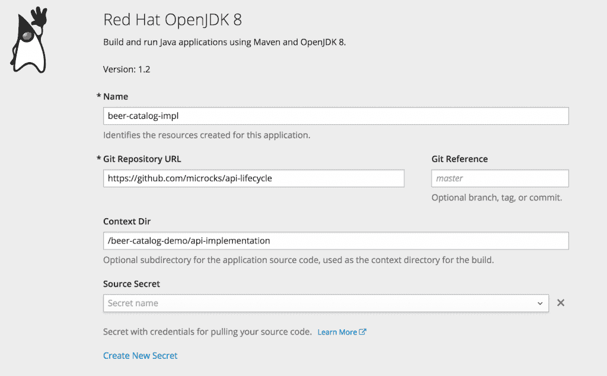

你会注意到 API 实现位于一个 `/beer-catalog-demo/api-implementation` 目录下的 `https://github.com/microcks/api-lifecycle` GitHub 仓库中。即使 OpenShift 最终运行的是容器，它也允许您简单地从源代码部署应用程序。在真正部署之前，它会将应用程序构建和容器化的所有位和字节交给您(在 OpenShift 中，这个过程被称为“源到映像”)。

几分钟后，你应该有一个 pod 在运行，所有的网络东西都被初始化了，如下面的截图所示:

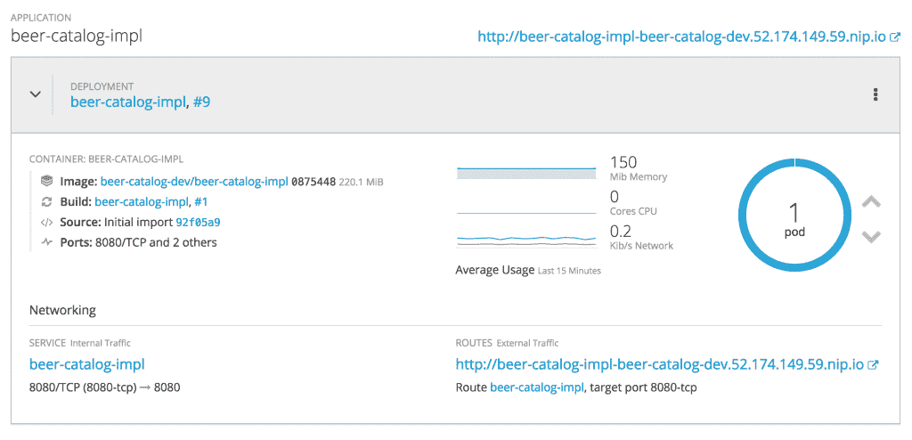

现在是时候测试 0.9 版本的 `Beer Catalog API` 的极致实现了，看看它是否符合定义的端点和期望。让我们回到微时钟，现在您可以使用橙色的 `NEW TEST…` 按钮。

在 Microcks 中请求一个 新测试 允许您设置两个测试属性:应该被评估的端点 URL 和测试应该应用的运行者(测试策略)。

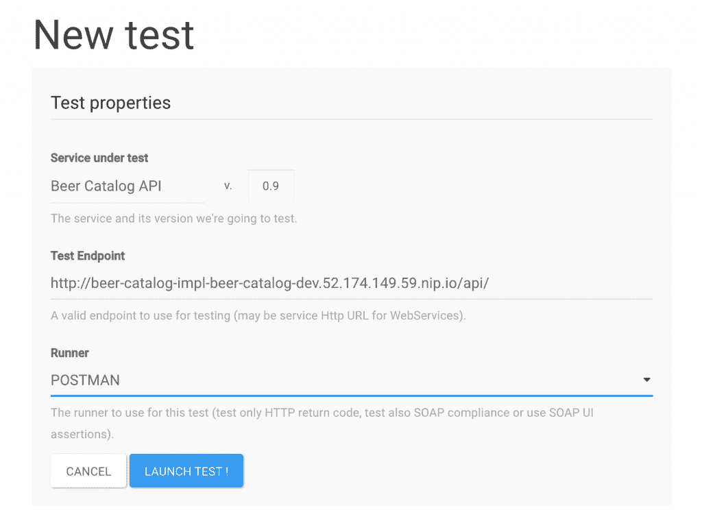

Microcks 为测试提供了不同的现成策略。您可以选择只测试端点(即冒烟测试),直到测试来自实现的响应消息的符合性。 邮差 策略只是重复使用我们在里程碑 2 的阶段设定的期望。

现在可以开始测试了。您将进入一个摘要页面，该页面将一直刷新，直到测试完全完成(成功或失败)。你可以看到，在我们的例子中，它都是绿色的，表示成功。

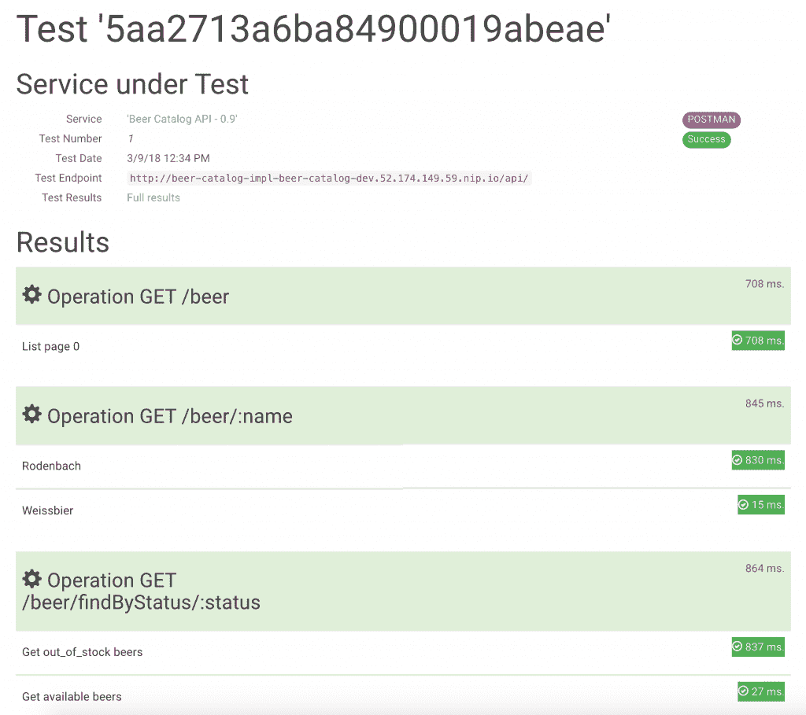

然后，您可以访问测试的详细 f 全部结果 ，这将引导您进入一个页面，在该页面中，您还可以检查和获取与您测试的 API 实现交换的有效负载和报头。

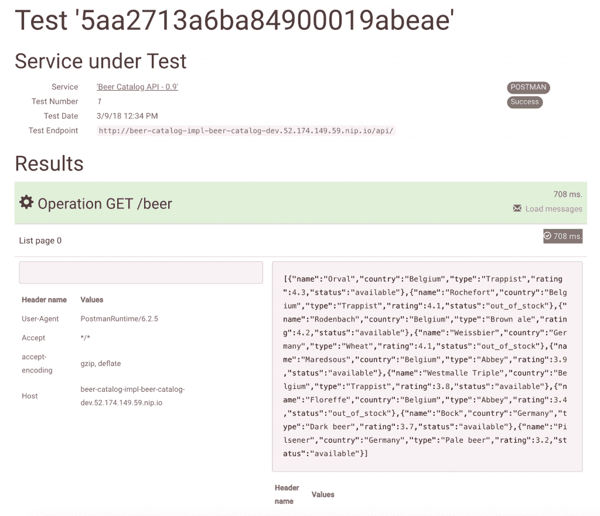

现在，我们对 ACME API 的实施充满信心，并可以继续前进。

## 里程碑 API 实现的持续测试

手动启动测试一次或两次是可以接受的。但是如果能以自动化的方式完成，那就太好了。此外，您应该考虑在每次构建和部署新版本的实现时，从您的持续集成/持续交付(CI/CD)管道中自动启动新的测试。

我们在这个阶段实现的是 API 测试在自动化构建、部署和交付流程中的无缝集成，如下图所示:

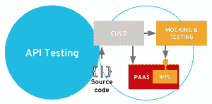

幸运的是，ACME 有一套合适的工具来做这件事。我们现在要为我们的 API 实现建立一个新的生产环境。紧挨着我们之前在 OpenShift 中创建的 `beer-catalog-dev` 环境，我们将要创建一个 `beer-catalog-prod` 环境。我们还将在 OpenShift 中声明一个 CI/CD 管道。该管道将自动连接到微芯片，以便在部署到生产之前检查测试是否正常。

在开始之前，让我们回顾一些先决条件和概念。OpenShift 中的 CI/CD 管道是使用 [Jenkins](https://jenkins.io/) 实现的——这是管理管道的事实标准。OpenShift 提供了 Jenkins 的认证图像和模板，您可以对其进行定制。我们已经使用该特性建立了一个 Jenkins 实例，它嵌入了 [Microcks Jenkins 插件](https://github.com/microcks/microcks-jenkins-plugin) 。插件安装可以用多种方式完成，但是我们提供了一个 [Jenkins 主配置](http://microcks.github.io/automating/jenkins/#jenkins-info) 来轻松完成。我们假设您已经在一个专用的`microcks`open shift 项目中建立了一个 `jenkins` 服务实例(即有这个插件)。

因为手工做什么都很繁琐容易出错，我们在 [GitHub 资源库](https://github.com/microcks/api-lifecycle/tree/master/beer-catalog-demo) 中提供了一个 `deploy-pipeline.sh` 脚本。因此，只要在登录到 OpenShift 环境后执行这个脚本，您就会在您的 `microcks` 项目中获得一个新的管道定义。

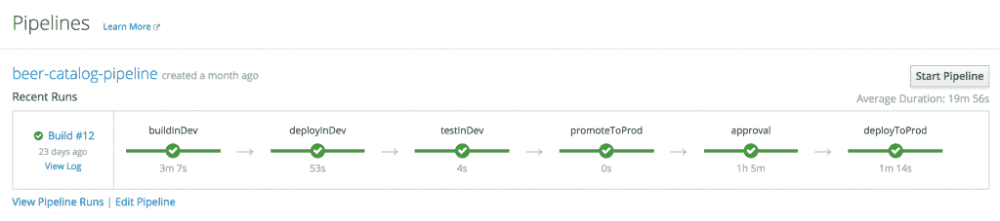

在实际启动管道之前，您可能只需要检查一下管道的配置，这样您就可以了解发生了什么。在 web 控制台的`Configuration`标签中，您会发现以下描述:

```
node('maven') {
  stage ('buildInDev') {
    openshiftBuild(buildConfig: 'beer-catalog-impl', namespace: 'beer-catalog-dev', showBuildLogs: 'true')
  }
  stage ('deployInDev') {
    openshiftDeploy(namespace: 'beer-catalog-dev', deploymentConfig: 'beer-catalog-impl')
  }
  stage ('testInDev') {
    // Add Microcks test here.
    microcksTest(apiURL: 'http://microcks.example.com/api',
      serviceId: 'Beer Catalog API:0.9',
      testEndpoint: 'http://beer-catalog-impl-beer-catalog-dev.52.174.149.59.nip.io/api/',
      runnerType: 'POSTMAN', verbose: 'true')
  }
  stage ('promoteToProd') {
    openshiftTag(namespace: 'beer-catalog-dev', sourceStream: 'beer-catalog-impl',  sourceTag: 'latest', destinationStream: 'beer-catalog-impl', destinationTag: 'promoteToProd')
  }
  stage ('approval') {
    input 'Do you want to deploy this application in production?'
  }
  stage ('deployToProd') {
    openshiftDeploy(deploymentConfig: 'beer-catalog-impl', namespace: 'beer-catalog-prod')
    openshiftScale(deploymentConfig: 'beer-catalog-impl', namespace: 'beer-catalog-prod', replicaCount: '2')
  }
}
```

注意这里重要的部分:它是 `microcksTest()` 指令。这是 Jenkins 的 Microcks 插件，它使用前面提到的 `apiURL` 将一个新测试的执行委托给 Microcks 服务器。新的考试是关于我们的 `Beer Catalog API` 版本 `0.9` 在 `testEndpoint` 的基础上又采用了`POSTMAN``runnerType`。所以基本上，我们发现了与我们早期的手工测试相同的论点。

在管道定义中，该测试将在开发环境中的每次部署之后运行。测试的成功将允许管道继续运行，并将 API 实现推广到生产中。

运行管道后，您应该在 `beer-catalog-prod` 环境上获得以下状态:同一个应用程序 pod 的两个副本。

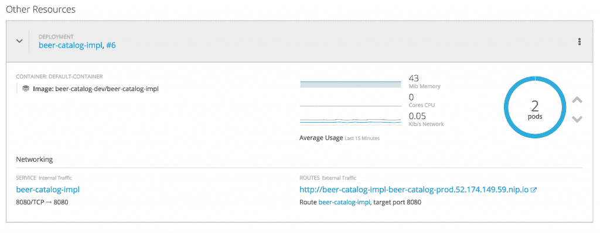

## 关键要点

在本系列的第二部分中，我们已经看到了 ACME 是如何通过以下三个阶段实现其 API 之旅的:

*   API 模仿公开，这样未来的 API 消费者可以更早地开始他们的开发。
*   在现代容器平台上开发和部署，以便于部署。然后，我们可以运行手动测试来强化关于互补期望的实现。
*   建立连续测试，允许我们在连续集成和交付管道中重复使用样本和测试。

请继续关注第三部分，在这一部分中，您将学习如何使用 API 管理来保护 API 以及更多内容。

*Last updated: September 3, 2019*